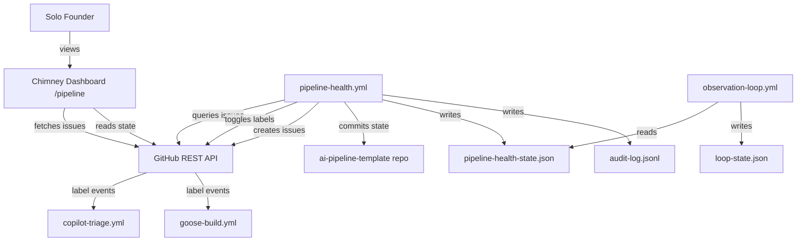
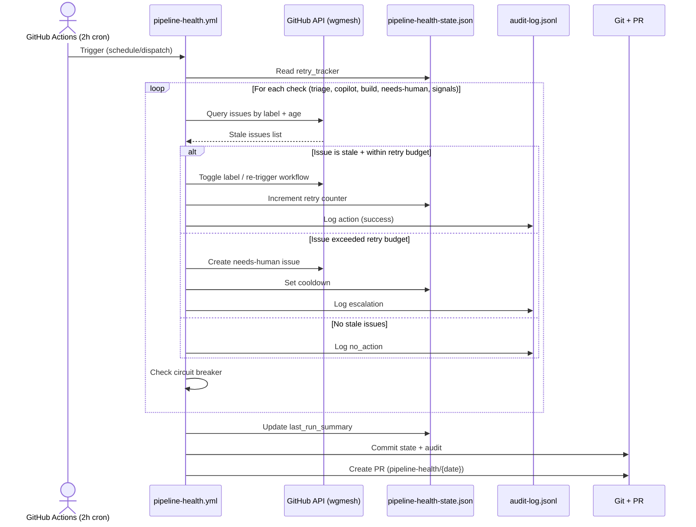

# Solution Design Document

## Validation Checklist

### CRITICAL GATES (Must Pass)

- [x] All required sections are complete
- [x] No [NEEDS CLARIFICATION] markers remain
- [x] Architecture pattern is clearly stated with rationale
- [x] **All architecture decisions confirmed by user**
- [x] Every interface has specification

### QUALITY CHECKS (Should Pass)

- [x] All context sources are listed with relevance ratings
- [x] Project commands are discovered from actual project files
- [x] Constraints → Strategy → Design → Implementation path is logical
- [x] Every component in diagram has directory mapping
- [x] Error handling covers all error types
- [x] Quality requirements are specific and measurable
- [x] Component names consistent across diagrams
- [x] A developer could implement from this design
- [x] Implementation examples use actual schema column names (not pseudocode), verified against migration files
- [x] Complex queries include traced walkthroughs with example data showing how the logic evaluates

---

## Constraints

CON-1 **Zero new infrastructure.** Dashboard extends chimney (existing Node.js/web app). Self-healing runs in GitHub Actions. No new services, databases, or hosting.

CON-2 **Budget: <€10/month incremental.** Current burn is €50/month. Self-healing adds ~€6/month in GitHub Actions minutes. GitHub Pro upgrade may be needed ($7/month).

CON-3 **GitHub API rate limits.** REST: 5,000 req/hour. Search: 30 req/minute. Self-healing budget: ~30-65 req per 2h cycle (0.29% of capacity).

CON-4 **Cross-repo operation.** Self-healing runs from ai-pipeline-template, operates on issues in atvirokodosprendimai/wgmesh. Requires PAT (PUSH_TOKEN) with cross-repo write access.

CON-5 **No LLM dependency.** Self-healing must be deterministic shell/gh CLI. No API calls to LLM providers. This is the core design principle from the brainstorm.

CON-6 **State isolation.** Self-healing must NOT write to company/loop-state.json (owned by observation-loop). Uses separate state file.

## Implementation Context

### Required Context Sources

#### Documentation Context
```yaml
- doc: .start/specs/001-pipeline-self-healing-and-observability/requirements.md
  relevance: CRITICAL
  why: "PRD defining all 11 features and 28 acceptance criteria"

- doc: .start/ideas/2026-03-21-pipeline-self-healing-and-observability.md
  relevance: HIGH
  why: "Brainstorm with key decisions on self-healing approach"

- doc: docs/pipeline-flow.d2
  relevance: MEDIUM
  why: "Existing pipeline flow diagram showing issue lifecycle"
```

#### Code Context
```yaml
- file: .github/workflows/observation-loop.yml
  relevance: CRITICAL
  why: "Primary workflow pattern to follow — permissions, concurrency, commit strategy, error handling"

- file: .github/workflows/copilot-triage.yml
  relevance: HIGH
  why: "Label-triggered workflow that self-healing re-triggers for stale triage"

- file: .github/workflows/health-check.yml
  relevance: HIGH
  why: "15-minute health check pattern — endpoint monitoring, issue creation/closure"

- file: .github/workflow-templates/goose-build.yml
  relevance: HIGH
  why: "Goose implementation workflow that self-healing re-triggers for stale builds"

- file: .github/workflows/approve-build.yml
  relevance: HIGH
  why: "Spec approval workflow — adds approved-for-build label"

- file: .github/workflows/loop-automerge.yml
  relevance: MEDIUM
  why: "Auto-merge pattern for PR-based state commits"

- file: .github/labels.yml
  relevance: HIGH
  why: "Label definitions — state machine transitions"

- file: company/loop-state.json
  relevance: HIGH
  why: "Funnel stage state — read-only for self-healing"

- file: company/health.json
  relevance: MEDIUM
  why: "Endpoint definitions for health monitoring"

- file: company/costs.json
  relevance: MEDIUM
  why: "Financial data for dashboard banner"

- file: company/scripts/sanitise.sh
  relevance: MEDIUM
  why: "Content sanitization pattern — must use before creating issues"
```

#### External APIs
```yaml
- service: GitHub REST API
  doc: https://docs.github.com/en/rest
  relevance: CRITICAL
  why: "All self-healing operations use GitHub REST API via gh CLI"

- service: GitHub Actions
  doc: https://docs.github.com/en/actions
  relevance: CRITICAL
  why: "Self-healing workflow execution environment"
```

### Implementation Boundaries

- **Must Preserve**: observation-loop.yml behavior, loop-state.json ownership, existing label state machine, copilot-triage.yml trigger conditions, goose-build.yml guard conditions
- **Can Modify**: Add new workflow files, add new state files to company/, extend chimney with new routes
- **Must Not Touch**: company/loop-state.json (write), observation-loop.yml (modify), existing workflow guard conditions

### External Interfaces

#### System Context Diagram



#### Interface Specifications

```yaml
# Inbound Interfaces
inbound:
  - name: "Cron Schedule (2h)"
    type: GitHub Actions schedule
    format: cron expression
    authentication: None (GitHub-managed)
    data_flow: "Triggers self-healing cycle every 2 hours"

  - name: "Manual Dispatch"
    type: GitHub Actions workflow_dispatch
    format: None
    authentication: GitHub user with write access
    data_flow: "Allows manual trigger of self-healing"

  - name: "Dashboard Page Load"
    type: HTTP/HTTPS
    format: HTML
    authentication: None (public)
    data_flow: "Founder loads chimney.beerpub.dev/pipeline"

# Outbound Interfaces
outbound:
  - name: "GitHub Issues API (wgmesh)"
    type: HTTPS
    format: REST JSON
    authentication: PAT (PUSH_TOKEN)
    data_flow: "Query issues by label, modify labels, create/close issues, post comments"
    criticality: CRITICAL

  - name: "GitHub Contents API"
    type: HTTPS
    format: REST JSON
    authentication: PAT (PUSH_TOKEN)
    data_flow: "Read loop-state.json, costs.json, health.json from repo"
    criticality: HIGH

  - name: "GitHub Git API"
    type: HTTPS
    format: REST JSON
    authentication: PAT (PUSH_TOKEN)
    data_flow: "Commit state changes, create branches, create PRs"
    criticality: HIGH

# Data Interfaces
data:
  - name: "pipeline-health-state.json"
    type: JSON file (git-versioned)
    connection: File read/write in workflow
    data_flow: "Self-healing state persistence"

  - name: "audit-log.jsonl"
    type: JSONL file (git-versioned, append-only)
    connection: File append in workflow
    data_flow: "Audit trail of all self-healing actions"
```

### Cross-Component Boundaries

- **API Contracts**: GitHub REST API is the contract between self-healing, dashboard, and issue management. No custom APIs.
- **Team Ownership**: Solo founder owns all components. ai-pipeline-template owns workflows + state. chimney owns dashboard.
- **Shared Resources**: GitHub issues in wgmesh (shared between observation-loop, self-healing, and copilot/goose workflows). loop-state.json (read by dashboard + self-healing, written only by observation-loop).
- **Breaking Change Policy**: Label names and state file schemas are contracts. Changes require coordinated updates across workflows + dashboard.

### Project Commands

```bash
# ai-pipeline-template (this repo)
# No build system — shell scripts + GitHub Actions YAML
Lint YAML: yamllint .github/workflows/*.yml  # if yamllint installed
Validate: bash .github/scripts/validate-spec.sh specs/
Test scripts: bash company/scripts/test-collect-memory.sh

# chimney (separate repo)
# Commands TBD — depends on chimney's stack (to be discovered during implementation)
```

## Solution Strategy

- **Architecture Pattern**: Event-driven pipeline with scheduled health checks. Two independent scheduled workflows (observation-loop at 8h, pipeline-health at 2h) share a common state layer (JSON files in git) and operate on a shared issue board (GitHub labels as state machine). Dashboard is a read-only view over the same data sources.

- **Integration Approach**: Self-healing is a new workflow file (`pipeline-health.yml`) that follows identical patterns to observation-loop.yml — same permissions model, same commit-via-PR strategy, same error handling. Dashboard is a new route in chimney that queries GitHub API directly with caching.

- **Justification**: This approach adds zero new infrastructure (CON-1), stays within budget (CON-2), reuses battle-tested patterns from observation-loop (reduces risk), and maintains clear state ownership (CON-6). The 2h schedule provides 4x faster detection than the current 8h loop.

- **Key Decisions**: Deterministic shell over LLM (CON-5). Separate state file over shared loop-state.json (CON-6). PR-based commits over direct push (safety). Circuit breaker with 2-failure threshold (fast escalation).

## Building Block View

### Components

```mermaid
graph LR
    subgraph "ai-pipeline-template"
        PH[pipeline-health.yml] --> |reads| PHS[pipeline-health-state.json]
        PH --> |appends| AL[audit-log.jsonl]
        PH --> |creates PR| Git[Git/GitHub]
        OL[observation-loop.yml] --> |reads| PHS
        OL --> |writes| LS[loop-state.json]
    end

    subgraph "GitHub (wgmesh)"
        Issues[Issues + Labels]
        PRs[Pull Requests]
    end

    subgraph "chimney"
        Dash[/pipeline route] --> |queries| GHAPI[GitHub API]
        Dash --> |reads| LS
        Dash --> |reads| PHS
    end

    PH --> |queries/modifies| Issues
    PH --> |queries| PRs
    GHAPI --> Issues
    GHAPI --> PRs
```

### Directory Map

**Component**: ai-pipeline-template (self-healing workflow)
```
.
├── .github/
│   └── workflows/
│       └── pipeline-health.yml          # NEW: Self-healing workflow (2h cron)
├── company/
│   ├── loop-state.json                  # EXISTING: Read-only for self-healing
│   ├── health.json                      # EXISTING: Endpoint definitions
│   ├── costs.json                       # EXISTING: Financial data
│   ├── pipeline-health-state.json       # NEW: Self-healing state
│   ├── audit-log.jsonl                  # NEW: Append-only audit trail
│   └── scripts/
│       └── sanitise.sh                  # EXISTING: Content sanitization
```

**Component**: chimney (pipeline dashboard)
```
.
├── [chimney project root]/
│   ├── [routes or pages]/
│   │   └── pipeline.[ext]               # NEW: Pipeline dashboard route
│   ├── [components]/
│   │   ├── pipeline-kanban.[ext]        # NEW: Kanban board component
│   │   ├── pipeline-banner.[ext]        # NEW: Funnel stage + runway banner
│   │   ├── pipeline-alert-zone.[ext]    # NEW: Stale issue alerts
│   │   └── pipeline-issue-card.[ext]    # NEW: Individual issue card
│   └── [lib or utils]/
│       └── github-client.[ext]          # NEW or MODIFY: GitHub API client with caching
```

Note: Exact file extensions and directory structure depend on chimney's technology stack (to be confirmed during implementation).

### Interface Specifications

#### Data Storage Changes

```yaml
# New files (no database — all JSON in git)
File: company/pipeline-health-state.json (NEW)
  Schema:
    last_check: ISO 8601 timestamp
    check_interval_hours: integer (default: 2)
    checks_run: integer (cumulative)
    issues_healed_total: integer (cumulative)
    retry_tracker: object
      # Keyed by issue number, tracks consecutive failures
      # Example: { "42": { "retries": 1, "last_retry": "2026-03-21T10:00:00Z", "action": "retrigger_triage" } }
    last_run_summary: object
      stale_triage_found: integer
      stale_copilot_found: integer
      stale_approved_found: integer
      needs_human_closed: integer
      actions_taken: integer
      errors: integer

File: company/audit-log.jsonl (NEW)
  Schema (one JSON object per line):
    timestamp: ISO 8601
    run_id: string (GitHub Actions run ID)
    action: enum [retrigger_triage, retrigger_copilot, retrigger_goose, close_needs_human, escalate, circuit_breaker, no_action]
    issue_number: integer (nullable)
    target_repo: string
    reason: string
    outcome: enum [success, failed, skipped]
    retry_count: integer (nullable)
```

#### Internal API Changes

No internal APIs are created. Self-healing uses GitHub CLI (`gh`) and GitHub REST API exclusively. Dashboard queries GitHub API directly from chimney.

#### Application Data Models

```pseudocode
ENTITY: PipelineHealthState (NEW)
  FIELDS:
    last_check: DateTime
    check_interval_hours: Integer = 2
    checks_run: Integer = 0
    issues_healed_total: Integer = 0
    retry_tracker: Map<IssueNumber, RetryRecord>
    last_run_summary: RunSummary

ENTITY: RetryRecord (NEW)
  FIELDS:
    retries: Integer
    last_retry: DateTime
    action: String
    cooldown_until: DateTime (nullable, set when escalated)

ENTITY: RunSummary (NEW)
  FIELDS:
    stale_triage_found: Integer
    stale_copilot_found: Integer
    stale_approved_found: Integer
    needs_human_closed: Integer
    actions_taken: Integer
    errors: Integer

ENTITY: AuditEntry (NEW)
  FIELDS:
    timestamp: DateTime
    run_id: String
    action: ActionType
    issue_number: Integer (nullable)
    target_repo: String
    reason: String
    outcome: OutcomeType
    retry_count: Integer (nullable)
```

#### Integration Points

```yaml
# Inter-Component Communication
- from: pipeline-health.yml
  to: GitHub REST API (wgmesh)
  protocol: HTTPS (gh CLI)
  endpoints:
    - GET /repos/{owner}/wgmesh/issues?state=open&labels={label}
    - PATCH /repos/{owner}/wgmesh/issues/{number}/labels
    - POST /repos/{owner}/wgmesh/issues/{number}/comments
    - POST /repos/{owner}/wgmesh/issues (create needs-human)
    - PATCH /repos/{owner}/wgmesh/issues/{number} (close)
  data_flow: "Query stale issues, modify labels, create/close issues"

- from: pipeline-health.yml
  to: ai-pipeline-template Git
  protocol: Git over HTTPS
  endpoints:
    - git checkout -b pipeline-health/{date}
    - git commit (pipeline-health-state.json + audit-log.jsonl)
    - git push -u origin
    - gh pr create
  data_flow: "Commit state changes via PR"

- from: chimney dashboard
  to: GitHub REST API
  protocol: HTTPS
  endpoints:
    - GET /repos/{owner}/wgmesh/issues?state=open&labels={label}
    - GET /repos/{owner}/ai-pipeline-template/contents/company/loop-state.json
    - GET /repos/{owner}/ai-pipeline-template/contents/company/costs.json
    - GET /repos/{owner}/ai-pipeline-template/contents/company/pipeline-health-state.json
  data_flow: "Fetch pipeline state for dashboard rendering"

# External System Integration
GitHub_Actions:
  integration: "Self-healing workflow runs as a scheduled GitHub Action"
  critical_data: [PUSH_TOKEN, TARGET_REPO environment variables]
```

### Implementation Examples

#### Example: Stale Triage Detection and Recovery

**Why this example**: This is the core self-healing pattern. All other checks follow the same structure: detect → verify → act → log.

```bash
#!/usr/bin/env bash
# Stale needs-triage detection (>24h)
# Reuses pattern from observation-loop.yml lines 519-544

TARGET_REPO="atvirokodosprendimai/wgmesh"
STATE_FILE="company/pipeline-health-state.json"
AUDIT_LOG="company/audit-log.jsonl"
RUN_ID="${GITHUB_RUN_ID:-local}"

# Dual-platform date math (Linux + macOS)
cutoff=$(date -u -d '24 hours ago' '+%Y-%m-%dT%H:%M:%SZ' 2>/dev/null || \
         date -u -v-24H '+%Y-%m-%dT%H:%M:%SZ' 2>/dev/null || echo "")

if [ -z "$cutoff" ]; then
  echo "::warning::Could not compute 24h cutoff"
  exit 0
fi

# Query stale issues (reuses observation-loop pattern)
stale_issues=$(gh issue list --repo "$TARGET_REPO" --state open \
  --label "needs-triage" --limit 50 \
  --json number,title,createdAt \
  --jq --arg cutoff "$cutoff" \
  '.[] | select(.createdAt < $cutoff) | {number, title, createdAt}')

echo "$stale_issues" | jq -c '.' | while read -r issue; do
  number=$(echo "$issue" | jq -r '.number')
  title=$(echo "$issue" | jq -r '.title')

  # Check retry tracker — skip if in cooldown
  retries=$(jq -r --arg n "$number" \
    '.retry_tracker[$n].retries // 0' "$STATE_FILE")
  cooldown=$(jq -r --arg n "$number" \
    '.retry_tracker[$n].cooldown_until // ""' "$STATE_FILE")

  if [ -n "$cooldown" ] && [ "$(date -u '+%Y-%m-%dT%H:%M:%SZ')" \< "$cooldown" ]; then
    echo "Skipping #${number} — in cooldown until $cooldown"
    continue
  fi

  # Circuit breaker: escalate after 2 failures
  if [ "$retries" -ge 2 ]; then
    echo "Escalating #${number} — $retries consecutive failures"
    body="Self-healing failed to resolve stale triage for #${number} after $retries attempts."
    if echo "$body" | bash company/scripts/sanitise.sh > /dev/null 2>&1; then
      gh issue create --repo "$TARGET_REPO" \
        --title "[needs-human] Stuck at triage: #${number} ${title}" \
        --body "$body" \
        --label "needs-human" || true
    fi
    # Set 24h cooldown
    jq --arg n "$number" --arg until "$(date -u -d '+24 hours' '+%Y-%m-%dT%H:%M:%SZ' 2>/dev/null || date -u -v+24H '+%Y-%m-%dT%H:%M:%SZ')" \
      '.retry_tracker[$n].cooldown_until = $until' "$STATE_FILE" > /tmp/state.json
    mv /tmp/state.json "$STATE_FILE"
    # Audit
    jq -nc --arg ts "$(date -u '+%Y-%m-%dT%H:%M:%SZ')" --arg rid "$RUN_ID" \
      --arg num "$number" --argjson retries "$retries" \
      '{timestamp:$ts, run_id:$rid, action:"escalate", issue_number:($num|tonumber), target_repo:"wgmesh", reason:"2 consecutive triage failures", outcome:"success", retry_count:$retries}' \
      >> "$AUDIT_LOG"
    continue
  fi

  # Recovery: toggle label to re-trigger copilot-triage.yml
  echo "Healing #${number}: removing needs-triage label"
  gh issue edit "$number" --repo "$TARGET_REPO" \
    --remove-label "needs-triage" 2>/dev/null || true
  sleep 2
  echo "Healing #${number}: re-applying needs-triage label"
  gh issue edit "$number" --repo "$TARGET_REPO" \
    --add-label "needs-triage" 2>/dev/null || true

  # Update retry tracker
  new_retries=$((retries + 1))
  jq --arg n "$number" --argjson r "$new_retries" \
    --arg ts "$(date -u '+%Y-%m-%dT%H:%M:%SZ')" \
    '.retry_tracker[$n] = {retries: $r, last_retry: $ts, action: "retrigger_triage"}' \
    "$STATE_FILE" > /tmp/state.json
  mv /tmp/state.json "$STATE_FILE"

  # Audit
  jq -nc --arg ts "$(date -u '+%Y-%m-%dT%H:%M:%SZ')" --arg rid "$RUN_ID" \
    --arg num "$number" --argjson retries "$new_retries" \
    '{timestamp:$ts, run_id:$rid, action:"retrigger_triage", issue_number:($num|tonumber), target_repo:"wgmesh", reason:"stale >24h at needs-triage", outcome:"success", retry_count:$retries}' \
    >> "$AUDIT_LOG"
done
```

**Traced Walkthrough**:

Given these issues in wgmesh:

| # | Title | Label | createdAt | updatedAt |
|---|-------|-------|-----------|-----------|
| 42 | Add VPN relay | needs-triage | 2026-03-20T08:00Z | 2026-03-20T08:00Z |
| 43 | Fix DNS | needs-triage | 2026-03-21T20:00Z | 2026-03-21T20:00Z |
| 44 | Improve logs | copilot-triaging | 2026-03-19T10:00Z | 2026-03-20T14:00Z |

And pipeline-health-state.json:
```json
{ "retry_tracker": { "42": { "retries": 1, "last_retry": "2026-03-21T08:00:00Z", "action": "retrigger_triage" } } }
```

At 2026-03-21T10:00:00Z (cutoff = 2026-03-20T10:00:00Z):

1. **Issue #42** (created 2026-03-20T08:00Z < cutoff): STALE. retry_tracker shows 1 retry. < 2 threshold → **re-trigger label toggle**. Increment to retries=2.
2. **Issue #43** (created 2026-03-21T20:00Z > cutoff): NOT STALE. Skipped.
3. **Issue #44**: Has `copilot-triaging`, not `needs-triage`. Not in this query.

If #42 is still stuck at next cycle (2026-03-21T12:00Z), retries=2 ≥ threshold → **ESCALATE** to needs-human. Set 24h cooldown.

#### Example: Circuit Breaker Per-Run Check

**Why this example**: Shows the per-run safety valve that prevents a single bad cycle from creating 10+ issues.

```bash
# Track per-run totals
ACTIONS_TAKEN=0
ERRORS=0
ISSUES_CREATED=0
MAX_CREATES=10
MAX_ERRORS=5

check_circuit_breaker() {
  if [ "$ISSUES_CREATED" -ge "$MAX_CREATES" ] || [ "$ERRORS" -ge "$MAX_ERRORS" ]; then
    echo "::error::Circuit breaker triggered: $ISSUES_CREATED creates, $ERRORS errors"
    jq -nc --arg ts "$(date -u '+%Y-%m-%dT%H:%M:%SZ')" --arg rid "$RUN_ID" \
      '{timestamp:$ts, run_id:$rid, action:"circuit_breaker", issue_number:null, target_repo:"wgmesh", reason:"per-run limit exceeded", outcome:"success", retry_count:null}' \
      >> "$AUDIT_LOG"
    # Create single escalation issue
    gh issue create --repo "$TARGET_REPO" \
      --title "[needs-human] Pipeline self-healing circuit breaker triggered" \
      --body "Self-healing hit per-run limits: $ISSUES_CREATED issues created, $ERRORS errors. Manual review required." \
      --label "needs-human" || true
    return 1  # Signal caller to stop processing
  fi
  return 0
}
```

## Runtime View

### Primary Flow: Self-Healing Cycle

1. GitHub Actions triggers pipeline-health.yml (cron: every 2h)
2. Workflow checks out repository, reads pipeline-health-state.json
3. Runs 5 checks sequentially (triage → copilot → build → needs-human → funnel signals)
4. For each check: query GitHub API → evaluate → act if needed → log to audit
5. After all checks: update pipeline-health-state.json summary
6. If any changes made: commit state + audit → create PR → push
7. loop-automerge.yml auto-merges the PR when reviewed



### Error Handling

- **GitHub API 403 (rate limited)**: Check `X-RateLimit-Remaining` header before each major operation. If <100 remaining, log warning and exit gracefully. Skip remaining checks for this cycle. Retry on next 2h cycle.
- **GitHub API 404 (issue not found)**: Issue was closed/deleted between query and action. Log warning, skip this issue, continue with next.
- **GitHub API 422 (label not found)**: Label doesn't exist in target repo. Log error, create needs-human issue to run sync-labels.yml.
- **Git commit conflict**: Another workflow committed simultaneously. Use `git pull --rebase` before push. If rebase fails, abandon this cycle's commit (state will be re-computed next cycle).
- **Network timeout**: gh CLI has built-in retry. If persistent, log error and exit. Next 2h cycle will retry.

### Complex Logic: Fulfilled Needs-Human Detection

```
ALGORITHM: Detect Fulfilled needs-human Issues
INPUT: open issues labeled "needs-human" in wgmesh
OUTPUT: list of issues to close with reasons

FOR each issue labeled "needs-human":
  1. CHECK if issue has linked merged PRs
     → YES: Close with "Resolved: linked PR #{pr_number} merged"

  2. CHECK if issue has human comments (not bot)
     → YES and comment contains resolution language: Close with "Resolved: human confirmed"
     → YES but no resolution: Leave open (human acknowledged but didn't resolve)

  3. CHECK specific signals based on issue title patterns:
     a. Title contains "API key" or "secret"
        → Check if observation-loop.yml last run succeeded (no stub assessment)
        → YES: Close with "Resolved: API key configured (loop running successfully)"
     b. Title contains "health check" or "endpoint"
        → Check if all health.json endpoints respond 200
        → YES: Close with "Resolved: all endpoints healthy"
     c. Title contains "burn" or "capital" or "budget"
        → Check if costs.json has non-default values
        → YES: Close with "Resolved: financial data updated"

  4. DEFAULT: Leave open (no resolution signal detected)

EDGE CASES:
  - Issue closed by human since last check → skip (already closed)
  - Multiple needs-human issues for same root cause → close all that match signal
  - Issue created by self-healing (escalation) → also subject to this check
```

## Deployment View

### Single Application Deployment

**pipeline-health.yml** (GitHub Actions):
- **Environment**: GitHub-hosted ubuntu-latest runner
- **Configuration**:
  - `secrets.PUSH_TOKEN` — PAT with repo + issues write access to wgmesh
  - `TARGET_REPO` — hardcoded to `atvirokodosprendimai/wgmesh`
  - Cron: `0 */2 * * *` (every 2h)
- **Dependencies**: gh CLI (pre-installed on GitHub runners), jq, curl
- **Performance**: Expected run time <5 minutes. 30-65 API calls per run.

**Chimney Dashboard** (/pipeline route):
- **Environment**: Existing chimney deployment at chimney.beerpub.dev
- **Configuration**:
  - GitHub PAT for API queries (or use existing chimney GitHub token)
  - Cache TTL: 15 minutes
  - Health thresholds: hardcoded (24h yellow, 48h red)
- **Dependencies**: GitHub REST API
- **Performance**: Page load <1.5s with cached data. <3s cold cache.

### Multi-Component Coordination

- **Deployment Order**: pipeline-health.yml first (creates state files), then chimney dashboard (reads state files). Order matters because dashboard reads pipeline-health-state.json.
- **Version Dependencies**: None — components communicate via GitHub API and JSON files, not internal APIs.
- **Feature Flags**: Not needed — components are independently deployable.
- **Rollback Strategy**: Delete pipeline-health.yml to disable self-healing. Remove /pipeline route to disable dashboard. Both are independently rollback-safe.
- **Data Migration Sequencing**: Create empty pipeline-health-state.json and audit-log.jsonl before first pipeline-health.yml run.

## Cross-Cutting Concepts

### Pattern Documentation

```yaml
# Existing patterns reused
- pattern: "Scheduled workflow with state commit via PR"
  source: .github/workflows/observation-loop.yml
  relevance: CRITICAL
  why: "Self-healing follows identical commit pattern — branch, commit, PR, auto-merge"

- pattern: "Label toggle to re-trigger workflows"
  source: .github/workflows/observation-loop.yml (lines 519-544)
  relevance: CRITICAL
  why: "Core self-healing mechanism for stale triage recovery"

- pattern: "Soft-fail with warning"
  source: .github/workflows/observation-loop.yml (lines 52-55)
  relevance: HIGH
  why: "Error handling pattern — log warning, use stub data, continue"

- pattern: "Content sanitization before publish"
  source: company/scripts/sanitise.sh
  relevance: HIGH
  why: "All issue content must pass sanitization before creation"

- pattern: "Fuzzy deduplication of issues"
  source: .github/workflows/observation-loop.yml (lines 413-428)
  relevance: MEDIUM
  why: "Prevent duplicate needs-human issues from self-healing"

# New patterns
- pattern: "Circuit breaker for autonomous actions"
  relevance: HIGH
  why: "Prevents runaway loops — per-issue retry limit + per-run action limit"

- pattern: "JSONL append-only audit log"
  relevance: HIGH
  why: "Structured audit trail for all self-healing mutations"
```

### User Interface & UX

**Information Architecture:**
- Navigation: Direct URL (chimney.beerpub.dev/pipeline) — no navigation hierarchy needed
- Content Organization: Three-zone layout — Banner (funnel + runway + last healed) → Alert Zone (stale issues only) → Kanban (6 columns)
- User Flows: Load → Scan alert zone (2-5s) → Click issue if needed → GitHub

**Design System:**
- Components: Issue cards, column headers, banner, alert badges
- Tokens: Health colors — Green (#0E8A16), Yellow (#FBCA04), Red (#B60205) — matches GitHub label colors
- Patterns: Kanban board, health indicator badges, relative timestamps

**Interaction Design:**
- State Management: Server-rendered with 15-min cache. No client-side state.
- Feedback: Loading spinner during data fetch. Stale data warning if cache >4h.
- Accessibility: WCAG 2.1 AA. Color + symbols for health (not color alone). 4.5:1 contrast. Keyboard navigable. Screen reader: "Column: Created, 8 issues, 6 green, 2 yellow"

#### UI Visualization Guide

**Dashboard Layout (Desktop)**:
```
┌─────────────────────────────────────────────────────────────┐
│  BANNER: Dogfood │ 48mo runway │ Last healed: 2h ago (3)   │
├─────────────────────────────────────────────────────────────┤
│  ALERT: 🔴 Issue #42 stuck at triage (26h) │ 🟡 #38 (22h) │
├──────────┬──────────┬──────────┬──────────┬────────┬────────┤
│ Created  │ Triaging │ Spec PR  │ Approved │ Impl   │ Merged │
│ (3)      │ (2)      │ (1)      │ (1)      │ (0)    │ (4)    │
├──────────┼──────────┼──────────┼──────────┼────────┼────────┤
│ 🟢 #50   │ 🟢 #48   │ 🟡 #45   │ 🔴 #38   │        │ ✓ #32  │
│ Add auth │ Fix DNS  │ Spec PR  │ Approved │ empty  │ VPN    │
│ 6h ago   │ 12h ago  │ 22h ago  │ 26h ago  │        │ 2d ago │
│          │          │          │          │        │        │
│ 🟢 #51   │ 🟢 #49   │          │          │        │ ✓ #30  │
│ Update   │ Refactor │          │          │        │ DNS    │
│ 2h ago   │ 8h ago   │          │          │        │ 3d ago │
│          │          │          │          │        │        │
│ 🔴 #42   │          │          │          │        │ ✓ #28  │
│ VPN rly  │          │          │          │        │ Logs   │
│ 26h ago  │          │          │          │        │ 5d ago │
└──────────┴──────────┴──────────┴──────────┴────────┴────────┘
```

**Dashboard Layout (Mobile, <480px)**:
```
┌───────────────────────┐
│ Dogfood │ 48mo │ 🔄 2h│
├───────────────────────┤
│ 🔴 #42 stuck (26h)    │
│ 🟡 #38 approaching    │
├───────────────────────┤
│ ← Created (3)       → │
│ ┌───────────────────┐ │
│ │ 🟢 #50 Add auth   │ │
│ │ 6h ago            │ │
│ └───────────────────┘ │
│ ┌───────────────────┐ │
│ │ 🟢 #51 Update     │ │
│ │ 2h ago            │ │
│ └───────────────────┘ │
│ ┌───────────────────┐ │
│ │ 🔴 #42 VPN relay  │ │
│ │ 26h ago           │ │
│ └───────────────────┘ │
│     ● ○ ○ ○ ○ ○      │
│   swipe for columns   │
└───────────────────────┘
```

### System-Wide Patterns

- **Security**: PUSH_TOKEN (PAT) is the only secret. Minimum permissions: `contents: write`, `issues: write`, `pull-requests: write`, `actions: read`. Content sanitization via sanitise.sh before any issue creation.
- **Error Handling**: Soft-fail pattern — log `::warning::`, use defaults, continue. Hard-fail only on missing PUSH_TOKEN. Circuit breaker for runaway scenarios.
- **Performance**: 30-65 API calls per 2h cycle. 15-min dashboard cache. No heavy computation.
- **Logging/Auditing**: JSONL audit log for all mutations. GitHub Actions logs for workflow execution. Pipeline-health-state.json for aggregate metrics. All committed to git for permanent history.

### Multi-Component Patterns

- **Communication Patterns**: Async via shared state files (JSON in git). No direct API calls between self-healing and dashboard. Both read from GitHub API independently.
- **Data Consistency**: Eventual consistency. Self-healing writes state → PR → merge → dashboard reads on next cache refresh (up to 15 min delay). Acceptable for this use case.
- **Circuit Breakers**: Per-issue (2 failures → escalate + 24h cooldown) and per-run (10 creates or 5 failures → stop processing).

## Architecture Decisions

- [x] **ADR-1 State Storage**: JSON file in repo (`company/pipeline-health-state.json`)
  - Rationale: Matches observation-loop pattern. Git history = audit trail. Zero infra. Committed via PR for review.
  - Trade-offs: Slightly slower than in-memory (requires git read/write). State is only updated after PR merge. Acceptable for 2h cycle.
  - User confirmed: ✅ 2026-03-21

- [x] **ADR-2 Audit Trail**: JSONL file in repo (`company/audit-log.jsonl`)
  - Rationale: Append-only, queryable with jq, committed with state changes. Chimney can read for "Last healed" display. Permanent record in git history.
  - Trade-offs: File grows over time (mitigated by monthly archival). Not real-time (merged via PR). Acceptable for async audit.
  - User confirmed: ✅ 2026-03-21

- [x] **ADR-3 Git Strategy**: PR to main (branch `pipeline-health/{date}-{run_id}`)
  - Rationale: Matches observation-loop commit pattern. Reviewable. loop-automerge.yml can auto-merge. Prevents direct main mutations from autonomous system.
  - Trade-offs: State update delayed until PR merge. If PR queue backs up, state may be stale. Mitigated by auto-merge.
  - User confirmed: ✅ 2026-03-21

- [x] **ADR-4 Dashboard Thresholds**: Hardcoded in chimney
  - Rationale: Simple. 24h yellow / 48h red are stable constants from brainstorm. No need for runtime configurability yet.
  - Trade-offs: Changing thresholds requires code deploy. Acceptable — thresholds are unlikely to change frequently.
  - User confirmed: ✅ 2026-03-21

- [x] **ADR-5 Dashboard Data Source**: GitHub API direct with 15-min cache
  - Rationale: Zero new infra (CON-1). Chimney already has GitHub integration capability. Cache prevents API exhaustion. 15-min freshness is acceptable for a daily-check dashboard.
  - Trade-offs: Dashboard may show slightly stale data (up to 15 min). Cannot show real-time updates. Acceptable per PRD Won't Have.
  - User confirmed: ✅ 2026-03-21 (decided during research synthesis)

- [x] **ADR-6 Funnel Ownership**: Observation loop only
  - Rationale: Self-healing detects signals and reports them in pipeline-health-state.json. The LLM observation loop makes advancement decisions. Prevents state conflicts and maintains single-writer principle.
  - Trade-offs: Funnel advancement delayed up to 8h (next loop cycle). Acceptable — funnel stages are long-duration milestones, not urgent transitions.
  - User confirmed: ✅ 2026-03-21 (decided during research synthesis)

## Quality Requirements

- **Performance**: Self-healing cycle completes in <5 minutes. Dashboard loads in <1.5s (cached) / <3s (cold). API usage <100 calls per cycle.
- **Usability**: Dashboard scannable in <10 seconds. Health indicators use color + symbols. Mobile-responsive. WCAG 2.1 AA compliant.
- **Security**: Minimum-privilege PAT. Content sanitization on all issue creation. No sensitive data on public dashboard. Audit trail for all autonomous actions.
- **Reliability**: Self-healing runs 12x/day with >99% success rate. Circuit breaker prevents runaway loops. Graceful degradation on API failures (skip cycle, retry next).

## Acceptance Criteria

**Self-Healing Core (PRD Features 1-4):**
- [x] WHEN pipeline-health.yml runs on schedule, THE SYSTEM SHALL query all open issues in wgmesh by label and detect those exceeding age thresholds (24h for needs-triage and approved-for-build, 48h for copilot-triaging)
- [x] WHEN a stale issue is detected within retry budget, THE SYSTEM SHALL toggle the relevant label to re-trigger the downstream workflow and increment the retry counter
- [x] IF an issue has failed recovery 2 consecutive times, THEN THE SYSTEM SHALL create a needs-human issue, set a 24h cooldown, and stop retrying
- [x] WHEN a needs-human issue has resolution signals (merged PR, human comment, or resolved condition), THE SYSTEM SHALL close it with a reason comment

**Circuit Breaker (PRD Feature 7):**
- [x] WHILE processing checks, THE SYSTEM SHALL track per-run issue creation count and error count
- [x] IF per-run thresholds are exceeded (10 creates or 5 errors), THEN THE SYSTEM SHALL stop all processing and create a single escalation issue

**Dashboard (PRD Features 5, 8, 9):**
- [x] WHEN the /pipeline page loads, THE SYSTEM SHALL render issues grouped into 6 Kanban columns mapped by label state
- [x] THE SYSTEM SHALL display health indicators (green/yellow/red + symbols) on each issue card based on age thresholds
- [x] THE SYSTEM SHALL display a banner with funnel stage, runway months, and last self-healing activity
- [x] WHEN data is older than 4 hours, THE SYSTEM SHALL display a staleness warning

**Audit Trail (PRD Feature 6):**
- [x] WHEN any self-healing action is taken, THE SYSTEM SHALL append a structured JSON entry to audit-log.jsonl with timestamp, action, issue number, reason, and outcome
- [x] THE SYSTEM SHALL commit pipeline-health-state.json and audit-log.jsonl via PR after each cycle

## Risks and Technical Debt

### Known Technical Issues

- observation-loop.yml already exceeds GitHub Actions free tier (~2,225 min/month). Adding self-healing (~540 min/month) will require monitoring and likely a GitHub Pro upgrade.
- The `copilot-swe-agent[bot]` assignment API may not support re-assignment with custom instructions. Fallback: use label toggle to re-trigger triage workflow.
- goose-build.yml has a guard `!contains(github.repository, 'ai-pipeline-template')` — self-healing cannot re-trigger Goose directly from this repo. Must use `workflow_dispatch` or `repository_dispatch` targeting wgmesh.

### Technical Debt

- No structured health signal exists between self-healing and observation-loop. Currently observation-loop must parse pipeline-health-state.json directly. Future: observation-loop should consume a health summary in its collection phase.
- Audit log has no rotation/archival mechanism. Will grow indefinitely until monthly archival is implemented.
- Dashboard data contract between chimney and GitHub API is implicit (chimney queries directly). Future: formalize as a data access layer.

### Implementation Gotchas

- **Date math is platform-dependent**: `date -d` (Linux) vs `date -v` (macOS). All scripts must handle both (pattern from observation-loop.yml line 528-529).
- **Label toggle timing**: A 2-second sleep between remove and re-add is required. Without it, GitHub may coalesce the events and not re-trigger the label-based workflow.
- **PR branch naming**: Must not collide with observation-loop's `loop/assessment-*` pattern. Use `pipeline-health/{date}-{run_id}`.
- **Auto-merge dependency**: loop-automerge.yml only merges branches starting with `loop/`. Self-healing PRs need either: (a) extend auto-merge to `pipeline-health/` prefix, or (b) use a different auto-merge mechanism.
- **Retry tracker key type**: Issue numbers in JSON are strings when used as object keys. Ensure consistent string type in jq operations.

## Glossary

### Domain Terms

| Term | Definition | Context |
|------|------------|---------|
| Pipeline | The automated issue-to-code flow: issue → triage → spec → build → review → merge | Core system this feature monitors and heals |
| Funnel Stage | Company maturity level (Foundation → Dogfood → Presence → Reachable → Pipeline → Revenue) | Displayed in dashboard banner, advanced by observation loop |
| Self-Healing | Deterministic detection and recovery of stuck pipeline states without human intervention | Core capability of pipeline-health.yml |
| Stale Issue | An issue that has remained at the same pipeline stage longer than its age threshold | Triggers self-healing action |
| Circuit Breaker | Safety mechanism that stops retrying after consecutive failures and escalates to human | Prevents runaway loops |

### Technical Terms

| Term | Definition | Context |
|------|------------|---------|
| PAT (Personal Access Token) | GitHub authentication token with specific repository and permission scopes | Used as PUSH_TOKEN for cross-repo operations |
| JSONL | JSON Lines format — one JSON object per line, newline-delimited | Format for audit-log.jsonl |
| Label Toggle | Removing and re-adding a GitHub label to re-trigger label-based workflow automation | Core self-healing mechanism |
| Soft-Fail | Error handling pattern where failures are logged as warnings and processing continues with defaults | Used throughout self-healing for resilience |

### API/Interface Terms

| Term | Definition | Context |
|------|------------|---------|
| gh CLI | GitHub's official command-line tool for API operations | Primary interface for all GitHub operations in self-healing |
| workflow_dispatch | GitHub Actions event that allows manual triggering of workflows with input parameters | Used to re-trigger Goose builds |
| repository_dispatch | GitHub Actions event triggered by external webhooks with custom event types | Used by observation loop for external signals |
