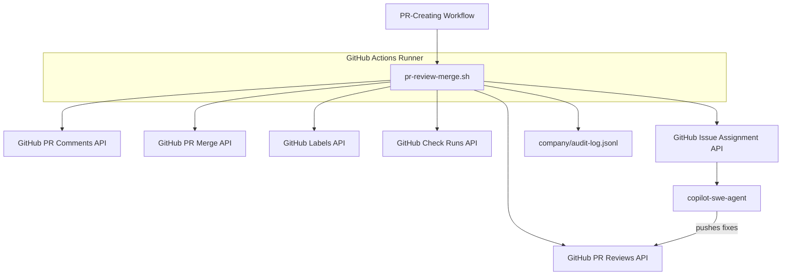
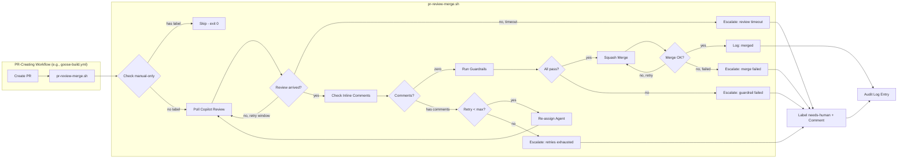
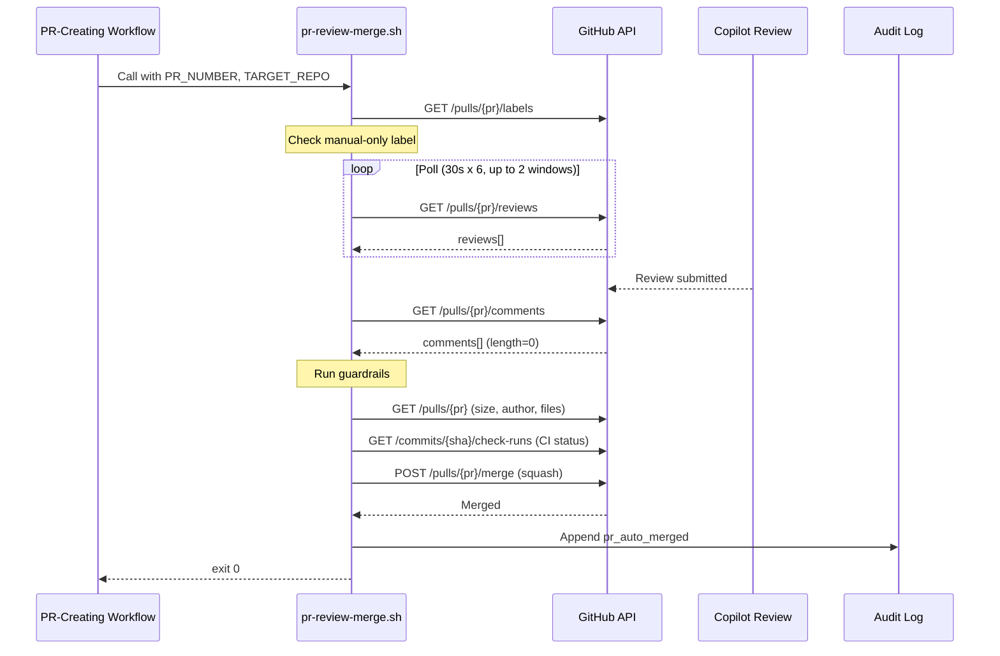
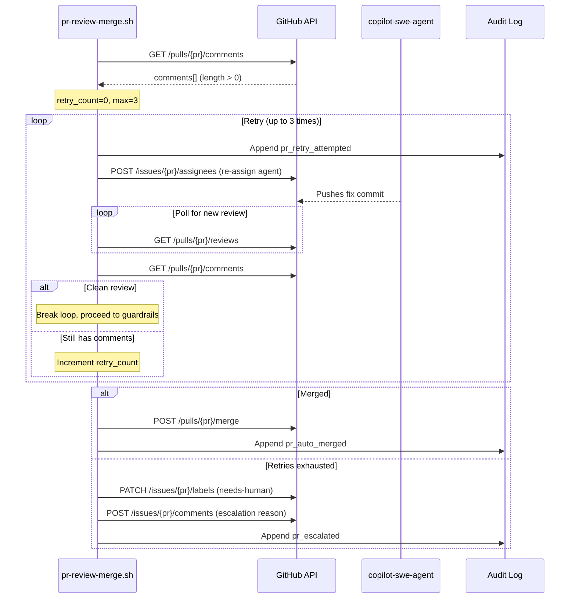

# Solution Design Document

## Validation Checklist

### CRITICAL GATES (Must Pass)

- [x] All required sections are complete
- [x] No [NEEDS CLARIFICATION] markers remain
- [x] Architecture pattern is clearly stated with rationale
- [x] **All architecture decisions confirmed by user**
- [x] Every interface has specification

### QUALITY CHECKS (Should Pass)

- [x] All context sources are listed with relevance ratings
- [x] Project commands are discovered from actual project files
- [x] Constraints -> Strategy -> Design -> Implementation path is logical
- [x] Every component in diagram has directory mapping
- [x] Error handling covers all error types
- [x] Quality requirements are specific and measurable
- [x] Component names consistent across diagrams
- [x] A developer could implement from this design
- [x] Implementation examples use actual schema column names, verified against existing files
- [x] Complex queries include traced walkthroughs with example data

---

## Constraints

CON-1 **Platform**: GitHub Actions workflows + Bash scripts. No external runtime. All logic runs in GitHub-hosted Ubuntu runners.

CON-2 **Constitution compliance**: Must comply with all L1/L2 rules in CONSTITUTION.md v1.2.0. Key constraints: Andon principle (no silent failures), SEC-1 (secrets via env), SEC-2 (sanitise published content), ARCH-2 (scripts in company/scripts/), ARCH-4 (data path scoping for auto-merge), QUAL-1 (bash strict mode), QUAL-2 (atomic file writes), QUAL-5 (no silent errors).

CON-3 **Authentication**: All repo-write operations require PUSH_TOKEN (PAT), never GITHUB_TOKEN (per ARCH-8). GITHUB_TOKEN commits don't trigger downstream workflows.

CON-4 **Copilot review SLA**: No guaranteed latency. Typical 30-90s, can exceed 2 minutes. No event trigger for review completion (GitHub App reviews don't fire `pull_request_review` events).

CON-5 **Scope**: Phase 1 targets bot-authored implementation PRs in a single repository. Phase 2 adds spec PRs. Phase 3 adds cross-repo support via TARGET_REPO.

## Implementation Context

### Required Context Sources

#### Documentation Context
```yaml
- doc: CONSTITUTION.md
  relevance: CRITICAL
  why: "All L1/L2 rules must be satisfied — especially Andon, SEC-*, ARCH-*, QUAL-*"

- doc: docs/patterns/workflow-self-merge.md
  relevance: CRITICAL
  why: "Existing self-merge pattern to reuse (proven for data PRs)"

- doc: docs/domain/pipeline-state-machine.md
  relevance: HIGH
  why: "Pipeline state transitions — new PR review/merge states must integrate"

- doc: docs/interfaces/github-api-pipeline.md
  relevance: HIGH
  why: "GitHub API contracts and authentication patterns"

- doc: docs/solutions/integration-issues/github-app-reviews-dont-trigger-workflows.md
  relevance: CRITICAL
  why: "Explains why polling is required — Copilot reviews are not event sources"

- doc: docs/solutions/integration-issues/loop-pr-automerge-timing-race.md
  relevance: HIGH
  why: "Previous timing race and fix — informs poll window design"

- doc: .start/ideas/2026-03-22-autonomous-pr-review-and-merge.md
  relevance: HIGH
  why: "Original brainstorm with flow, guardrails, and queue theory rationale"
```

#### Code Context
```yaml
- file: .github/workflows/pipeline-health.yml
  relevance: CRITICAL
  why: "Self-merge pattern at lines 746-782, circuit breaker at 189-209, polling at 746-764"

- file: .github/workflows/observation-loop.yml
  relevance: HIGH
  why: "Self-merge pattern at line 394, audit logging pattern"

- file: .github/workflows/approve-build.yml
  relevance: HIGH
  why: "Copilot re-assignment pattern at lines 107-126"

- file: .github/workflows/copilot-triage.yml
  relevance: MEDIUM
  why: "Agent assignment API usage pattern"

- file: company/scripts/sanitise.sh
  relevance: HIGH
  why: "Content sanitisation (SEC-2) — must sanitise PR comments"

- file: company/pipeline-health-state.json
  relevance: MEDIUM
  why: "State file format reference (not used directly, but pattern reference)"
```

#### External APIs
```yaml
- service: GitHub REST API
  doc: docs/interfaces/github-api-pipeline.md
  relevance: CRITICAL
  why: "PR reviews, merge, labels, check runs, agent assignment"

- service: GitHub Copilot Code Review
  doc: (no formal doc — behavior observed via API)
  relevance: CRITICAL
  why: "Review source — poll via /pulls/{pr}/reviews and /pulls/{pr}/comments"

- service: Copilot SWE Agent
  doc: (API pattern in approve-build.yml)
  relevance: HIGH
  why: "Re-assignment target for fix loop"
```

### Implementation Boundaries

- **Must Preserve**: Existing self-merge behavior in pipeline-health.yml and observation-loop.yml. Existing workflow triggers and permissions. State file formats.
- **Can Modify**: Workflow files that create bot-authored PRs (to add inline review-merge steps). Audit log format (append new event types).
- **Must Not Touch**: CONSTITUTION.md. Branch protection rules. Other team's workflows. Human-authored PR flows.

### External Interfaces

#### System Context Diagram



#### Interface Specifications

```yaml
# Inbound Interfaces
inbound:
  - name: "PR-Creating Workflow"
    type: GitHub Actions step invocation
    format: Shell script call with environment variables
    authentication: PUSH_TOKEN via env block
    data_flow: "PR number, repo, author, branch passed as env vars"

# Outbound Interfaces
outbound:
  - name: "GitHub PR Reviews API"
    type: HTTPS
    format: REST (JSON)
    authentication: PUSH_TOKEN (pull-requests:read)
    data_flow: "Poll for Copilot review existence and state"
    criticality: CRITICAL

  - name: "GitHub PR Comments API"
    type: HTTPS
    format: REST (JSON)
    authentication: PUSH_TOKEN (pull-requests:read)
    data_flow: "Check for inline review comments (blocking vs clean)"
    criticality: CRITICAL

  - name: "GitHub PR Merge API"
    type: HTTPS
    format: REST (JSON)
    authentication: PUSH_TOKEN (pull-requests:write, contents:write)
    data_flow: "Squash merge PR, delete branch"
    criticality: CRITICAL

  - name: "GitHub Labels API"
    type: HTTPS
    format: REST (JSON)
    authentication: PUSH_TOKEN (issues:write)
    data_flow: "Add needs-human label on escalation"
    criticality: HIGH

  - name: "GitHub Check Runs API"
    type: HTTPS
    format: REST (JSON)
    authentication: PUSH_TOKEN (actions:read)
    data_flow: "Verify CI checks passed before merge"
    criticality: HIGH

  - name: "GitHub Issue Assignment API"
    type: HTTPS
    format: REST (JSON)
    authentication: PUSH_TOKEN (issues:write)
    data_flow: "Re-assign copilot-swe-agent with review feedback"
    criticality: HIGH

# Data Interfaces
data:
  - name: "Audit Log"
    type: JSONL file (append-only)
    connection: Direct file write
    data_flow: "Every action logged: review_detected, merged, retry, escalated, error"
    path: company/audit-log.jsonl
```

### Project Commands

```bash
# Core Commands (discovered from project files)
Test:    company/scripts/test-pipeline.sh   # unit/integration tests
E2E:     company/scripts/e2e-pipeline.sh    # end-to-end tests
Lint:    shellcheck company/scripts/*.sh     # shell script linting
Sanitise: company/scripts/sanitise.sh       # content sanitisation

# Workflow validation
Validate: actionlint .github/workflows/*.yml  # GitHub Actions linting
```

## Solution Strategy

- **Architecture Pattern**: Inline pipeline extension with extracted script. The review-merge logic is a shell script (`company/scripts/pr-review-merge.sh`) called as a step within the PR-creating workflow. This follows the established pattern where workflows orchestrate and scripts contain logic (ARCH-2).

- **Integration Approach**: The script slots into existing workflows as additional steps after PR creation. No new workflows, no new triggers, no new state files. It reuses proven patterns from pipeline-health.yml (self-merge, polling, circuit breaker, Andon error handling).

- **Justification**: Inline execution eliminates queue delay (per brainstorm's queue theory rationale). A single script keeps logic testable and portable across workflows. Ephemeral state avoids state file complexity for Phase 1.

- **Key Decisions**: See Architecture Decisions section (ADR-1 through ADR-4, all user-confirmed).

## Building Block View

### Components



### Directory Map

**Component**: pr-review-merge script
```
.
├── company/
│   └── scripts/
│       └── pr-review-merge.sh           # NEW: Core review-merge logic
├── .github/
│   └── workflows/
│       └── goose-build.yml              # MODIFY: Add review-merge step after PR creation
│       └── (future: other PR-creating workflows)
```

### Interface Specifications

#### Data Storage Changes

No new state files. Audit log uses existing format:

```yaml
# Append to existing company/audit-log.jsonl
# New event types for PR review-merge
Event: pr_review_detected
  Fields:
    timestamp: ISO 8601
    run_id: string (GitHub Actions run ID)
    action: "review_detected"
    pr_number: integer
    target_repo: string (owner/repo)
    review_state: string (APPROVED, CHANGES_REQUESTED, COMMENTED)
    comment_count: integer
    poll_duration_seconds: integer

Event: pr_auto_merged
  Fields:
    timestamp: ISO 8601
    run_id: string
    action: "merged"
    pr_number: integer
    target_repo: string
    retry_count: integer
    time_to_merge_seconds: integer

Event: pr_retry_attempted
  Fields:
    timestamp: ISO 8601
    run_id: string
    action: "retry"
    pr_number: integer
    target_repo: string
    attempt: integer
    comment_summary: string (truncated to 500 chars)

Event: pr_escalated
  Fields:
    timestamp: ISO 8601
    run_id: string
    action: "escalated"
    pr_number: integer
    target_repo: string
    reason: string
    retry_count: integer

Event: pr_error
  Fields:
    timestamp: ISO 8601
    run_id: string
    action: "error"
    pr_number: integer
    target_repo: string
    error: string
    context: string
```

#### Application Data Models

```pseudocode
# No persistent data models — all state is ephemeral within script execution

MODEL: ReviewMergeState (ephemeral, script-local)
  FIELDS:
    pr_number: integer
    target_repo: string
    retry_count: integer (starts at 0, max from env MAX_RETRY_COUNT or default 3)
    poll_attempt: integer (starts at 0, max 6 per window, 2 windows)
    start_time: epoch seconds
    review_state: string (pending | clean | has_comments | timeout)
    guardrail_result: string (pass | fail:<reason>)
    merge_result: string (success | conflict | error)
    escalation_reason: string (nullable)

MODEL: GuardrailConfig (from environment variables)
  FIELDS:
    PR_MAX_LINES: integer (default 500)
    MAX_RETRY_COUNT: integer (default 3)
    APPROVED_AUTHORS: string (default "copilot-swe-agent[bot],goose[bot]")
    POLL_INTERVAL: integer (default 30, seconds)
    POLL_MAX_ATTEMPTS: integer (default 6, per window)
    REVIEW_WINDOWS: integer (default 2, total poll windows before timeout)
    PROTECTED_PATHS: string (default ".github/,company/scripts/")
    SECURITY_KEYWORDS: string (default "secret,token,key,password,api_key,private_key")
```

#### Integration Points

```yaml
# Inbound: PR-Creating Workflow -> Script
- from: goose-build.yml (or any PR-creating workflow)
  to: pr-review-merge.sh
  protocol: Shell invocation (bash script call)
  data_flow: |
    Environment variables:
      PR_NUMBER: integer (the PR to process)
      TARGET_REPO: string (owner/repo format, per ARCH-5)
      GH_TOKEN: string (PUSH_TOKEN, per SEC-1 + ARCH-8)
    Exit codes:
      0: success (merged or escalated — both are valid outcomes)
      1: fatal error (script failed, Andon violation)

# Outbound: Script -> GitHub APIs
- from: pr-review-merge.sh
  to: GitHub REST API
  protocol: HTTPS via gh CLI
  endpoints:
    - "GET /repos/{owner}/{repo}/pulls/{pr}/reviews"
    - "GET /repos/{owner}/{repo}/pulls/{pr}/comments"
    - "POST /repos/{owner}/{repo}/pulls/{pr}/merge"
    - "PATCH /repos/{owner}/{repo}/issues/{pr}/labels"
    - "POST /repos/{owner}/{repo}/issues/{pr}/assignees"
    - "GET /repos/{owner}/{repo}/commits/{sha}/check-runs"
  authentication: PUSH_TOKEN via GH_TOKEN env var

# Outbound: Script -> Copilot SWE Agent (re-assignment)
- from: pr-review-merge.sh
  to: copilot-swe-agent[bot]
  protocol: HTTPS via gh api
  data_flow: |
    POST /repos/{owner}/{repo}/issues/{pr}/assignees
    Headers: X-GitHub-Api-Version: 2022-11-28
    Body: { assignees: ["copilot-swe-agent[bot]"],
            agent_assignment: { custom_instructions: "<accumulated feedback>" } }
```

### Implementation Examples

#### Example: Poll-Review-Merge Core Loop

**Why this example**: The polling + retry logic is the most complex part of the script. This shows how the main loop, review detection, and retry orchestration fit together.

```bash
#!/usr/bin/env bash
set -euo pipefail

# Example: Core poll-review-merge loop (simplified for clarity)
# Full implementation will include Andon error handling, audit logging, etc.

poll_for_review() {
  local pr="$1" repo="$2" window="$3"
  local max_attempts="${POLL_MAX_ATTEMPTS:-6}"
  local interval="${POLL_INTERVAL:-30}"

  for attempt in $(seq 1 "$max_attempts"); do
    local review_count
    review_count=$(gh api "repos/${repo}/pulls/${pr}/reviews" --jq 'length')

    if [[ "$review_count" -gt 0 ]]; then
      echo "Review found after ${attempt} polls (window ${window})"
      return 0
    fi

    if [[ "$attempt" -lt "$max_attempts" ]]; then
      sleep "$interval"
    fi
  done
  return 1  # timeout
}

check_inline_comments() {
  local pr="$1" repo="$2"
  gh api "repos/${repo}/pulls/${pr}/comments" --jq 'length'
}

# Main flow
review_found=false
for window in 1 2; do
  if poll_for_review "$PR_NUMBER" "$TARGET_REPO" "$window"; then
    review_found=true
    break
  fi
  echo "::warning::Review poll window ${window} expired, retrying..."
done

if [[ "$review_found" != "true" ]]; then
  # Escalate: review timeout (never merge without review)
  escalate "$PR_NUMBER" "Copilot review timeout after 2 poll windows"
  exit 0
fi

comment_count=$(check_inline_comments "$PR_NUMBER" "$TARGET_REPO")
retry_count=0
max_retries="${MAX_RETRY_COUNT:-3}"

while [[ "$comment_count" -gt 0 ]] && [[ "$retry_count" -lt "$max_retries" ]]; do
  retry_count=$((retry_count + 1))
  reassign_agent "$PR_NUMBER" "$TARGET_REPO" "$retry_count"

  # Wait for new push + new review
  review_found=false
  for window in 1 2; do
    if poll_for_review "$PR_NUMBER" "$TARGET_REPO" "$window"; then
      review_found=true
      break
    fi
  done

  if [[ "$review_found" != "true" ]]; then
    escalate "$PR_NUMBER" "Review timeout during retry ${retry_count}"
    exit 0
  fi

  comment_count=$(check_inline_comments "$PR_NUMBER" "$TARGET_REPO")
done

if [[ "$comment_count" -gt 0 ]]; then
  escalate "$PR_NUMBER" "Retries exhausted (${max_retries}), comments remain"
  exit 0
fi

# All clear — run guardrails then merge
run_guardrails "$PR_NUMBER" "$TARGET_REPO" || exit 0  # guardrail escalates internally
merge_pr "$PR_NUMBER" "$TARGET_REPO"
```

#### Example: Guardrail Checks

**Why this example**: Guardrails are the safety net. This shows how each check works and how failures are handled per Andon.

```bash
run_guardrails() {
  local pr="$1" repo="$2"

  # Guardrail 1: PR size
  local lines_changed
  lines_changed=$(gh pr view "$pr" --repo "$repo" --json additions,deletions \
    --jq '.additions + .deletions')
  local max_lines="${PR_MAX_LINES:-500}"
  if [[ "$lines_changed" -gt "$max_lines" ]]; then
    escalate "$pr" "PR exceeds size limit (${lines_changed} lines > ${max_lines})"
    return 1
  fi

  # Guardrail 2: Author check
  local author
  author=$(gh pr view "$pr" --repo "$repo" --json author --jq '.author.login')
  local approved="${APPROVED_AUTHORS:-copilot-swe-agent[bot],goose[bot]}"
  if ! echo "$approved" | tr ',' '\n' | grep -qxF "$author"; then
    escalate "$pr" "Unknown author: ${author}"
    return 1
  fi

  # Guardrail 3: Protected paths
  local protected="${PROTECTED_PATHS:-.github/,company/scripts/}"
  local changed_files
  changed_files=$(gh pr view "$pr" --repo "$repo" --json files --jq '.files[].path')
  for prefix in $(echo "$protected" | tr ',' '\n'); do
    if echo "$changed_files" | grep -q "^${prefix}"; then
      escalate "$pr" "Changes to protected path: ${prefix}"
      return 1
    fi
  done

  # Guardrail 4: Security keywords in diff
  local keywords="${SECURITY_KEYWORDS:-secret,token,key,password,api_key,private_key}"
  local diff
  diff=$(gh pr diff "$pr" --repo "$repo" | grep '^+' | grep -v '^+++' || true)
  for kw in $(echo "$keywords" | tr ',' '\n'); do
    if echo "$diff" | grep -qi "$kw"; then
      escalate "$pr" "Security keyword detected in diff: ${kw}"
      return 1
    fi
  done

  # Guardrail 5: CI checks
  local head_sha
  head_sha=$(gh pr view "$pr" --repo "$repo" --json headRefOid --jq '.headRefOid')
  local failed_checks
  failed_checks=$(gh api "repos/${repo}/commits/${head_sha}/check-runs" \
    --jq '[.check_runs[] | select(.status=="completed" and .conclusion=="failure")] | length')
  if [[ "$failed_checks" -gt 0 ]]; then
    escalate "$pr" "CI checks failed (${failed_checks} failures)"
    return 1
  fi

  return 0  # all guardrails passed
}
```

#### Example: Andon-Compliant Error Handling

**Why this example**: Every error must produce a visible signal per CONSTITUTION Andon principle. This shows the pattern.

```bash
ERRORS=0
AUDIT_LOG="company/audit-log.jsonl"

log_audit() {
  local action="$1" pr="$2" details="$3"
  jq -nc \
    --arg ts "$(date -u +%Y-%m-%dT%H:%M:%SZ)" \
    --arg run "$GITHUB_RUN_ID" \
    --arg action "$action" \
    --argjson pr "$pr" \
    --arg repo "$TARGET_REPO" \
    --arg details "$details" \
    '{timestamp: $ts, run_id: $run, action: $action, pr_number: $pr, target_repo: $repo, details: $details}' \
    >> "$AUDIT_LOG"
}

escalate() {
  local pr="$1" reason="$2"
  echo "::warning::Escalating PR #${pr}: ${reason}"
  ERRORS=$((ERRORS + 1))

  # Sanitise the reason before posting (SEC-2)
  local safe_reason
  safe_reason=$(echo "$reason" | company/scripts/sanitise.sh)

  if ! gh pr edit "$pr" --repo "$TARGET_REPO" --add-label "needs-human" 2>/dev/null; then
    echo "::error::Failed to add needs-human label to PR #${pr}"
    ERRORS=$((ERRORS + 1))
  fi

  if ! gh pr comment "$pr" --repo "$TARGET_REPO" \
    --body "## Escalated to Human Review\n\n**Reason:** ${safe_reason}\n\n_Autonomous review could not resolve this PR._" 2>/dev/null; then
    echo "::error::Failed to comment on PR #${pr}"
    ERRORS=$((ERRORS + 1))
  fi

  log_audit "escalated" "$pr" "$reason"
}
```

## Runtime View

### Primary Flow

#### Primary Flow: Clean Review -> Auto-Merge

1. PR-creating workflow creates a bot-authored PR
2. Workflow calls `pr-review-merge.sh` with PR_NUMBER and TARGET_REPO
3. Script checks for `manual-only` label — if present, exits 0 (skip)
4. Script polls for Copilot review (30s intervals, 6 attempts per window, 2 windows max)
5. Review arrives with zero inline comments
6. Script runs guardrails: size, author, protected paths, security keywords, CI status
7. All guardrails pass
8. Script squash-merges PR with `gh pr merge --squash --admin --delete-branch`
9. Script logs `pr_auto_merged` to audit log
10. Script exits 0



#### Secondary Flow: Fix Loop -> Retry -> Merge



### Error Handling

| Error Type | Detection | Response | Andon Signal |
|------------|-----------|----------|--------------|
| API 403 (auth failure) | gh CLI exit code | Increment ERRORS, log context | `::error::` annotation + audit entry |
| API 404 (PR deleted) | gh CLI exit code | Log "PR closed externally", exit 0 | `::warning::` annotation + audit entry |
| Merge conflict (409) | gh pr merge exit code | Retry once after 10s, then escalate | `::warning::` annotation + audit entry |
| Copilot review timeout | Poll counter exhausted | Escalate with "review timeout" | `::warning::` annotation + audit entry |
| Network timeout | gh CLI timeout | Retry once, then escalate | `::error::` annotation + audit entry |
| Script bug (unhandled) | `set -euo pipefail` | Script exits 1, workflow fails | GitHub Actions failure annotation |
| Circuit breaker | ERRORS >= 5 | Stop processing, log summary | `::error::` annotation + audit entry |

### Complex Logic: Guardrail Evaluation Order

```
ALGORITHM: Evaluate Guardrails
INPUT: pr_number, target_repo
OUTPUT: pass | fail (with escalation)

1. CHECK manual-only label
   - If present: exit 0 (skip all automation)

2. CHECK author (fastest, no API call beyond initial PR fetch)
   - If not in APPROVED_AUTHORS: escalate "unknown author"

3. CHECK protected paths (fast, uses cached file list)
   - If .github/* or company/scripts/* modified: escalate "protected path"

4. CHECK PR size (fast, uses cached additions/deletions)
   - If additions + deletions > PR_MAX_LINES: escalate "size exceeded"

5. CHECK security keywords (moderate, requires diff scan)
   - If keyword found in added lines: escalate "security keyword"

6. CHECK CI status (may need to wait for CI completion)
   - If any check failed: escalate "CI failed"

ORDER RATIONALE: Cheapest checks first. Each check short-circuits on failure.
Author and path checks prevent wasted API calls on PRs that can never auto-merge.
```

**Traced walkthrough with example PR:**

| PR # | Author | Files Changed | Lines | Diff Contains "secret" | CI | Result |
|------|--------|---------------|-------|------------------------|-----|--------|
| 507 | copilot-swe-agent[bot] | src/fix.ts | 42 | No | Pass | MERGE |
| 508 | goose[bot] | .github/workflows/ci.yml | 15 | No | Pass | ESCALATE: protected path |
| 509 | human-dev | src/feature.ts | 200 | No | Pass | ESCALATE: unknown author |
| 510 | copilot-swe-agent[bot] | src/big-refactor.ts | 650 | No | Pass | ESCALATE: size exceeded |
| 511 | copilot-swe-agent[bot] | src/config.ts | 30 | Yes ("api_key") | Pass | ESCALATE: security keyword |
| 512 | copilot-swe-agent[bot] | src/fix.ts | 80 | No | Fail | ESCALATE: CI failed |

## Deployment View

### Single Application Deployment

- **Environment**: GitHub Actions Ubuntu runner (standard). No self-hosted runners needed.
- **Configuration**: Environment variables set in workflow `env:` block (per SEC-1, SEC-3):

```yaml
env:
  GH_TOKEN: ${{ secrets.PUSH_TOKEN }}
  TARGET_REPO: ${{ github.repository }}
  PR_NUMBER: ${{ steps.create-pr.outputs.pr_number }}
  # Optional overrides (defaults in script)
  PR_MAX_LINES: "500"
  MAX_RETRY_COUNT: "3"
  APPROVED_AUTHORS: "copilot-swe-agent[bot],goose[bot]"
```

- **Dependencies**: `gh` CLI (pre-installed on GitHub runners), `jq` (pre-installed), `bash` 4+.
- **Performance**: ~4 min per PR (best case), ~15 min (worst case with 3 retries). No impact on other workflows.

### Rollback Strategy

No database, no persistent state, no migrations. Rollback = revert the workflow file change. PRs that were mid-processing when rollback happens will be left open (no corruption).

## Cross-Cutting Concepts

### Pattern Documentation

```yaml
# Existing patterns reused
- pattern: docs/patterns/workflow-self-merge.md
  relevance: CRITICAL
  why: "Self-merge via gh pr merge --admin --squash is the proven merge mechanism"

# New patterns created
- pattern: docs/patterns/pr-review-merge.md (NEW)
  relevance: HIGH
  why: "Documents the autonomous review-merge pattern for reuse in other workflows"
```

### System-Wide Patterns

- **Security**: All secrets via env blocks (SEC-1). Event context via env (SEC-3). Content sanitised before posting (SEC-2). Explicit minimal permissions (SEC-4).
- **Error Handling**: Andon principle — every failure produces `::warning::` or `::error::` annotation + error counter increment + audit log entry. No bare `|| true` (QUAL-5).
- **Performance**: Polling with configurable intervals. Short-circuit guardrails (cheapest first). No unnecessary API calls.
- **Logging/Auditing**: Every action appended to `company/audit-log.jsonl` via `jq -nc --arg` (QUAL-6). Atomic writes not needed for append-only JSONL.

## Architecture Decisions

- [x] **ADR-1: Inline execution in PR-creating workflow**
  - Choice: Review-merge logic runs as steps within the workflow that creates the PR
  - Rationale: Zero queue delay (queue theory), each workflow owns its PR lifecycle, matches brainstorm design
  - Trade-offs: Workflow files grow longer; logic is coupled to specific workflows until Phase 3
  - User confirmed: Yes

- [x] **ADR-2: Single script (company/scripts/pr-review-merge.sh)**
  - Choice: One shell script containing all review-merge logic
  - Rationale: ARCH-2 compliance (scripts in company/scripts/). Single file is simpler to test, debug, and reuse. Keeps workflow YAML thin.
  - Trade-offs: Script may grow large (estimate ~300 lines). Could split later if complexity warrants.
  - User confirmed: Yes

- [x] **ADR-3: Ephemeral state (workflow-local)**
  - Choice: Retry counter and all state lives within the workflow run, not in state files
  - Rationale: Phase 1 retries happen within a single workflow execution (fix loop is synchronous). No need for cross-run state. Simpler, no state file conflicts.
  - Trade-offs: If a workflow is cancelled mid-retry, state is lost (retry counter resets). Acceptable for Phase 1. Phase 2+ may need persistent state.
  - User confirmed: Yes

- [x] **ADR-4: Squash merge**
  - Choice: Use `gh pr merge --squash` for all autonomous merges
  - Rationale: Matches existing self-merge pattern. Produces clean, single-commit history on main. Easier to revert if needed.
  - Trade-offs: Loses per-commit granularity from fix loop retries. Acceptable — the audit log captures retry details.
  - User confirmed: Yes

- [x] **ADR-5: Never merge without review (timeout -> escalate)**
  - Choice: If Copilot review doesn't arrive within 6 minutes (2 poll windows), escalate to human — never merge without review
  - Rationale: User decision — middle ground between security (never merge unreviewed) and performance (merge on timeout). For code PRs, review is non-negotiable.
  - Trade-offs: Very rare Copilot outages could cause PR backlog. Acceptable — human reviewer is the safety net.
  - User confirmed: Yes (decided during PRD phase)

- [x] **ADR-6: Honor manual-only label (QUAL-7)**
  - Choice: If a PR has the `manual-only` label, skip all automation entirely
  - Rationale: Consistent with pipeline-health.yml behavior. Provides an escape hatch for PRs that need human judgment.
  - Trade-offs: Someone must remember to add the label. Acceptable — it's an opt-in override.
  - User confirmed: Yes (decided during PRD phase)

## Quality Requirements

| Quality | Requirement | Measurement |
|---------|-------------|-------------|
| **Latency** | Auto-merge within 5 min on happy path | time_to_merge_seconds in audit log |
| **Reliability** | Zero silent failures (Andon) | ERRORS counter = 0 for clean runs; all errors produce annotations |
| **Availability** | Copilot review timeout handled gracefully | review_timeout events in audit log < 5% of total |
| **Throughput** | Handle 5 concurrent PRs without interference | Each PR gets independent workflow run |
| **Auditability** | 100% of PR actions logged | audit log entry count >= PR action count |
| **Configurability** | All thresholds changeable via env vars | No code changes needed to adjust thresholds |
| **Testability** | Script testable locally with mocked gh CLI | test-pr-review-merge.sh passes all scenarios |

## Acceptance Criteria

**Main Flow Criteria (PRD/AC-1.x, AC-2.x):**
- [x] WHEN a bot-authored PR is created, THE SYSTEM SHALL poll for Copilot review within 30 seconds
- [x] WHEN a clean Copilot review is detected AND all guardrails pass, THE SYSTEM SHALL squash-merge the PR and delete the branch
- [x] THE SYSTEM SHALL log every action (review, merge, retry, escalation, error) to the audit log

**Guardrail Criteria (PRD/AC-4.x):**
- [x] IF PR size exceeds PR_MAX_LINES, THEN THE SYSTEM SHALL label needs-human and comment with reason
- [x] IF PR author is not in APPROVED_AUTHORS, THEN THE SYSTEM SHALL label needs-human
- [x] IF PR modifies PROTECTED_PATHS, THEN THE SYSTEM SHALL label needs-human
- [x] IF PR diff contains SECURITY_KEYWORDS, THEN THE SYSTEM SHALL label needs-human

**Fix Loop Criteria (PRD/AC-2.x, AC-3.x):**
- [x] WHEN review has inline comments AND retry count < MAX_RETRY_COUNT, THE SYSTEM SHALL re-assign copilot-swe-agent with accumulated feedback
- [x] WHEN retry count reaches MAX_RETRY_COUNT, THE SYSTEM SHALL escalate with full retry history

**Error Handling Criteria:**
- [x] WHEN any API call fails, THE SYSTEM SHALL produce a ::warning:: or ::error:: annotation, increment ERRORS counter, and log to audit
- [x] WHEN ERRORS >= 5 in a single run, THE SYSTEM SHALL activate circuit breaker and stop processing
- [x] WHILE manual-only label is present, THE SYSTEM SHALL skip all automation for that PR

**Timeout Criteria (PRD/AC-1.x):**
- [x] WHEN Copilot review is not detected after 2 poll windows (6 minutes total), THE SYSTEM SHALL escalate with reason "review timeout"
- [x] THE SYSTEM SHALL never merge a PR that has not received a Copilot review

## Risks and Technical Debt

### Known Technical Issues

- **GitHub App reviews don't trigger workflows**: Documented in `docs/solutions/integration-issues/github-app-reviews-dont-trigger-workflows.md`. This is WHY we poll instead of using event triggers. Not fixable — it's a GitHub platform limitation.
- **Copilot review timing race**: Documented in `docs/solutions/integration-issues/loop-pr-automerge-timing-race.md`. Previous 90s window was too short. Solution: 2 windows x 3 min = 6 min total.

### Technical Debt

- **Inline workflow coupling**: Phase 1 adds steps directly to goose-build.yml. Phase 3 should refactor to a reusable workflow (workflow_call) for portability.
- **Ephemeral state limitation**: If a workflow is cancelled mid-retry, state is lost. Phase 2+ should evaluate persistent state if this becomes an issue.
- **Security keyword scanning**: Simple string matching (grep). Phase 2+ could integrate with GitHub's secret scanning API for deeper analysis.

### Implementation Gotchas

- **`gh pr merge --admin` bypasses branch protection**: Required for self-merge, but dangerous if guardrails are buggy. Defense in depth: multiple guardrails must ALL pass.
- **Copilot review comment vs PR comment**: `GET /pulls/{pr}/comments` returns inline review comments. `GET /issues/{pr}/comments` returns general PR comments. Must use the correct endpoint.
- **Re-assignment API version**: The copilot-swe-agent assignment API requires header `X-GitHub-Api-Version: 2022-11-28`. Missing this header causes silent failure (returns 200 but doesn't assign).
- **`jq` append to JSONL**: Use `>>` (append), not `>` (overwrite). QUAL-2 atomic write pattern is for JSON files; JSONL append is safe without temp files.
- **Sanitise before posting**: Every PR comment must go through `company/scripts/sanitise.sh` (SEC-2). Forgetting this is a constitution violation.
- **Race condition on merge**: Between checking CI status and calling merge, CI could fail. Mitigation: if merge fails, check PR state; if still open, retry once.

## Glossary

### Domain Terms

| Term | Definition | Context |
|------|------------|---------|
| Auto-merge | Autonomous squash merge of a PR without human approval | The primary outcome when all guardrails pass |
| Fix loop | Cycle of re-assigning coding agent with review feedback | Up to 3 retries before escalation |
| Escalation | Labeling a PR `needs-human` with context for human review | Triggered by guardrail failures or retry exhaustion |
| Guardrail | Safety check that must pass before auto-merge | Size, author, paths, keywords, CI |
| Circuit breaker | Safety mechanism that stops processing after too many errors | Per CONSTITUTION SEC-7 |
| Andon | Principle: every failure must be visible, never silent | Per CONSTITUTION foundational principle |

### Technical Terms

| Term | Definition | Context |
|------|------------|---------|
| PUSH_TOKEN | Personal Access Token for repo writes | Required per ARCH-8 — GITHUB_TOKEN doesn't trigger downstream workflows |
| Inline review comments | Comments attached to specific lines in a PR diff | Returned by GET /pulls/{pr}/comments |
| Poll window | A cycle of 6 attempts at 30s intervals (3 min) | 2 windows = 6 min total before timeout |
| copilot-swe-agent[bot] | GitHub's AI coding agent that can fix code | Re-assigned with review feedback during fix loop |

### API/Interface Terms

| Term | Definition | Context |
|------|------------|---------|
| `gh pr merge --admin` | Merge bypassing branch protection | Required for self-merge of bot-authored PRs |
| `gh pr merge --squash` | Squash all commits into one before merging | Produces clean history on main |
| `X-GitHub-Api-Version: 2022-11-28` | API version header for agent assignment | Required for copilot-swe-agent re-assignment |
| `needs-human` label | PR label indicating human review required | Universal escalation signal, queryable via gh pr list |
