# AI Pipeline Template

Autonomous product pipeline for AI-native startups. An **observation loop** watches your project state, an LLM decides what to do, and **AI agents** write specs and code — with humans approving at two gates.



## The Full Loop

```
observe → assess → create issues → [spec agent] → HUMAN approves → [build agent] → HUMAN merges
    ↑                                                                                      |
    └──────────────────────────────────────────────────────────────────────────────────────┘
```

| Phase | Actor | What Happens |
|-------|-------|-------------|
| 0. Observe | Loop | Collects GitHub signals, infra health, costs, contributions daily |
| 1. Assess | LLM | Reads state, determines funnel stage, decides highest-leverage actions |
| 2. Act | Loop | Creates/closes issues with function labels, commits assessment |
| 3. Triage | Spec agent | Analyzes `needs-triage` issues, writes spec, opens spec PR |
| 4. Approval | **Human** | Reviews spec PR — approve, request changes, or close |
| 5. Build | Build agent | Reads approved spec, implements code, opens draft PR |
| 6. Review | **Human** | Reviews implementation PR, merges to main |

Humans approve at exactly two points: **spec review** and **PR merge**. Everything else runs autonomously.

## Quick Start

### 1. Create your repo from this template

Click **[Use this template](../../generate)** on GitHub, or:

```bash
gh repo create my-project --template atvirokodosprendimai/ai-pipeline-template --public --clone
cd my-project
```

### 2. Run the setup script

```bash
./init.sh
```

The script will ask for:
- **Project** — name, description
- **Language** — presets for Go, Node.js, Python, Rust, or custom
- **Build agent LLM** — provider and model for code implementation
- **Observation loop** — observer LLM, health endpoints, available capital

### 3. Commit and push

```bash
git add -A && git commit -m "Initialize AI pipeline" && git push
```

### 4. Configure GitHub

1. **Add secrets** to Settings > Secrets > Actions:
   - Build agent API key (e.g. `GOOGLE_API_KEY`)
   - Observer API key (e.g. `OPENROUTER_API_KEY`)
   - `PUSH_TOKEN` — a fine-grained PAT with **Contents: write**, **Pull requests: write**, and **Issues: write** scopes (for loop commits and PRs)
2. **Enable Copilot coding agent** (Settings > Copilot > Coding agent)
3. **Run the "Sync Labels" workflow** from the Actions tab to create pipeline labels
4. **(Optional) Set up a project board** — see [CONTRIBUTING.md](CONTRIBUTING.md#board-setup) for instructions

## Observation Loop

The observation loop runs daily (08:00 UTC) via GitHub Actions. Each run:

1. **Collects state** — GitHub API signals, infrastructure health, git contributors, costs
2. **Sends to LLM** — state + system prompt + recent history → structured JSON assessment
3. **Acts** — creates/closes issues, commits assessment to `company/loop-history/`

### Opinionated Defaults

The loop ships with a company-oriented system prompt that includes:

- **Funnel stages** (Foundation → Dogfood → Presence → Reachable → Pipeline → Revenue)
- **Frugality constraint** — runway tracking, survival mode at < 3 months
- **Reciprocity tracking** — humans, AI agents, OSS dependencies tracked and flagged
- **Function labels** — `fn:dev`, `fn:ops`, `fn:gtm`, `fn:billing`, `fn:support`, `fn:legal`
- **Public/private boundary** — rules for what can be committed publicly

Edit `company/system-prompt.md` to match your company.

### Disabling

If you don't want the observation loop, answer `n` during `init.sh` setup. The `company/` directory and workflow will be removed.

## Supported Languages

| Language | Build | Test | Lint | Format |
|----------|-------|------|------|--------|
| Go | `go build ./...` | `go test ./...` | `go vet ./...` | `gofmt -w .` |
| Node.js | `npm run build` | `npm test` | `npm run lint` | `prettier --write .` |
| Python | `python -m build` | `pytest` | `ruff check .` | `ruff format .` |
| Rust | `cargo build` | `cargo test` | `cargo clippy` | `cargo fmt` |
| Other | *(you provide)* | *(you provide)* | *(you provide)* | *(you provide)* |

All defaults can be overridden during `init.sh` setup.

## Agent Roles

The pipeline defines roles, not specific tools. Swap any agent:

| Role | Default | Alternatives |
|------|---------|-------------|
| **Spec writer** | GitHub Copilot coding agent | Claude Code, Cursor, manual |
| **Build agent** | Goose | Claude Code, Aider, any PR-opening agent |
| **Observer** | OpenRouter (any model) | OpenAI, any OpenAI-compatible API |

## File Manifest

```
.github/
  copilot-instructions.md     # Spec agent behavior config
  labels.yml                  # Pipeline + function label definitions
  ISSUE_TEMPLATE/
    bug_report.yml            # Bug report form
    feature_request.yml       # Feature request form
  workflows/
    copilot-triage.yml        # Triggers spec agent on needs-triage label
    approve-build.yml         # Handles spec PR approval flow
    goose-build.yml           # Installs toolchain + runs build agent
    observation-loop.yml      # Daily observe → assess → act cycle
    sync-labels.yml           # Creates/syncs pipeline labels
    board-sync.yml            # Auto-moves project board items by label
company/
  system-prompt.md            # LLM operational instructions (edit this)
  loop-state.json             # Funnel stage, run count, timestamps
  costs.json                  # Available capital, monthly burn
  metrics.json                # Product + community + revenue signals
  contributors.json           # Contribution ledger
  health.json                 # Infrastructure health endpoints
  loop-history/               # Daily assessment archive
  scripts/
    collect-github.sh         # GitHub API signal collector
    collect-infra.sh          # Infrastructure health checker
    collect-contributions.sh  # Git author + dependency tracker
    sanitise.sh               # Secret/PII scanner
.goosehints                   # Build agent project context
CONTRIBUTING.md               # Pipeline guide for contributors
specs/                        # Spec documents (auto-created by spec agent)
docs/
  pipeline-flow.d2            # Pipeline diagram source (D2 language)
  pipeline-flow.svg           # Rendered pipeline diagram
```

## LLM Providers

### Build Agent (Goose)

| Provider | Default Model | Secret Name |
|----------|--------------|-------------|
| Google | `gemini-2.0-flash` (free tier) | `GOOGLE_API_KEY` |
| OpenAI | `gpt-4o` | `OPENAI_API_KEY` |
| Anthropic | `claude-sonnet-4-20250514` | `ANTHROPIC_API_KEY` |

### Observer (Observation Loop)

| Provider | Default Model | Secret Name |
|----------|--------------|-------------|
| OpenRouter | `anthropic/claude-sonnet-4` | `OPENROUTER_API_KEY` |
| OpenAI | `gpt-4o` | `OPENAI_API_KEY` |

## Customization

After running `init.sh`, edit these files for your project:

- **`company/system-prompt.md`** — Funnel stages, constraints, and company context
- **`company/health.json`** — Your infrastructure endpoints to monitor
- **`.github/copilot-instructions.md`** — Project structure, code style, security guidelines
- **`.goosehints`** — Architecture, key dependencies, important files
- **`.github/ISSUE_TEMPLATE/*.yml`** — Customize the component dropdown

## FAQ

**Q: Can I use this with a monorepo?**
A: Yes. Edit `.goosehints` and `copilot-instructions.md` to describe your monorepo structure.

**Q: What if Goose produces bad code?**
A: Implementation PRs are always **drafts**. Review like any other PR.

**Q: Can I change the LLM provider later?**
A: Yes. Edit the `env:` section in the relevant workflow and update your repository secrets.

**Q: What if I don't use GitHub Copilot?**
A: You can manually write specs in `specs/` and approve them to trigger the build agent.

**Q: What if the observer LLM is unavailable?**
A: The loop falls back to a stub assessment — no crash, just a `needs-human` issue to fix the API key.

**Q: How do I update the pipeline diagram?**
A: Edit `docs/pipeline-flow.d2` and render with: `d2 --theme 200 --layout elk docs/pipeline-flow.d2 docs/pipeline-flow.svg`

## License

Apache-2.0 - see [LICENSE](LICENSE) for details.
