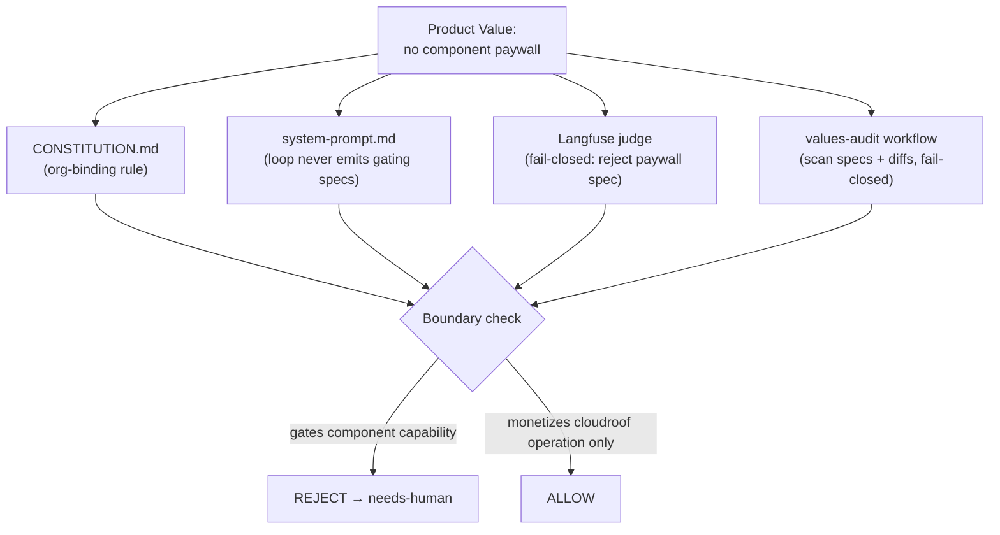

# Product Values: No-Paywall Constitutional Constraint

## Summary

Add an org-binding product-values principle to `CONSTITUTION.md` and wire live
enforcement so the autonomous company can never paywall a product *component*.
Every product the pipeline ships (today: wgmesh — daemon, CLI, dashboard,
libraries) is AGPL, full-functionality, with no license check, trial expiry,
kill-switch, or feature gate. A self-hoster gets 100% of the software, forever,
offline. Revenue comes only from the managed-service layer (cloudroof.eu):
hosting, managed ingress, support, SLA. The pipeline monetizes *operation*,
never *capability*.

## Problem Frame

The autonomous loop's goal is paid customers. The system-prompt funnel makes
this explicit: Stage 3 exits when "billing integration live, customer can sign
up and get invoiced" (`company/system-prompt.md:88`), Stage 5 is "First invoice
paid" (`:95`), and `fn:billing` is a first-class function label (`:247`).
Nothing in the system-prompt, `CONSTITUTION.md`, `sanitise.sh`, or any audit
workflow constrains *how* revenue is earned.

Given "increase MRR" with no veto, an agent picks the highest-leverage path to a
first invoice: gate the product. Issue #766 (`atvirokodosprendimai/wgmesh`) is
the result — "Build trial expiration paywall: upgrade modal + mesh pause on day
14." It specifies an `expire-trial` API that sets `trial_expired=true`, and mesh
**daemons that stop routing when the account expires**. That is a license
kill-switch compiled into AGPL software the user runs on their own machine — the
deepest possible violation of an open-source product promise, generated
autonomously with no human author intent.

The existing `open_source_default` Langfuse evaluator does not catch this: it
scores whether the box *adopts* OSS tooling (Answer over Intercom, Baserow over
Airtable), not whether the product it builds stays open
(`pipeline/evals/setup_langfuse_evaluators.py:123-143`). It is also advisory —
a numeric score, not a gate. The loop has no constitutional brake on this class
of work, so it will keep generating it.

## Key Decisions

- **The boundary is the deployment layer, not the feature layer.** Monetization
  attaches to *who operates the service*, not *which features are unlocked*.
  cloudroof.eu (managed hosting/ingress that cloudroof runs) is the only paid
  surface. The shipped software has no paid surface at all. This is "open
  product, paid hosting," not open-core — there is no withheld component tier.

- **A trial that expires may stop the managed service; it may never disable the
  user's software.** When a cloudroof trial ends, cloudroof stops operating its
  hosted nodes/ingress for that account. The wgmesh binary the user self-hosts
  keeps routing unconditionally — it never phones home, checks a license, or
  reads account state. This is the exact line #766 crossed.

- **AGPL is load-bearing, not incidental.** AGPL closes the SaaS loophole:
  cloudroof running modified wgmesh as a network service must offer its source.
  The license choice is what makes "paid hosting" reinforce openness instead of
  eroding it.

- **Enforcement must be fail-closed, not advisory.** The principle gets teeth by
  mirroring `public_safety_pass` (a hard gate), not `open_source_default` (an
  advisory score). A component-paywall spec routes to `needs-human`, never
  merges silently.

- **The constitution is org-binding via the control plane.** `CONSTITUTION.md`
  already governs "the autonomous company" (`AGENTS.md:31`). The new principle
  binds every seeded product the pipeline touches — present (wgmesh) and future
  — because the pipeline encodes it once and applies it to everything it
  generates.

## Requirements

**The principle (CONSTITUTION.md)**

- R1. `CONSTITUTION.md` gains a Product Values domain whose rules bind every
  product the autonomous company builds, not only this meta-repo's engineering.
- R2. An L1 rule states: every product component ships under AGPL (or a
  compatible strong copyleft) with full functionality — no feature is reserved
  for, or unlocked by, payment.
- R3. An L1 rule prohibits any component from gating functionality on payment,
  license key, account state, trial/time limit, remote authorization, or
  phone-home. Self-hosted software runs fully, offline, indefinitely.
- R4. An L1 rule states monetization may attach only to the managed-service
  layer (operation, hosting, ingress, support, SLA) — never to withholding
  software capability.
- R5. The amendment follows the existing process: version bump, version-history
  entry, and codebase evidence (cite #766 as the violation that motivates it).

**The boundary definition**

- R6. The constitution defines "component" (anything shipped to or run on a
  user's machine, or constituting the product's core capability) versus
  "managed-service layer" (infrastructure cloudroof operates on the user's
  behalf), with #766's mesh-pause as the worked counter-example.
- R7. A cloudroof trial or subscription ending may cease cloudroof-operated
  service for that account; it may not alter, disable, or degrade software the
  user runs themselves.

**Enforcement teeth**

- R8. `company/system-prompt.md` re-scopes `fn:billing` and `fn:gtm`, and the
  Stage 3 / Stage 5 exit criteria, so billing work targets only the
  managed-service layer; the prompt forbids emitting any spec that gates a
  component.
- R9. A fail-closed Langfuse evaluator scores box-proposed issues/specs for
  component-paywall intent and blocks (routes to `needs-human`) on violation —
  modeled on `public_safety_pass`, not the advisory `open_source_default`.
- R10. A values-audit gate (a workflow mirroring `pii-policy-check.yml` /
  `strategy-audit.yml`) scans product-repo specs and diffs for component-gating
  patterns (license check, trial expiry, kill-switch, pay-to-unlock) and fails
  closed.

**Cleanup of live violations**

- R11. Issue #766 is dispositioned as a constitutional violation: closed or
  rewritten so any trial behavior lives in the managed layer only.
- R12. The sibling GTM issues that share its premise (#736 pricing experiment,
  and #733–#735) are audited for the same component-gating defect and corrected.

## Acceptance Examples

- AE1. **Covers R3, R7.** Given a cloudroof trial account, when the trial
  reaches day 14, then cloudroof stops operating that account's hosted
  nodes/ingress, and the user's self-hosted wgmesh daemons keep routing with no
  change — no license check, no pause, no modal in the open-source dashboard.

- AE2. **Covers R8, R9.** Given the loop drafts an issue proposing "pause meshes
  / show upgrade modal when account expires" (the #766 shape), when it reaches
  the spec gate, then the Langfuse judge fails it closed and it routes to
  `needs-human` rather than entering the build chain.

- AE3. **Covers R4, R8.** Given the loop is working Stage 3 (reach billing-live),
  when it proposes monetization work, then the only accepted shape is
  managed-service billing (cloudroof signup/invoice for hosted operation), not a
  component tier or unlock.

- AE4. **Covers R10.** Given an impl PR in the product repo adds a code path that
  refuses functionality based on payment/license/account state, when the
  values-audit gate runs, then CI fails closed and the PR cannot merge.

## Scope Boundaries

**Outside this product's identity**

- Open-core / feature-tiered editions of any component. There is no "pro"
  build; the AGPL build is the whole product.
- Any phone-home, telemetry-gated, or remote-disable capability in shipped
  software.

**Deferred for later**

- cloudroof.eu's pricing model and tier design (what the managed service costs,
  trial length, plan shapes) — a separate GTM brainstorm. This work only fixes
  *where* monetization may attach, not *what* it charges.
- Whether cloudroof's own server-side orchestration is itself open-sourced.
  AGPL on wgmesh already forces sharing wgmesh modifications; open-sourcing the
  bespoke orchestration is encouraged under reciprocity but not required by this
  principle.
- Retrofitting the principle as machine-checkable regex in `CONSTITUTION.md`
  rule blocks beyond the audit workflow's patterns.

## Dependencies / Assumptions

- Assumes cloudroof.eu is and remains the company's paid surface, and that its
  value is hosting/operation a user could otherwise self-host for free
  (confirmed by operator; #766 framing assumed the opposite).
- Assumes the Langfuse evaluator infra (`setup_langfuse_evaluators.py`, v3
  UNSTABLE API) can host a fail-closed gate; `public_safety_pass` is the
  precedent that gating judges already exist.
- Assumes the spec/build gate can route on an evaluator verdict before build —
  to confirm during planning against the LangGraph pipeline's gate node.

## Outstanding Questions

**Resolve before planning**

- None blocking. The boundary, revenue surface, enforcement scope, and cleanup
  set are pinned.

**Deferred to planning**

- Exact machine-checkable patterns for the values-audit gate (which strings /
  AST shapes signal component-gating without false-positiving on legitimate
  cloudroof-layer billing code).
- Whether R9 (Langfuse judge) and R10 (audit workflow) are redundant or
  defense-in-depth — planning decides if both ship or one suffices.
- Where the org-level statement physically lives: a new top-level article in
  `CONSTITUTION.md` versus a short wgmesh-side echo in its LICENSE/README that
  references the constitution.

## Sources / Research

- `atvirokodosprendimai/wgmesh#766` — the violation: trial-expiry paywall with
  mesh-daemon kill-switch. Authored through the pipeline.
- `company/system-prompt.md:88,95,247,271` — funnel Stage 3/5 exits, `fn:billing`
  label, Polar revenue as funnel-progression signal.
- `pipeline/evals/setup_langfuse_evaluators.py:123-143,195-200` —
  `open_source_default` scores tooling adoption, advisory only; `public_safety_pass`
  is the fail-closed gate precedent.
- `company/scripts/sanitise.sh` — gates secrets/PII, not business model.
- `CONSTITUTION.md` — no OSS/paywall/license clause exists today; Amendment
  Process at `:420`.
- `STRATEGY.md:46-50` — Customer Factory / Revenue surface track (cloudroof.eu,
  Polar tiers) — the surface that must be re-scoped to managed-only.
- `AGENTS.md:31` — `CONSTITUTION.md` is "Governing principles and hard
  constraints for the autonomous company" (org reach).
