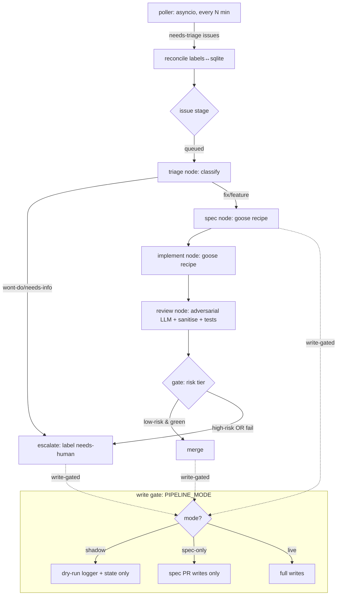

# feat: Self-hosted LangGraph autonomous pipeline on Hetzner (wgmesh)

**Target repo:** this repo (`ai-pipeline-template`). New component dir `pipeline/`. Operates on `atvirokodosprendimai/wgmesh`.

---

## Summary

Replace the GitHub-Actions/Copilot/Goose-on-Actions chain (goose-triage → spec-auto-approve → goose-build) with a single self-hosted Python service that owns the autonomous loop: poll wgmesh issues, run a LangGraph graph (triage → spec → implement → review → gate), drive Goose for spec/impl, and open/merge PRs under one PAT identity. The service owns its queue, state, and scheduler — **no GitHub-side workflow triggers in the loop** — eliminating the entire class of failures hit this session (Copilot availability, expired PUSH_TOKEN PAT, app-perms gap, self-approval 422, label-trigger coupling). Eval-driven from day one via LangSmith + openevals/agentevals.

This plan covers **Phase 1 (first PR): the core service skeleton in shadow mode (no writes) plus the eval harness and gate golden-set.** Live-write stages, deployment/systemd, and cutover are later phases (enumerated under Phased Delivery, deferred).

---

## Problem Frame

The wgmesh autonomous pipeline is coupled to GitHub-side machinery that fails independently and silently:
- **Copilot coding agent** — intermittently unavailable (`Bad credentials` on assign).
- **PUSH_TOKEN PAT** — expired; 56% of wgmesh workflow runs failed in a 24h window.
- **GitHub App perms** — lacks `issues:write`; label-add can't trigger downstream.
- **Self-approval** — app token authoring + approving a PR → HTTP 422.
- **Label/event triggers** — `GITHUB_TOKEN`-created events don't trigger downstream workflows.

Each is a symptom of running the agent loop **inside** GitHub's orchestration. Moving the loop onto owned infra (Hetzner) removes the orchestration coupling by construction: the box decides what to do from its own state + the issues API, and uses GitHub only to host code and surface PRs.

Requirements traceability: realizes the standing decision to "decouple pipeline from GitHub — own queue/state/scheduler" (see memory `project_decouple_pipeline_from_github`), via the brainstorm-locked anchors below.

---

## Requirements

- **R1** — Single Python service polls wgmesh `needs-triage` issues on its own asyncio schedule (no cron, no webhook).
- **R2** — Owned sqlite state is the source of truth for issue stage/status; reconciles against GitHub labels.
- **R3** — LangGraph graph runs triage → spec → implement → review → gate; spec and implement nodes shell out to `goose run` reusing existing wgmesh recipes.
- **R4** — All GitHub writes go through one fine-grained PAT identity (clone/push/PR/issue ops).
- **R5** — Merge gate: low-risk + tests + sanitise + clean adversarial review → auto-merge; high-risk paths or any failure → label `needs-human`, stop. Never merge unreviewed, never merge high-risk blind.
- **R6** — Eval suite (day one): LangSmith tracing on all runs; offline golden sets for spec, impl, and the gate (precision/recall); trajectory eval (graph never skips review); online scoring of live runs.
- **R7** — **Phase 1 ships shadow mode**: the loop runs end-to-end but performs **no GitHub writes** (specs/diffs computed and logged, decisions recorded in state; no branch push, no PR, no merge, no label change).
- **R8** — Existing Actions workflows remain untouched and live in Phase 1 (fallback); they are only disabled in the later cutover phase.

---

## Key Technical Decisions

- **KTD1 — Single systemd Python service (runtime A), not LangGraph Platform or containers.** Smallest surface that kills the coupling. sqlite + asyncio poller + in-process graph. Postgres/containers/server-runtime are later graduations, not needed to prove the loop. (Brainstorm anchor: scope = full loop, runtime A.)
- **KTD2 — Wrap Goose CLI for spec + implement.** Reuse the proven `wgmesh-triage-spec.yaml` and `wgmesh-implementation.yaml` recipes via `goose run --recipe ... --params spec_file=...`, LLM = z.ai/GLM (`ANTHROPIC_API_KEY=ZAI_API_KEY`, `ANTHROPIC_HOST=https://api.z.ai/api/anthropic`). Do not re-implement a coding agent. (Anchor: coding core = wrap Goose.)
- **KTD3 — Single fine-grained PAT identity on the box.** Scopes: issues, contents, pull_requests. No GitHub App, no Actions tokens. Self-approval is moot in shadow (no writes); in later live phases the single identity authors + a separate review identity is **not** needed because the box's review node gates merge directly (admin/direct merge by the same identity is allowed — self-*merge* is permitted; only self-*approval review* is blocked, which we don't depend on). (Anchor: identity = dedicated PAT.)
- **KTD4 — Risk-tier gate mirrors existing `pr-disposition` high-risk regexes.** High-risk: `auth|authn|oauth|crypto|wireguard key|secret|token|credential|payment|polar|billing|stripe`, net-new external network calls, or > `MAX_FILES` changed files. Reuse `company/scripts/sanitise.sh` as a hard gate. (Anchor: tiered merge.)
- **KTD5 — Eval-driven from day one.** LangSmith for tracing/datasets/online scoring; `openevals` (LLM-as-judge) + `agentevals` (trajectory). The **gate golden-set is the highest-leverage eval** — auto-merge is only trustworthy if the gate's precision/recall on known-good/known-bad diffs is measured. (Anchor: full eval suite.)
- **KTD6 — Python packaging via `pyproject.toml` (uv/pip), pytest for tests.** Repo is currently bash/yaml; `pipeline/` is a self-contained Python package with its own venv on the box.
- **KTD7 — Shadow mode is a hard runtime flag (`PIPELINE_MODE=shadow|spec-only|live`), defaulting to `shadow`.** Every GitHub-write site checks the mode and routes to a dry-run logger in shadow. This makes Phase 1 safe to run against real wgmesh issues without side effects, and makes cutover a config change.

---

## Output Structure

```
pipeline/
├── pyproject.toml
├── README.md
├── wgmesh_pipeline/
│   ├── __init__.py
│   ├── config.py                # env + mode loading, validation
│   ├── tracing.py               # LangSmith init (env-gated, no-op if unset)
│   ├── state/
│   │   ├── schema.sql           # issues, runs tables
│   │   └── store.py             # sqlite CRUD, transitions, dedup, retry-cooldown
│   ├── github/
│   │   ├── client.py            # PAT-backed REST/git wrapper; write-gated by mode
│   │   └── reconcile.py         # labels ↔ state reconciliation
│   ├── goose/
│   │   └── runner.py            # subprocess wrapper for `goose run --recipe`
│   ├── graph/
│   │   ├── state.py             # GraphState TypedDict
│   │   ├── build.py             # LangGraph assembly + edges
│   │   └── nodes/
│   │       ├── triage.py        # classify fix/feature/wont-do (LLM)
│   │       ├── spec.py          # goose spec recipe → specs/issue-N.md
│   │       ├── implement.py     # goose impl recipe → code+tests
│   │       ├── review.py        # adversarial LLM review + sanitise + tests
│   │       └── gate.py          # risk-tier decision → merge/escalate (write-gated)
│   ├── risk.py                  # risk-tier classifier (diff → low/high)
│   ├── poller.py                # asyncio scheduler loop
│   └── main.py                  # entrypoint, wires poller + graph + state
├── evals/
│   ├── datasets/
│   │   ├── gate_golden.jsonl    # known-good + known-bad/high-risk diffs + labels
│   │   └── spec_golden.jsonl    # issues + expected spec characteristics
│   ├── eval_gate.py             # precision/recall of auto-merge decision
│   ├── eval_spec.py             # structural + LLM-judge spec quality
│   ├── eval_trajectory.py       # agentevals: never-skip-review invariant
│   └── run_evals.py             # CI entrypoint, LangSmith dataset upload
└── tests/
    ├── conftest.py
    ├── test_config.py
    ├── test_state.py
    ├── test_reconcile.py
    ├── test_risk.py
    ├── test_gate.py
    ├── test_goose_runner.py
    └── test_poller.py
```

---

## High-Level Technical Design

Graph topology and the shadow-mode write gate:



Every node emits a LangSmith trace span. The poller never blocks on a single issue: each issue advances one stage per tick, with state persisted between ticks (crash-safe resume).

---

## Implementation Units (Phase 1 — first PR, shadow mode)

### U1. Package scaffold + config + mode flag

**Goal:** Stand up the `pipeline/` Python package with env/config loading and the hard `PIPELINE_MODE` gate.
**Requirements:** R1, R7, KTD6, KTD7.
**Dependencies:** none.
**Files:** `pipeline/pyproject.toml`, `pipeline/wgmesh_pipeline/__init__.py`, `pipeline/wgmesh_pipeline/config.py`, `pipeline/README.md`, `pipeline/tests/test_config.py`, `pipeline/tests/conftest.py`.
**Approach:** `config.py` loads env (`WGMESH_BOT_PAT`, `ZAI_API_KEY`, `ANTHROPIC_HOST`, `LANGSMITH_API_KEY`, `TARGET_REPO`, `PIPELINE_MODE`, `POLL_INTERVAL_SECONDS`, `MAX_FILES`) into a frozen dataclass; validate required vars per mode (shadow needs no PAT write scope; live does); default `PIPELINE_MODE=shadow`. Fail-loud on missing required vars.
**Patterns to follow:** mirror env-validation discipline in `company/scripts/*.sh` (loud-fail on empty required secrets).
**Test scenarios:**
- Happy: full env → valid frozen `Config`; `mode=shadow` by default when `PIPELINE_MODE` unset.
- Edge: `PIPELINE_MODE=bogus` → raises ValueError listing valid modes.
- Error: missing `TARGET_REPO` → raises with the var name.
- Edge: `mode=shadow` with no PAT → OK (shadow needs no writes); `mode=live` with no PAT → raises.
**Verification:** `pytest pipeline/tests/test_config.py` green; importing the package with a minimal env succeeds.

### U2. sqlite state store (owned queue)

**Goal:** The owned queue — issues/runs tables, stage transitions, dedup, retry-with-cooldown.
**Requirements:** R2, KTD1.
**Dependencies:** U1.
**Files:** `pipeline/wgmesh_pipeline/state/schema.sql`, `pipeline/wgmesh_pipeline/state/store.py`, `pipeline/tests/test_state.py`.
**Approach:** `issues(number PK, title, classification, stage, status, risk_tier, attempts, spec_pr, impl_pr, last_error, updated_at)`; `runs(id PK, issue, node, started, ended, outcome, langsmith_run_id, tokens)`. `stage ∈ {queued,triaged,specced,implemented,reviewed,merged,escalated,failed}`. Store exposes `upsert_issue`, `transition(number, from_stage, to_stage)` (rejects illegal transitions), `claim_next()` (returns the next actionable issue honoring cooldown), `record_run(...)`, `bump_attempt(...)`. Cooldown = `updated_at + backoff(attempts)`.
**Patterns to follow:** transition table as an explicit allowed-edges map; immutable-update style (new row dicts, no in-place mutation).
**Test scenarios:**
- Happy: upsert then transition queued→triaged→specced persists and reads back.
- Edge: illegal transition (merged→queued) rejected with clear error.
- Edge: `claim_next` skips issues whose cooldown has not elapsed; returns the eldest eligible.
- Edge: dedup — upserting the same issue number twice updates, never duplicates.
- Error: `bump_attempt` increments and sets `last_error`; after N attempts stage→failed.
**Verification:** `pytest pipeline/tests/test_state.py` green; schema applies idempotently.

### U3. GitHub client (PAT, write-gated)

**Goal:** One PAT-backed client for issue reads, label ops, branch push, PR create/merge — every write routed through the mode gate.
**Requirements:** R4, R7, KTD3, KTD7.
**Dependencies:** U1.
**Files:** `pipeline/wgmesh_pipeline/github/client.py`, `pipeline/tests/conftest.py` (fixtures/mocks).
**Approach:** Thin wrapper over the GitHub REST API + local git (subprocess) using `WGMESH_BOT_PAT`. Reads (list issues, get PR, get diff) always execute. **Writes** (`add_label`, `remove_label`, `push_branch`, `create_pr`, `merge_pr`, `comment`) check `config.mode`: in `shadow`, log the intended write to a structured dry-run record and return a synthetic result; in `spec-only`, allow spec-PR writes only; in `live`, execute. No write method may bypass the gate.
**Patterns to follow:** existing `gh`/git usage in `.github/workflows/*` (spec PR title `spec: Issue #N - <title>`); sanitise gating before any content write (`company/scripts/sanitise.sh`).
**Test scenarios:**
- Happy: `list_needs_triage()` returns parsed issues (mocked HTTP).
- Integration: in `shadow` mode, `create_pr(...)` performs NO network write and returns a dry-run marker; the intended payload is captured for assertion.
- Edge: `merge_pr` in shadow → dry-run; in live (mocked) → calls the merge endpoint once.
- Error: write attempted in `spec-only` mode for a non-spec PR → refused.
**Verification:** `pytest` covers the gate matrix (mode × write-method) proving no shadow-mode network writes.

### U4. Reconcile (labels ↔ state)

**Goal:** Keep sqlite as source of truth; reconcile GitHub `needs-triage`/`copilot-triaging`/`needs-human` labels against stored stage.
**Requirements:** R2.
**Dependencies:** U2, U3.
**Files:** `pipeline/wgmesh_pipeline/github/reconcile.py`, `pipeline/tests/test_reconcile.py`.
**Approach:** On each poll, fetch open issues + labels; for each, upsert into state and resolve drift (e.g., issue merged upstream but stage<merged → mark merged; issue reopened → re-queue per rules). Reconciliation is read-only against state-truth; label *writes* go through U3's gate.
**Test scenarios:**
- Happy: new `needs-triage` issue not in state → inserted as `queued`.
- Edge: issue with merged spec/impl PR upstream → state advanced, not re-queued (mirror `#1476` completed-issue skip).
- Edge: issue labeled `needs-human` upstream → state `escalated`, excluded from `claim_next`.
- Integration: reconcile then `claim_next` returns only actionable, non-escalated, cooldown-elapsed issues.
**Verification:** `pytest pipeline/tests/test_reconcile.py` green.

### U5. Goose runner

**Goal:** Subprocess wrapper for `goose run --recipe ... --params spec_file=...` with empty-output guard.
**Requirements:** R3, KTD2.
**Dependencies:** U1.
**Files:** `pipeline/wgmesh_pipeline/goose/runner.py`, `pipeline/tests/test_goose_runner.py`.
**Approach:** Run goose in a working clone with the z.ai env; capture stdout/stderr/exit; **guard against 0-change/empty output** (the historical masking bug — see memory `project_goose_pipeline_fix`): fail loudly if the expected output file (`specs/issue-N-spec.md` or impl diff) is missing or empty. Return a structured result (ok, output_path, duration, raw_log).
**Patterns to follow:** the merged goose-triage/goose-build workflow invocation (`--no-session`, recipe + params); empty-output guard from those workflows.
**Test scenarios:**
- Happy: mocked goose writes the spec file → runner returns ok + path.
- Error: goose exits non-zero → runner returns not-ok with raw log; no exception leak.
- Edge: goose exits 0 but produced no/empty file → runner FAILS loudly (guard fires).
- Edge: `goose_duration≈0` (recipe parse failure signal) surfaced in result.
**Verification:** `pytest pipeline/tests/test_goose_runner.py` green; guard proven on the empty-output case.

### U6. Risk-tier classifier

**Goal:** Classify a diff as low/high risk per the existing pr-disposition regexes + file-count + net-new-external-call heuristic.
**Requirements:** R5, KTD4.
**Dependencies:** U1.
**Files:** `pipeline/wgmesh_pipeline/risk.py`, `pipeline/tests/test_risk.py`.
**Approach:** Input = changed file paths + diff text. High-risk if any path matches `auth|authn|oauth|crypto|wireguard key|secret|token|credential|payment|polar|billing|stripe`, OR changed-files > `MAX_FILES`, OR diff introduces a net-new outbound network call (heuristic regex on added lines). Otherwise low. Pure function, no I/O.
**Patterns to follow:** high-risk path regexes from `.compound-engineering/config.local.yaml` `pr_disposition_high_risk_paths` and the pr-disposition workflow.
**Test scenarios:**
- Happy: docs-only diff → low.
- Edge: touches `internal/crypto/key.go` → high.
- Edge: 1-line change across `MAX_FILES+1` files → high (file-count rule).
- Edge: adds `http.Post(...)` to a new endpoint → high (net-new external call).
- Edge: boundary at exactly `MAX_FILES` → low.
**Verification:** `pytest pipeline/tests/test_risk.py` green across all tiers.

### U7. Graph state + nodes + assembly

**Goal:** Wire the LangGraph graph: triage → spec → implement → review → gate, with shadow-safe nodes.
**Requirements:** R3, R5, R7.
**Dependencies:** U2, U3, U5, U6.
**Files:** `pipeline/wgmesh_pipeline/graph/state.py`, `pipeline/wgmesh_pipeline/graph/build.py`, `pipeline/wgmesh_pipeline/graph/nodes/triage.py`, `.../spec.py`, `.../implement.py`, `.../review.py`, `.../gate.py`, `pipeline/tests/test_gate.py`.
**Approach:** `GraphState` TypedDict (issue, classification, spec_path, diff, risk_tier, review_findings, decision). `triage` = LLM classify (fix/feature/wont-do/needs-info); wont-do/needs-info → escalate edge. `spec`/`implement` = call U5 goose runner. `review` = adversarial LLM review + `sanitise.sh` + run wgmesh tests; produce blocking/non-blocking findings. `gate` = combine U6 risk-tier + review result → `merge` or `escalate`; **all merge/escalate side-effects route through U3's write gate** (dry-run in shadow). `build.py` assembles nodes + conditional edges and returns a compiled graph. Each node wrapped to emit a LangSmith span (U10).
**Execution note:** implement the gate decision function test-first — it is the safety-critical unit.
**Patterns to follow:** LangGraph `StateGraph` + conditional edges; existing adversarial-review framing from `ce-code-review` personas.
**Test scenarios:**
- Happy (gate): low-risk + tests pass + sanitise clean + no blocking findings → decision=merge.
- Edge (gate): high-risk path → decision=escalate regardless of green tests.
- Edge (gate): blocking review finding → escalate.
- Edge (gate): sanitise failure → escalate.
- Integration (graph): triage=wont-do → routes straight to escalate, skips spec/implement.
- Integration (graph): full fix path reaches gate with a populated diff; in shadow, no writes occur.
**Verification:** `pytest pipeline/tests/test_gate.py` green; a compiled graph runs end-to-end on a stub issue in shadow with zero writes.

### U8. Poller + main entrypoint

**Goal:** asyncio scheduler that reconciles, claims the next issue, advances it one stage, persists, repeats — crash-safe.
**Requirements:** R1, R2, R7.
**Dependencies:** U4, U7.
**Files:** `pipeline/wgmesh_pipeline/poller.py`, `pipeline/wgmesh_pipeline/main.py`, `pipeline/tests/test_poller.py`.
**Approach:** Loop every `POLL_INTERVAL_SECONDS`: reconcile → `claim_next` → run the graph for that issue's current stage → persist transition + record_run. One stage per tick; resume from sqlite on restart. `main.py` builds config, state, client, graph, tracing, then runs the poller. Graceful shutdown on SIGTERM (systemd-friendly).
**Test scenarios:**
- Happy: one tick advances a queued issue to triaged and records a run.
- Edge: no actionable issues → tick is a no-op, no error.
- Edge: graph raises on one issue → `bump_attempt` + `last_error`, loop continues (one bad issue never halts the loop).
- Integration: restart mid-flight → state resumes at the persisted stage, no double-work.
**Verification:** `pytest pipeline/tests/test_poller.py` green; `python -m wgmesh_pipeline.main` in shadow against a fixture issue completes a full cycle with no writes.

### U9. LangSmith tracing

**Goal:** Env-gated tracing on every node and the whole run; no-op when `LANGSMITH_API_KEY` unset.
**Requirements:** R6.
**Dependencies:** U1.
**Files:** `pipeline/wgmesh_pipeline/tracing.py` (+ decorators applied in U7 nodes).
**Approach:** Initialize LangSmith from env; wrap nodes so each emits a span (inputs/outputs/tokens/latency/errors) tagged by issue + stage; store the run id back into `runs.langsmith_run_id`. When the key is absent, tracing degrades to a no-op so local/dev runs work.
**Test scenarios:**
- Happy: with key set (mocked), running a node emits one span with the expected tags.
- Edge: key unset → no-op, node still runs and returns normally.
**Verification:** `pytest` covers the no-op path; a traced shadow run shows spans in LangSmith (manual, dev).

### U10. Eval harness + gate golden-set

**Goal:** The day-one eval scaffolding, with the highest-leverage gate golden-set populated and runnable in CI.
**Requirements:** R6, KTD5.
**Dependencies:** U6, U7.
**Files:** `pipeline/evals/datasets/gate_golden.jsonl`, `pipeline/evals/datasets/spec_golden.jsonl`, `pipeline/evals/eval_gate.py`, `pipeline/evals/eval_spec.py`, `pipeline/evals/eval_trajectory.py`, `pipeline/evals/run_evals.py`.
**Approach:** `gate_golden.jsonl` = labeled diffs: known-good (low-risk, clean) that MUST auto-merge, and known-bad/high-risk that MUST escalate. `eval_gate.py` runs the U7 gate over the set and computes **precision/recall of the auto-merge decision** (false-merge of a high-risk diff is the cardinal failure → weight recall on "escalate"). `eval_spec.py` = structural check (3 required sections present) + LLM-as-judge (openevals) for concreteness. `eval_trajectory.py` (agentevals) asserts the graph never reaches `merge` without passing through `review`. `run_evals.py` = CI entrypoint; optionally uploads datasets to LangSmith.
**Execution note:** seed `gate_golden.jsonl` with at least the real high-risk categories from KTD4 plus a few benign docs/test diffs.
**Test scenarios:**
- Happy: gate eval over the golden set reports precision/recall; a deliberately-broken gate (auto-merges high-risk) drops escalate-recall below threshold → eval fails (proving the eval bites).
- Edge: spec eval flags a spec missing `## Proposed Approach` (the real `#660` failure) as low-quality.
- Edge: trajectory eval fails a synthetic trace that skips review.
**Verification:** `python pipeline/evals/run_evals.py` runs all three evals; gate precision/recall printed; CI-runnable exit code.

---

## Phased Delivery

- **Phase 1 (this PR):** U1–U10 — full graph in **shadow mode** (no writes) + eval harness + gate golden-set + unit tests. Runs against real wgmesh issues with zero side effects.
- **Phase 2 (deferred):** spec-only live — flip `PIPELINE_MODE=spec-only`; box opens real spec PRs, Actions still build/merge; verify spec parity vs the live chain.
- **Phase 3 (deferred):** full live — `PIPELINE_MODE=live`; box owns through merge; disable goose-triage/goose-build/spec-auto-approve (`if: false` fallback). Online LangSmith scoring feeds KPIs.
- **Phase 4 (deferred):** deployment — Hetzner host decision (new VM via `HCLOUD_TOKEN` vs co-locate on chimney), systemd unit, secrets provisioning (`WGMESH_BOT_PAT`, `LANGSMITH_API_KEY`), coroot/signoz wiring, deploy/update script.

---

## Scope Boundaries

**In scope (Phase 1):** the `pipeline/` package, shadow-mode end-to-end loop, eval harness + gate golden-set, unit tests.

### Deferred to Follow-Up Work
- systemd unit + Hetzner provisioning + secrets (Phase 4).
- Live writes / cutover / disabling Actions workflows (Phases 2–3).
- Online production scoring dashboards (Phase 3).
- Postgres migration (only if sqlite proves insufficient).
- Generalizing the pipeline beyond wgmesh to other seed repos.

---

## Risks & Dependencies

- **R-A: Goose recipe fragility** (historical 40-day outage). Mitigation: U5 mirrors the known-good invocation verbatim and guards empty output; recipe schema unchanged.
- **R-B: Shadow-mode leak** — an accidental real write during Phase 1. Mitigation: KTD7 single choke point in U3; the U3 test matrix proves no shadow network writes; no node calls the GitHub API except through U3.
- **R-C: Eval that doesn't bite** — a gate golden-set that passes a broken gate. Mitigation: U10 includes a deliberately-broken-gate test that MUST fail the eval.
- **R-D: PAT scope/expiry** (the very failure we're fleeing). Phase 1 needs only `issues:read`/`repo:read` for shadow; write scopes provisioned at Phase 2. Rotation cadence is a Phase 4 ops concern.
- **Dependencies:** `langgraph`, `langsmith`, `openevals`, `agentevals`, `langchain-anthropic` (pointed at z.ai), goose CLI on the box, Python 3.11+.

---

## System-Wide Impact

- The 3 wgmesh Actions workflows are **untouched in Phase 1** (R8) — pure addition, zero risk to the running fallback pipeline.
- New `pipeline/` dir is the first Python in a bash/yaml repo; isolate its tooling (own `pyproject.toml`, venv) so it doesn't perturb existing shell CI.
- LangSmith introduces an external observability dependency; gated so absence is a no-op.

---

## Sources & Research

- Memory: `project_langgraph_hetzner_pipeline` (brainstorm anchors), `project_wgmesh_triage_bad_credentials` (PUSH_TOKEN root), `project_goose_pipeline_fix` (recipe schema + empty-output bug), `project_goose_authored_specs_plan` (spec-contract 3-sections), `reference_autonomous_lane_label_gates`, `project_decouple_pipeline_from_github`.
- Existing code: `company/scripts/sanitise.sh`, `.github/workflows/goose-build.yml` (recipe invocation), `.compound-engineering/config.local.yaml` (high-risk regexes).
- External (to confirm at implementation): current `langgraph` StateGraph API, `openevals`/`agentevals` evaluator signatures, LangSmith tracing env vars.
