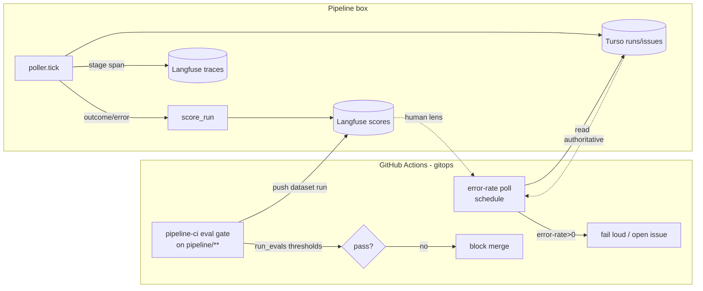

# feat: Langfuse correctness layer — make the lang* stack assert pipeline correctness

**Target repo:** ai-pipeline-template (this repo); runtime is the Hetzner pipeline box + GitHub Actions.

## Summary

We launched self-hosted Langfuse + an eval scaffold (`pipeline/evals/`) but use them only as a passive trace viewer. This session cost ~6 hours because prod behavior was **invisible and unasserted**: 5 latent bugs (langfuse-v4 API, shadow fake-advance, silent-swallow, spec-only gate stall, spec-write-never-wired) each passed 98 unit tests and surfaced only via manual gitops archaeology. This plan turns Langfuse + evals into an **always-on correctness layer** so the pipeline self-reports when it breaks and proves its own safety before autonomy widens.

Four capabilities, phased:
1. **Outcome + error scoring that is verified to land** (kills the silent-swallow / hollow-green class).
2. **Gitops error-rate poll** that fails loud when any node errors (turns silent stalls into alerts).
3. **Gate golden-set as a CI eval wall** (auto-merge is only safe if the gate evals well).
4. **Spec-parity scoring + prompt management** (go-live decision + recipe iteration) — gated on the in-flight goose wiring (`feat/wire-goose-spec-authoring`, Codex `br9dimd21`).

---

## Problem Frame

- **What's broken:** Langfuse receives spans but nothing *asserts* on them. Scores view shows 0 (the stalled box never reached a terminal outcome; once it errors, scoring is `except: pass`-guarded and unverified). Evals run locally and print to stdout — not in CI, not in Langfuse, not gating anything. There is no signal that says "the box is erroring" without a human polling Turso/journalctl.
- **Why it matters:** The pipeline is moving toward `live` + auto-merge. Auto-merge on an unasserted gate is the documented PII-leak / hollow-green risk. And every hour the box silently stalls is lost convergence toward the revenue goal.
- **The leverage:** We already proved it — adding logging (#1536) turned 6h of blind guessing into one journal line. Institutionalize that as data: scores + evals + an error-rate gate.

---

## Requirements

- **R1** — Every run outcome (merged / escalated / failed) and every tick-level error is recorded to Langfuse as a score/observation, and this is **verified to actually land** (not assumed from a green unit test).
- **R2** — Scoring/telemetry guards never silently swallow: first failure is announced (stderr/log), mirroring `tracing.py` ([[feedback_defensive_guard_must_announce]]).
- **R3** — A scheduled gitops workflow computes per-node error-rate from the box's durable state (and/or Langfuse) and fails loud / opens an issue when error-rate > 0 over the window.
- **R4** — The gate golden-set (`pipeline/evals/datasets/gate_golden.jsonl`) runs in CI on every `pipeline/**` change and **fails the build** when auto-merge precision or escalate-recall drops below threshold.
- **R5** — Gate/eval results are pushed to Langfuse as a dataset run so eval quality is trackable over time.
- **R6** — Once goose authoring lands, box-authored specs are scored against the legacy Actions-chain specs (spec-parity) and surfaced as a go-live signal.
- **R7** — The goose spec-authoring prompt/recipe is versioned in Langfuse prompt management and iterable via the playground.
- **R8** — Nothing in this layer can crash or block the poll loop; all telemetry is best-effort and guarded (but loud on first failure per R2).

---

## Key Technical Decisions

- **KTD1 — Gitops poll, not Langfuse-native alerts** (user decision). Alerting is a scheduled workflow reading durable state (Turso) and/or the Langfuse API, computing error-rate, and failing loud / opening an issue. Rationale: in-repo, versioned, no UI-config drift — same pattern as `diagnose-pipeline.yml`. Langfuse-native alerts deferred (Scope Boundaries).
- **KTD2 — Durable state is the source of truth for error-rate; Langfuse is the human lens.** The `runs` table already records `outcome` per node (`ok`/`error`) and `issues.last_error`. The poll computes error-rate from Turso (authoritative, already-queried by `diagnose-pipeline.yml`) and cross-references Langfuse for the human-facing view. Avoids depending on the Langfuse secret key in CI for the hard gate.
- **KTD3 — Verify-by-landing, not by unit test.** Every telemetry unit's verification includes an end-to-end check that data appears in Langfuse/Turso, because this session's entire bug class was green-tests-over-unlanded-behavior ([[feedback_test_fakes_override_the_gate]], [[feedback_green_tests_rest_on_stubs]]). Tests stub the lowest boundary only.
- **KTD4 — Scores link to traces where possible.** `create_score` accepts an optional `trace_id`; attach the run's trace id so scores are navigable from the trace, not free-floating. If trace-id plumbing is non-trivial, free-floating scores are acceptable for v1 (Open Question OQ1).
- **KTD5 — Eval CI gate uses thresholds, not exact match.** `run_evals.py` already computes auto_merge_precision / auto_merge_recall / escalate_recall. CI fails when below configurable thresholds (start: escalate_recall == 1.0, auto_merge_precision ≥ 0.9) so a regression that would auto-merge a high-risk change breaks the build.
- **KTD6 — Phase 4 (U5/U6) is gated on goose wiring.** Spec-parity + prompt-mgmt need real box-authored specs. They are planned but sequenced after `feat/wire-goose-spec-authoring` merges; do not start them until the box writes real specs.

---

## High-Level Technical Design

Authoritative: error-rate gate reads Turso; Langfuse is the human-navigable view + eval-quality history.

---

## Implementation Units

### U1. Verified, loud outcome/error scoring to Langfuse

**Goal:** Make `score_run` actually land scores in Langfuse and announce on first failure (kill the silent swallow). Confirm via the live box, not just a unit test.
**Requirements:** R1, R2, R8, KTD3, KTD4
**Dependencies:** none
**Files:** `pipeline/wgmesh_pipeline/scoring.py`, `pipeline/tests/test_scoring.py`
**Approach:** `LangfuseScorer.record` already calls the valid v4 `create_score(name, value, data_type, metadata)`. Two gaps: (1) the `except Exception: pass` swallows any failure silently — add a one-time stderr announce (`_warned` flag, mirror `tracing._LangfuseSpan._announce`); (2) attach `trace_id` when the run has one in scratch/state so scores link to the trace (KTD4; fall back to free-floating if absent). Keep the whole-body guard in `score_run` (must never raise into the loop).
**Patterns to follow:** `pipeline/wgmesh_pipeline/tracing.py` `_LangfuseSpan` (v4 fix + `_announce` + `_warned`).
**Test scenarios:**
- Happy: a fake Langfuse client records `create_score` with `name=pipeline_outcome`, the outcome value, and merged metadata; `flush` called.
- v4/v3 tolerance: if a `trace_id` is present in state it is passed to `create_score`; absent → omitted, no crash.
- Loud-on-failure: a client whose `create_score` raises → `score_run` returns the scores dict, does NOT raise, and prints `tracing/scoring degraded` once to stderr (assert via capsys).
- Outcome coverage: merged / escalated / failed each produce a score with correct categorical value.
**Verification:** unit tests green; then deploy and confirm scores appear in Langfuse `Scores` view for real wgmesh runs (count > 0, linked to traces). Covers the dashboard's current "Scores: 0".

### U2. Score tick-level errors per node (not just terminal outcomes)

**Goal:** Surface per-node failures (the 5-bug class) as Langfuse data + structured fields, so an erroring stage is visible without reading journalctl.
**Requirements:** R1, R2, R8
**Dependencies:** U1
**Files:** `pipeline/wgmesh_pipeline/poller.py`, `pipeline/tests/test_poller.py`
**Approach:** The tick `except` blocks (reconcile/claim and advance) currently `log.exception` + `bump_attempt` + (advance path) `score_run(failed)`. Add: the reconcile/claim except path also records a failure score tagged with `node`/`stage` and the error string (truncated), so reconcile-level failures (like the spec-only gate stall) become scored data, not just a log line. Ensure the `node`/`stage` and a short error tag ride along in the score's tags for the poll to aggregate.
**Patterns to follow:** existing `score_run` call in the advance-except branch (poller.py).
**Test scenarios:**
- Reconcile/claim raises → a failure score is recorded with the stage and a truncated error tag; loop continues (returns None, no raise).
- Advance raises → existing failed score still recorded plus node tag present.
- Success tick → no failure score; one ok run recorded.
**Verification:** unit tests green; deploy and confirm an induced error (or the current spec_pr error pre-goose-fix) shows as a failed score with `node` tag in Langfuse.

### U3. Gitops error-rate poll workflow (fail loud on any node error)

**Goal:** A scheduled workflow that reads durable state, computes per-node error-rate over a window, and fails loud / opens an issue when error-rate > 0 — turning silent stalls into alerts (R3).
**Requirements:** R3, KTD1, KTD2
**Dependencies:** U2 (richer scored errors improve the Langfuse cross-reference; Turso `runs` already sufficient for the hard gate)
**Files:** `.github/workflows/pipeline-error-rate.yml` (new), `pipeline/wgmesh_pipeline/state/store.py` (add a read-only `error_stats(window)` helper if cleaner than inline SQL), `pipeline/tests/test_state.py`
**Approach:** Extend the proven `diagnose-pipeline.yml` pattern: connect to Turso via `TURSO_*` secrets, compute per-node `error/(ok+error)` over the recent window + count issues at `stage='failed'` and issues with non-null `last_error`. Schedule (e.g. every 15 min) + `workflow_dispatch`. On error-rate > 0 (or any `failed`-stage issue): print a loud summary and open/update a single deduped GitHub issue (`pipeline: box error-rate > 0`) with the failing node + last_error. Idempotent: reuse one tracking issue, don't flood (mirror the supervisor/state anti-flood lessons).
**Patterns to follow:** `.github/workflows/diagnose-pipeline.yml` (Turso query via libsql); dedup pattern from the heartbeat/supervisor workflows.
**Test scenarios:**
- `error_stats` over a store with mixed ok/error runs returns correct per-node rates and failed-issue count.
- Window boundary: runs outside the window excluded.
- Zero-error store → empty/zero result (workflow would pass).
- `Test expectation: workflow YAML` — smoke-validate via in-script guard; the SQL/aggregation logic is unit-tested through `error_stats`.
**Verification:** dispatch the workflow against the live box; with the current pre-goose spec_pr errors present, it must fail loud + open the tracking issue naming `spec_pr`. After goose fix, error-rate returns to 0 and the issue auto-closes/stays closed.

### U4. Gate golden-set as a CI eval wall

**Goal:** Run the gate golden-set on every `pipeline/**` change and fail the build when auto-merge precision / escalate-recall drop below threshold — the autonomy safety wall (R4).
**Requirements:** R4, KTD5
**Dependencies:** none (independent of box runtime)
**Files:** `.github/workflows/pipeline-ci.yml` (add eval job/step), `pipeline/evals/run_evals.py` (add `--check` mode returning non-zero on threshold breach), `pipeline/tests/test_evals.py`
**Approach:** `run_evals.py` already computes the metrics + prints them. Add a `--check` flag (or env thresholds) that exits non-zero when `escalate_recall < 1.0` or `auto_merge_precision < 0.9` (configurable constants). Add a step to `pipeline-ci.yml` that runs `python -m pipeline.evals.run_evals --check` so a change weakening the gate fails CI. Keep the human-readable print.
**Patterns to follow:** existing `pipeline-ci.yml` pytest job; `run_evals.main` metric computation.
**Test scenarios:**
- Golden set with a deliberately mis-gated case → `--check` exits non-zero.
- Clean golden set → exits zero.
- Threshold boundary: precision exactly at threshold passes; just below fails.
- `Covers R4.`
**Verification:** CI run shows the eval step; a temporary bad golden case turns the job red, then is reverted.

### U5. Spec-parity scoring to Langfuse (go-live signal) — gated on goose wiring

**Goal:** Score box-authored specs against the legacy Actions-chain specs and surface a quantitative go-live signal (R6).
**Requirements:** R6, R5, KTD6
**Dependencies:** `feat/wire-goose-spec-authoring` merged + box writing real specs (Codex `br9dimd21`); U1
**Files:** `pipeline/evals/spec_parity.py`, `.github/workflows/spec-parity.yml` (new, or a step), `pipeline/tests/test_spec_parity.py`
**Approach:** `spec_parity.py` already does structural + LLM-judge comparison. Wire it to (a) pull a box-authored spec PR + the corresponding legacy spec, (b) score parity, (c) push the score to Langfuse as a dataset run (R5) tagged by issue. Surface an aggregate parity score as the spec-only→live readiness signal. Do not start until the box actually authors specs (KTD6).
**Patterns to follow:** `spec_parity.py` existing comparison; U1 Langfuse scoring.
**Test scenarios:**
- Identical specs → parity ~1.0.
- Missing required section in box spec → parity penalized.
- LLM-judge unavailable → structural-only score, no crash.
- `Covers R6.`
**Verification:** run against a real box spec PR once goose lands; parity score visible in Langfuse.

### U6. Version the goose spec recipe in Langfuse prompt management — gated on goose wiring

**Goal:** Manage the spec-authoring prompt/recipe in Langfuse prompt management so it is versioned + iterable in the playground (R7).
**Requirements:** R7, KTD6
**Dependencies:** `feat/wire-goose-spec-authoring` merged (the recipe must exist first)
**Files:** `pipeline/wgmesh_pipeline/goose/runner.py` (optional: fetch prompt from Langfuse), `pipeline/recipes/wgmesh-triage-spec.yaml` (created by the goose-wiring branch), docs note
**Approach:** Register the spec recipe's core instruction as a Langfuse-managed prompt; optionally have the runner fetch the active version (fallback to the in-repo recipe if Langfuse unreachable — never block the loop). Enables playground iteration + A/B without redeploys. Lowest priority; pure enhancement.
**Patterns to follow:** Langfuse prompt-management SDK; the env-gated/guarded pattern from `tracing.py`.
**Test scenarios:**
- Runner uses Langfuse prompt when available; falls back to in-repo recipe when not.
- Fetch failure → fallback, no crash.
- `Test expectation: light` — this is an enhancement; keep coverage to the fetch/fallback contract.
**Verification:** edit the prompt in Langfuse playground, confirm the box picks up the new version on next run (or documented manual refresh).

---

## Scope Boundaries

**In scope:** outcome/error scoring verified-to-land (U1/U2), gitops error-rate poll (U3), gate eval CI wall (U4), spec-parity scoring (U5), prompt management (U6).

### Deferred to Follow-Up Work
- Langfuse-native alerting/dashboards (KTD1 chose gitops poll; native alerts are a nice human-facing add later).
- Trajectory eval (`eval_trajectory.py`) as a CI gate — start with gate golden-set (highest leverage); add trajectory once gate wall is proven.
- Datasets built from real failures (regression corpus from the 5 bugs) — compounding, but after the core layer lands.
- Cost/token dashboards (relevant only once goose LLM calls produce non-$0 traces).

### Outside this effort
- The goose wiring itself (separate branch `feat/wire-goose-spec-authoring`, Codex `br9dimd21`).
- Rebuilding or re-provisioning Langfuse (already live at the self-hosted box).
- Flipping the box to `live` mode — this layer is the *precondition* (safety wall), not the flip.

---

## Risks & Dependencies

- **Risk: scoring still doesn't land despite valid API** (e.g., v4 scores require a trace context server-side). Mitigation: U1 verification is end-to-end (check the Scores view), and KTD4 attaches trace_id. If still empty, treat as the next hollow-green and instrument (the #1536 playbook).
- **Risk: error-rate poll floods issues.** Mitigation: single deduped tracking issue, anti-flood per the monitor-workflow lessons.
- **Risk: eval thresholds too strict → CI noise, or too loose → unsafe.** Mitigation: start with `escalate_recall == 1.0` (never auto-merge a should-escalate) + `auto_merge_precision ≥ 0.9`; tune from real data.
- **Dependency:** U5/U6 blocked on goose wiring landing (KTD6). U1–U4 are independent and can ship now.
- **Dependency:** Turso secrets already in CI (used by `diagnose-pipeline.yml`); Langfuse secret key needed only for the human-lens cross-reference, not the hard gate (KTD2).

---

## Open Questions

- **OQ1 (planning-resolved → defer detail to impl):** Does `create_score` need a `trace_id` to persist in v4 self-hosted, or do free-floating scores show in the Scores view? Resolve during U1 by checking the live Scores view both ways; KTD4 attaches trace_id regardless if cheap.
- **OQ2 (impl-time):** Exact error-rate window + schedule for U3 (15 min? per-tick-count vs time window). Decide against real tick cadence (currently 60s).
- **OQ3 (impl-time):** Whether U6 fetches the prompt at runtime or just registers it for playground iteration (runtime fetch adds a network dependency to the loop — must stay guarded/fallback).

---

## Sources & Research

- This session's live diagnosis: Langfuse dashboard (Scores: 0), `diagnose-pipeline.yml` Turso probe, journalctl root-cause (#1536 logging).
- Code: `pipeline/wgmesh_pipeline/scoring.py`, `tracing.py`, `poller.py`, `evals/run_evals.py`, `evals/spec_parity.py`, `state/store.py` (runs/issues schema).
- Memory: [[feedback_green_tests_rest_on_stubs]], [[feedback_test_fakes_override_the_gate]], [[feedback_defensive_guard_must_announce]], [[project_langgraph_hetzner_pipeline]] (eval-layer intent: gate golden-set = highest-leverage; LangSmith→Langfuse swap).
- v4 API verified locally: `langfuse==4.7.1` `create_score(name, value, data_type, metadata, trace_id?)` exists; `start_observation` (not `start_span`) — the API-drift class that caused bug #1.
