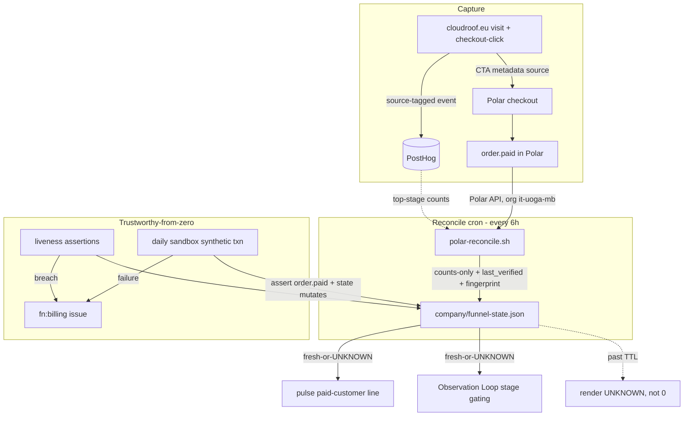

# feat: Customer Funnel Instrumentation

## Summary

Instrument the customer funnel (visit → checkout-click → paid) into a committed, counts-only `company/funnel-state.json` that renders fresh-or-`UNKNOWN` and feeds the pulse and Observation Loop, replacing the brittle chimney HTML scrape. Authoritative paid data comes from a scheduled Polar-API reconcile (keyed on `order.paid`), kept trustworthy-from-zero by per-stage liveness checks and a daily Polar-sandbox synthetic transaction; any stale or broken signal opens an `fn:billing` issue rather than passing a silent 0.

***

## Problem Frame

The company is Day 83 in Revenue with 0 *verified* paying customers, and the revenue surface is its least-instrumented. The paid count comes from an HTML scrape of `chimney.beerpub.dev` (`.github/workflows/strategy-audit.yml:143-164`); `company/metrics.json` has been stale since April; every pulse carries "0 customers" forward unverified. A Polar org/slug mismatch (real org `it-uoga-mb`, not `atvirokodosprendimai`) already caused a 19-day revenue-blindness incident where checkout 404'd while the loop logged "0 subs" against an actual 5 subscribers (`docs/solutions/integration-issues/polar-checkout-404s-from-stale-config-2026-05-08.md`).

The fix is measurement, not demand generation: an authoritative, fresh-or-`UNKNOWN` funnel signal so the loop and pulse stop conflating "broken integration" with "nobody came." Carrying a stale "0" forward is the metrics equivalent of `|| true` — the same silent-failure class that left self-heal dead for 6 days.

***

## Requirements

Carried from origin (`see origin: docs/brainstorms/2026-06-09-customer-funnel-instrumentation-requirements.md`).

**Capture & attribution**

* R1. Emit a funnel event at each stage — visit (cloudroof.eu), checkout-click (CTA hand-off to Polar), invoiced/paid — each carrying a source/channel tag.

* R2. Top-of-funnel events (visit, checkout-click) flow through the existing PostHog instrumentation; bottom-of-funnel truth (invoiced/paid) comes from authoritative Polar data, replacing the `chimney` HTML scrape as the paid-customer source.

**Source of truth & freshness**

* R3. A committed funnel-state artifact reconciles the two tiers into per-stage counts the loop and pulse read; counts and stage-health only.

* R4. Every value carries a last-verified timestamp; past its TTL it renders `UNKNOWN`, never a carried-forward prior value.

**Trustworthy from zero**

* R5. Each capture point self-asserts liveness (reachable / receiving / semantically valid); silence beyond threshold is a breach.

* R6. A scheduled synthetic transaction drives a real checkout → invoice through Polar sandbox, proving the paid path carries a payment end-to-end.

* R7. A breach (failed liveness or stale stage) opens an `fn:billing` issue and sets the affected stage to `UNKNOWN`, rather than reading 0 or passing silently.

**Consumption & operability**

* R8. The pulse's paid-customer line and the loop's customer-side read both source from the funnel-state artifact (fresh-or-`UNKNOWN`), replacing the stale carried-forward figure.

* R9. The funnel is operable by the autonomous loop via API on the steady-state path — reconcile, liveness, synthetic run, and artifact refresh require no manual step.

**Repo boundary**

* R10. No secrets, PII, customer identity, or exact revenue figures are committed; Polar and PostHog credentials live in the secrets store; any new recurring spend remains subject to human approval.

***

## Key Technical Decisions

* KTD1. **Scheduled Polar-API reconcile, not an inbound webhook.** No webhook receiver exists anywhere — the repo is entirely cron-pull plus one GitHub-issue poller, and `.github/workflows/checkout-monitor.yml` already polls the Polar API on a cron. A webhook would add always-on public ingress and a new `POLAR_WEBHOOK_SECRET` to a hardened box for a 0-customer funnel. The reconcile keys on `order.paid` (the confirmed money-received event; `order.created` can be unpaid) and delivers a fresh-or-`UNKNOWN` signal at cron granularity — not event-fresh like a webhook, but acceptable at 0 customers (a first paid customer becomes visible within one cron interval). Satisfies R2/R3 in-grain. (If a webhook is wanted later, the reconcile's parsing is reusable.)

* KTD2. **Own state file** **`company/funnel-state.json`, counts-only.** Mirrors the company-state convention (full-ISO `last_run`, monotonic counter, `material_fingerprint` commit gate). It never writes loop-owned `company/loop-state.json` (`see docs/domain/pipeline-state-machine.md` ownership rule). Holds per-stage counts, per-stage health (`live`/`stale`/`unknown`), and per-source breakdown — never euro amounts, invoice values, customer identity, or raw payloads. The loop continues to read live MRR from Polar at loop-time; exact revenue is never committed (R10).

* KTD3. **Freshness contract with loud escalation.** Each stage carries a TTL; past it the shared reader renders `UNKNOWN` everywhere consumed (R4), never a carried-forward value. Liveness asserts *semantic* content (product/price present, API returns the expected org/product), not a bare 2xx — broken Polar URLs previously 302'd to a marketing page and passed a naive `curl` check. Resolving the prod org+product to their expected UUIDs is a *recurring* liveness stage, not a one-time startup check: a prod slug regression is the documented 19-day-blindness mode and would otherwise read a true `0` under green liveness. The sandbox synthetic transaction proves only the sandbox path — never the prod read. No liveness or reconcile path is wrapped in `|| true`.

* KTD4. **Target Polar org** **`it-uoga-mb`** **/ the cloudroof product, verified against the live API before wiring.** The slug mismatch is the documented root cause of the prior 19-day blindness; the reconcile must resolve the org and the three cloudroof tier product IDs (enumerated from the Polar org, not a singular product) via the API and fail loudly on mismatch rather than assume a slug.

* KTD5. **Synthetic transaction in Polar sandbox, verified by landing.** A programmatic sandbox checkout (`sandbox-api.polar.sh`) with a `metadata` source tag, completed with test card `4242 4242 4242 4242`, must assert that `order.paid` was received *and* that the state file mutated — not merely that the script exited 0. A dedicated `POLAR_SANDBOX_TOKEN` is required (the prod `POLAR_TOKEN` does not authenticate against sandbox); each script binds its token to its host and fails loudly on mismatch (synthetic → `sandbox-api.polar.sh`, reconcile → `api.polar.sh`), so a sandbox flow can never run against prod. Sandbox orders are tracked in a separate field and never inflate the prod paid count. **Open risk:** completing the checkout with a test card may require a Stripe hosted-page/Elements confirm rather than a single API call — unverified; spike before U5 is treated as done, and if headless completion is impossible, fall back to a defined degraded heartbeat (checkout-session created + reachability) rather than a false `order.paid`.

* KTD6. **Escalation is** **`fn:billing`, not** **`needs-human`.** A broken billing integration is contractible and reversible, so it is a normal `fn:billing` issue (reserve `needs-human` only if a Polar-account action the agent cannot perform is required). The issue is idempotent (reuse the open issue by label) using `GITHUB_TOKEN` + `issues: write`, mirroring `checkout-monitor.yml`. The state commit is not relied on to trigger any downstream workflow (GitHub-App/`GITHUB_TOKEN` events do not fire downstream).

* KTD7. **Attribution via Polar order** **`metadata`** **(paid) and PostHog event properties (top stages).** Counts-only means no cross-source single-user identity join is required; per-source counts are assembled independently per tier. True single-visitor funnel correlation is deferred. Because `source` originates in user-controllable query params and lands in the public artifact and PostHog, the reconcile allowlists/normalizes it (e.g. `^[a-z0-9_-]{1,32}$`, anything else → `other`) before it becomes a JSON key or count bucket.

* KTD8. **Cadence defaults: reconcile + liveness every 6h (mirroring** **`checkout-monitor.yml`'s** **`13 */6`), synthetic daily, paid-stage TTL \~24h.** Tunable; finalized when the workflows are written.

* KTD9. **Single-writer ownership of** **`company/funnel-state.json`.** The reconcile workflow (U6) is the *sole* committer; liveness (U4) and the synthetic transaction (U5) run as steps inside it and hand their results back for U6 to write in one commit. Two workflows independently committing the same state file would race and clobber each other — the same class as the state-ownership rule that keeps self-heal out of loop-owned state (`see docs/domain/pipeline-state-machine.md`). One writer, one fingerprint-gated commit per run.

***

## High-Level Technical Design

Phase A (U1–U7) is entirely in-repo and ships the core value — authoritative paid truth, fresh-or-`UNKNOWN`, liveness, synthetic, escalation, and pulse/loop wiring. Phase B (U8–U10) adds top-of-funnel capture, reads those events back into the artifact (U10), and closes the attribution loop; it depends on locating the cloudroof.eu site source and a read-capable PostHog credential. Phase A's artifact is paid-only until U10 lands – its top-of-funnel stages render `UNKNOWN`, not 0.

***

## Implementation Units

### U1. Polar reconcile script

* **Goal:** Pull authoritative paid data from the Polar API (prod, org `it-uoga-mb`, cloudroof product) and derive per-stage paid counts and per-source breakdown.

* **Requirements:** R2, R7 (no silent zero), R10

* **Dependencies:** none

* **Files:** `company/scripts/polar-reconcile.sh`, `company/scripts/test-polar-reconcile.sh`

* **Approach:** Authenticate with `POLAR_TOKEN` bound to `api.polar.sh` (fail loudly if pointed at sandbox, KTD5); resolve org/product to their expected UUIDs via the API and fail loudly on mismatch (KTD4) — expose this resolution as a recurring liveness stage, not just a startup check (KTD3); count distinct active seed-product subscriptions/customers as the paid-customer count (renewals and repeat orders must never inflate it), and use `order.paid` only for the delta/event emission (U7) and verify-by-landing; read each order's `metadata.source`, allowlist/normalize it (KTD7), for the per-source breakdown. A fetch failure yields a `fetch_failed` status, never a `0`. No token, header, or raw order/checkout object is echoed to logs (public Actions logs); jq-extract only count/status fields.

* **Patterns to follow:** `.github/workflows/checkout-monitor.yml` (Polar-API call shape, silent `-s` curl), the `strategy-audit.yml:143-164` paid-fetch step it replaces (for the status-on-failure idiom, minus the silent null).

* **Test scenarios:** Covers R2. Orders present → correct count + source breakdown. API error → `fetch_failed`, no `0` emitted. Empty result → `0` with `live` status. Wrong org/product slug → loud failure, not assumed. Token pointed at the wrong host → loud failure. Malformed/oversized `source` → normalized to `other`, never written verbatim.

* **Verification:** Running against the live Polar org returns a count matching the Polar dashboard, and an injected API failure surfaces `fetch_failed`.

### U2. funnel-state.json artifact and writer

* **Goal:** Define and write the counts-only state artifact.

* **Requirements:** R3, R4, R10

* **Dependencies:** U1

* **Files:** `company/funnel-state.json` (seed), writer logic in `company/scripts/polar-reconcile.sh`, a short schema note in `docs/domain/` if one is warranted

* **Approach:** Schema holds per-stage `count`, `health` (`live`/`stale`/`unknown`), `last_verified` (full ISO), per-source sub-counts, a monotonic `run_count`, and a `material_fingerprint` (sha256) that gates commits — mirroring `supervisor-rank-state.json`. No amounts, customer identity, or raw payloads.

* **Patterns to follow:** `company/supervisor-rank-state.json`, `company/pipeline-health-state.json`.

* **Test scenarios:** Writes counts/health only — assert no euro amount, email, or payload field is ever present. Fingerprint unchanged → no spurious commit. `last_verified` stamped on every write.

* **Verification:** A reconcile run produces a well-formed artifact; a no-change run leaves the fingerprint identical.

### U3. Freshness/TTL reader with UNKNOWN rendering

* **Goal:** A shared helper that renders any stage `UNKNOWN` when past its TTL, used by both pulse and loop.

* **Requirements:** R4, R8

* **Dependencies:** U2

* **Files:** `company/scripts/funnel-read.sh`, `company/scripts/test-funnel-read.sh`

* **Approach:** Given the artifact and now(), return each stage's value or `UNKNOWN` based on `last_verified` + TTL (KTD8). Single source of the freshness rule so pulse and loop cannot diverge.

* **Test scenarios:** Fresh → value. Past-TTL → `UNKNOWN`. Missing stage → `UNKNOWN`. Never returns a stale numeric value as current.

* **Verification:** A backdated `last_verified` renders `UNKNOWN` in the reader's output.

### U4. Liveness assertions and breach escalation

* **Goal:** Per-stage liveness with an idempotent `fn:billing` escalation that also flips the stage to `UNKNOWN`.

* **Requirements:** R5, R7

* **Dependencies:** U2

* **Files:** `company/scripts/funnel-liveness.sh`, `company/scripts/test-funnel-liveness.sh`

* **Approach:** A liveness-assertion script invoked by the reconcile workflow (U6) — it does not commit `company/funnel-state.json` itself (KTD9). Assert semantic content (KTD3), not bare 2xx, and include the prod org+product UUID resolution as a liveness stage. On breach, open/reuse an `fn:billing` issue (label-keyed idempotency, `GITHUB_TOKEN` + `issues: write`) and return a breach signal so U6 marks the stage `UNKNOWN`. The issue body carries only stage name, health, `last_verified`, and the run URL — never raw API responses, amounts, customer identity, or auth headers (public repo; mirrors bug #13/#14 hardening). Borrow the circuit-breaker/escalation shape from `pipeline-health.yml:225-243`. No `|| true` around the detection.

* **Patterns to follow:** `.github/workflows/checkout-monitor.yml:143-204` (idempotent issue), `pipeline-health.yml` circuit breaker.

* **Test scenarios:** Covers R7. Breach → issue opened (once) + stage `UNKNOWN`. Prod slug regression → breach (not a silent `0`). Recovery → stage returns to `live`, issue not duplicated. Issue body contains no amount/email/payload/token. A failing detection query surfaces loudly, never swallowed.

* **Verification:** A simulated breach opens exactly one `fn:billing` issue and the stage reads `UNKNOWN`.

### U5. Synthetic sandbox transaction

* **Goal:** Prove the paid path end-to-end without a real customer.

* **Requirements:** R6, R9

* **Dependencies:** U2, U4

* **Files:** `company/scripts/polar-synthetic-txn.sh`, `company/scripts/test-polar-synthetic-txn.sh`

* **Approach:** A script invoked daily by the reconcile workflow (U6, not an independent committer — KTD9), authenticating with `POLAR_SANDBOX_TOKEN` bound to `sandbox-api.polar.sh` (KTD5). Create a sandbox checkout with a `metadata.source` tag, complete it with test card `4242 4242 4242 4242`, then assert `order.paid` was received; return synthetic-health for U6 to write. Sandbox results are tracked in a separate field and never added to the prod paid count. Whether the test-card checkout can be completed headlessly (vs needing a Stripe hosted-page/Elements confirm) is unverified — spike first; if not automatable, emit the degraded heartbeat (checkout-session created + reachability) and label it as such, never a false `order.paid`.

* **Execution note:** Spike the sandbox confirm flow before building U5. Verify-by-landing — assert the order landed and state changed, not just a 0 exit.

* **Patterns to follow:** `checkout-monitor.yml` Polar-API auth; the langfuse correctness layer's land-assertion posture (`docs/plans/2026-06-08-001-feat-langfuse-correctness-layer-plan.md`).

* **Test scenarios:** Covers R6. Successful sandbox checkout → `order.paid` observed + synthetic stage `live`/fresh. Headless completion unavailable → degraded heartbeat recorded and flagged, not a false green. Failure (e.g. misconfig) → `fn:billing` escalation. Assert sandbox count never touches prod count.

* **Verification:** A sandbox run produces a real `order.paid` and refreshes synthetic health; a forced failure escalates.

### U6. Reconcile cron workflow with state commit-back

* **Goal:** Schedule the funnel run and be the sole writer of the artifact.

* **Requirements:** R3, R9

* **Dependencies:** U1, U2, U4, U5

* **Files:** `.github/workflows/funnel-reconcile.yml`, `.github/workflows/heartbeat-pr-automerge.yml` (add `company/funnel-state.json` + funnel title/branch to the fast-lane)

* **Approach:** Cron (\~6h, KTD8). The sole committer of `company/funnel-state.json` (KTD9): runs reconcile (U1) + liveness (U4) + daily synthetic (U5) as sequential steps, assembles all stages and health flags, and commits once via branch + PR. The `material_fingerprint` includes `last_verified`, so every successful reconcile lands a freshness heartbeat and always commits; a healthy run is never suppressed as a no-op, and the TTL can only lapse when reconcile actually fails or stops. This deliberately does not borrow supervisor-rank's content-only fingerprint suppression for a TTL-backed metric. A state-mutation assertion fails the run if a successful reconcile did not update state. Liveness runs as a step here (KTD9 single-writer); `checkout-monitor.yml` may still call the same liveness script for its own checkout-link check, but only this workflow writes the artifact. As the sole writer, this workflow runs a runtime pre-commit guard that scans the rendered artifact and aborts the commit if any disallowed field (amount, currency, email, customer identity, checkout URL, raw payload) is present — a chokepoint so a future schema change cannot leak into the public repo even if a unit test is missed. Add `company/funnel-state.json` and the funnel PR title/branch prefix to the `heartbeat-pr-automerge.yml` fast-lane so the state PR auto-merges to `main` under the existing sanitise guards (otherwise the PR sits unmerged and the artifact never becomes fresh on `main` – verify-by-landing). Do not depend on the commit to trigger any downstream workflow (KTD6).

* **Patterns to follow:** `.github/workflows/supervisor-rank.yml`, `pipeline-health.yml:858-889` (fingerprint gate + `assert_mutation`).

* **Test scenarios:** State-mutation assertion fails a no-op run that pretended success. A successful run always lands a `last_verified` heartbeat (never suppressed as a no-op); only a failed or skipped run produces no commit. Pre-commit guard aborts when a disallowed field is injected. `bash -n` + `shellcheck` clean.

* **Verification:** A scheduled run lands a fresh artifact or asserts-and-reports when truly unchanged.

### U7. Pulse and loop consumption

* **Goal:** Source the paid line from the artifact (fresh-or-`UNKNOWN`) and emit the configured paid event.

* **Requirements:** R8, R2

* **Dependencies:** U1, U2, U3, U6

* **Files:** `.github/workflows/strategy-audit.yml` (replace the chimney scrape at `:143-164`), `.compound-engineering/config.local.yaml` (`pulse_metric_sources` paid-source), `.github/workflows/observation-loop.yml` (the loop's existing live Polar read), a `company/scripts/posthog-emit.sh` call for `paid_customer_added`

* **Approach:** Pulse reads via `funnel-read.sh`; renders `UNKNOWN` when stale instead of the scrape. The artifact is the single authoritative paid-count source for both the pulse and the loop's stage gating — `observation-loop.yml` already polls Polar live, so reconcile that read to consume the artifact (or, if a live read is kept for MRR, the artifact stays authoritative for the *count* and any divergence is surfaced, never silently picked). Emit the configured-but-never-emitted `paid_customer_added` event on the reconcile delta (new `order.paid` vs prior count, computed in U1/U6) — it is not derivable from counts-only U2/U3 alone.

* **Patterns to follow:** existing `posthog-emit.sh` callers (`pipeline-health.yml:958`, `bot-pr-review-merge.yml:200`).

* **Test scenarios:** Covers R8. Stale artifact → pulse shows `UNKNOWN`, not a number. New paid order → `paid_customer_added` emitted once. Config points the paid source at the artifact, not chimney.

* **Verification:** A pulse run reads the artifact; a stale artifact renders `UNKNOWN` in the report.

### U8. Instrument cloudroof.eu visit and checkout-click

* **Goal:** Emit source-tagged top-of-funnel events.

* **Requirements:** R1, R2

* **Dependencies:** locate the cloudroof.eu site source (see Open Questions)

* **Files:** cloudroof.eu site repo (path TBD — not in this repo)

* **Approach:** Capture a `visit` event on load and a `checkout_click` event on the founding-member CTA, each carrying the `source`/`campaign` tag (from query params). Use PostHog capture; land events with the same project the pipeline uses.

* **Test scenarios:** Covers R1. Visit → event lands in PostHog with `source`. CTA click → `checkout_click` lands with `source`. Verify-by-landing (event visible in PostHog), not a stubbed unit test.

* **Verification:** A tagged visit and click appear in PostHog with their source property.

### U9. Close the attribution loop through to paid

* **Goal:** Carry the source tag from click into Polar checkout `metadata` so `order.paid` is attributable, and surface per-source paid counts.

* **Requirements:** R1, R3

* **Dependencies:** U1, U8

* **Files:** cloudroof.eu CTA link templating (site repo), `company/scripts/polar-reconcile.sh`

* **Approach:** Carry the `source` into the Polar checkout `metadata` so it reaches `order.paid`; the reconcile reads `metadata.source` (U1) into per-source counts — still counts-only. Whether a static `buy.polar.sh` one-click link can propagate per-click metadata is unverified (see Open Questions); if not, this requires an API-created checkout or falls back to per-product attribution.

* **Test scenarios:** A synthetic txn with `metadata.source=test` increments that source's paid count. No amount/identity leaks into the artifact.

* **Verification:** A source-tagged sandbox purchase shows up under that source in the artifact.

***

### U10. PostHog read-back into the artifact

* **Goal:** Query PostHog for visit and checkout-click counts and write them (counts-only) into the funnel-state artifact, completing the two-tier reconcile.

* **Requirements:** R3, R1

* **Dependencies:** U2, U8

* **Files:** `company/scripts/posthog-read.sh`, `company/scripts/test-posthog-read.sh`

* **Approach:** Requires a read-capable PostHog credential (`POSTHOG_PROJECT_KEY` is write-only capture); query the events/insights API for per-source visit and checkout-click counts over the window and hand them to U6 to write. Until this lands, the artifact's top-of-funnel stages render `UNKNOWN`, not 0.

* **Test scenarios:** Covers R3. Query returns counts then top stages populated with source breakdown. Read credential missing/unauthorized then top stages `UNKNOWN`, never silently 0. Counts-only, no event payloads/PII written.

* **Verification:** With events present in PostHog, the artifact shows non-`UNKNOWN` visit/click counts.

## Scope Boundaries

**Deferred for later** (from origin)

* Distribution arm (Mixpost) — gated behind a working, attributed funnel.

* Driving traffic, demand campaigns, and choosing/demand-testing the 2nd seed product.

**Outside this product's identity** (from origin)

* This is revenue-measurement infrastructure, not a growth/marketing engine; it does not decide what to sell or to whom.

**Deferred to follow-up work**

* An inbound Polar webhook receiver (only if real-time latency is later needed; the reconcile covers the current requirement).

* True single-visitor funnel correlation across PostHog and Polar (counts-only does not require it).

***

## System-Wide Impact

* **Shared state file.** `company/funnel-state.json` is written only by the reconcile workflow (KTD9) and read by the pulse and the loop. No other workflow commits it, which is what keeps concurrent runs from clobbering each other; the `material_fingerprint` gate plus the state-mutation assertion guard the commit itself.

* **Paid-customer source swap.** Repointing the paid metric from the chimney scrape to the artifact touches the pulse (`strategy-audit.yml`), the loop's stage gating, and `pulse_metric_sources` in config. The action-success KPI now also covers the new reconcile/liveness/synthetic workflows — each is an autonomous action expected to succeed, so a breach must escalate (R7), not fail silently.

* **Two Polar environments.** Prod (read-only reconcile) and sandbox (synthetic) are distinct accounts with distinct tokens; their counts must never merge (KTD5).

***

## Risks & Dependencies

* **Polar org/product slug mismatch (high).** Real org is `it-uoga-mb`; assuming `atvirokodosprendimai` caused 19 days of revenue blindness. U1 must resolve org/product via the API and fail loudly (KTD4).

* **cloudroof.eu site source not in this repo (blocks Phase B).** U8/U9 depend on locating it; Phase A delivers full core value without it.

* **Synthetic completion may not be headlessly automatable (P0).** The trust-from-zero heartbeat depends on completing a sandbox checkout; if it needs a Stripe hosted-page confirm, U5 must use the degraded heartbeat. Spike before relying on U5 (KTD5).

* **Green liveness can mask a prod read regression.** The synthetic proves only the sandbox path; a prod org/product slug regression (the prior 19-day incident) would read a true `0` under green liveness unless prod UUID resolution is a recurring liveness stage (KTD3).

* **Sandbox vs prod conflation.** Synthetic sandbox orders must never inflate the prod paid count — separate environments, separate tokens (`POLAR_SANDBOX_TOKEN` vs `POLAR_TOKEN`, not yet provisioned), separate state fields, with token↔host binding (KTD5).

* **Silent-zero regression.** The class that killed self-heal for 6 days; every detection path must surface failure, never `|| true` (KTD3).

* **Frugality.** `POLAR_TOKEN` and `POSTHOG_PROJECT_KEY` already exist; sandbox transactions are free. Any new recurring spend (e.g. a paid PostHog tier) needs human approval before commit (R10).

* **Downstream-trigger gotcha.** A `GITHUB_TOKEN`-authored state commit will not trigger other workflows; do not architect on that assumption (KTD6).

***

## Open Questions

Resolve before/early in implementation:

* Spike whether a Polar sandbox test-card checkout can be completed headlessly (vs a Stripe hosted-page/Elements confirm). Prerequisite for U5; if not automatable, finalize the degraded synthetic heartbeat instead.

* Confirm `cloudroof.eu`'s one-click `buy.polar.sh` CTA can carry per-click `metadata.source` to `order.paid`; if a static buy-link can't, U9 attribution needs an API-created checkout (heavier site change) or falls back to per-product attribution only.

Deferred to implementation:

* Exact TTL and cadence values (start 6h reconcile/liveness, daily synthetic, \~24h paid TTL; tune against real signal).

* cloudroof.eu site repo location, and whether its CTA already emits any PostHog event.

* Whether the new artifact supersedes the existing `funnel_signals` key in `company/pipeline-health-state.json`, or how the two relate without divergence.

* Final `funnel-state.json` field names, reconciled against the loop's existing revenue-read expectations. Also: enumerate the three cloudroof tier product IDs from the Polar org (U1/KTD4), and provision a read-capable PostHog credential for U10 (the existing `POSTHOG_PROJECT_KEY` is write-only).

***

## Sources & Research

* Origin: `docs/brainstorms/2026-06-09-customer-funnel-instrumentation-requirements.md`; ideation `docs/ideation/2026-06-09-open-ideation.md` (ideas #3 freshness/sentinel, #4 silent-degradation registry).

* `docs/solutions/integration-issues/polar-checkout-404s-from-stale-config-2026-05-08.md` — slug mismatch + synthetic-monitor prevention.

* `docs/plans/2026-06-06-001-fix-self-healing-stale-detection-plan.md` — `|| true` silent-failure class.

* `docs/plans/2026-06-08-001-feat-langfuse-correctness-layer-plan.md` — verify-by-landing posture.

* `company/scripts/posthog-emit.sh` (capture pattern), `.github/workflows/checkout-monitor.yml` (Polar-API cron + idempotent issue), `.github/workflows/strategy-audit.yml:143-164` (chimney scrape being replaced), `.github/workflows/supervisor-rank.yml` / `pipeline-health.yml:858-889` (cron commit-back + state-mutation assertion), `docs/domain/pipeline-state-machine.md` (state ownership).

* Polar: `order.paid` is the money-received event; Standard Webhooks signing; sandbox at `sandbox-api.polar.sh` with test card `4242 4242 4242 4242`; checkout `metadata` passthrough for attribution (polar.sh/docs). PostHog server capture: `POST {host}/i/v0/e/` with `api_key`/`event`/`distinct_id`/`properties` (posthog.com/docs/api/capture).
