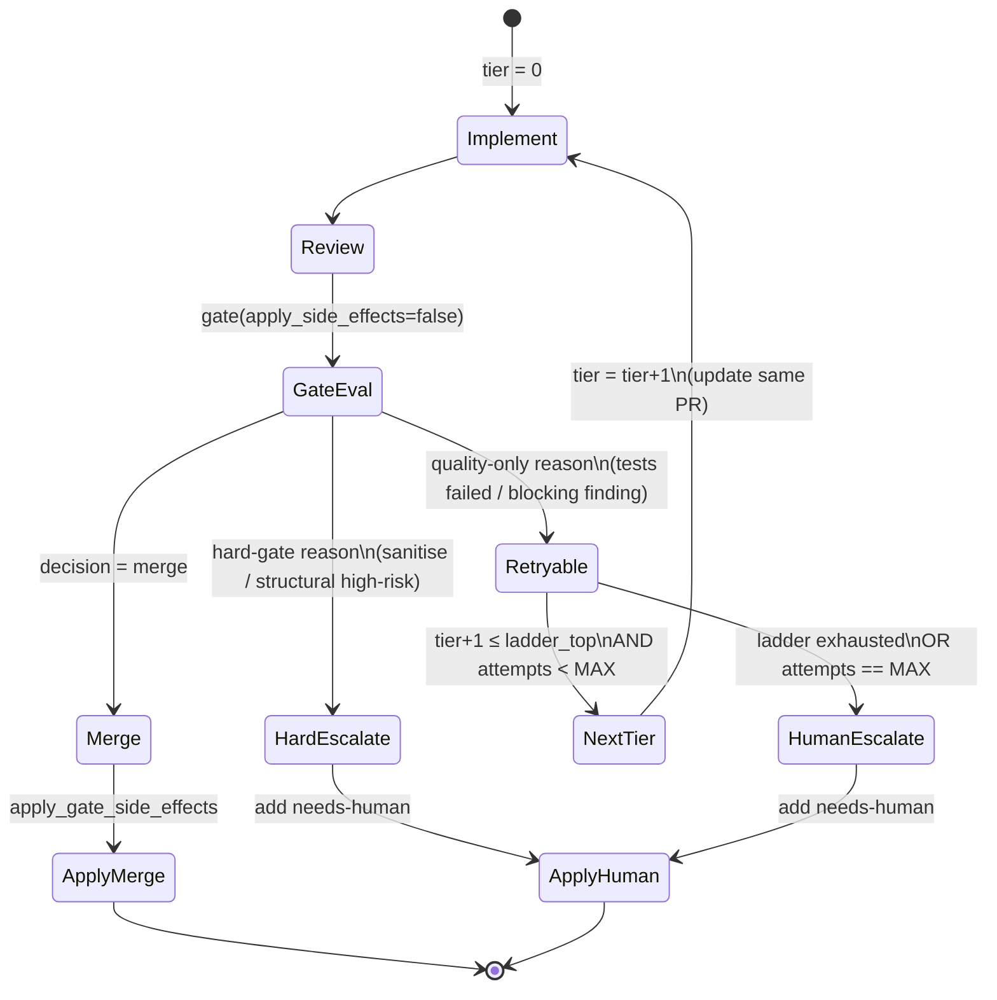

# feat: Escalate-on-fail model ladder (price/perf #3)

## Summary

The merged static routing layer (#1580) picks one model per stage. This plan makes the
**implement** stage *dynamic*: when the gate rejects a build for a **quality** reason
(tests failed / blocking review finding), the graph automatically re-runs
implement→review→gate on the **next model up an ordered ladder** — cheap → capable →
premium — instead of immediately labeling `needs-human`. It keeps climbing until the build
passes the gate or the ladder is exhausted.

Autonomy lives **inside** the safety gates, never around them. A `sanitise` failure
(security) or any structural high-risk reason (too many files, high-risk paths, net-new
network call) goes **straight** to `needs-human` — the ladder is never climbed to brute-force
a security or scope violation past the gate.

Fail-safe-off: a stage with no ladder configured (single model) behaves exactly as today —
one attempt, escalate-to-human on failure. The "cost ceiling" is bounded attempts (ladder
length + a hard max-attempts guard), not a live dollar cap — see Risks for why in-process
$-metering isn't available.

---

## Problem Frame

Today the build graph is linear (`graph/build.py` `CompiledGraph.invoke`):
`triage → spec → spec_pr → implement → review → gate`, and `gate` is terminal — `merge` or
`add needs-human`. A weak cheap model that fails tests on `implement` dead-ends at
`needs-human` even when a stronger model would have produced a mergeable diff. That wastes
the whole spec+implement investment and dumps work on a human for a *recoverable* quality
miss.

Two facts make a clean retry loop possible:

- **`decide_gate` is already pure** and `gate_node(..., apply_side_effects=False)` exists —
  the gate decision can be computed without committing the `needs-human`/`merge` side-effect,
  so intermediate ladder attempts don't pollute labels.
- **`classify_risk` already separates** structural/security reasons (high tier) from the
  quality signals (`tests_passed`, `review_findings`) — so "retryable quality failure" vs
  "hard-gate failure" is a classification over data the gate already has.

**In scope:** gate reason-classification (retryable vs hard-gate); a per-stage ordered model
ladder in routing; tier-indexed model resolution; a bounded escalation loop in `invoke`;
impl-PR update (not duplicate) on retry; escalation attribution in scoring.

**Out of scope:** live token/dollar budget accounting (not available in-process — see Risks);
escalation on `spec` or `triage` (only `implement` retries); changing the funnel topology or
the gate's *merge* criteria; re-speccing (retry reuses the same spec).

---

## Requirements

- **R1** A quality-only gate rejection on `implement` triggers an automatic re-run on the
  next ladder model, up to ladder exhaustion.
- **R2** Hard-gate rejections — `sanitise failed` OR any structural high-risk reason — go
  straight to `needs-human`, never climbing the ladder.
- **R3** The loop is bounded: at most `min(ladder_length-1, MAX_ESCALATION_ATTEMPTS)` retries
  per issue; the counter lives in run state and cannot loop forever.
- **R4** Fail-safe-off: a stage with a single-model route (or no ladder) behaves exactly as
  today — one attempt, then escalate-to-human. Zero-config unchanged.
- **R5** A retry updates the **existing** impl PR/branch, never opens a duplicate PR per tier.
- **R6** Escalation is observable: which tiers were tried, the terminal tier, and the terminal
  outcome are recorded in Langfuse so escalation rate and tier-resolution can be charted.
- **R7** Fail-closed config: a malformed ladder, a ladder key absent from the registry, or a
  tier index out of range raises — never silently routes to the wrong/no model.

---

## High-Level Technical Design

The escalation loop wraps the existing `implement → review → gate` segment. The gate is
evaluated **without** side-effects on each pass; side-effects apply once, on the terminal
decision.



**Reason classification** (directional, not final signature):

```
retryable_quality(decision) :=
    decision == escalate
    AND risk_tier == "low"            # no structural high-risk reason fired
    AND sanitise_ok == true           # security gate never brute-forced
    AND reasons ⊆ { "tests failed", "blocking review finding" }
```

If any reason falls outside that set, the rejection is a **hard gate** → human.

---

## Key Technical Decisions

- **KTD1 — Ladder as an ordered list in `STAGE_ROUTING`.** A stage's route value may be a
  string (single model, escalation off) OR an ordered list of registry keys
  (`["impl-cheap","impl-capable","impl-premium"]`). Tier index selects the entry. This keeps
  one config surface, makes "off" the natural default (scalar), and lets the operator define
  the climb. Rejected: a separate `ESCALATION_LADDER` env (two sources of truth) and a
  per-profile `escalate_to` pointer (can't express a >2-rung ladder cleanly).
- **KTD2 — Loop in `invoke`, gate evaluated side-effect-free.** The retry lives in the
  hand-rolled `CompiledGraph.invoke` (no LangGraph StateGraph today), using the existing
  `apply_side_effects=False` seam. Intermediate gate passes compute a decision only; the
  terminal pass applies `merge`/`needs-human` once. Avoids label churn and double PRs.
- **KTD3 — Retry classification reads gate output, doesn't re-derive.** `decide_gate` gains a
  `retryable` flag computed from `risk_tier`/`sanitise_ok`/`reasons`. The loop branches on
  that flag — it never re-inspects the diff. Single source of truth for "is this recoverable".
- **KTD4 — Bounded by ladder length AND a hard guard.** `MAX_ESCALATION_ATTEMPTS` (config,
  small default) caps retries even if a ladder is long; the loop also stops at ladder top.
  This *is* the cost ceiling (see Risks for why a $-cap isn't feasible in-process).
- **KTD5 — Retry updates the same impl branch/PR.** The second+ implement pass pushes the new
  diff to the existing `bot/impl-<n>` branch and reuses the open PR, rather than creating a
  per-tier PR. The reviewer/merge lane sees one PR that improved.
- **KTD6 — Fail-safe-off default.** No ladder configured → single-entry ladder → zero retries
  → today's behavior. The feature cannot change behavior for an un-migrated deploy.

---

## Implementation Units

### U1. Classify gate rejections as retryable-quality vs hard-gate

**Goal:** `decide_gate` labels each `escalate` decision as retryable (quality-only) or not,
so the loop can branch without re-inspecting the diff.

**Requirements:** R1, R2, KTD3

**Dependencies:** none

**Files:**
- `pipeline/wgmesh_pipeline/graph/nodes/gate.py` (modify — add `retryable: bool` to `GateDecision`; compute it)
- `pipeline/tests/test_gate.py` (modify)

**Approach:** Extend `GateDecision` with `retryable`. Compute `retryable = (decision ==
"escalate") and (risk_tier == "low") and sanitise_ok and reasons ⊆ {"tests failed","blocking
review finding"}`. The structural reasons come from `classify_risk` (already folded into
`reasons` when `risk.high`); `risk_tier == "low"` is the clean discriminator since any risk
reason sets tier `high`. `gate_node` surfaces `retryable` into state (`state["retryable"]`).
`merge` decisions are never retryable.

**Patterns to follow:** existing `GateDecision` dataclass + `decide_gate` reason assembly in
`gate.py`.

**Test scenarios:**
- tests failed only, low risk, sanitise ok → escalate, `retryable=True`.
- blocking review finding only, low risk, sanitise ok → `retryable=True`.
- tests failed AND sanitise failed → escalate, `retryable=False` (security gate).
- tests failed AND high-risk path present (risk_tier high) → `retryable=False`.
- net-new network call (risk high) with tests passing → escalate, `retryable=False`.
- clean build → merge, `retryable=False`.
- `retryable` is surfaced into state by `gate_node`.

### U2. Ordered model ladder in routing config

**Goal:** Let a stage route to an ordered list of model keys; resolve a profile by tier index;
keep scalar routes working unchanged.

**Requirements:** R4, R7, KTD1, KTD6

**Dependencies:** none

**Files:**
- `pipeline/wgmesh_pipeline/models.py` (modify — accept list route values; `resolve_profile_for_tier`; `ladder_length_for`)
- `pipeline/wgmesh_pipeline/config.py` (modify — `MAX_ESCALATION_ATTEMPTS` parse)
- `pipeline/tests/test_models.py` (modify)
- `pipeline/tests/test_config.py` (modify)

**Approach:** `parse_stage_routing` accepts a value that is a string OR a non-empty list of
strings; normalize internally to a list (scalar → 1-element ladder). Add
`resolve_profile_for_tier(registry, routing, stage, tier)` — fail-closed on out-of-range tier,
missing key, or unroutable stage — and `ladder_length_for(routing, stage)`. Existing
`resolve_profile` keeps working as `tier=0`. `MAX_ESCALATION_ATTEMPTS` parses as a positive
int (small default, e.g. 2), bounding retries regardless of ladder length.

**Patterns to follow:** existing `parse_stage_routing`/`resolve_profile` fail-closed style in
`models.py`; `_get_int` in `config.py`.

**Test scenarios:**
- list route `["a","b","c"]` → `ladder_length_for == 3`; `resolve_profile_for_tier(...,1)` → key `b`.
- scalar route `"a"` → ladder length 1; tier 0 → `a`; tier 1 → raises (out of range).
- list with a key absent from registry → raises naming the key.
- empty list route → raises (invalid).
- `resolve_profile(...)` (no tier) still resolves tier 0 unchanged (back-compat).
- `MAX_ESCALATION_ATTEMPTS` unset → default; invalid/zero → raises.

### U3. Tier-aware implement execution

**Goal:** `implement` runs the model for the current escalation tier.

**Requirements:** R1, KTD2

**Dependencies:** U2

**Files:**
- `pipeline/wgmesh_pipeline/goose/runner.py` (modify — `run_recipe(..., tier=0)`; resolve by tier)
- `pipeline/wgmesh_pipeline/graph/nodes/implement.py` (modify — read `state["escalation_tier"]`, pass it; re-run clears stale diff)
- `pipeline/tests/test_runner_routing.py` (modify)

**Approach:** `run_recipe` takes `tier: int = 0`; `_resolve_profile` becomes
`_resolve_profile(stage, tier)` using `resolve_profile_for_tier`. `implement_node` reads
`state.get("escalation_tier", 0)` and passes it; on a retry pass it must clear the prior
`diff`/`changed_files` so it actually re-runs Goose (today it short-circuits when `diff` is
present). `model_key` on the result still flows to attribution (U6).

**Patterns to follow:** the stage-threading from the merged routing work (`run_recipe(stage=...)`).

**Test scenarios:**
- `run_recipe(stage="implement", tier=2)` resolves the 3rd ladder model (assert via captured env).
- tier defaults to 0 when unspecified (back-compat).
- `implement_node` with `escalation_tier=1` requests tier 1.
- retry pass with a stale `diff` in state re-runs Goose rather than short-circuiting.

### U4. Bounded escalation loop in the graph

**Goal:** Wrap implement→review→gate in a bounded climb that retries quality failures on the
next tier and applies side-effects only once, terminally.

**Requirements:** R1, R2, R3, R4, KTD2, KTD4

**Dependencies:** U1, U2, U3

**Files:**
- `pipeline/wgmesh_pipeline/graph/build.py` (modify — escalation loop in `invoke`)
- `pipeline/wgmesh_pipeline/graph/state.py` (modify — `escalation_tier`, `escalation_attempts`, `escalation_history`)
- `pipeline/tests/test_build_escalation.py` (create)

**Approach:** Replace the linear `implement → review → gate` tail with a loop. Each pass runs
implement(tier)→review→`gate(apply_side_effects=False)`. Branch on the gate result:
`merge` → break; `retryable AND tier+1 < ladder_length AND attempts < MAX` → bump tier,
increment attempts, record the tier in `escalation_history`, loop; otherwise (hard-gate OR
exhausted) → break. After the loop, apply side-effects once for the terminal decision
(`apply_gate_side_effects`). State carries `escalation_tier`, `escalation_attempts`,
`escalation_history`. `spec-only` mode and the `wont-do`/`needs-info` early-escalate path are
untouched.

**Execution note:** Start with a failing integration test that drives a fake runner returning
fail-then-pass across tiers and asserts the loop climbs exactly once and merges.

**Patterns to follow:** existing `CompiledGraph.invoke` sequencing and the
`apply_side_effects` flag on `gate_node`.

**Test scenarios:**
- tier 0 fails tests, tier 1 passes → loop climbs once, terminal `merge`, side-effects applied
  ONCE, `escalation_history == [0,1]`.
- tier 0 fails, ladder length 1 → no retry, terminal `needs-human`.
- tier 0 hard-gate (sanitise failed) → no retry even though tiers remain; `needs-human`.
- ladder length 3 but `MAX_ESCALATION_ATTEMPTS=1` → at most one retry, then `needs-human`.
- all tiers fail quality → exhausted → `needs-human`, history records every tier.
- no needs-human label is applied on intermediate failing passes (side-effect-free gate).
- `spec-only` mode never enters the loop.
- clean tier-0 build → merge, no escalation, history `[0]`.

### U5. Update the impl PR on retry instead of duplicating

**Goal:** A retry pushes the improved diff to the existing impl branch/PR; no per-tier PR.

**Requirements:** R5

**Dependencies:** U4

**Files:**
- `pipeline/wgmesh_pipeline/graph/nodes/implement.py` (modify — reuse existing `impl_pr`/branch on retry)
- `pipeline/wgmesh_pipeline/github/client.py` (modify if needed — update-branch/PR-body affordance)
- `pipeline/tests/test_implement_retry_pr.py` (create)

**Approach:** `_ensure_impl_pr` already no-ops when `impl_pr` is set — good for not creating a
second PR, but the *new diff* must reach the branch. On a retry pass, push the new diff to the
existing `bot/impl-<n>` branch (force or new commit) and optionally update the PR body to note
the escalated tier. Keep the single PR number in state. Verify the GitHub client exposes a
branch-update path; if not, add a minimal one mirroring existing client methods.

**Patterns to follow:** existing `_ensure_impl_pr` + `GitHubClient.create_pr`/`merge_pr` shapes.

**Test scenarios:**
- retry with `impl_pr` already set → no second `create_pr` call; branch receives the new diff.
- PR body reflects the terminal tier (e.g. "escalated to impl-capable").
- first-pass behavior (no prior `impl_pr`) unchanged — one PR created.
- `Covers` the R5 no-duplicate-PR guarantee.

### U6. Escalation attribution in scoring

**Goal:** Record escalation history + terminal tier so Langfuse charts escalation rate and
which tier resolves builds.

**Requirements:** R6

**Dependencies:** U4

**Files:**
- `pipeline/wgmesh_pipeline/scoring.py` (modify — tags/scores for escalation)
- `pipeline/tests/test_scoring.py` (modify)

**Approach:** Extend `_tags_from_state` / `_scores_from_state` to include
`escalation_attempts`, terminal `escalation_tier`, and a boolean `escalated_recovered`
(escalation happened AND terminal outcome merged). Builds on the `implement_model_key`
attribution already shipped — now the tag reflects the *winning* tier's model.

**Patterns to follow:** the per-model attribution tags added in the merged routing work
(`spec_model_key`/`implement_model_key` in `scoring.py`).

**Test scenarios:**
- a run that climbed 0→1 and merged → `escalation_attempts=1`, `escalation_tier=1`,
  `escalated_recovered=True`, `implement_model_key` = tier-1 model.
- a run that exhausted the ladder and escalated to human → `escalated_recovered=False`.
- a clean tier-0 merge → `escalation_attempts=0`, no recovery flag set true.

### U7. Config defaults, docs, operating-prompt note

**Goal:** Document the ladder config + the autonomy/safety boundary; provision the new env.

**Requirements:** R4

**Dependencies:** U1–U6

**Files:**
- `AGENTS.md` (modify — extend the Model routing section with the escalation ladder)
- `company/system-prompt.md` (modify — one line: pipeline self-escalates quality failures within gates)
- `.github/workflows/provision-pipeline-box.yml` (modify — `MAX_ESCALATION_ATTEMPTS` passthrough)
- `docs/solutions/design-decisions/multi-model-routing.md` (modify — flip escalate-on-fail from "deferred" to "shipped", describe the ladder + hard-gate boundary)

**Approach:** Document the list-form `STAGE_ROUTING`, `MAX_ESCALATION_ATTEMPTS`, the
quality-only-retry rule, and the never-climb-on-security/structural boundary. State the cost
ceiling honestly (bounded attempts, no live $-cap).

**Test scenarios:** `Test expectation: none — docs/config only.`

---

## Scope Boundaries

### Deferred to Follow-Up Work

- **Live cost/token budget enforcement.** A real per-issue dollar cap needs in-process token
  accounting the current Goose-subprocess boundary doesn't expose (see Risks). If wanted later:
  parse Goose's usage output or read Langfuse synchronously before each climb — its own plan.
- **Escalation on `spec`.** Only `implement` retries here. A weak spec could also be re-run on
  a stronger model, but spec failures surface differently (no test signal) — separate work.
- **Adaptive ladder selection.** Choosing the *starting* tier from issue difficulty (skip cheap
  for known-hard issues) is a future optimization; this plan always starts at tier 0.

### Outside this product's identity

- **Model-ranking / eval harness.** Deciding ladder *membership/order* stays a human decision
  fed by the Langfuse escalation+cost data, not an automated ranker.

---

## Risks & Dependencies

- **No in-process dollar ceiling — the honest limitation.** Goose runs as a subprocess and
  reports token cost to Langfuse *asynchronously*; the runner gets no synchronous usage number
  back. So a true "$X per issue then stop" cap is not implementable without new plumbing. The
  enforced ceiling is **bounded attempts** (`MAX_ESCALATION_ATTEMPTS` + ladder length) plus
  **quality-only triggering**. This is a deliberate, documented bound — not an oversight.
- **Premium-tier spend is operator-gated by config.** Escalation only reaches a premium model
  if the operator put it on the ladder. With the routing defaults (cheap subscription tiers),
  the ladder can stay entirely flat-rate; a metered top rung is an explicit opt-in. Pairs with
  the operator LLM budget posture (premium reserved for safety-critical work).
- **Retry latency.** Each climb re-runs implement (a full Goose invocation, up to the 1800s
  timeout) + review. A 3-rung ladder triples worst-case wall-clock for a failing issue. The
  `MAX_ESCALATION_ATTEMPTS` guard bounds this.
- **PR-update correctness (U5).** Pushing a new diff to an existing branch must not orphan the
  prior commit or confuse the reviewer lane. Verify the branch-update path against the existing
  bot-review-merge flow.

### Execution-time unknowns (resolve during implementation)

- Whether `GitHubClient` already exposes a branch-update/force-push affordance or U5 must add one.
- Exact default for `MAX_ESCALATION_ATTEMPTS` (proposed 2) — tune against observed ladder depth.
- Whether `review_findings` `blocking` flags are populated today or need a producer before
  "blocking review finding" is a live retry trigger (may be latent until a review producer exists).

---

## Sources & Research

Grounded entirely in local code read (internal refactor of the just-merged routing layer; no
external research needed):

- `pipeline/wgmesh_pipeline/graph/nodes/gate.py` — `decide_gate`/`GateDecision`,
  `apply_side_effects` seam, reason assembly.
- `pipeline/wgmesh_pipeline/risk.py` — `classify_risk` high-vs-low tiering (the structural/
  security discriminator U1 keys on).
- `pipeline/wgmesh_pipeline/graph/build.py` — hand-rolled `CompiledGraph.invoke` (loop site).
- `pipeline/wgmesh_pipeline/graph/state.py` — `GraphState` TypedDict (`total=False`).
- `pipeline/wgmesh_pipeline/models.py`, `goose/runner.py`, `graph/nodes/implement.py` — the
  merged routing layer this builds on (#1580).
- `pipeline/wgmesh_pipeline/poller.py`, `scoring.py` — escalate/score side-effect path.
- Predecessor plan: `docs/plans/2026-06-09-001-feat-multi-model-routing-plan.md` (Phase 2
  deferral); learning doc `docs/solutions/design-decisions/multi-model-routing.md`.
