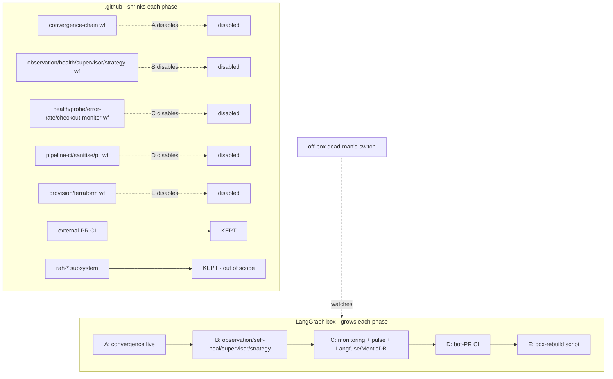

# refactor: Retire GitHub Actions — LangGraph Box Cutover

## Summary

Complete the deferred cutover of the 2026-06-07 LangGraph plan: flip the box from `spec-only` to `live`, then absorb every orchestration job Actions runs today — convergence chain, control loop, monitoring, pulse, bot-PR CI — disabling each Actions workflow only after its box-owned equivalent passes a parity bake period. Strangler-style and reversible throughout (disable, don't delete). When done, `.github/workflows/` holds only the single sandboxed external-PR CI plus the out-of-scope RAH subsystem; box-liveness moves to an off-box, non-Actions dead-man's-switch and box-rebuild becomes an operator-run script.

---

## Problem Frame

The Actions spec→build→merge chain is structurally fragile — GitHub's workflow-approval gate stalls Copilot-PR workflows (`action_required`, jobs never run), the `bot-pr-review-merge` `*/5` cron is throttled to ~3h, the `PUSH_TOKEN` PAT expires. Issue #1589 shipped end-to-end this session only by hand-clearing those gates. The replacement already exists: `pipeline/wgmesh_pipeline` runs the full graph (triage → spec → implement → review → gate → merge) with a `PIPELINE_MODE` flag, currently in `spec-only` with Actions live as fallback. This plan is that plan's deferred Phase 3/4 taken to completion under a "total" scope: the box becomes the single owner of the loop, and Actions is reduced to a sandboxed external-PR CI (plus the out-of-scope RAH workflows). It does **not** re-decide the graph, the merge gate, or the identity model — those are inherited.

---

## Requirements

Carried from origin (`see origin: docs/brainstorms/2026-06-09-actions-to-langchain-migration-requirements.md`), plus R12–R13 added during planning.

**Convergence → live**
- R1. The pipeline runs in `live` mode: implement → review → gate → merge perform real GitHub writes.
- R2. The R5 risk-tier merge gate is enforced unchanged (low-risk + tests + sanitise + clean review → auto-merge; high-risk → `needs-human`).
- R3. The stranded funnel-instrumentation work (#1589, `specs/issue-1589-spec.md`) builds through the live pipeline.

**Absorbed orchestration**
- R4. The box owns the Observation Loop, Self-Heal, and Supervisor-Rank.
- R5. The box owns Strategy-Audit and the Pulse; MentisDB thought-chain and Langfuse scoring run from the box.
- R6. The box runs PR CI for bot-authored PRs; untrusted external PRs are CI'd by a single retained Actions workflow with no box/secret access.

**Resilience**
- R7. An off-box, non-Actions liveness monitor alarms when the box goes silent; it runs nowhere on the box.
- R8. The box is rebuildable from scratch by one command, with state surviving off-box; the off-box watcher can trigger the rebuild so recovery is unattended-startable, not human-gated.
- R12. The box deploys its own code changes through a guarded self-deploy — pre-restart smoke gate and auto-rollback to the last-good SHA; a self-merge that breaks the loop rolls back rather than bricking it.
- R13. The off-box monitor receives pushed health signals beyond liveness (last-merge-age, error-rate, queue-depth), so a live-but-broken box is externally visible, not just a fully-dead one.

**Cutover discipline**
- R9. Strangler: an Actions workflow is disabled (not deleted) only after its box equivalent passes a parity bake period; rollback is re-enabling it.
- R10. No GitHub-side workflow triggers remain in the loop — the box owns its queue, scheduler, and state.

**Boundary**
- R11. No secrets, PII, or exact revenue committed; secrets live on the box and the off-box monitor's config, never in the repo.

---

## Key Technical Decisions

- KTD1. **Inherited, not re-decided.** The convergence graph, the R5 risk-tier merge gate (low-risk + tests + sanitise + clean review → auto-merge; high-risk paths → `needs-human`), the single fine-grained PAT identity (KTD3), and the high-risk regexes (KTD4) all carry over verbatim from `docs/plans/2026-06-07-001-feat-langgraph-hetzner-pipeline-plan.md`. This plan executes its cutover, not a redesign.
- KTD2. **Strangler, disable-don't-delete.** Each Actions workflow is disabled (workflow-level disable / `if: false`) only after its box equivalent is proven; files stay in-repo through a bake period; deletion happens only in the final unit. Rollback at any point is re-enabling the workflow.
- KTD3. **Parity gate before every disable — two kinds.** A workflow is disabled only after the box equivalent is proven to do its job. For **deterministic** subsystems (the merge gate, risk-tier classification, CI/sanitise/PII, supervisor-rank, monitoring up/down) parity is exact-match on a representative sample. For **judgment** subsystems (observation-loop "what to build", spec, implement — non-deterministic LLM output that cannot be diffed for equality) parity is *behavioral*: the box ran end-to-end in parallel over a longer bake period and produced sound output on a human-sampled set, not byte-identical output. Disable a judgment subsystem on sampled confidence, a deterministic one on exact match.
- KTD4. **Sequencing: flip-to-live first.** Convergence goes live before monitoring is absorbed — fastest value, and it unblocks the stranded #1589. The accepted consequence is a window where the box writes/merges while its self-heal and monitoring still run on Actions; full self-monitoring lands mid-migration (Phase C), not day one.
- KTD5. **Off-box liveness, off-Actions provisioning.** The sole box-liveness detector is a non-Actions dead-man's-switch (Phase E); box-rebuild becomes an operator-run script absorbing the provisioning workflows. Neither lives on the box, and provisioning leaves Actions.
- KTD6. **RAH is out of scope.** The `rah-*` recruiting/bounty workflows are untouched by this migration; they remain on Actions until a separate effort. Consequently `.github/workflows/` ends non-empty: external-PR CI + RAH.
- KTD7. **The box must own its own code deploy, behind a safety gate.** Once convergence is live, the box merges PRs into the code that runs it — and the only deploy path today (`provision-pipeline-box.yml` SSH `git pull` + restart) is retired in Phase E. A guarded self-deploy (U14) is a hard prerequisite of going live: pull on a guarded trigger, run a pre-restart smoke gate, auto-rollback to the last-good SHA if the restarted loop fails health. A bad self-merge must roll back, not brick the loop.
- KTD8. **Total scope is a deliberate bet, not a free default.** Every named Actions failure lives in the convergence chain (Phase A); Phases B–E move subsystems that work on Actions onto the SPOF, including the box's own monitoring. Total was chosen for single-owner autonomy; the cost is total blast radius, mitigated by U11/U12/U14 + off-box signals. If those mitigations slip, the recorded fallback is convergence-only — keep monitoring/CI as out-of-band Actions observers. The tradeoff is explicit, not assumed.

---

## High-Level Technical Design

Phased strangler — the box absorbs a subsystem, parity is proven, then the matching Actions workflow is disabled. `.github` shrinks per phase; deletion is last.

**Workflow disposition map** (the 34-workflow inventory; `absorb` = box owns it then the workflow is disabled, `keep` = stays on Actions):

| Disposition | Phase | Workflows |
|---|---|---|
| Absorb → retire (convergence, deterministic — exact-match parity) | A | `spec-validation`, `approve-build`, `spec-merged-build`, `copilot-undraft`, `bot-pr-review-merge`, `heartbeat-pr-automerge`, `impl-merged-close`, `pr-disposition` |
| Absorb → retire (convergence, judgment — behavioral parity) | A | `copilot-triage` |
| Absorb → retire (control loop) | B | `observation-loop`, `goal-sprint`, `pipeline-health`, `supervisor-rank`, `strategy-audit` |
| Absorb → retire (self-monitoring) | C | `health-check`, `pipeline-error-rate`, `diagnose-pipeline` |
| Absorb → retire (Polar synthetics) | C | `checkout-monitor`, `polar-discovery` |
| Absorb → retire (telemetry) | C | `langfuse-probe`, `langfuse-llm-connection`, `mentisdb-smoketest` |
| Open question (absorb vs drop) | C | `sync-labels` |
| Absorb → retire (CI for bot PRs) | D | `pipeline-ci`, `sanitise-wall`, `pii-policy-check` |
| Absorb → script (provisioning) | E | `provision-pipeline-box`, `provision-langfuse`, `terraform-deploy` |
| **Keep on Actions** | — | one external-PR CI (new/repurposed), `rah-*` (out of scope) |

---

## Implementation Units

### Phase A — Convergence live, retire the dev chain

### U14. Guarded self-deploy (prerequisite for live)
- **Goal:** The box deploys merged code changes to itself safely, replacing the retired Actions SSH-deploy — before convergence goes live.
- **Requirements:** R12
- **Dependencies:** none
- **Files:** `pipeline/deploy/deploy.sh` (extend), `pipeline/wgmesh_pipeline/` (self-deploy trigger + smoke gate + rollback), tests under `pipeline/tests/`
- **Approach:** On a guarded trigger (a merge to `main` of pipeline code, or a scheduled pull), the box pulls, runs a pre-restart smoke gate (suite + loop-startup check), restarts, verifies health, and auto-rolls-back to the last-good SHA on failure (KTD7). The current path (`provision-pipeline-box.yml` SSH `git pull` + restart) is what this replaces; it is disabled in U12.
- **Execution note:** Build and prove this before U1 — going live without it means a bad self-merge can brick the loop with no human in the path.
- **Test scenarios:** Covers R12. Good pipeline-code merge → pulled, smoke-gated, restarted healthy. Poison-pill merge (breaks the poller) → smoke gate fails → auto-rollback to last-good SHA, loop stays up. Smoke gate itself errors → no restart.
- **Verification:** A deliberately-broken pipeline change is auto-rolled-back and the loop keeps running on the prior SHA.

### U1. Flip `PIPELINE_MODE` to live
- **Goal:** The box performs real GitHub writes through implement → review → gate → merge, not dry-run.
- **Requirements:** R1, R2
- **Dependencies:** U14 (self-deploy gate), U9 (box CI gate active before auto-merge)
- **Files:** `pipeline/wgmesh_pipeline/config.py`, the box's deployed env file (`pipeline/deploy/env.example` documents it), `pipeline/tests/test_live_e2e.py`
- **Approach:** Set `PIPELINE_MODE=live` on the box; confirm the write-gate routes implement/merge to real writes under the single PAT identity, and the R5 risk-tier gate still escalates high-risk paths to `needs-human` (KTD1). No graph logic changes. **Hard prerequisites (ordering):** the guarded self-deploy (U14) must exist — the box is about to merge changes to its own running code (KTD7) — and the box pre-merge CI gate (U9) must be active, since the R5 gate's inputs include CI; do not enable auto-merge before both, even though U9 is grouped in Phase D.
- **Patterns to follow:** the mode-gate in `poller.py` / the write sites; `pipeline/tests/test_live_e2e.py`.
- **Test scenarios:** Covers R1, R2. Low-risk green issue → box opens impl PR and merges. High-risk path (token/payment/polar) → `needs-human`, no merge. Mode misread → fail closed (no writes).
- **Verification:** A canary low-risk wgmesh issue is implemented and merged end-to-end by the box.

### U2. Parity-verify live convergence, then disable the deterministic dev-chain workflows
- **Goal:** Prove the box matches the Actions chain, rebuild the stranded #1589 through it, then disable the *deterministic* convergence workflows on exact-match parity.
- **Requirements:** R3, R9, R10
- **Dependencies:** U1
- **Files:** `.github/workflows/{spec-validation,approve-build,spec-merged-build,copilot-undraft,bot-pr-review-merge,heartbeat-pr-automerge,impl-merged-close,pr-disposition}.yml` (disable, not delete)
- **Approach:** Run the box live alongside Actions for a bake period; confirm **exact-match** decision parity (KTD3) for these deterministic gate/merge/disposition/validation workflows. Rebuild issue #1589's funnel spec (`specs/issue-1589-spec.md`) through the live box. Then disable each (workflow-level disable); leave files for rollback (KTD2). The judgment-tier triage/spec workflow is U15.
- **Test scenarios:** Covers R3. #1589 builds through the box to a merged impl PR. After disable, a new `fn:dev` issue's deterministic stages run only on the box. Re-enable restores the Actions path (rollback works).
- **Verification:** The deterministic convergence stages run on the box; the listed workflows show disabled with no new runs.

### U15. Disable the judgment-tier dev-chain workflow
- **Goal:** Retire the LLM-judgment triage/spec-authoring workflow on behavioral parity, not exact match.
- **Requirements:** R9, R10
- **Dependencies:** U2
- **Files:** `.github/workflows/copilot-triage.yml` (disable, not delete)
- **Approach:** Triage→spec authoring is non-deterministic LLM output that cannot be diffed for equality (KTD3). Bake the box's triage/spec stage in parallel over a *longer* period; disable on human-sampled behavioral confidence that the box's specs are sound — not byte-identical to Copilot's.
- **Test scenarios:** Covers R9. Over the bake set, box-authored specs are judged sound on a human sample. After disable, triage/spec runs only on the box.
- **Verification:** The box authors specs end-to-end; `copilot-triage` is disabled after the behavioral bake.

### Phase B — Absorb the control loop

### U3. Observation Loop on the box
- **Goal:** The box decides what to build (issue creation/closing) natively; retire `observation-loop` + `goal-sprint`.
- **Requirements:** R4
- **Dependencies:** U2
- **Files:** `pipeline/wgmesh_pipeline/` (new observation module + tests), `.github/workflows/{observation-loop,goal-sprint}.yml` (disable)
- **Approach:** Port the daily assessment + weekly goal-sprint emission into a box-scheduled job reading the same ground-truth (issues, state, costs). Open Question: move the decisioning wholesale vs re-derive natively (see Open Questions).
- **Test scenarios:** Covers R4. Box run produces a *sound* assessment + issue set on a fixture state (judgment parity, human-sampled — not byte-equal to the Actions loop, per KTD3). Dedup checks open+closed (institutional learning). Anti-flood fingerprint honored.
- **Verification:** A box observation run produces an assessment + (on cadence) one spec issue, matching the Actions loop's behavior on the same input.

### U4. Self-Heal on the box
- **Goal:** Detect and retrigger stalled stages natively; retire `pipeline-health`.
- **Requirements:** R4
- **Dependencies:** U2
- **Files:** `pipeline/wgmesh_pipeline/` (self-heal module + tests), `.github/workflows/pipeline-health.yml` (disable)
- **Approach:** The box owns its queue, so self-heal is a state sweep, not a label-toggle. Mirror the circuit-breaker + escalate-after-N + state-mutation-assertion behavior; no `|| true` swallowing (institutional learning).
- **Test scenarios:** Covers R4. Stalled stage → retrigger; N failures → escalate `needs-human`; healthy run asserts a state mutation; a failing detection surfaces loudly, never swallowed.
- **Verification:** A seeded stalled item is detected and retriggered by the box; the Actions healer is disabled.

### U5. Supervisor-Rank on the box
- **Goal:** Clog ranking native to the box; retire `supervisor-rank`.
- **Requirements:** R4
- **Dependencies:** U2
- **Files:** `pipeline/wgmesh_pipeline/` (rank module + tests), `.github/workflows/supervisor-rank.yml` (disable)
- **Approach:** Reproduce the dwell × downstream-blocked ranking over the box's own state; read-only surface (recommends, does not act), per the existing concept.
- **Test scenarios:** Covers R4. Ranking on a fixture matches the Actions ranker's top-N ordering. Idempotent fingerprint gate.
- **Verification:** Box rank output matches the prior workflow on a sample window.

### U6. Strategy-Audit on the box
- **Goal:** Strategy-drift audit native; retire `strategy-audit`.
- **Requirements:** R5
- **Dependencies:** U2
- **Files:** `pipeline/wgmesh_pipeline/` (audit module + tests), `.github/workflows/strategy-audit.yml` (disable)
- **Approach:** Port the drift check (config/metrics vs STRATEGY) onto the box; note `strategy-audit` currently also fetches the chimney paid-customer scrape — fold that into the box's metrics read (and reconcile with the funnel-state work from #1589).
- **Test scenarios:** Covers R5. Drift detected on a fixture → same finding as the workflow. Paid-customer read sourced correctly.
- **Verification:** Box audit reproduces the workflow's drift output.

### Phase C — Absorb monitoring + pulse

### U7. Box self-monitoring
- **Goal:** Endpoint health, error-rate, and diagnostics run on the box; retire those monitoring workflows.
- **Requirements:** R5
- **Dependencies:** U2
- **Files:** `pipeline/wgmesh_pipeline/` (monitoring module + tests), `.github/workflows/{health-check,pipeline-error-rate,diagnose-pipeline}.yml` (disable)
- **Approach:** Box-scheduled health/error-rate/diagnose checks. **Ordering caveat (KTD4):** these land after the box is live, so until this unit the box's own monitoring runs on Actions. Because box self-monitoring dies with the box, the externally-visible signals it feeds live in U11 (pushed off-box), not here. Polar synthetics are U16; telemetry probes moved to U8.
- **Test scenarios:** Covers R5. Each absorbed check fires on the box and reports the same up/down + semantic result as its workflow. A broken endpoint alarms (not a silent pass).
- **Verification:** Health/error-rate/diagnose run on the box; the three workflows are disabled.

### U16. Polar synthetics on the box
- **Goal:** The Polar synthetic checkout + discovery run on the box; retire `checkout-monitor` + `polar-discovery`.
- **Requirements:** R5
- **Dependencies:** U2
- **Files:** `pipeline/wgmesh_pipeline/` (Polar synthetic module + tests), `.github/workflows/{checkout-monitor,polar-discovery}.yml` (disable)
- **Approach:** Move the Polar sandbox synthetic + product discovery onto the box. **Reconcile with the #1589 funnel-instrumentation work — don't duplicate the synthetic transaction:** `docs/plans/2026-06-09-001-feat-customer-funnel-instrumentation-plan.md` already owns a Polar sandbox synthetic, so share one implementation.
- **Test scenarios:** Covers R5. The synthetic fires on the box and reports the same result as `checkout-monitor`. No duplicate synthetic vs the funnel work.
- **Verification:** Polar synthetics run on the box; the two workflows are disabled.

### U8. Pulse + thought-chain + scoring on the box
- **Goal:** The product Pulse, MentisDB thought-chain appends, and Langfuse scoring are driven from the box, not Actions.
- **Requirements:** R5
- **Dependencies:** U7
- **Files:** `pipeline/wgmesh_pipeline/` (pulse + telemetry module + tests); `.github/workflows/{langfuse-probe,langfuse-llm-connection,mentisdb-smoketest}.yml` (disable — telemetry is U8's domain, moved here from U7); update `.compound-engineering/config.local.yaml` (`pulse_tracing_source` is `github-actions` today)
- **Approach:** Generate the pulse from box-side state + live reads; emit MentisDB thoughts and drive the Langfuse connection + scoring from box runs. **Sequence so observability is never dark — prove box-side scoring/connection before disabling the Actions Langfuse connection + probe** (recently hardened in #1575/#1576/#1578). Retire the Actions tracing source last.
- **Test scenarios:** Covers R5. A box pulse run produces a report sourced from live state (no stale carry-forward); MentisDB append is non-fatal; Langfuse score lands.
- **Verification:** A pulse generated on the box matches the Actions pulse's shape on the same window.

### Phase D — CI

### U9. Bot-PR CI on the box
- **Goal:** Test/lint/sanitise/PII for the box's own bot-authored PRs run on the box; retire those Actions checks for bot PRs.
- **Requirements:** R6
- **Dependencies:** none (CI is independent of live mode; **U1 depends on this**, not the reverse — the box CI gate must be active before auto-merge goes live)
- **Files:** `pipeline/wgmesh_pipeline/` (CI runner integration + tests), `.github/workflows/{pipeline-ci,sanitise-wall,pii-policy-check}.yml`
- **Approach:** The box runs the suite + `company/scripts/sanitise.sh` + the path-scoped PII check (the email/customer-namespace rules `pii-policy-check` enforces, not just generic sanitise) as a gate stage before merge. Bot PRs are CI'd on the box; external PRs stay on the retained Actions workflow (U10). **Do not disable `pii-policy-check`/`sanitise-wall` for *any* PR class until U10 carries the leak guard on the external path** — they exist because of a real public-repo email-leak incident, so no window may exist where a PR class merges with no leak guard.
- **Test scenarios:** Covers R6. Box-authored PR fails a test → gate blocks merge. Sanitise/PII violation → blocked. Green → merges.
- **Verification:** A failing test on a box PR blocks its merge without any Actions run.

### U10. Retain one sandboxed external-PR CI workflow
- **Goal:** Untrusted external-contributor PRs are CI'd in GitHub's sandbox, never on the box.
- **Requirements:** R6, R11
- **Dependencies:** none (**must land before U9 disables `pii`/`sanitise` for any PR class** — the external leak guard cannot lapse)
- **Files:** `.github/workflows/external-pr-ci.yml` (new or repurposed from `pipeline-ci`/`sanitise-wall`/`pii-policy-check`)
- **Approach:** A minimal CI workflow for non-bot authors, hardened as a checklist: (1) trigger is `pull_request`, **never `pull_request_target`** (which would run base-repo secrets against fork code); (2) no `secrets.*` referenced anywhere; (3) `permissions: contents: read` only; (4) an explicit non-bot author/event filter; (5) it also runs the sanitise + PII leak guard (forks are the highest-PII-risk authors). The single deliberate Actions exception, alongside out-of-scope RAH.
- **Test scenarios:** Covers R11. A fork PR runs CI in Actions, **cannot reach any secret**, and never runs on the box. A PII/sanitise violation in a fork PR is caught. A bot PR does not double-run here (box owns it).
- **Verification:** An external PR gets a CI status from Actions; secret-bearing steps never execute for it.

### Phase E — Resilience + final cutover

### U11. Off-box dead-man's-switch
- **Goal:** A non-Actions, off-box monitor that detects both a dead box and a live-but-broken one, and can trigger recovery.
- **Requirements:** R7, R13
- **Dependencies:** U2
- **Files:** off-box (no repo path); the box-side heartbeat/health-signal emit code path in `pipeline/wgmesh_pipeline/` (committed + tested); config captured in `pipeline/deploy/` docs
- **Approach:** The box pushes a heartbeat plus health signals (last-merge-age, error-rate, queue-depth — R13) to an external surface; the surface alarms on silence past a pinned threshold **and** on degraded signals — so a hung-but-alive box is visible, not just a dead one (the box's own U7 monitoring dies with it, so these signals must be pushed off-box). On a confirmed-dead alarm the surface can trigger the U12 rebuild (R8, unattended-startable). Runs nowhere on the box and not on Actions. Surface choice + threshold values are Open Questions.
- **Test scenarios:** Covers R7, R13. Heartbeat stops → alarm within the pinned threshold. Error-rate/queue-depth past threshold while still alive → degraded alarm. Heartbeat resumes → clears. The monitor has no dependency on the box being up.
- **Verification:** Killing the heartbeat alarms; a simulated degraded signal alarms without a full outage.

### U12. Reproducible box-rebuild script (off Actions)
- **Goal:** Rebuild the box from scratch with one operator command; retire the provisioning workflows.
- **Requirements:** R8
- **Dependencies:** U11
- **Files:** `pipeline/deploy/` (rebuild script + provisioning consolidation), `.github/workflows/{provision-pipeline-box,provision-langfuse,terraform-deploy}.yml` (disable)
- **Approach:** Consolidate the three provisioning workflows into a script the off-box watcher can also invoke (KTD5, R8); state survives off-box (libsql/Turso). **On startup the box reconciles its state against live GitHub** (open PRs, merge status) before acting — live merges are non-idempotent, so a crash after a push/merge but before persisting state must not double-merge or re-open a duplicate PR on resume.
- **Test scenarios:** Covers R8. Script rebuilds a box from zero; the loop resumes from off-box state. Re-run is idempotent. **Crash-mid-write: box dies after a merge but before persisting → rebuilt box reconciles from GitHub and does not double-merge.** Secrets are sourced, never committed.
- **Verification:** A from-scratch rebuild restores a working box; a simulated crash-after-merge resumes with no duplicate side effects.

### U13. Trim `.github` to the kept surface
- **Goal:** Delete the disabled workflows once all phases have baked, leaving only external-PR CI + RAH.
- **Requirements:** R9, R10
- **Dependencies:** U1, U2, U3, U4, U5, U6, U7, U8, U9, U10, U11, U12, U14, U15, U16 (every absorb/retire unit must have baked first)
- **Files:** `.github/workflows/` (delete the disabled files)
- **Approach:** After each phase's bake period passes with the box owning the job, delete the disabled workflow files. `.github/workflows/` ends with `external-pr-ci.yml` + the `rah-*` files (out of scope). This is the irreversible step — do it last, per phase, only after parity is proven.
- **Test scenarios:** `Test expectation: none -- deletion of already-disabled workflows; behavior was proven at each phase's disable step.`
- **Verification:** `.github/workflows/` contains only the external-PR CI and `rah-*`; the autonomous loop runs entirely on the box.

---

## Scope Boundaries

**Deferred for later**
- The `rah-*` recruiting/bounty subsystem stays on Actions; migrating it is a separate effort (KTD6).
- Box HA / a second box — this plan adds liveness *detection* (U11) and fast *rebuild* (U12), not redundancy.

**Outside this product's identity**
- This moves the execution substrate; it does not change what the company builds or the autonomous-convergence thesis. The convergence graph and merge gate are inherited, not redesigned.

**Deferred to follow-up work**
- Tuning per-phase bake-period lengths and the off-box monitor surface (see Open Questions) — chosen at execution, not redesign.

---

## System-Wide Impact

- **Single-box blast radius becomes total.** After cutover the box owns dev, control loop, monitoring, and CI; its death is a total outage. U11 (detection) + U12 (fast rebuild) + off-box state are the mitigations — they are mandatory, not optional.
- **The live-before-monitoring window (KTD4).** Between Phase A and Phase C the box writes/merges while self-heal + monitoring still run on Actions (disabled per phase, not all at once). Each phase is independently reversible, bounding the risk.
- **`pulse_tracing_source` and metric sources** in `.compound-engineering/config.local.yaml` shift from `github-actions` to box-driven; downstream pulse consumers must read the new source.
- **One identity does everything.** The box authors, CIs, merges, and deploys under a single PAT with no off-box control — a concentration that did not exist when Actions ran CI/merge in a separate execution context. See Risks for the mitigation.

---

## Risks & Dependencies

- **Parity misjudged (high).** Disabling a workflow before the box truly matches it loses a capability silently. Mitigation: KTD3 parity gate + bake period + disable-don't-delete rollback.
- **Total-outage SPOF (high).** Mitigated only by U11 + U12 + off-box state; if those slip, "empty `.github`" is strictly worse than today. Sequence them as hard prerequisites for U13.
- **The off-box monitor is a new external dependency** with a small recurring cost — needs frugality approval (human approves recurring spend > 0).
- **Single-identity concentration (high).** Post-cutover one PAT on one box authors a PR, runs its own gating CI (U9), merges it (R5), and deploys it (U12/U14) — no independent second control, so a box compromise does the whole chain. Add at least one control the box cannot forge: an off-box status check required by branch protection, scope-split PATs (CI-read vs merge-write), or an off-box audit of merges. (Identity model inherited from the 2026-06-07 plan; self-merge permitted, self-approval-review not depended on.)
- **Recovery needs a human unless automated (medium).** Box death pages a human to run U12 unless the off-box watcher triggers the rebuild (R8). Define an acceptable MTTR and confirm a reachable operator; otherwise "no babysitting" regresses into an overnight/weekend tail-risk.
- **Disable-don't-delete rollback is weak for Phase A.** Re-enabling restores a path the plan itself calls structurally broken (approval gate, `*/5` throttle, PAT expiry). Treat Phase A rollback as bounded blast radius, not "restores working behavior"; pin a `PUSH_TOKEN` rotation owner so it can't silently expire mid-bake.

---

## Open Questions

**Deferred to implementation**
- Which off-box monitor surface (uptime SaaS free tier vs second tiny host vs serverless ping).
- Bake-period length per phase before disabling each workflow.
- Whether the Observation Loop's decisioning moves wholesale or is re-derived natively on the box (U3).
- Whether `sync-labels` is absorbed or simply dropped once labels are box-managed.

---

## Sources & Research

- `docs/brainstorms/2026-06-09-actions-to-langchain-migration-requirements.md` — origin; total scope, two off-box exceptions, strangler discipline, RAH out of scope, provisioning off Actions.
- `docs/plans/2026-06-07-001-feat-langgraph-hetzner-pipeline-plan.md` — the LangGraph plan; this is its deferred Phase 3 (full live + disable dev chain) and Phase 4 (deployment), taken to total cutover. Inherits R5 gate, KTD3 identity, KTD4 risk regexes, KTD7 `PIPELINE_MODE`.
- `pipeline/wgmesh_pipeline/` — `poller.py` (stage advancement + mode gate), `config.py`, `gate`/`implement`/`review` nodes; `pipeline/tests/` confirms the graph is built and tested. `pipeline/deploy/` holds provisioning to consolidate.
- `.github/workflows/` — the 34-workflow inventory dispositioned in the HTD map above.
- Session evidence (issue #1589, 2026-06-09): the Actions workflow-approval gate blocked spec-validation and the Goose build-trigger; `bot-pr-review-merge` `*/5` throttled to ~3h; the `needs-human` payment ceiling held. The motivating failure set; #1589's spec rebuilds through the live box in U2.
