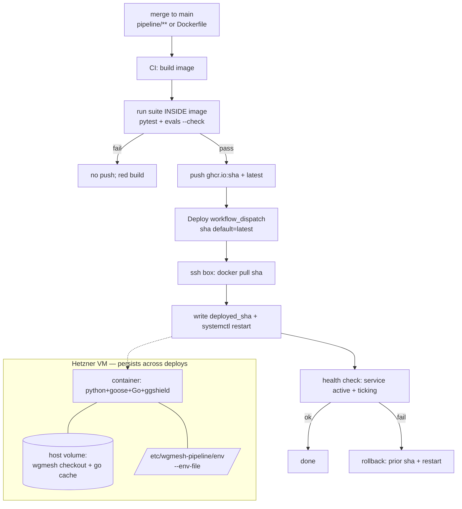

# feat: Containerized atomic deploy for the wgmesh-pipeline box

## Summary

Replace live git-pull + per-deploy toolchain installs with a Docker image that CI
builds, tests **inside the image**, and pushes to `ghcr.io` tagged by commit SHA. The
box deploys by pulling a SHA and swapping the container; rollback re-runs the prior
SHA. The wgmesh checkout + Go module cache live on a persistent host volume; secrets
stay in `/etc/wgmesh-pipeline/env` and are injected with `--env-file`. Provision shrinks
to first-time infra; the 75 s git-pull path is retained as a dev escape hatch.

Primary win: the deployed artifact IS the CI-tested artifact, and rollback is one
dispatch. Secondary wins: the Go/ggshield install races (session 2026-06-10) become
structurally impossible, and the VM is never recreated to ship the app.

---

## Problem Frame

Today two workflows update the box, both flawed (see origin):
- `provision-pipeline-box.yml` recreates the VM (~13 min, delete+create+cloud-init) for
  any change beyond code — env, secrets, `MODEL_REGISTRY`, mode. A cancel mid-provision
  destroyed the box on 2026-06-10.
- `update-pipeline-box.yml` ships code in-place (~75 s) but installs goose/Go/ggshield
  live; those installs have raced and conflicted in production.

Neither gives a provably-CI-tested artifact or atomic rollback: deploy is
`git reset --hard origin/main` + `pip install -e` resolved live.

---

## Requirements (traceability to origin)

- **R1** Baked toolchain image — python + goose + Go 1.25.5 + ggshield, pinned (origin R1).
- **R2** CI build → test-in-image → push `ghcr.io/<org>/wgmesh-pipeline:<sha>` (+ `latest`); failed in-image tests block the push (origin R2).
- **R3** Atomic deploy = pull SHA + container swap + health check, no server recreate, <~2 min (origin R3).
- **R4** Rollback = re-deploy a prior SHA tag, restores exact artifact (origin R4).
- **R5** Persistent host volume for wgmesh checkout + Go mod cache, survives swaps (origin R5).
- **R6** Secrets from host `--env-file`, never baked, never in registry layers (origin R6).
- **R7** Provision shrinks to first-time infra only (VM create, docker install, volume init, env write, first container) (origin R7).
- **R8** Keep `update-pipeline-box.yml` git-pull path as dev escape hatch (origin R8).

---

## Key Technical Decisions

- **Registry: `ghcr.io`, private image.** Org is on GitHub; CI pushes with `GITHUB_TOKEN`
  (needs `packages: write`). The box pulls with a read-scoped deploy token stored in its
  env (`GHCR_PULL_TOKEN`), set the same encrypted-secret way as `GITGUARDIAN_API_KEY`
  (pynacl-sealed `gh api` PUT — `gh secret set` is hook-blocked in this environment).
- **Build trigger: push to `main` filtered to `pipeline/**` + `pipeline/deploy/Dockerfile`.**
  Skips docs-only and state-commit merges that don't change the artifact. Mirrors the
  existing `pipeline-ci.yml` path filter.
- **Test-in-image is the gate, reusing the existing suite.** The image build runs
  `python -m pytest pipeline/tests/ -q` + `python -m evals.run_evals --check` (same as
  `pipeline-ci.yml`) in a build stage or a post-build `docker run`; push only on pass.
- **Service stays systemd-managed, now wrapping docker.** `wgmesh-pipeline.service`
  `ExecStart` becomes `docker run ... ghcr.io/...:<pinned>` (or `docker compose up`),
  keeping the systemd lifecycle, restart policy, and journald logging the box diagnostics
  already depend on. The deployed SHA is recorded in a host file (e.g.
  `/etc/wgmesh-pipeline/deployed_sha`) the unit reads, so deploy = write SHA + restart and
  rollback = write prior SHA + restart — atomic and symmetric.
- **First cutover is a documented runbook step, not an auto-run unit.** It recreates the
  current box one final time onto the docker model; doing it by hand keeps the destructive
  step operator-gated.

---

## High-Level Technical Design

---

## Implementation Units

### U1. Rebuild the deploy image with the full pinned toolchain

- **Goal:** A Docker image that runs the pipeline service with goose + Go 1.25.5 + ggshield baked, matching the box's hand-assembled toolchain (session 2026-06-10).
- **Requirements:** R1, R6.
- **Dependencies:** none.
- **Files:** `pipeline/deploy/Dockerfile`, `pipeline/deploy/env.example` (document required runtime vars incl. `GITGUARDIAN_API_KEY`, `MODEL_REGISTRY`, `STAGE_ROUTING`).
- **Approach:** base `python:3.12-slim` (box runs 3.12); install pinned goose (`GOOSE_BIN_DIR=/usr/local/bin CONFIGURE=false`), Go 1.25.5 to `/usr/local/go` + symlink, ggshield in an isolated venv symlinked onto PATH (the `--break-system-packages`/urllib3 conflict from 2026-06-10 — keep the venv approach inside the image too). Install the pipeline package. Non-root `wgmesh` uid. `CMD python -m wgmesh_pipeline.main`. Secrets only at runtime via `--env-file`; nothing copied in. Declare the volume mountpoints for the wgmesh checkout + `GOMODCACHE`.
- **Patterns to follow:** the install recipes already proven in `.github/workflows/provision-pipeline-box.yml` cloud-init; current `pipeline/deploy/Dockerfile` skeleton.
- **Test scenarios:**
  - Covers R1. Image builds clean; `docker run --rm  sh -c 'goose --version && go version && ggshield --version && python -c "import wgmesh_pipeline"'` all succeed.
  - `docker run --rm  id -u` is non-root (10001).
  - No secret value present in any layer (`docker history` / scan shows env-only injection).
- **Verification:** image builds locally and the toolchain self-check command passes.

### U2. CI workflow: build, test-in-image, push to ghcr

- **Goal:** On qualifying pushes to main, build the image, run the suite inside it, push SHA + `latest` on green.
- **Requirements:** R2.
- **Dependencies:** U1.
- **Files:** `.github/workflows/build-pipeline-image.yml` (new).
- **Approach:** trigger `push` to `main` with `paths: [pipeline/**, pipeline/deploy/Dockerfile]`; `permissions: { contents: read, packages: write }`; build with buildx + layer cache (cache the Go-toolchain layer aggressively, KTD); run `pytest pipeline/tests/ -q` and `evals.run_evals --check` via `docker run` against the freshly built image (or a final test stage that fails the build); on pass, tag and push `ghcr.io/<org>/wgmesh-pipeline:${{ github.sha }}` and `:latest`. Login via `GITHUB_TOKEN`.
- **Patterns to follow:** `pipeline-ci.yml` (same test commands, same path filter shape); `docker/build-push-action` + `docker/login-action`.
- **Test scenarios:**
  - Covers R2. A green commit produces a pushed `:<sha>` image (verify tag exists post-run).
  - A commit with a deliberately failing test does NOT push (push step gated on test job success).
  - A docs-only push to main does not trigger the workflow (path filter).
- **Verification:** workflow run on a real merge pushes a SHA-tagged image; a red test blocks the push.

### U3. Shrink provision to first-time infra + docker bootstrap

- **Goal:** Provision creates the VM, installs docker, initializes the persistent volume, writes the env file (incl. ghcr pull token), and starts the first container — but is no longer the app-update path.
- **Requirements:** R3, R5, R6, R7.
- **Dependencies:** U1, U2 (image must exist to pull).
- **Files:** `.github/workflows/provision-pipeline-box.yml`, `pipeline/deploy/wgmesh-pipeline.service`, `pipeline/deploy/deploy.sh` (or a new `pipeline/deploy/run-container.sh`).
- **Approach:** cloud-init installs docker instead of python venv + goose + Go + ggshield (those move into the image, U1). Create a host volume/dir for the wgmesh checkout + Go mod cache (R5). Keep writing `/etc/wgmesh-pipeline/env` over SSH (R6), adding `GHCR_PULL_TOKEN`. `docker login ghcr.io` with the pull token. Rewrite `wgmesh-pipeline.service` `ExecStart` to `docker run --env-file /etc/wgmesh-pipeline/env -v <vol>:/opt/wgmesh-checkout -v <gocache>:/go/pkg/mod ghcr.io/...:$(cat /etc/wgmesh-pipeline/deployed_sha)` (or compose). Initialize `deployed_sha=latest` on first boot.
- **Patterns to follow:** existing provision SSH/env-write steps; `op-persistent` + deploy-key auth model.
- **Test scenarios:**
  - Covers R7. Provision on a fresh VM ends with the service active, container running the pulled image, ticking confirmed in journal.
  - Covers R5. Volume persists a file across a container restart.
  - Covers R6. `docker inspect` shows env via `--env-file`, no secret baked; `/etc/wgmesh-pipeline/env` is the only secret source.
  - Env-only change (e.g. edit `MODEL_REGISTRY` in the host env) + `systemctl restart` takes effect with no image rebuild.
- **Verification:** a from-scratch provision yields a ticking containerized box; an env edit + restart applies without rebuild.

### U4. Deploy + rollback workflow

- **Goal:** A `workflow_dispatch` that deploys a given SHA (default `latest`) by pull + swap + health check; the same workflow with a prior SHA is the rollback.
- **Requirements:** R3, R4.
- **Dependencies:** U2, U3.
- **Files:** `.github/workflows/deploy-pipeline-box.yml` (new).
- **Approach:** input `sha` (default `latest`); resolve box IP via hcloud; SSH with the deploy key; `docker pull ghcr.io/...:<sha>`; write `/etc/wgmesh-pipeline/deployed_sha`; `systemctl restart wgmesh-pipeline`; health check (service active + a fresh tick / `/health`-equivalent in journal within N s); on health failure, restore the previous `deployed_sha` and restart (auto-rollback of the failed deploy). Keep the prior SHA in `/etc/wgmesh-pipeline/previous_sha` so a manual rollback dispatch needs no lookup.
- **Patterns to follow:** `update-pipeline-box.yml` (IP resolve, deploy-key SSH, health-check shape).
- **Test scenarios:**
  - Covers R3. Dispatch with a known-good SHA swaps the container and the service returns active + ticking.
  - Covers R4. Dispatch with the prior SHA restores that exact image (verify running image digest).
  - A pull of a nonexistent SHA fails the deploy without stopping the currently-running container (pull before swap; don't restart on pull failure).
  - Health-check failure after swap auto-restores previous SHA.
- **Verification:** deploy a SHA then roll back to the prior SHA; running image digest matches each target; service healthy throughout except the brief restart.

### U5. Retire image-build duplication from the fast path; keep git-pull as escape hatch

- **Goal:** `update-pipeline-box.yml` stays as the dev escape hatch but is clearly demarcated as non-production; production deploy is U4.
- **Requirements:** R8.
- **Dependencies:** U4.
- **Files:** `.github/workflows/update-pipeline-box.yml` (header/doc only), `docs/` runbook note.
- **Approach:** add a header comment to `update-pipeline-box.yml` stating it is the break-glass dev path (in-place git-pull against a box still running the container? — note the constraint: the git-pull path mutates `/opt/wgmesh-pipeline` which the container no longer runs from once U3 lands). **Open question (below)** resolves whether the fast path targets a bind-mounted source or is demoted to "rebuild+local-run image" — do not silently break it. Minimum: document that it is not the containerized path.
- **Test scenarios:** `Test expectation: none — documentation/demarcation only.` Verify the workflow still parses (actionlint/CI yaml check if present).
- **Verification:** header reflects reality post-U3; no production deploy relies on it.

### U6. Cutover runbook + provision/deploy split docs

- **Goal:** A documented, operator-run cutover from the current hand-patched box to the containerized model, plus updated headers describing the provision-vs-deploy split.
- **Requirements:** R7.
- **Dependencies:** U1–U4.
- **Files:** `pipeline/docs/` (new `CONTAINER-CUTOVER.md` or append to PHASE4-DEPLOY), workflow header comments.
- **Approach:** ordered runbook — set `GHCR_PULL_TOKEN` secret (pynacl-sealed `gh api` PUT); confirm first image built (U2); run shrunk provision (U3) `reset_queue=false` to rebuild the box onto docker; verify ticking + a gate decision; confirm deploy/rollback (U4) on a no-op SHA bump. Note the one-time destructive recreate and that durable Turso state survives it.
- **Test scenarios:** `Test expectation: none — runbook/docs.`
- **Verification:** following the runbook on the live box yields a containerized box passing a full issue cycle.

---

## Scope Boundaries

**In scope:** image (U1), CI build-test-push (U2), shrunk provision + docker bootstrap (U3), deploy/rollback workflow (U4), escape-hatch demarcation (U5), cutover runbook (U6).

### Deferred to Follow-Up Work
- Per-goose-run sandbox containers (each goose invocation in its own throwaway container) — origin "Deferred for later"; the current Dockerfile already notes it.
- Zero-downtime / blue-green deploy — single box; brief restart between swaps accepted (origin).
- Auto-running the first cutover from CI — kept operator-gated (KTD).

### Outside this change
- Turso state store and Langfuse (already remote/decoupled).
- Multi-box / horizontal scaling.
- Pipeline Python behavior (gate, routing, cost capture) — unchanged; this is deploy mechanics only.

---

## Risks & Dependencies

- **Image size / build time.** Go toolchain layer ~600 MB; without aggressive buildx layer caching, per-merge builds drag. Mitigation: cache the toolchain layers; they change rarely.
- **ghcr pull auth on the box.** A bad/expired `GHCR_PULL_TOKEN` blocks deploy. Mitigation: provision validates `docker login` + a test pull; deploy fails loud (announce) on auth error.
- **One-time destructive cutover.** Rebuilding the live box drops any hand-patched state. Mitigation: durable state is Turso (survives); the runbook (U6) lists what must be in secrets/env first. **This is the same class of loss that bit the 2026-06-10 provision-cancel — runbook makes the prerequisites explicit.**
- **Fast-path coherence (U5 open question).** Once the container runs the app, the git-pull path's edits to `/opt/wgmesh-pipeline` no longer affect the running service unless source is bind-mounted. Must be resolved, not left ambiguous.
- **Dependency:** box gains a docker runtime (U3); CI needs `packages: write`.

---

## Open Questions (resolve at implementation)

1. **U5 fast-path shape.** Post-containerization, should `update-pipeline-box` (a) bind-mount `/opt/wgmesh-pipeline` source into a dev container so git-pull still iterates, (b) become "rebuild image locally on box + run", or (c) be demoted to docs-only break-glass with a documented `docker run -v $(pwd):/app` recipe? Pick during U5.
- 2. **Service wrapper: raw `docker run` vs `docker compose`.** Compose eases volume/env/restart declaration and a future multi-container (per-goose sandbox) story; raw `docker run` is one less dependency. Decide in U3.
3. **Health check signal.** Reuse the existing journal "tick" log line, add a lightweight `/health` endpoint, or check `systemctl is-active` + a Turso write timestamp. Decide in U4.

---

## Sources & Research

- Origin requirements: `docs/brainstorms/2026-06-11-containerized-box-deploy-requirements.md`.
- Existing infra mirrored: `.github/workflows/pipeline-ci.yml` (test commands, path filter), `.github/workflows/provision-pipeline-box.yml` (SSH/env-write, toolchain installs), `.github/workflows/update-pipeline-box.yml` (deploy-key SSH, health check), `pipeline/deploy/Dockerfile` + `wgmesh-pipeline.service` (current shapes).
- Session 2026-06-10 (memory `project_box_spec_contract_mismatch`): the Go-install race and ggshield/urllib3 conflict that motivate baking the toolchain; the provision-cancel box-loss that motivates decoupling server from app lifecycle; the pynacl-sealed `gh api` secret-set pattern (`gh secret set` hook-blocked).
