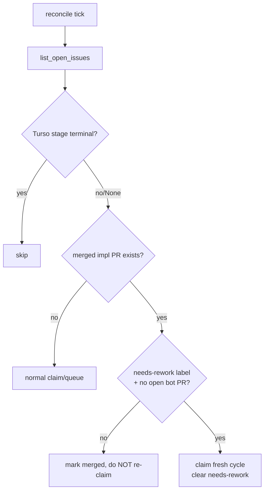
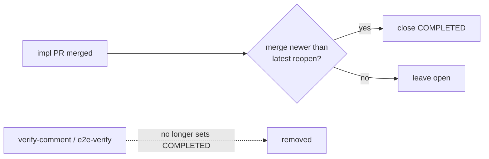

# fix: Issue lifecycle guards

**Target repos:** pipeline code in `ai-pipeline-template` (`pipeline/wgmesh_pipeline/...`); workflows in the **wgmesh** repo (`.github/workflows/...`). Paths below are repo-relative to whichever repo owns the file.

## Summary

Stop the box reprocessing already-resolved issues, and stop issues closing `COMPLETED`
without a current-cycle merged impl PR. A resolved issue (one with a merged impl PR) is
re-claimable only when reopened AND labelled `needs-rework` AND it has no open bot PR; a
bare reopen is invisible to the box. One closer owns `COMPLETED`, keyed on a current-cycle
merge; the stale-merged-PR re-close and the non-merge closers are removed. A one-time
scripted cleanup closes the existing dangling duplicate PRs.

---

## Problem Frame

`reconcile_issues` (`pipeline/wgmesh_pipeline/github/reconcile.py`) skips issues whose
**Turso** stage is terminal — but `reset_queue` wipes Turso, so after any reset a
reopened-and-previously-resolved issue (open on GitHub, no merged label) re-enters as
`queued` and the box re-specs/re-implements it. #510 (spec #511 merged Apr-12, reopened
Apr-29) and #540 (impl #544 merged Apr-29, reopened May-5) produced dangling dup PRs
(#688/#719, #690/#717). Separately, `close-resolved-issues.yml` closes on *any* merged
`impl: Issue #N` match, blind to a post-merge reopen, and other workflows close COMPLETED on
non-merge signals (#584 closed with no merged PR). See origin for the full ce-debug trace.

The Turso-wipe insight is load-bearing: the resolved-guard cannot rely on local state,
because the exact failure path destroys it. It must read a GitHub-side signal.

---

## Requirements (origin traceability)

- **R1** Reconcile skips a resolved issue unless open + `needs-rework` + no open bot PR (origin R1).
- **R2** Bare reopen (no `needs-rework`) never triggers claim/spec/implement (origin R2).
- **R3** `needs-rework` on a resolved issue drives exactly one fresh cycle; marker cleared on new-cycle claim (origin R3).
- **R4** Exactly one workflow closes `state_reason: completed`, only on a current-cycle merged impl PR; stale-merged matches do not close (origin R4).
- **R5** No autonomous path closes COMPLETED on a non-merge signal (origin R5).
- **R6** One-time cleanup closes dangling dup PRs #688/#719, #690/#717, #668/#722 with goal-citing reasons (origin R6).

---

## Key Technical Decisions

- **Resolved-signal = live merged-PR lookup, not local state.** Reconcile asks GitHub
  "does a merged `impl: Issue #N` (or resolving spec) PR exist?" because `reset_queue`
  wipes the Turso state the old terminal-skip relied on. One extra API call per *candidate*
  issue (only those not already terminal in state), acceptable at the box's tick cadence.
- **`needs-rework` is the single rework control.** Operator-applied. Its presence overrides
  the resolved-skip; its absence means a resolved issue is left alone regardless of open/closed.
- **One closer: `close-resolved-issues.yml`, current-cycle-gated.** It already owns the
  merged-PR→close path; extend it to require the merged PR to post-date the issue's latest
  reopen (or, equivalently, that the issue is not in a `needs-rework` cycle). The other
  closers stop setting COMPLETED.
- **Cleanup is a scripted operator step, not an autonomous sweep.** A bulk `gh pr close`
  with reasons, run once, kept out of the loop so no autonomous path mass-closes PRs.

---

## High-Level Technical Design

Close authority, after:

---

## Implementation Units

### U1. Reconcile resolved-guard (merged-PR lookup + needs-rework override)

- **Goal:** Reconcile does not re-queue a resolved issue unless it is in an explicit rework cycle.
- **Requirements:** R1, R2, R3.
- **Dependencies:** none (U4 label can land in parallel; guard treats absent label as "no rework").
- **Files:** `pipeline/wgmesh_pipeline/github/reconcile.py`, `pipeline/wgmesh_pipeline/github/client.py` (add a `has_merged_impl_pr(issue_number)` query if absent), `pipeline/tests/test_reconcile.py`.
- **Approach:** in the `current_stage is None / not terminal` path, before queuing, check `has_merged_impl_pr(issue.number)`. If a merged impl PR exists AND `needs-rework` is NOT in labels → `upsert_issue(stage="merged", status=issue.state)` and skip (do not queue). If `needs-rework` IS present AND no open bot PR → queue a fresh cycle and remove the `needs-rework` label (R3 clear-on-claim). Reuse the existing `find_open_pr_number`/branch helpers for the open-bot-PR check. Keep the existing label-based MERGED_LABELS path.
- **Patterns to follow:** existing `reconcile.py` branch structure; `client.list_open_pulls`/`find_open_pr_number` for the bot-PR check.
- **Test scenarios:**
  - Covers R1/R2. Issue open, no Turso state (post-reset), merged impl PR exists, no `needs-rework` → marked merged, NOT queued.
  - Covers R3. Same but `needs-rework` present + no open bot PR → queued fresh, label removed.
  - `needs-rework` present BUT an open bot PR exists → not re-queued (avoid duplicate in-flight).
  - No merged impl PR (genuinely new issue) → queued as today (no regression).
  - Existing MERGED_LABELS / needs-human / needs-triage paths unchanged (regression guard).
- **Verification:** reconcile unit suite green; a simulated post-reset reopened-resolved issue is not re-queued.

### U2. Close-authority consolidation + stale-match fix

- **Goal:** Only one workflow closes COMPLETED, and only on a current-cycle merged impl PR.
- **Requirements:** R4.
- **Dependencies:** none.
- **Files:** `.github/workflows/close-resolved-issues.yml` (wgmesh).
- **Approach:** in both the PR-merge path and the sweep path, before closing, require the merged impl PR's merge time to be **newer than the issue's latest `reopened` event** (GitHub issue timeline), OR equivalently that the issue carries no active `needs-rework`. A stale merge (predating the last reopen) does not close. Keep `shouldSkip` (bug-class/gated) logic.
- **Patterns to follow:** existing github-script close logic in the file; issue timeline API for reopen time.
- **Test scenarios:** `Test expectation: logic-documented (YAML/github-script, no Python harness).` Manual/integration checks: (a) issue with merge newer than last reopen → closes; (b) issue reopened after its only merged impl PR → does NOT close; (c) bug-class/gated issue still skipped.
- **Verification:** a reopened-after-merge issue survives a sweep run without closing.

### U3. Fence non-merge closers (#584 class)

- **Goal:** No workflow sets `state_reason: completed` on a non-merge signal.
- **Requirements:** R5.
- **Dependencies:** none.
- **Files:** `.github/workflows/verify-comment-close.yml`, `.github/workflows/e2e-verify-close.yml` (wgmesh).
- **Approach:** audit each closer. verify-comment-close (issue_comment trigger) and e2e-verify-close (workflow_run) may close only via the verified-bug lifecycle (awaiting-verification → verified), never a bare COMPLETED on an unresolved issue. Bounded trace of the #584 close (suspect verify-comment-close on a stray comment) to confirm the path that fired and close it off. If a closer has a legitimate close path, gate it on the same current-cycle-merge requirement as U2.
- **Test scenarios:** `Test expectation: logic-documented.` Integration: a stray issue comment on an unresolved issue does not close it; an e2e-verify failure does not close COMPLETED.
- **Verification:** the #584 reproduction (or its closest reconstruction) no longer closes the issue.

### U4. `needs-rework` label lifecycle

- **Goal:** The label exists, is documented, and is cleared at the right point.
- **Requirements:** R3.
- **Dependencies:** U1 (consumer).
- **Files:** label creation (one-time `gh label create` or in provision), a short doc note in `pipeline/docs/` or AGENTS-adjacent guidance, `.github/workflows/` only if a workflow must clear it.
- **Approach:** create the `needs-rework` label in wgmesh. Document the operator workflow: reopen + apply `needs-rework` to request a redo. Clearing happens in U1 on fresh-cycle claim (single clear-point to avoid a stuck marker re-triggering).
- **Test scenarios:** `Test expectation: none — label + docs.` (Clear-on-claim behavior is tested in U1.)
- **Verification:** label present in wgmesh; the operator runbook names the reopen+label step.

### U5. One-time dangling-PR cleanup

- **Goal:** Close the existing dangling duplicate PRs with reasons.
- **Requirements:** R6.
- **Dependencies:** U1 (so re-running reconcile won't immediately recreate them).
- **Files:** a documented `gh` command sequence in `pipeline/docs/` (operator-run); no autonomous code.
- **Approach:** `gh pr close` #688, #719, #690, #717, #668, #722 (wgmesh) each with a reason citing the resolved/duplicate status and the lifecycle fix. Verify the parent issues are in the correct state afterward (resolved issues stay closed; #584 reopened if it was wrongly closed and has real pending work — operator judgment).
- **Test scenarios:** `Test expectation: none — one-time operator cleanup.`
- **Verification:** zero open `bot/spec-*` or `bot/impl-*` PRs against resolved/closed issues after the sweep.

---

## Scope Boundaries

**In scope:** U1-U5 above.

### Deferred to Follow-Up Work
- Auto-detecting "reopened for new work" without the manual `needs-rework` marker (timestamp model set aside in brainstorm as too silent).
- The first autonomous impl merge itself — needs a fresh low-risk issue, tracked separately.

### Outside this change
- Verification gate, ggshield, routing, cost capture (working, untouched).
- The PUSH_TOKEN→app-token migration — separate OPEN track; U2/U3 should prefer the durable principal where they already touch these workflows, but the migration itself is not this plan.

---

## Risks & Dependencies

- **Per-tick API cost (U1).** The merged-PR lookup adds a call per non-terminal candidate. Mitigation: only for issues without a terminal Turso stage; cache within a tick if the candidate set is large.
- **Timeline-based stale check (U2).** Reopen-time vs merge-time comparison is subtle; a missing timeline read defaults must fail safe to NOT closing (leave open) rather than closing wrongly.
- **#584 not fully root-caused.** U3 fences by removing non-merge close authority even if the exact trigger stays unproven (origin decision). Residual risk: an unaudited closer remains; mitigation is the bounded trace in U3.
- **Cross-repo.** Code in ai-pipeline-template, workflows in wgmesh — two PRs, sequence U1 (pipeline) and U2-U4 (wgmesh) can land independently; U5 cleanup after U1 deploys.

---

## Open Questions (resolve at implementation)

1. **#584 closer identity** — bounded trace at impl time: which workflow set COMPLETED with no merged PR, and does U3 actually remove its ability to.
2. **Resolving-PR definition** — does a merged *spec* PR count as "resolved" (it did for #510 via #511), or only a merged *impl* PR? Affects U1's `has_merged_impl_pr` predicate.
3. **Marker clear timing** — confirmed clear-on-claim (U1); verify it can't get stuck if the fresh cycle fails before producing a PR.

---

## Sources & Research

- Origin: `docs/brainstorms/2026-06-11-issue-lifecycle-guards-requirements.md`.
- ce-debug trace (session 2026-06-11, memory `project_box_spec_contract_mismatch` wave 22): reset_queue wipes Turso → reopened-resolved issues re-enter; close-resolved-issues stale-merged match; #584 non-merge close.
- Code read this session: `pipeline/wgmesh_pipeline/github/reconcile.py` (terminal-skip + MERGED_LABELS), `.github/workflows/close-resolved-issues.yml` (merged-guard + sweep), `verify-comment-close.yml` / `e2e-verify-close.yml` (PUSH_TOKEN closers).
