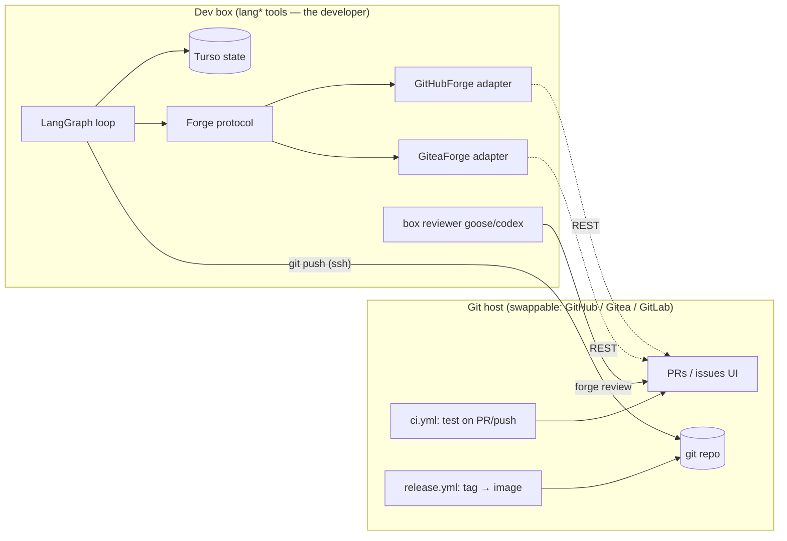
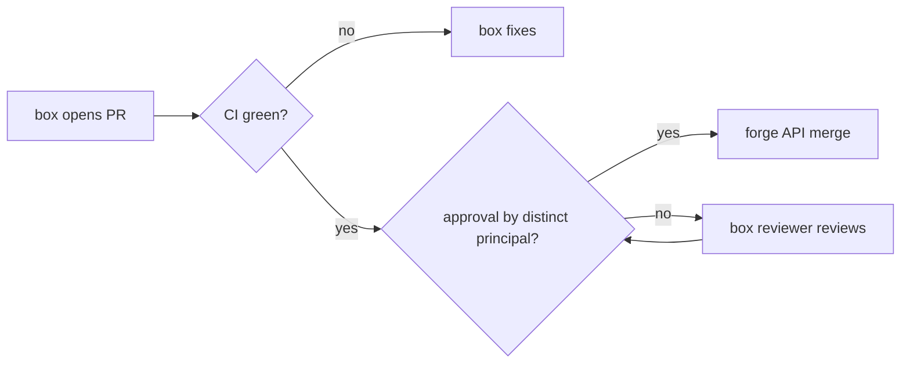

# refactor: Forge-portable SDLC

**Target repo:** ai-pipeline-template (pipeline code + workflows). Seed-repo (wgmesh) workflow changes are referenced but deferred to their own units.

## Summary

End state, verbatim from the operator: GitHub Actions carries only a *normal git flow* (test on PR/push, release on tag); all development happens on the box using lang* tools; GitHub is replaceable by another git host *quickly, without losing functionality*; no `gh` commands are necessary for the full SDLC; the goose box develops and is *treated the same way as any independent developer*.

This plan introduces a **forge abstraction** over the 12-method GitHub REST surface the box actually uses, moves lifecycle control flow off host labels onto box state + git facts, normalizes host CI to test+release only, makes the box a plain-git developer (ssh push, forge-API PRs, no admin bypass), and proves portability with a local Gitea/Forgejo conformance run. It builds on — does not replace — the 16-unit Actions→LangGraph cutover plan (#1599), which owns moving the 34 orchestration workflows onto the box.

---

## Problem Frame

Inventory (2026-06-11): 39 workflows, of which **34 are orchestration** (observation loop, heal, supervisor-rank, auto-merge lanes, strategy audit, pulse, RAH…), only 4 are test-CI and 1 builds the container image (branch-triggered, not tag release). Workflows shell out to `gh` extensively; the box's Python code is cleaner — zero `gh` usage, all GitHub access via `GitHubClient` (12 public methods) — but that client is GitHub-shaped (REST paths, Search API, label semantics) and lifecycle control flow is keyed on GitHub labels (`needs-triage`, `needs-human`, `copilot-triaging`) at 5 code sites.

Consequences observed this session and in memory: app-token permission drift, Copilot availability coupling, label-gate freezes, dead PATs stalling lanes (`goose-review dispatch 401`), self-approval 422s, GitHub Search API mis-tokenization. Every one is a GitHub-specific fragility in what should be host-neutral SDLC machinery. The standing direction ("decouple pipeline from GitHub") has no concrete portability layer yet — this plan is that layer.

---

## Assumptions

Headless-run inferences; correct at review if wrong:

- "lang* tools" = the existing LangGraph box + Goose/Codex runners already live on Hetzner; no new orchestrator is being introduced.
- "another git repo hosting" means a self-hostable forge with issues + PRs + CI (Gitea/Forgejo primary target, GitLab acceptable); not a bare git remote without issue/PR surface.
- "no github commands" = no `gh` CLI and no GitHub-only API assumptions in the SDLC path; host-native CI config files (`.github/workflows/` vs `.gitea/workflows/`) are acceptable as the thin swappable layer.
- "treated the same way as any independent developer" = box holds a normal bot account credential (ssh key + forge API token), pushes branches, opens PRs, and its PRs merge through the same CI-green + distinct-approver gate as anyone else — no `--admin`, no app-token bypass of protections.
- Copilot review is GitHub-only and therefore gets replaced by a box-side review step (goose/codex reviewer) as the portable review gate.
- The #1599 cutover plan remains the owner of migrating/retiring the 34 orchestration workflows; this plan provides the forge layer they migrate onto and the target CI shape.

---

## Requirements

- **R1** Host CI = normal git flow only: test/lint on PR and push; release (image build + publish) on tag. No orchestration logic in host workflows.
- **R2** All development orchestration (spec, implement, review, lifecycle, healing, supervision) runs on the box via lang* tools.
- **R3** Forge abstraction: pipeline code depends on a `Forge` protocol, never on GitHub specifics; a second adapter (Gitea/Forgejo) passes the same conformance suite — host swap is config + credentials + thin CI file.
- **R4** Zero `gh` CLI in the SDLC path; no GitHub-only API semantics (Search API quirks, App tokens, Copilot) load-bearing anywhere.
- **R5** Box = independent developer: plain git over ssh for branches, forge API for PRs, merges gated on CI green + approval from a principal distinct from the PR author; no admin bypass held by the box.
- **R6** Lifecycle control flow keyed on box state (Turso) + git facts (merged commits/branches); host labels are best-effort mirrors for humans, never gates.
- **R7** Portability proven, not asserted: conformance test suite runs against the GitHub adapter (HTTP-stubbed) and a live local Gitea/Forgejo (docker) in an opt-in integration lane.

---

## Key Technical Decisions

- **Protocol over rewrite.** `GitHubClient`'s 12 used methods define the `Forge` protocol surface (issues list/by-marker, PR create/find/merge/update-body/diff, label add/remove, branch push, resolution lookup). The existing client becomes the first adapter behind the protocol — callers (`reconcile.py`, `poller.py`, `gate.py`, `spec_pr.py`, `implement.py`) change imports, not logic. Rationale: 169+ tests already pin behavior; wrapping preserves them.
- **Git facts over host facts.** `has_merged_resolution_pr` (today: GitHub Search API, known mis-tokenization risk) gains a git-native implementation: resolution = merged commit reachable from main whose message/branch matches the `impl|spec|fix: Issue #N` convention — computable from a clone with `git log`, identical on every host. Host PR lookup stays as a fallback adapter method.
- **Labels demoted to mirrors.** The 5 label-gate sites move to box-state reads; label writes become best-effort + non-blocking (telemetry-write lesson: side-channel writes must never block convergence). `needs-human` remains meaningful to humans but the box's own escalation state is authoritative.
- **Distinct-principal merge gate.** Box bot opens PRs; a second identity (reviewer bot or CI auto-approve rule on green) approves; merge via forge API requires both. Directly informed by the live `422 "Can not approve your own pull request"` failure (2026-06-11). No `--admin` in any box path.
- **Thin CI is the swappable layer.** `ci.yml` (test) + `release.yml` (tag → build/push image) written in the Gitea-Actions-compatible subset of GitHub Actions syntax where feasible; a `docs/` mapping table records the GitLab CI equivalent. Workflow files are *expected* to be rewritten per host — that's the acceptable porting cost; everything else ports for free.
- **Box-side review replaces Copilot.** Portable review gate = goose/codex reviewer invoked by the box, posting a normal forge review. Also resolves the current dead-credential goose-review dispatch (401) by moving the dispatch on-box.

---

## High-Level Technical Design

Merge gate (any host):

---

## Implementation Units

### U1. Forge protocol

- **Goal:** Host-neutral `Forge` protocol capturing the used client surface.
- **Requirements:** R3, R4.
- **Dependencies:** none.
- **Files:** `pipeline/wgmesh_pipeline/forge/__init__.py`, `pipeline/wgmesh_pipeline/forge/protocol.py`, `pipeline/tests/test_forge_protocol.py`
- **Approach:** `typing.Protocol` with the 12 methods + dataclasses (`ForgeIssue`, `ForgePR`) generalized from `GitHubIssue`. Method semantics documented host-neutrally (e.g., "merge request" vs "pull request" naming hidden behind `create_change_request`). Keep `spec_pr` write-gate flags — they are box policy, not host policy.
- **Patterns to follow:** Repository-pattern guidance in user rules; `Protocol` duck-typing per python patterns rule.
- **Test scenarios:** protocol is runtime-checkable; `GitHubClient` satisfies it (isinstance check); dataclasses immutable (frozen).

### U2. GitHubForge adapter + caller migration

- **Goal:** Existing client becomes one adapter; all callers depend on the protocol.
- **Requirements:** R3.
- **Dependencies:** U1.
- **Files:** `pipeline/wgmesh_pipeline/forge/github.py` (thin re-export/wrap of `github/client.py`), callers `pipeline/wgmesh_pipeline/github/reconcile.py`, `pipeline/wgmesh_pipeline/poller.py`, `pipeline/wgmesh_pipeline/graph/nodes/{spec_pr,gate,implement}.py`, config `pipeline/wgmesh_pipeline/config.py` (`FORGE_KIND`, default `github`), factory `pipeline/wgmesh_pipeline/forge/factory.py`, tests `pipeline/tests/test_forge_factory.py`
- **Approach:** Zero behavior change; imports + a `make_forge(config)` factory (mirror `open_state_store` factory pattern from the mailservice-sqlite adoption). Fail-closed on unknown `FORGE_KIND`.
- **Test scenarios:** factory returns GitHub adapter by default; unknown kind raises with clear message; full existing suite stays green (the real assertion).

### U3. Git-native resolution + lifecycle off labels

- **Goal:** Control flow keyed on box state + git facts; labels best-effort mirrors.
- **Requirements:** R4, R6.
- **Dependencies:** U1.
- **Files:** `pipeline/wgmesh_pipeline/forge/gitfacts.py` (clone-local `git log` resolution lookup), `pipeline/wgmesh_pipeline/github/reconcile.py`, `pipeline/wgmesh_pipeline/graph/nodes/spec_pr.py`, `pipeline/wgmesh_pipeline/poller.py`, `pipeline/wgmesh_pipeline/graph/nodes/gate.py`, tests `pipeline/tests/test_gitfacts.py`, `pipeline/tests/test_reconcile.py`
- **Approach:** `has_merged_resolution_pr` prefers git-facts (merged `impl|spec|fix: Issue #N` commit reachable from default branch — same regex discipline as the 2026-06-11 resolved-guard, exact match incl. Copilot-era `(Issue #N)` suffix); host-API lookup is fallback. Label writes wrapped best-effort (log-don't-raise), reads replaced by store state. `needs-human` escalation: store is authoritative; label mirrored.
- **Execution note:** test-first on `gitfacts` matching — the resolved-guard's hollow-green history (test fakes overriding the gate) applies here verbatim; stub at the subprocess/HTTP boundary.
- **Test scenarios:** merged impl commit → resolved (exact title); referencing-only commit ("fix: regression from Issue #N rollout") → NOT resolved; `#5401` vs `#540` → not resolved; label write failure does not abort reconcile tick (logged); escalation honored from store with label-write down.

### U4. Box-as-developer auth + distinct-principal merge

- **Goal:** Box pushes via ssh deploy key, opens PRs via forge token, merges only through CI-green + distinct approver.
- **Requirements:** R5.
- **Dependencies:** U2.
- **Files:** `pipeline/wgmesh_pipeline/forge/protocol.py` (add `approve_change_request`, `merge_when_ready` semantics), `pipeline/wgmesh_pipeline/graph/nodes/gate.py`, `pipeline/deploy/run-container.sh` (mount ssh key), `pipeline/docs/CONTAINER-CUTOVER.md` (credential matrix), tests `pipeline/tests/test_gate.py`
- **Approach:** Two credentials on box: author bot (pushes, opens PRs) and reviewer bot (approves) — the 422 self-approval failure made the split non-negotiable. `merge_pr` gains preconditions: CI green + ≥1 approval by non-author; remove any admin/bypass flags from box code. Branch protection config documented per host.
- **Test scenarios:** merge refused when approver == author; merge refused on red CI; merge proceeds green+distinct-approval; missing reviewer credential → escalate to store (needs-human state), never bypass.

### U5. Thin git-flow CI + tag release

- **Goal:** Host CI reduced to test + release; release becomes tag-driven.
- **Requirements:** R1.
- **Dependencies:** none (parallel).
- **Files:** `.github/workflows/ci.yml` (consolidate pipeline-ci + sanitise/pii checks), `.github/workflows/release.yml` (tag `v*` → build/push pipeline image; replaces branch-triggered `build-pipeline-image.yml`), `docs/ci-portability.md` (GitHub↔Gitea Actions↔GitLab CI mapping table)
- **Approach:** Keep workflow syntax inside the Gitea-Actions-compatible subset where practical (actions/checkout, plain run steps; avoid GitHub-only contexts). Box cuts release tags via plain `git tag`+push — a developer action, satisfying R5.
- **Test scenarios:** `Test expectation: none — CI config; verified by a tag push producing an image and a PR run executing tests (operational verification, recorded in unit Verification).`
- **Verification:** one tagged release built from tag; PR run executes pytest+gates; old branch-trigger build retired.

### U6. Orchestration workflow disposition map

- **Goal:** Every one of the 34 orchestration workflows gets a disposition: MOVE-TO-BOX (cite #1599 unit) / RETIRE / KEEP-THIN (the 4 CI + release).
- **Requirements:** R1, R2.
- **Dependencies:** U2 (forge layer exists to move onto).
- **Files:** `docs/plans/2026-06-11-003a-workflow-disposition.md` (table), updates to `docs/plans/2026-06-09-002-refactor-retire-actions-langgraph-cutover-plan.md` cross-references
- **Approach:** Disposition doc, not mass deletion — actual migration executes under #1599's phases. The 13 gh-CLI-bearing workflows (observation-loop, pipeline-health, strategy-audit, pr-disposition, supervisor-rank, bot-pr-review-merge, …) map to box jobs calling the forge layer; deploy/provision dispatch workflows become box-local scripts.
- **Test scenarios:** `Test expectation: none — planning artifact.`

### U7. Gitea/Forgejo conformance proof

- **Goal:** Portability demonstrated against a real second forge.
- **Requirements:** R3, R7.
- **Dependencies:** U1, U2, U3.
- **Files:** `pipeline/wgmesh_pipeline/forge/gitea.py`, `pipeline/tests/conformance/test_forge_conformance.py` (parametrized over adapters), `pipeline/tests/conformance/docker-compose.gitea.yml`, `pipeline/docs/FORGE-SWAP.md` (the actual swap runbook: config, credentials, CI file, webhook/poll notes)
- **Approach:** Conformance suite = behavioral contract per protocol method (create issue → list; open PR → find by branch; merge gated; labels best-effort). GitHub adapter runs HTTP-stubbed; Gitea adapter runs against dockerized Forgejo (opt-in marker, excluded from default CI; pin image version per third-party-image lesson). Gitea REST is GitHub-similar; divergences land in the adapter, never in callers.
- **Execution note:** characterize Gitea API responses first against the live container before writing the adapter.
- **Test scenarios:** full conformance matrix passes on both adapters; swap runbook executed once end-to-end manually (issue→spec PR→review→merge on local Forgejo) and recorded in FORGE-SWAP.md.

### U8. SDLC runbook + gh-free verification sweep

- **Goal:** Documented host-agnostic SDLC; prove no `gh` needed.
- **Requirements:** R4.
- **Dependencies:** U3, U4, U5.
- **Files:** `docs/SDLC.md`, `company/scripts/` sweep, CI grep-gate added to `ci.yml` (fail if `gh ` appears in `pipeline/` runtime code)
- **Approach:** Runbook covers: issue → box spec → PR → box review → merge → tag → release, with per-host notes. Grep-gate is the wall (promote-lesson-to-wall discipline) keeping `gh` out of the box's SDLC path permanently; workflows being retired under U6/#1599 are exempt until removed.
- **Test scenarios:** grep-gate red when `gh ` introduced in `pipeline/wgmesh_pipeline/`; green on current tree post-U3.

---

## Scope Boundaries

**In scope:** forge protocol + GitHub/Gitea adapters, lifecycle de-labeling, box developer credentials + merge gate, thin CI + tag release, disposition map, conformance proof, runbook.

**Deferred to follow-up work:**
- Executing the 34-workflow migration (owned by #1599 phases; U6 only maps it).
- wgmesh seed-repo workflow ports (same pattern, separate repo + plan; includes the goose-review 401 + self-approval 422 lane fixes already memo'd).
- GitLab adapter (mapping documented; adapter only if/when a swap is actually scheduled).
- Webhook-driven (vs poll) event ingestion on non-GitHub hosts.

**Outside this plan's identity:** replacing git itself; building a self-hosted issue tracker; multi-forge simultaneous operation.

---

## Risks & Dependencies

- **Copilot review disappears as a gate** → replaced by box reviewer (U4); risk: review quality regression → mitigated by keeping CI gates + sanitise walls authoritative, review advisory until proven.
- **Two-credential management on box** → secrets handling per allowlist-not-denylist lesson; ssh deploy key scoped to repo, forge tokens scoped minimal.
- **Gitea behavioral drift vs GitHub** (merge methods, review states) → absorbed in adapter; conformance suite is the contract, run on adapter changes.
- **Strangler-period split brain** (some flows on box, some still in Actions) → disposition map (U6) makes ownership explicit per workflow; #1599 sequencing governs.
- **Search-API removal** (U3) interacts with the just-merged resolved-guard — git-facts implementation must preserve its exact-match semantics and tests.

---

## Sources & Research

- Coupling inventory agent run 2026-06-11 (39 workflows; 12-method client surface; 5 label-gate sites; no gh in box Python).
- Sibling plan: `docs/plans/2026-06-09-002-refactor-retire-actions-langgraph-cutover-plan.md` (#1599).
- Session evidence 2026-06-11: resolved-guard #1656 (Search API token-loose), heartbeat race #1658, observation-loop close guards #1665, wgmesh lane 401/422 findings.
- Institutional memory: decouple-from-GitHub directive; two automerge lanes; app-token vs GITHUB_TOKEN principals; telemetry writes best-effort; test fakes override the gate.
