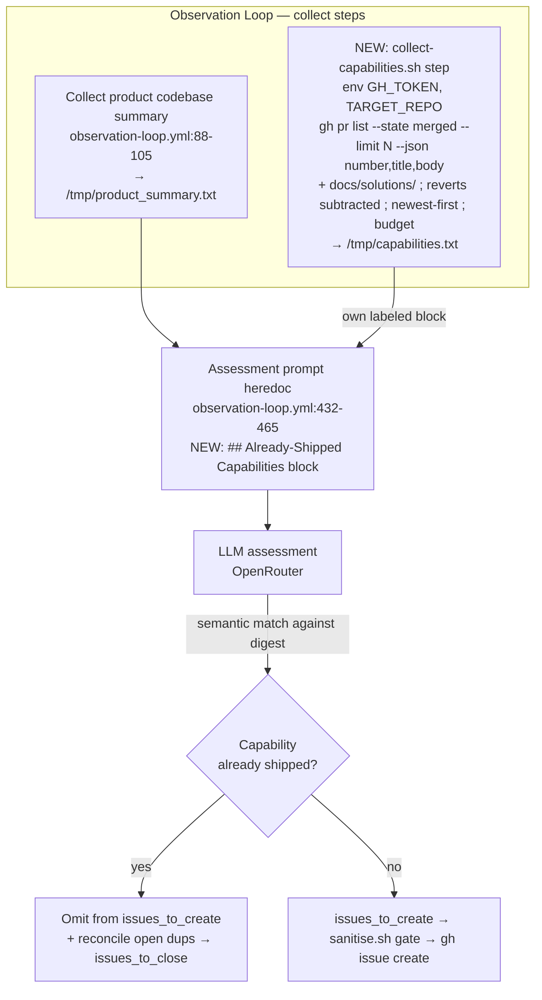

# feat: Capabilities Grounding to Stop Autobuilders Re-Proposing Shipped Work

## Summary

Add a `collect-capabilities.sh` collector that derives a digest of already-shipped capabilities from recent merged implementation PRs and `docs/solutions/` entries, and feed it into the Observation Loop's assessment grounding as its own labeled block. The loop then sees what already shipped and stops proposing duplicate work at the assessment source — no new dedup gate. Disposition the live OpenPanel redo (#767/#769) and record the mechanism as a `docs/solutions/` learning.

Throughout this plan, **digest** is the single name for the artifact the collector emits (`/tmp/capabilities.txt`); it realizes the brainstorm's "capabilities manifest" concept.

---

## Problem Frame

The Observation Loop filed wgmesh #767 "Add web analytics tracking (Plausible/PostHog)" while OpenPanel analytics had already shipped via merged PR #762 (`feat(landing): OpenPanel analytics`). The redo advanced into the pipeline and produced open PR #769, a Build agent re-implementing live analytics.

The loop already has two dedup mechanisms and both missed this. The issue-creation step does fuzzy keyword matching on issue **titles** only (`.github/workflows/observation-loop.yml:688-705`); "Add web analytics tracking" and "OpenPanel analytics" share no title keywords. The system prompt instructs the LLM to never duplicate features described in a **Product Codebase Summary** (`company/system-prompt.md:109-115`), but that summary is assembled only from the head of the seed repo's `CLAUDE.md` (`.github/workflows/observation-loop.yml:88-105`), where the OpenPanel deployment was never written. The capability shipped through a merged PR — invisible to issue-title dedup, absent from the grounding the LLM reads.

This is the next iteration of a documented failure class. `docs/solutions/logic-errors/observation-loop-creates-bogus-issues-for-existing-features.md` records the loop filing greenfield issues (#453/#458/#460) for already-shipped features; that fix created the Product Codebase Summary. The carry-forward rule from that RCA: *a single corrective signal cannot override compounding LLM priors, and metadata alone is insufficient — the LLM needs structural/capability awareness.* That lesson shapes two decisions below — the digest rides in its own labeled block (not buried in the CLAUDE.md-head summary), and it is bounded so it stays short enough to attend to rather than diluting into noise.

---

## Requirements

Traceability to origin (`see origin: docs/brainstorms/2026-06-19-capabilities-grounding-redo-prevention-requirements.md`). R1-R7 carry origin IDs; R8-R9 are plan-local, resolving origin Outstanding Questions deferred to planning.

**Capabilities collector**

- R1. A collector derives a digest of shipped capabilities from merged implementation PRs in the seed repo (bounded to a recency window, see R9) plus `docs/solutions/` entries (origin R1).
- R2. The digest is regenerated each loop run from current source data, holding no persisted cross-run state that could drift from what shipped (origin R2).
- R3. Each digest entry carries the capability's substance and its source PR number, enough for an LLM to recognize a semantic duplicate (origin R3).
- R8. Reverted or superseded capabilities are reconciled out of the digest — a `Revert "<title>"` PR subtracts the matching capability so the digest never asserts a removed capability is shipped (resolves origin Outstanding Question on revert/supersession).
- R9. The collector bounds its derivation to a recency window (a `--limit` and/or date scope), emits newest-first, and dedups, so growth stays bounded and budget truncation never drops the newest (highest-risk) capabilities.

**Loop grounding**

- R4. The digest feeds the assessment prompt as its own labeled block, adding no post-LLM reject stage (origin R4).
- R5. The grounding surfaces capabilities richly enough that the LLM links a differently-worded proposed issue to an existing capability (origin R5).

**Acceptance proof and cleanup**

- R6. A live control replay demonstrates the mechanism bites: with the digest present the loop does not re-produce the #767-shaped analytics issue, and with the digest empty/removed it does (origin R6).
- R7. The live #767 and its in-flight PR #769 are dispositioned as already-shipped, closed with a reason citing #762 (origin R7).

---

## Acceptance Examples

Carried from origin for in-plan traceability.

- AE1. Covers R6. Given OpenPanel analytics shipped via merged PR #762 and the digest generated for the loop run, when the loop assesses GTM state and considers proposing web analytics tracking, then it recognizes analytics as already shipped and does not add it to `issues_to_create`.
- AE2. Covers R3, R5. Given a digest entry derived from #762 and a candidate issue titled "Add web analytics tracking (Plausible/PostHog)," when the LLM evaluates the candidate against the digest, then it links the two despite zero shared title keywords and declines the candidate.
- AE3. Covers R7. Given #767 open and PR #769 in flight, when the cleanup runs, then #767 is closed with a reason citing #762.

---

## Key Technical Decisions

- **Read merged PRs deliberately, not issues.** The collector sources capabilities via `gh pr list --repo "$TARGET_REPO" --state merged --json number,title,body`, never `gh issue list`. The GitHub `/issues` API returns PRs too (`pull_request` key); a digest built from "issues" would ingest the loop's own spec PRs and runaway (`feedback_github_issues_api_includes_prs`). The #762 capability *is* a PR, so PR reading is both correct and required.

- **Bounded recency window, not full history.** Derivation is scoped with `gh pr list --state merged --limit N` over a recency window (last N merged PRs / last ~180 days), newest-first, deduped — not the full merged-PR history (the seed and template repos are already past PR #1800). This bounds API cost on the loop's critical path, keeps the digest short enough to attend to, and guarantees budget truncation drops oldest-first, never the freshest capabilities. The long-tail backstop for older capabilities remains the existing CLAUDE.md-head Product Codebase Summary; the digest targets the recent-ship redo class (#762 shipped one day before #767).

- **Stateless across runs.** The digest is rebuilt fresh every run from `gh pr list` + `docs/solutions/`; no cross-run cache or state file is read or written. The only output is the session-scoped `/tmp/capabilities.txt`, discarded with the job. The `scripts/goal-sprint/fingerprint.sh` state-file/skip precedent was considered and rejected: a persisted cache reintroduces the drift R2 forbids.

- **Reverts subtract capabilities.** Derivation from merged PRs is complete for additions but blind to removals — a revert is itself a merged PR. The collector detects `Revert "<title>"` PRs and subtracts the matching capability, so a shipped-then-reverted feature does not linger and suppress legitimate re-work (R8). Residual supersession that does not use a `Revert` title is documented as known residual risk in the RCA (U4).

- **Plain text to stdout, in its own grounding block.** The collector emits text (like `collect-memory.sh`), not JSON. It is surfaced as a dedicated `## Already-Shipped Capabilities` block in the assessment prompt — not appended into the CLAUDE.md-head Product Codebase Summary — so provenance is honest and the block is structurally distinct (the prior RCA's lesson: a signal buried among priors loses).

- **The LLM does the semantic match; no new keyword code.** "Add web analytics" vs "OpenPanel analytics shipped" is a semantic link, not lexical. The design surfaces capabilities richly and leaves the match to the model, rather than adding deterministic matching that would reproduce the title-matcher's miss. This is the plan's load-bearing bet (origin Key Decision), and R6's control replay is what makes the bet falsifiable rather than assumed.

- **Best-effort, but visibly degraded.** The collector step must never block the loop: failure falls to `|| true`. But an empty/failed run writes a sentinel line (e.g. `(capabilities digest unavailable this run)`) to `/tmp/capabilities.txt` — mirroring the product-summary step's `"No CLAUDE.md found"` (`observation-loop.yml:104`) — so a degraded run is visible *in the prompt*, not silently blank. A loud `::warning::` also goes to stderr (`feedback_telemetry_writes_must_be_best_effort`, `feedback_defensive_guard_must_announce`).

- **Offline real-path test via injected PR fixture.** The collector's two inputs are heterogeneous: `docs/solutions/` (filesystem, overridable with a `--solutions-dir` flag like `collect-memory.sh`'s `--memory-dir`) and `gh pr list` (network). For the network half, the collector reads PRs through a single seam that a `--pr-list-file <json>` flag overrides with a canned `gh pr list --json number,title,body`-shaped fixture, and the real path and the fixture feed the *same* parse function. The test thus exercises the real parser against fixture bytes without live `gh`, satisfying the real-path rule (`AGENTS.md:66-67`).

---

## High-Level Technical Design

The digest is a sibling of the existing Product Codebase Summary step, surfaced as its own block the system prompt binds the LLM to (U3). The match and reconciliation stay inside the existing LLM assessment — no new branch in the create/dedup bash.

---

## Implementation Units

### U1. `collect-capabilities.sh` collector + offline test

- **Goal:** Produce a plain-text capabilities digest from recent merged implementation PRs and `docs/solutions/` entries — newest-first, deduped, revert-reconciled, budget-bounded — with an offline real-path test.
- **Requirements:** R1, R2, R3, R8, R9.
- **Dependencies:** none.
- **Files:**
  - `company/scripts/collect-capabilities.sh` (new)
  - `company/scripts/test-collect-capabilities.sh` (new)
- **Approach:** Mirror `collect-github.sh`/`collect-memory.sh` conventions: `#!/usr/bin/env bash`, `set -euo pipefail`, header comment with an `Output:` line, repo root via `git rev-parse --show-toplevel`, graceful `|| true` fallbacks, warnings to stderr via `echo "::warning::..." >&2`. Resolve the target repo from env (`TARGET_REPO`/`GITHUB_REPOSITORY`), never a re-hardcoded literal. Fetch PRs once via `gh pr list --state merged --limit N --json number,title,body` (N a recency-window constant), routed through one overridable seam (`--pr-list-file` reads the same JSON shape from a fixture). Parse each PR: skip non-implementation types (chore/docs/ci); for `Revert "<title>"` PRs, subtract the capability whose title matches `<title>`; otherwise emit one line carrying the title stripped of its `type(scope):` prefix, the PR number, and a truncated first line of the body — e.g. `OpenPanel analytics — track Polar CTA clicks (PR #762)`. Add `docs/solutions/` entry capabilities (titles/frontmatter) via `--solutions-dir`-overridable read. Emit newest-first, dedup by capability, then apply a `--budget` cap that truncates **oldest-first by whole lines** (not `head -c` mid-line). On empty/failed derivation write the sentinel line. No state file read or written.
- **Patterns to follow:** `company/scripts/collect-memory.sh` (flag parsing `:24-34`, text-to-stdout, budget), `company/scripts/collect-github.sh` (gh usage, graceful degradation), `company/scripts/test-collect-memory.sh:1-192` (test structure: `mktemp -d` + `trap` cleanup, `assert_eq`/`assert_contains` helpers, fixture setup, numbered blocks, `=== Results ===` + `exit 1` on failure).
- **Execution note:** Start with the failing collector test against fixtures (a canned `--pr-list-file` JSON including a #762-shaped OpenPanel entry and a `Revert "...OpenPanel..."` entry, plus a `docs/solutions/` fixture), then implement to satisfy it.
- **Test scenarios:**
  - Covers AE2. Given a `--pr-list-file` fixture containing `feat(landing): OpenPanel analytics` (#762), the digest contains a line naming OpenPanel and citing PR #762.
  - The emitted line strips the conventional-commit prefix (`feat(landing): `) and includes the PR number; a fixed-format assertion pins the shape.
  - A merged PR of type chore/docs/ci is excluded (no capability line).
  - Given a `Revert "feat(landing): OpenPanel analytics"` PR in the fixture, the OpenPanel capability is absent from the digest (R8 bite).
  - Given a fixture set exceeding `--budget`, the newest capabilities survive and the oldest are dropped first, with no mid-line truncation (R9 bite).
  - Duplicate capabilities across two PRs collapse to one line (dedup).
  - With `gh`/`--pr-list-file` unavailable (simulated), the script exits 0, emits `::warning::` to stderr, and writes the sentinel line rather than an empty file.
  - No state file exists in the repo after a run (statelessness).
  - Bite check: reverting the capability-extraction line turns the OpenPanel assertion RED.
- **Verification:** `bash -n` clean; `bash company/scripts/test-collect-capabilities.sh` all pass; `shellcheck` clean if available; the #762 fixture yields a line citing #762; the revert fixture removes it.

### U2. Wire the collector into the Observation Loop grounding

- **Goal:** Run the collector each loop with the right auth, and surface its digest as a dedicated prompt block.
- **Requirements:** R2, R4, R5, R9.
- **Dependencies:** U1.
- **Files:**
  - `.github/workflows/observation-loop.yml` (modify)
- **Approach:** Add a step after `Collect product codebase summary` (`:88-105`) with an explicit `env:` block — `GH_TOKEN: ${{ secrets.PUSH_TOKEN }}` and `TARGET_REPO: atvirokodosprendimai/wgmesh` (matching `:672-674`) — running `bash company/scripts/collect-capabilities.sh > /tmp/capabilities.txt || true`. Without `GH_TOKEN` the step would silently fall to the empty path every run and the feature would be a no-op (the wired-but-off-execution-path trap), so the env block is required, not optional. In the assessment prompt heredoc (`:432-465`), add a new `## Already-Shipped Capabilities` block fed by `$(cat /tmp/capabilities.txt)`, adjacent to the Product Codebase Summary block (`~439-442`), with header text directing the LLM to treat listed capabilities as already shipped. Do not append into `/tmp/product_summary.txt` (keeps CLAUDE.md provenance honest) and do not touch the create/dedup step (`:671-718`).
- **Patterns to follow:** adjacent collector steps writing `/tmp/infra.json` (`:83`), `/tmp/shared_memory.txt` (`:111`); the create-step `env:` block (`:672-674`); the product-summary heredoc block (`:439-442`).
- **Test scenarios:**
  - `bash -n` / `actionlint` (if available) clean on the modified workflow.
  - Test expectation: workflow-step behavior is exercised by U1's collector test and U4's live control replay; the best-effort + sentinel fallback is asserted by U1's gh-unavailable scenario. No separate YAML unit harness.
- **Verification:** A dry-run assembled prompt contains the `## Already-Shipped Capabilities` block populated from the digest; a forced collector failure leaves the loop running with the sentinel line visible in the block and the rest of the prompt intact.

### U3. Assert the digest as ground truth in the system prompt

- **Goal:** Name the `## Already-Shipped Capabilities` block in the no-duplicate rule so the LLM treats it as authoritative shipped-state, including during the mandatory reconciliation pass.
- **Requirements:** R5.
- **Dependencies:** U2.
- **Files:**
  - `company/system-prompt.md` (modify)
- **Approach:** Extend the "Critical: Do not duplicate existing work" rule (`:109-115`) with one line stating that an `## Already-Shipped Capabilities` block (derived from recent merged PRs) accompanies the Product Codebase Summary and must be checked before adding to `issues_to_create`. Point the mandatory reconciliation pass (`:136-148`) at the same block. No output-schema change — the loop has only `issues_to_create`/`issues_to_close` (no relabel), so a redundant in-flight issue is retired via `issues_to_close`. The block name here must match the block name chosen in U2 verbatim.
- **Patterns to follow:** existing rule prose at `system-prompt.md:109-148`.
- **Test scenarios:** Test expectation: none — prose grounding change, no behavioral code. Verified through U4's live control replay.
- **Verification:** The rule text references the `## Already-Shipped Capabilities` block by the same name U2 uses; reconciliation language points at it.

### U4. Control replay, disposition #767/#769, and record the learning

- **Goal:** Falsifiably verify R6, close the live redo, and document the mechanism plus residual risks.
- **Requirements:** R6, R7.
- **Dependencies:** U2, U3.
- **Files:**
  - `docs/solutions/logic-errors/capabilities-digest-grounds-loop-against-shipped-work.md` (new)
- **Approach:** Run a control replay of the assessment against the #767 conditions: once with the digest populated (expect: analytics not in `issues_to_create` — AE1) and once with the digest replaced by the sentinel/empty (expect: analytics *is* proposed). Recording both halves is what distinguishes "digest works" from "loop happened not to re-file." Close wgmesh #767 and PR #769 with a reason citing #762 (operator-run `gh` against the seed repo; the loop's reconciliation would also close #767 once the digest lands, but disposition explicitly now). Author a `docs/solutions/` RCA following the frontmatter schema of `observation-loop-creates-bogus-issues-for-existing-features.md` (`title, category, date, tags, related_issues, severity, component`), generalizing the Product Codebase Summary into the capabilities digest, recording the load-bearing LLM-semantic-match bet, the control-replay result, and the known residual risks (non-`Revert`-titled supersession; capabilities older than the recency window relying on the CLAUDE.md backstop).
- **Patterns to follow:** `docs/solutions/logic-errors/observation-loop-creates-bogus-issues-for-existing-features.md` (frontmatter + RCA shape).
- **Test scenarios:**
  - Covers AE1, AE3. The control replay records both arms (digest-present → not proposed; digest-empty → proposed); #767 and #769 are closed citing #762.
  - Test expectation: no unit test — live-system verification and documentation. R6's bite is the control replay's two arms, not a unit assertion.
- **Verification:** The replay shows the two-arm result; #767/#769 closed with reasons citing #762; the RCA exists with correct frontmatter, links the related issues, and names the residual risks.

---

## Alternatives Considered

- **Candidate-relevant scoping (post-draft check) instead of static grounding.** After the LLM drafts `issues_to_create`, check each draft title against the digest scoped to that candidate, rather than surfacing the whole digest up front. This bounds what the model attends to per decision and is robust to digest growth. Rejected for now: it adds a second LLM pass and edges toward the post-LLM stage the brainstorm explicitly ruled out; the bounded recency window plus a dedicated block addresses the dilution concern more simply. Revisit if the recency-windowed digest still dilutes at scale.
- **Persisted cache with fingerprint skip (`fingerprint.sh` pattern).** Rejected: reintroduces cross-run state that R2 forbids; per-run derivation is bounded by the recency window, so the cost it would save is already capped.

---

## Scope Boundaries

### Outside this change

- No new post-LLM dedup/reject gate — the fix lives in grounding (origin Key Decision).
- The existing fuzzy title matcher (`observation-loop.yml:688-705`) is left untouched; the digest plus LLM semantic match supersedes it for this class.
- Live probing of deployed surfaces and a human-maintained `capabilities.json` are both rejected (origin Scope Boundaries).

### Deferred to Follow-Up Work

- Capabilities older than the recency window (R9) rely on the existing CLAUDE.md-head Product Codebase Summary; widening the window or adding a long-tail capability index is deferred.
- Supersession that does not use a `Revert "<title>"` PR title (e.g. a silent rewrite) is not reconciled; the residual suppression risk is documented in the RCA (U4), and closing it is deferred.
- Cross-repo capability indexing (secondary repos); seed repo only for now.
- A Langfuse eval scoring whether the loop re-proposed already-shipped work across many runs — the durable measurement instrument, beyond U4's one-shot control replay. Any future cache must stay session-scoped and never be committed to this public repo.

---

## Risks & Dependencies

- **LLM-semantic-match bet underperforms** — the model may still miss a differently-worded duplicate. Mitigation: surface each capability with its source PR richly in a dedicated block; the R6 control replay (U4) falsifiably checks the bite; the deferred Langfuse eval is the durable instrument if one-shot proof proves thin.
- **Digest dilution at scale** — a long digest buried among priors loses (the prior RCA's lesson). Mitigation: recency window (R9) keeps it short, dedicated block keeps it structurally distinct; the candidate-scoping alternative is the fallback if dilution persists.
- **Revert blindness** — derivation is complete for additions, blind to removals. Mitigation: `Revert "<title>"` reconciliation (R8); non-`Revert` supersession documented as residual (U4).
- **Critical-path cost** — `gh pr list` on every tick. Mitigation: `--limit N` recency window bounds it to a single bounded call with no per-PR fan-out (`--json` returns bodies in the one call); step is best-effort so a slow run cannot hang the loop (`feedback_telemetry_writes_must_be_best_effort`).
- **Best-effort failure masking** — `|| true` could hide a broken collector. Mitigation: sentinel line in the prompt plus a loud `::warning::` (U1) so degradation is visible both in the prompt and the logs.
- **Public-repo safety** — the digest is internal prompt context (not committed), built from already-public merged-PR titles. Any path that emits derived content into issue bodies stays behind the existing `sanitise.sh` gate (`observation-loop.yml:708-712`); any future cache must stay session-scoped and PII-free per `CLAUDE.md`.

---

## Sources & Research

- `.github/workflows/observation-loop.yml:88-105` — Product Codebase Summary build (sink `/tmp/product_summary.txt`).
- `.github/workflows/observation-loop.yml:432-465` — assessment prompt heredoc; summary block `~439-442`, consumed at `:442`.
- `.github/workflows/observation-loop.yml:671-718` — create-issues step + fuzzy title dedup (`:688-705`); `TARGET_REPO`/`GH_TOKEN` env `:672-674`; sanitise gate `:708-712`.
- `company/system-prompt.md:109-115` — no-duplicate rule; `:136-148` — mandatory reconciliation.
- `company/scripts/collect-memory.sh:24-34` — flag parsing; `:27/:49` — `head -c "$BUDGET"` byte-truncation (the precedent R9 deliberately does NOT inherit); `collect-github.sh` — gh/curl usage and graceful degradation; `company/scripts/test-collect-memory.sh:1-192` — test template with `--memory-dir` override.
- `scripts/goal-sprint/fingerprint.sh:1-86` — derive-and-compare/state-file precedent (considered, not used).
- `AGENTS.md:50-67` — bash test/lint conventions; input-producing scripts must test the real path.
- `docs/solutions/logic-errors/observation-loop-creates-bogus-issues-for-existing-features.md` — the on-point prior RCA the digest generalizes.
- `docs/solutions/logic-errors/observation-loop-board-hygiene-gaps.md` — fuzzy-dedup and merged-PR-invisibility precedent.
- wgmesh #762 (merged, OpenPanel analytics), #767 (open, redundant), #769 (open, redo impl).
