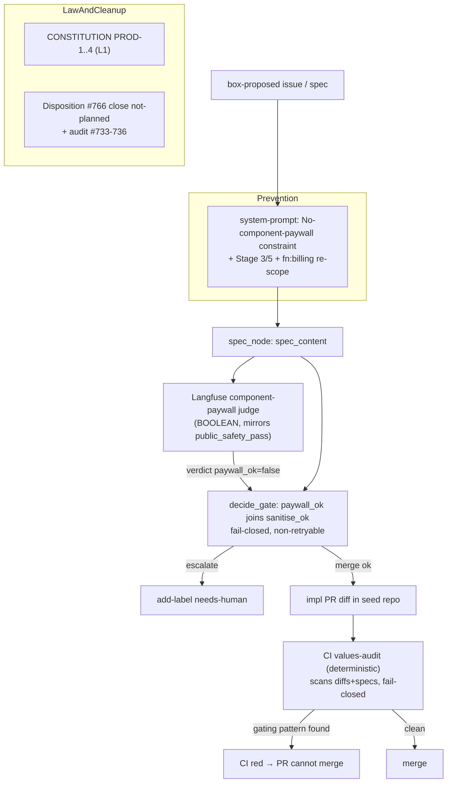

# feat: No-component-paywall constitution + live enforcement

## Summary

Encode a no-component-paywall product value in `CONSTITUTION.md` and wire fail-closed
enforcement so the autonomous loop can never ship another component paywall (it generated
`atvirokodosprendimai/wgmesh#766` — a trial kill-switch in the AGPL mesh daemon). Every
product component stays AGPL/full-functionality with no license check, trial bomb,
kill-switch, or phone-home; monetization attaches only to the cloudroof.eu managed-service
layer. Enforcement is defense-in-depth across both surfaces: a semantic Langfuse judge wired
into the live LangGraph merge gate (catches paywall intent in specs/impls inside the
pipeline) and a deterministic CI values-audit scanning seed-repo PR diffs/specs (the
un-stubbable catch). Then disposition the live offenders.

---

## Problem Frame

The loop's goal is paid customers — `company/system-prompt.md` Stage 3 exits "billing
integration live, customer can sign up and get invoiced" (`:88`), Stage 5 is "First invoice
paid" (`:95`), `fn:billing` is a first-class function (`:247`). Nothing constrains *how*
revenue is earned: `CONSTITUTION.md` has 27 rules for security/architecture/quality and zero
for product values; `company/scripts/sanitise.sh` gates secrets/PII only; the
`open_source_default` Langfuse judge scores which tools the box *adopts*, not whether the
product it *builds* stays open, and is advisory (numeric), not a gate.

Given an unconstrained "get paid customers", the loop took the shortest path to a first
invoice: gate the product. #766 specifies an `expire-trial` API and **mesh daemons that stop
routing when the account expires** — a license kill-switch in AGPL software a user runs on
their own machine. No human authored that intent; no rule vetoed it. Until a fail-closed
veto exists on the real execution path, the loop will keep generating this class of work.

---

## Key Technical Decisions

- **New `## Product Values` domain with `PROD-` prefix, major version bump.** Mirrors the
  existing domain pattern (`SEC`/`ARCH`/`QUAL`/`TEST`). Adding L1 rules forces `CONSTITUTION.md`
  2.0.0 → 3.0.0 per its own versioning rule, plus a Version History row and header update.
  The Amendment Process forbids aspirational rules ("document what's practiced") — so the
  rules cite #766 as the violation evidence and reference the gate shipped in this plan as the
  practiced enforcement (see origin: `docs/brainstorms/2026-06-19-product-values-no-paywall-requirements.md`).

- **Judge mirrors `public_safety_pass` (fail-closed BOOLEAN), not `open_source_default`
  (advisory NUMERIC).** A paywall is a hard constitutional violation, not a preference. The
  judge uses `_BOOLEAN`, `variables: ["output"]`, `_JUDGE_MODEL`, scoring `spec_content`. The
  deny-list reuses the five CONCEPTS.md vectors verbatim — payment, license key, account
  state, trial/time limit, remote authorization — so the rubric matches the constitution
  wording the corpus already recognizes.

- **The verdict must feed `decide_gate`, not just score a dashboard.** Today Langfuse judges
  only emit scores; no verdict is an input to `gate.py` `decide_gate`. A score nobody gates on
  is theater (the project's recurring "framework wired but off the execution path" / "advisory
  ≠ gate" failure). A `paywall_ok` boolean joins `sanitise_ok` as a fail-closed,
  **non-retryable** gate input → `escalate` → `needs-human`. `eval_gate.py` is the candidate
  bridge to confirm at implementation.

- **Deterministic CI values-audit is the primary, un-stubbable catch.** Built from
  `pii-policy-check.yml` (PR-gate, fail-closed, no path filter, head-SHA checkout, SHAs via
  `env:`, never echoes the matched value) + `strategy-audit.yml` (cross-repo read via
  app-token + `PUSH_TOKEN`, `TARGET_REPO` per ARCH-5). It scans seed-repo PR diffs and spec
  files for component-gating patterns and fails closed. The semantic judge catches intent the
  regex misses; the regex catches code the judge never sees. Both fail-closed = genuine
  defense-in-depth across the spec-intent and code-diff surfaces.

- **#766 disposition = close `not planned` + constitutional-violation comment.** Cleanest
  terminal state; the close-guard chain in `observation.py` refuses to auto-close anything
  carrying `needs-human`, so relabeling would freeze it in the human lane indefinitely. Close
  with `state_reason="not planned"` (the existing primitive; there is no `out-of-scope` label).

- **System-prompt clause pairs with the code gate, never stands alone.** A prompt instruction
  alone does not guarantee compliance (the goose-weak-model lesson). The `### No component
  paywall` constraint subsection is prevention; the judge + CI gate are enforcement. Both ship.

---

## High-Level Technical Design

Enforcement sits at three points along the issue→merge path. Prevention (system-prompt)
discourages emission; the two fail-closed gates stop anything that slips through.

---

## Requirements Traceability

Origin requirements R1–R12 map to units: R1–R5 → U1 (constitution); R6–R7 boundary
definition → U1 prose + U2 clause; R8 → U2 (system-prompt); R9 → U3 (judge) + U4 (gate
wiring); R10 → U5 (CI values-audit); R11 → U6 (#766); R12 → U6 (siblings). Acceptance
examples: AE1/AE2 → U3+U4; AE3 → U2; AE4 → U5.

---

## Implementation Units

Three phases. Phase A (U1–U2) is documentation + prompt — no live behavior change. Phase B
(U3–U5) is the fail-closed enforcement. Phase C (U6) cleans up live offenders and lands after
the gates exist, so dispositioned issues are judged against the shipped rule.

### U1. Constitution: Product Values domain

**Goal:** Add an org-binding `## Product Values` domain with L1 rules barring component
paywalls; bump to 3.0.0.

**Requirements:** R1, R2, R3, R4, R5, R6, R7.

**Dependencies:** none.

**Files:** `CONSTITUTION.md`.

**Approach:** New `## Product Values` section as a peer of `## Security`, placed after the
Andon foundational principle. Rules `PROD-1` (AGPL + full functionality), `PROD-2` (no
component gating on the five vectors), `PROD-3` (monetize managed-service layer only),
`PROD-4` (component vs managed-service-layer boundary definition, with #766 mesh-pause as the
worked counter-example). Each rule uses the established fenced-`yaml` block: `level: L1` first,
then `check:`/`scope:`/`pattern:` (escaped regex where a machine-check exists — e.g. the CI
audit from U5 is the `check` for PROD-2), `message:` last; followed by an evidence-prose
paragraph citing `atvirokodosprendimai/wgmesh#766` and the U3/U5 gates as practiced
enforcement. Update header `> **Version:**`/`> **Last Updated:**` to `3.0.0` / `2026-06-19`;
add a Version History row. Reuse CONCEPTS.md "No component paywall" + "Component vs
managed-service layer" wording verbatim.

**Patterns to follow:** `CONSTITUTION.md` SEC-2 rule block (the canonical shape); Amendment
Process + Version History table (`:420`–`:435`); the "no aspirational rules — document what's
practiced" constraint.

**Test scenarios:** Test expectation: none -- documentation change, no executable behavior.
Verification is structural (see below).

**Verification:** All four PROD rules present with well-formed yaml blocks; version reads
3.0.0 in both the header and a new history row dated 2026-06-19; rule wording matches the
CONCEPTS.md five-vector phrasing; #766 cited as evidence.

### U2. System-prompt: no-paywall constraint + funnel/label re-scope

**Goal:** Instruct the loop to monetize only the managed-service layer and never emit a
component-gating spec.

**Requirements:** R6, R7, R8 (advances AE3).

**Dependencies:** U1 (constraint references the constitutional rule).

**Files:** `company/system-prompt.md`.

**Approach:** Add a `### No component paywall` subsection under `## Your constraints`, a
structural peer of `### Public/private boundary` — use its `**NEVER** do X / you CAN do Y`
shape: NEVER gate a shipped component on the five vectors; you CAN bill the managed-service
layer (cloudroof.eu hosting/ingress/support/SLA). Re-scope the Stage 3 exit bullet (`:88`) and
Stage 5 exit bullet (`:95`) so "billing"/"payment" reads "managed-service billing", and tighten
the `fn:billing`/`fn:gtm` label descriptions (`:247`) to name the managed layer as the only
paid surface. Keep the Polar revenue-snapshot line (`:271`) consistent with the re-scoped Stage
3. Align with the existing JSON output schema rather than bolting on a free-floating
instruction.

**Patterns to follow:** `### Public/private boundary` (`company/system-prompt.md:51`) — the
existing hard NEVER/CAN boundary template; `### Frugality is survival` (`:34`); the funnel
stage bullet shape.

**Test scenarios:** Test expectation: none -- prompt-content change. Behavioral enforcement is
proven by U3/U4 (prompt alone is non-binding by design — see KTD).

**Verification:** The constraint subsection states the five-vector prohibition and names the
managed layer as the only paid surface; Stage 3/5 exits and `fn:billing`/`fn:gtm` no longer
read as unconstrained billing; revenue-snapshot line stays consistent.

### U3. Langfuse component-paywall judge

**Goal:** Register a fail-closed BOOLEAN judge that scores a box-proposed spec/issue for
component-paywall intent.

**Requirements:** R9 (advances AE2).

**Dependencies:** none (registration is independent; U4 consumes its verdict).

**Files:** `pipeline/evals/setup_langfuse_evaluators.py`,
`pipeline/evals/test_setup_langfuse_evaluators.py` (extend or create).

**Approach:** Append one evaluator dict to `EVALUATORS` mirroring `public_safety_pass`:
`outputDefinition: _BOOLEAN`, `variables: ["output"]`, `modelConfig: _JUDGE_MODEL`, prompt
embedding `{{output}}` and the five CONCEPTS.md deny-list vectors, plus the rubric that a
trial ending may stop the *managed service* but a shipped component must never gate — pass (1)
only if no component gating present. Append one rule to `RULES` mirroring
`rule_public_safety_pass`: `target: "observation"`, `sampling: 1.0`, `filter: _GEN_FILTER`,
`mapping: [{variable: output, source: output}]`. Run `--probe` against the live UNSTABLE
schema before finalizing the payload shape.

**Execution note:** Add the must-fail fixture test-first — feed #766's body as `{{output}}`
and assert the judge rubric classifies it as a paywall (0).

**Patterns to follow:** `public_safety_pass` evaluator + `rule_public_safety_pass`
(`pipeline/evals/setup_langfuse_evaluators.py`); `_BOOLEAN`/`_JUDGE_MODEL`/`_GEN_FILTER`
constants; the existing 409-idempotent `apply()` (treat `name_conflict`/already-exists as
success).

**Test scenarios:**
- Covers AE2. #766 body as judge input → rubric expects a paywall verdict (fail/0).
- A managed-layer billing spec (cloudroof signup/invoice, no component gating) → pass/1.
- A self-host full-functionality spec → pass/1.
- Registration idempotency: run `apply` twice against a stub/fake Langfuse endpoint → second
  run exits 0 (409 `name_conflict` treated as success), not red.
- `--dry-run` prints the new evaluator + rule payloads without writing.
- `--probe` path returns/handles the live schema dump without raising.
- Use `pytest.importorskip` for the langfuse optional extra so CI without it doesn't fail.

**Verification:** The new judge + rule appear in `--dry-run` output; the run-apply-twice test
is green on the second run; the #766 fixture test bites.

### U4. Wire paywall verdict into the merge gate

**Goal:** Make a paywall verdict a fail-closed, non-retryable input to `decide_gate`, routing
to `needs-human`.

**Requirements:** R9 (advances AE1, AE2).

**Dependencies:** U3 (verdict source).

**Files:** `pipeline/wgmesh_pipeline/graph/nodes/gate.py`,
`pipeline/evals/eval_gate.py` (confirm/extend the eval→gate bridge),
`pipeline/wgmesh_pipeline/graph/nodes/spec.py` (verdict produced from `spec_content`),
`pipeline/wgmesh_pipeline/graph/nodes/test_gate.py` (extend).

**Approach:** Add a `paywall_ok` boolean to the gate inputs, set from the judge verdict over
`spec_content` (via `eval_gate.py` if that is the existing bridge; confirm at implementation).
In `decide_gate`, when `paywall_ok` is false append a `"component paywall"` reason and force
`decision="escalate"` — mirror `sanitise_ok` exactly, and keep it **out** of
`retryable_reasons` so it is never climbed up the model ladder (a values violation goes
straight to `needs-human`, like sanitise). The escalate branch already calls
`client.add_label(issue.number, "needs-human")` in `apply_gate_side_effects`. Announce the
rejection loudly (annotation/log), never swallow it.

**Execution note:** Characterization-first — drive the test through the real
`gate_node`/`apply_gate_side_effects` path the poller uses (not a convenient unit shim), feed
the #766-derived spec as the golden must-fail fixture, and prove the test bites by reverting
the `paywall_ok` branch and watching it go green-when-it-should-be-red.

**Patterns to follow:** `sanitise_ok` handling in `decide_gate` (`gate.py:22`–`:53`); the
non-retryable-reason convention (`sanitise failed` excluded from `retryable_reasons`); the
`reviewed` branch in `poller.py` that calls `gate_node(apply_side_effects=False)` then
`apply_gate_side_effects`; the box-CI-crash-as-red fail-closed posture.

**Test scenarios:**
- Covers AE2. Spec carrying #766-shape component gating → `decide_gate` returns `escalate`
  with a `"component paywall"` reason; side-effects add `needs-human`.
- Covers AE1. Managed-layer trial-expiry spec (stops hosted service, no daemon kill-switch) →
  `paywall_ok` true → not escalated on the paywall reason.
- `paywall_ok` false is NOT in `retryable_reasons` → no model-ladder retry; straight to
  `needs-human`.
- Verdict-source failure / missing judge result → fail-closed (treat as paywall present /
  escalate), never silently pass.
- Test bites: revert the `paywall_ok` branch → the #766 fixture test fails (proves the gate is
  load-bearing, not hollow-green).
- Gate fires at the real poller entrypoint, not only a direct `decide_gate` unit call.

**Verification:** #766 fixture routes to `needs-human` through the production gate path; the
managed-layer spec passes; reverting the branch turns the fixture test red.

### U5. CI values-audit workflow (deterministic, cross-repo)

**Goal:** A fail-closed CI gate that scans seed-repo PR diffs and spec files for
component-gating patterns and blocks merge.

**Requirements:** R10 (advances AE4).

**Dependencies:** none (deterministic; complements U3/U4).

**Files:** `.github/workflows/values-audit.yml` (new),
`company/scripts/values-audit.sh` (new — extract the scan per ARCH-2),
`company/scripts/test-values-audit.sh` (new).

**Approach:** Model the PR-gate on `pii-policy-check.yml`: `on: pull_request` with no path
filter (so the required check never hangs "expected"), `permissions: contents: read`, checkout
the head SHA with `fetch-depth: 0`, SHAs through `env:` (SEC-3), iterate
`git rev-list BASE..HEAD`, grep the diff + changed spec files for component-gating patterns
(license check, `trial_expired`/expire-trial, mesh/daemon pause-on-expiry, kill-switch,
pay-to-unlock — the five-vector deny-list), set a `fail` flag + `::error::` annotation, `exit 1`
if any hit; never echo the matched value (public-repo posture). For the scheduled seed-repo
sweep, model the cross-repo read on `strategy-audit.yml`: `TARGET_REPO` input defaulting to
`atvirokodosprendimai/wgmesh`, app-token + `PUSH_TOKEN`, `gh pr list --repo "$TARGET_REPO"`.
Note CI gotchas: `secrets` context unavailable in `if:`; `gh --jq` has no `--arg` passthrough
(embed the value, fail loud); pin action versions.

**Execution note:** Add the #766 diff as a golden must-fail fixture in
`test-values-audit.sh`; prove it bites by confirming a clean managed-layer diff passes and the
#766 diff fails.

**Patterns to follow:** `.github/workflows/pii-policy-check.yml` (fail-closed PR-gate, head-SHA,
env SHAs, no-echo); `.github/workflows/strategy-audit.yml` (cross-repo `TARGET_REPO`,
app-token/`PUSH_TOKEN`, `needs-human` label, sanitise gate); `company/scripts/` strict-mode +
`test-*.sh` conventions (AGENTS.md: every input-producing script needs a real-path test);
QUAL-1 (`set -euo pipefail`).

**Test scenarios:**
- Covers AE4. A diff adding payment/license/account-state gating to a component → script sets
  `fail`, exits 1.
- A clean managed-layer billing diff (cloudroof signup/invoice) → exits 0.
- A PR touching no relevant paths → exits 0 cheaply (no false "expected" hang).
- #766 diff fixture → fails; reverting the deny-list pattern → fixture passes (proves it bites).
- Matched value is never echoed to logs (public-repo).
- `bash -n` + the `test-values-audit.sh` real-path run pass; shellcheck clean.

**Verification:** Workflow runs on every PR and exits 0 when clean; the #766 fixture fails the
script; matched content is not leaked to logs.

### U6. Disposition #766 and audit siblings

**Goal:** Terminate the live offender and check its siblings for the same defect.

**Requirements:** R11, R12.

**Dependencies:** U1 (the rule the disposition cites), U3/U4/U5 (so re-emission is now gated).

**Files:** none in this repo (operates on `atvirokodosprendimai/wgmesh` via `gh`); record the
audit outcome in the PR body / a short note.

**Approach:** Close `atvirokodosprendimai/wgmesh#766` with `state_reason="not planned"` and a
comment citing PROD-2 and pointing trial logic to the managed layer (the
`issues_to_close`→`close_issue` primitive, or a direct `gh issue close --reason "not planned"`).
Do not relabel to `needs-human` (the close-guard refuses to auto-close `needs-human` items —
it would freeze, not resolve). Audit #733, #734, #735, #736 (the GTM/pricing siblings) for the
same component-gating premise; for each, confirm terminal state by direct per-item read (label
is state; absence ≠ closed) and either close or rewrite the monetization into the managed
layer. Manual/one-time observation-loop pass — no new automation.

**Test scenarios:** Test expectation: none -- operational disposition, not code. Verify by
direct issue read.

**Verification:** #766 shows closed `not planned` with the constitutional-violation comment;
each of #733–#736 has a confirmed disposition (closed or rewritten) recorded, confirmed by
direct read rather than list-absence.

---

## Scope Boundaries

### Outside this product's identity (carried from origin)

- Open-core / feature-tiered editions of any component; no "pro" build.
- Any phone-home, telemetry-gated, or remote-disable capability in shipped software.

### Deferred for later (carried from origin)

- cloudroof.eu pricing-model and tier design (cost, trial length, plan shapes) — a separate
  GTM brainstorm. This plan fixes *where* monetization may attach, not *what* it charges.
- Open-sourcing cloudroof.eu's own server-side orchestration. AGPL on wgmesh already forces
  sharing wgmesh modifications.
- Machine-checkable regex inside `CONSTITUTION.md` rule blocks beyond the U5 audit patterns.

### Deferred to Follow-Up Work (plan-local)

- A general `CONSTITUTION.md`-enforcement CI harness (machine-checking all SEC/ARCH/QUAL/TEST
  rules) — U5 builds only the values-audit; the broader constitution-linter is out of scope.
- Capturing the values-audit gate as a `docs/solutions/design-decisions/` entry via
  `/ce-compound` after it lands.

---

## Risks & Dependencies

- **Hollow-green / off-path gate (high, recurring).** A judge that only scores, or a gate
  guarded by a cooperative stub, ships green tests over a live violation. Mitigation: U4/U5
  drive tests through the real entrypoint and prove they bite by reverting against the #766
  fixture (Execution notes).
- **Live merge-path change (U4).** `gate.py` is on the production merge path; a bug could
  wrongly escalate or wrongly pass. Mitigation: `paywall_ok` mirrors the proven `sanitise_ok`
  shape exactly; fail-closed on verdict-source failure; characterization-first.
- **Langfuse verdict→gate bridge: RESOLVED.** Investigation found `eval_gate.py` is an offline
  eval harness, not a runtime bridge — `decide_gate` has no synchronous Langfuse call and the U3
  judge scores traces observationally. So R9's runtime block is realized **deterministically**
  (U4: `detect_component_paywall` → `paywall_ok` gate input, fail-closed, non-retryable), with
  the U3 Langfuse judge as the semantic/observability backstop. A synchronous semantic-judge
  hard-gate is not architecturally available; defense-in-depth is deterministic-gate (U4) +
  deterministic-CI (U5) + observational-judge (U3).
- **Re-apply 409 (medium, already-bitten).** Registration must treat `name_conflict` as
  success; U3 includes the run-twice-green test. The existing `apply()` already handles this —
  U3 must not regress it.
- **Telemetry write best-effort, verdict hard.** The Langfuse score *write* must be
  non-blocking (`continue-on-error`/timeout); the paywall *verdict* is a hard gate. Don't
  conflate the two.
- **CI authoring gotchas.** `secrets` unavailable in `if:`; `gh --jq` no `--arg`; pin action
  versions; `--admin` merge of the gate PR still requires confirming its own CI is green.

---

## Sources & Research

- Origin: `docs/brainstorms/2026-06-19-product-values-no-paywall-requirements.md`.
- `atvirokodosprendimai/wgmesh#766` — the violation and golden must-fail fixture.
- `CONSTITUTION.md` (rule-block shape, Amendment/Version History, versioning rule).
- `company/system-prompt.md:51,88,95,247,271` (constraint template, funnel exits, labels,
  revenue snapshot).
- `pipeline/evals/setup_langfuse_evaluators.py` (`public_safety_pass` vs `open_source_default`,
  `_BOOLEAN`/`_NUMERIC`, `_GEN_FILTER`, `apply()` 409-idempotency); `register-langfuse-evaluators.yml`.
- `pipeline/wgmesh_pipeline/graph/nodes/gate.py` (`decide_gate`, `apply_gate_side_effects`,
  retryable-reasons); `poller.py` (`reviewed` branch); `spec.py` (`spec_content`);
  `eval_gate.py` (candidate bridge); `observation.py` (`vet_issue_close` guards);
  `control_loop/executor.py` (`_h_close_issue`).
- `.github/workflows/pii-policy-check.yml`, `strategy-audit.yml`; `.github/labels.yml`
  (`wont-do`/`needs-human`, no `out-of-scope`).
- `CONCEPTS.md` — "No component paywall", "Component vs managed-service layer" (verbatim
  deny-list vectors).
- Institutional learnings: fail-closed-not-advisory; framework-wired-but-off-path;
  hollow-green / test-fakes-override-gate; create-endpoint-409; llm-emit-must-gate-on-sanitise;
  cross-repo TARGET_REPO; confirm-CI-before-admin-merge; telemetry-best-effort;
  absence-not-closed-in-paginated-list.
