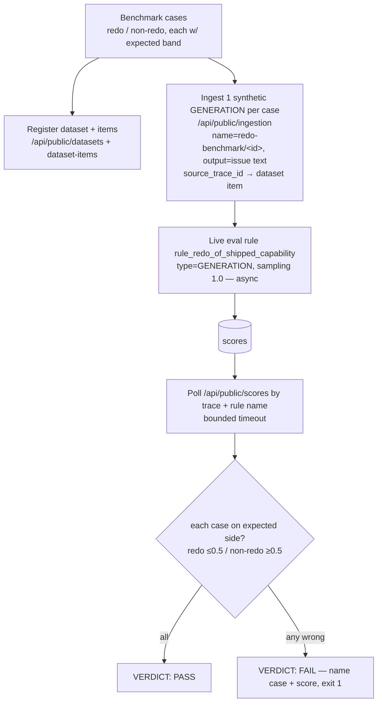

# feat: Deterministic Dataset Benchmark for the redo_of_shipped_capability Evaluator

## Summary

Build an on-demand benchmark that feeds known redo / non-redo issue cases to the deployed `redo_of_shipped_capability` Langfuse evaluator and asserts redo cases score low and non-redo cases score high. It registers the cases as a reusable Langfuse dataset, ingests one synthetic GENERATION observation per case so the live evaluation rule scores it, polls for the scores, and reports PASS/FAIL — replacing "wait hours for a sporadic box generation" with a deterministic correctness check. Stdlib-only, wired as a `mode=benchmark` workflow.

---

## Problem Frame

The redo evaluator is registered and live, but confirming it actually scores — and scores *correctly* — depends on the box convergence engine emitting a post-registration GENERATION observation, which is event-driven and sparse (4 verify checks over ~2h, box idle, redo score still 0). The `--verify` mode confirms *firing readiness* (pipeline alive, filter correct) but cannot confirm *judgment quality* and cannot fire on demand.

A deterministic benchmark closes both gaps: it pushes known inputs through the **deployed** evaluator (not an ad-hoc judge), so it verifies the rubric distinguishes a redo ("Add web analytics tracking" when OpenPanel ships) from legitimate build-on-existing work ("dashboard over OpenPanel data") — the exact distinction a keyword judge got wrong in the earlier control replay — and it runs in seconds, not hours.

---

## Key Technical Decisions

- **Synthetic GENERATION ingestion + live rule scoring, over the SDK experiment path.** The benchmark POSTs synthetic GENERATION observations (output = the case's issue text) via the stdlib public ingestion API; the live evaluation rule (`target: observation`, filter `type=GENERATION`, sampling 1.0) then scores them — the same path that produced the 91 sibling scores, so confidence it fires is high. Rejected the Langfuse Dataset *experiment* runner: it needs the `langfuse` SDK (the script is deliberately stdlib-only) and it is unconfirmed whether project-level eval rules auto-attach to experiment-run observations. The synthetic-ingestion path tests the exact deployed rule with no new dependency.

- **Register a real Langfuse dataset + items anyway.** The cases are also registered as a `redo-eval-benchmark` dataset with `expected_output` per item, via the stdlib public datasets API (`/api/public/datasets`, `/api/public/dataset-items`) — no SDK needed for creation. This gives the reusable, UI-visible benchmark the Datasets docs describe, and each synthetic generation links back to its dataset item (`source_trace_id`). The dataset is the source of truth for cases; the ingestion is how they reach the live evaluator.

- **Tag synthetic observations to isolate them from real box traces.** Each ingested generation carries a distinct name (`redo-benchmark/<case-id>`) and metadata (`{"benchmark": "redo-eval"}`) so the synthetic traces are filterable and never confused with real convergence-engine generations in analytics. Accepted side-effect: the benchmark adds synthetic entries to the project's trace stream (identifiable, not deletable via this API).

- **Match scores by the rule name, with async polling.** Scores are read from `/api/public/scores` filtered to the synthetic traces and the `rule_redo_of_shipped_capability` name (live Langfuse names scores after the rule, not the evaluator — the correction from the verify work). Evaluation is async, so the runner polls with a bounded timeout before giving up.

- **Assert against advisory NUMERIC anchors.** Redo cases must score `<= 0.5`, non-redo cases `>= 0.5` (the evaluator's rubric: 0.0 = redo, 1.0 = new/build-on-existing/N-A). The benchmark fails loudly on any case that lands the wrong side, naming the case and its score.

- **Probe-first.** The exact ingestion event envelope, the datasets/items payloads, and the scores-by-trace query shape are confirmed against the live instance before the runner trusts them (the unstable/stable API mix has surprised us before — the `rule_`-naming and the 409-on-rules bug both came from live data, not docs).

---

## High-Level Technical Design

---

## Implementation Units

### U1. Benchmark cases + Langfuse dataset registration

- **Goal:** Define the labelled cases and register them as a reusable `redo-eval-benchmark` dataset with expected-output bands.
- **Dependencies:** none.
- **Files:**
  - `pipeline/evals/setup_langfuse_evaluators.py` (modify — add `BENCHMARK_CASES` + a `register_dataset()` function)
  - `pipeline/tests/test_setup_langfuse_evaluators.py` (modify — case-shape tests)
- **Approach:** Add `BENCHMARK_CASES`: a list of `{id, issue_text, expect}` where `expect` is `redo` or `not_redo`. Cases: redo — `"Add web analytics tracking (Plausible/PostHog) to cloudroof.eu landing"`, `"Add an email newsletter signup form to the landing pages"`; not_redo — `"Build a conversion funnel dashboard over existing OpenPanel data"`, `"Write a cloudroof vs Tailscale comparison page"`. Add `register_dataset()` that creates the dataset (`POST /api/public/datasets`, idempotent — treat already-exists as success like the rules path) and upserts one dataset item per case (`POST /api/public/dataset-items`) with `input`=issue text and `expected_output`=the band. Reuse `_request`/`_auth_header`.
- **Patterns to follow:** the idempotent create + 409-as-success handling in `apply()`; the `_request` envelope; stdlib-only discipline (no SDK).
- **Execution note:** Probe first — dump the live `/api/public/datasets` and `/api/public/dataset-items` response shapes (extend `--probe` or a one-off) and confirm the field names before trusting `input`/`expected_output`/`datasetName`.
- **Test scenarios:**
  - `BENCHMARK_CASES` has at least one `redo` and one `not_redo` case; each has `id`, `issue_text`, `expect in {redo, not_redo}`.
  - `register_dataset()` with a mocked `_request` returning 200 issues one dataset POST then one item POST per case; a 409 on the dataset create is treated as success.
  - The OpenPanel redo case text contains "web analytics"; the dashboard case text contains "dashboard" and "OpenPanel".
- **Verification:** Dataset `redo-eval-benchmark` exists in the instance with one item per case; re-running registration is idempotent (no error on existing).

### U2. Synthetic GENERATION ingestion per case

- **Goal:** Push one tagged synthetic GENERATION observation per case so the live evaluation rule scores it, linked to its dataset item.
- **Dependencies:** U1.
- **Files:**
  - `pipeline/evals/setup_langfuse_evaluators.py` (modify — add `ingest_cases()` returning the synthetic trace/observation ids)
- **Approach:** For each case, `POST /api/public/ingestion` a batch with a trace + a GENERATION observation whose `output` is the issue text, `name` = `redo-benchmark/<case-id>`, and `metadata` = `{"benchmark": "redo-eval"}`. Capture the generated trace id / observation id per case (client-generated UUIDs, passed in — avoids a read-back round trip) and link each to its dataset item via the dataset-item `source_trace_id`/`source_observation_id` (or a dataset-run-item if probe shows that is the supported link). Return a map `case-id -> {traceId, observationId}` for U3 to poll against.
- **Patterns to follow:** `_request` POST envelope; the `metadata`/`name` tagging convention; UUID generation via stdlib `uuid`.
- **Execution note:** Probe the ingestion envelope first — confirm the event `type` (`generation-create`/`observation-create`), required fields, and that an ingested GENERATION appears in `/api/public/observations?type=GENERATION`. The rule only scores what matches `type=GENERATION`.
- **Test scenarios:**
  - `ingest_cases()` with a mocked `_request` posts one ingestion batch per case and returns a non-empty `{case-id: {traceId, observationId}}` map with distinct ids.
  - Each posted observation carries `name` starting `redo-benchmark/` and `metadata.benchmark == "redo-eval"`.
  - An ingestion HTTP failure for one case is surfaced (not silently dropped) and fails that case rather than the whole run.
- **Verification:** After a real run, the synthetic generations are visible in the observations table filtered by `type=GENERATION` and name `redo-benchmark/*`.

### U3. Score poll + assertion runner

- **Goal:** Poll for the redo scores on the synthetic generations and assert each case landed on its expected side; report PASS/FAIL.
- **Dependencies:** U2.
- **Files:**
  - `pipeline/evals/setup_langfuse_evaluators.py` (modify — add `benchmark()` orchestrating register → ingest → poll → assert)
  - `pipeline/tests/test_setup_langfuse_evaluators.py` (modify — assertion-logic tests)
- **Approach:** `benchmark()` calls `register_dataset()` + `ingest_cases()`, then polls `/api/public/scores` (filtered to `rule_redo_of_shipped_capability`, matched to each case's trace/observation id) up to a bounded number of attempts with a sleep between (async eval lag). For each case once scored: redo cases assert `value <= 0.5`, not_redo assert `value >= 0.5`. Print a per-case line (`case-id expect=redo score=0.0 OK/WRONG`) and a final `VERDICT: PASS` (all correct + all scored) / `VERDICT: FAIL` (any wrong side — exit 1, name the case) / `VERDICT: INCONCLUSIVE` (timed out before all cases scored — exit 1, name unscored cases). Match scores by trace/observation id from U2, not by recency.
- **Patterns to follow:** the `verify()` poll-and-classify shape; the `rule_`-prefixed score-name matching; fail-loud exit codes.
- **Execution note:** Probe the scores query first — confirm whether scores are filterable by `traceId`/`observationId` or must be fetched and matched client-side; tune the poll attempts/interval to the observed eval lag.
- **Test scenarios:**
  - All cases scored on the correct side → `benchmark()` returns 0 (PASS).
  - A redo case scored 0.9 (wrong side) → returns non-zero (FAIL), output names the case.
  - A not_redo case scored 0.1 (wrong side) → FAIL, names the case.
  - Polling exhausts with one case unscored → returns non-zero (INCONCLUSIVE), names the unscored case.
  - Score matching is by the case's observation/trace id, not by latest — a sibling evaluator's score on the same trace is ignored.
- **Verification:** A live `mode=benchmark` run prints per-case scores and a PASS when the deployed evaluator scores the redo cases low and the non-redo cases high.

### U4. Workflow `mode=benchmark` + docs

- **Goal:** Expose the benchmark as a repeatable workflow mode and document how to run it.
- **Dependencies:** U3.
- **Files:**
  - `pipeline/evals/setup_langfuse_evaluators.py` (modify — `--benchmark` arg)
  - `.github/workflows/register-langfuse-evaluators.yml` (modify — `benchmark` case in the mode switch + input description)
- **Approach:** Add `--benchmark` to argparse routing to `benchmark()` (env-guarded like the other live modes). Add `benchmark) python ... --benchmark ;;` to the workflow case statement and extend the `mode` input description to `probe | dry-run | apply | verify | benchmark`. Keep `permissions: contents: read` (benchmark only reads scores + writes Langfuse via API, no repo writes).
- **Patterns to follow:** the existing `--verify` arg + `verify)` workflow case added earlier.
- **Test scenarios:**
  - `main(["--benchmark"])` returns 2 when `LANGFUSE_*` env is missing (env guard).
  - `--dry-run` still works and does not require benchmark to run.
  - Test expectation for the workflow YAML: `bash -n`/`actionlint` clean; behavior covered by U1-U3 unit tests.
- **Verification:** `gh workflow run register-langfuse-evaluators.yml -f mode=benchmark` runs the benchmark end-to-end and prints the verdict.

---

## Risks & Dependencies

- **Async eval lag** — scores appear seconds-to-minutes after ingestion; too-short a poll yields false INCONCLUSIVE. Mitigation: bounded poll with a generous timeout, tuned against observed lag during U3 probing; INCONCLUSIVE is distinct from FAIL.
- **API shape unverified** — ingestion envelope, dataset-item linking, and score-by-trace filtering are assumed; a wrong shape silently no-ops. Mitigation: probe-first execution notes on U1-U3; fail-loud on non-2xx (the existing `_request` surfaces status).
- **Synthetic traces in prod stream** — the benchmark adds identifiable-but-undeletable observations. Mitigation: distinct `redo-benchmark/*` name + `benchmark` metadata for filtering; document that benchmark runs leave traces.
- **Metered judge budget** — each run spends one judge call per case (~4). Small and bounded; note it in the workflow description.
- **Evaluator rubric is the thing under test** — if the benchmark FAILs, the fix is the evaluator prompt/snapshot in `redo_of_shipped_capability`, not the harness. The benchmark is the regression guard for that rubric.

---

## Open Questions

*Resolve during implementation (probe):*

- Exact `/api/public/ingestion` event envelope (event `type`, trace+observation linkage, whether client-generated ids are accepted).
- Whether dataset items link to a source trace via `source_trace_id` on the item or via a dataset-run-item, on this instance.
- Whether `/api/public/scores` filters by `traceId`/`observationId` or requires client-side matching, and the typical eval lag (sets poll timeout).

---

## Scope Boundaries

### Outside this change

- Not modifying the `redo_of_shipped_capability` rubric or `_SHIPPED_SNAPSHOT` — the benchmark tests them; it does not change them.
- Not adopting the `langfuse` SDK or the Dataset *experiment* runner (rejected for the dependency + uncertain rule-attachment; revisit only if synthetic ingestion proves unworkable).
- Not a general multi-evaluator benchmark framework — scoped to the redo evaluator; the pattern can extend later.

### Deferred to Follow-Up Work

- Retiring the 30-minute live `--verify` poll once the benchmark proves correctness AND a first real box generation has scored (firing-on-real-traffic and on-demand-correctness are different checks; keep the poll until both are green).
- Extending the dataset with more cases (Polar payments redo, outreach-docs redo) once the harness is proven.

---

## Sources & Research

- `pipeline/evals/setup_langfuse_evaluators.py` — the stdlib script the benchmark extends: `_request`/`_auth_header`, idempotent create + 409-as-success in `apply()`, the `verify()` poll-and-classify + `rule_`-prefixed score-name matching, `--probe` schema dump.
- `.github/workflows/register-langfuse-evaluators.yml` — the `mode` switch the `benchmark` case joins (`probe|dry-run|apply|verify`).
- Langfuse Datasets docs (user-provided) — dataset + item creation, `expected_output`, `source_trace_id` linking, versioning; the experiment runner (SDK) is the path this plan deliberately does not take.
- Prior session learnings: live scores are named `rule_<name>` not `<evaluator>`; eval rules score forward-only; the `redo_of_shipped_capability` rubric distinguishes redo from build-on-existing (`docs/solutions/logic-errors/capabilities-digest-grounds-loop-against-shipped-work.md`).
