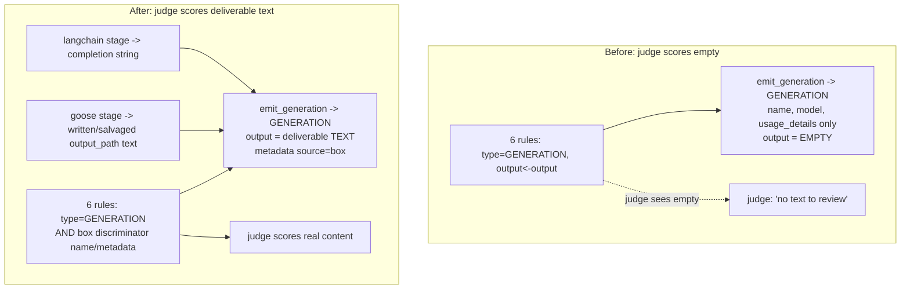

# fix: Eval Data Path — Enrich Box Generations With Deliverable Text, Exclude Judge Self-Calls

## Summary

The six Langfuse LLM-judge rules score `{{output}}` from GENERATION observations, but the box's `emit_generation` writes generations carrying only token counts — no text — so every judge scores an empty field (confirmed live: a judge replied *"you've provided the instructions but not the text to be reviewed"*). Fix the data path by enriching box generations with the stage's **deliverable text** (the completion for the langchain path, the written/salvaged stage output for the live goose path), and exclude the eval judges' own LLM calls from being re-scored. Wiring the issue-proposing observation-loop so the redo/growth judges score real proposed issues is deferred.

---

## Problem Frame

`emit_generation` (`pipeline/wgmesh_pipeline/tracing.py`) is post-hoc *usage* telemetry: the goose and langchain runners call it once per stage with only `UsageTotals` (token counts), and it creates a GENERATION observation with `name`, `model`, and `usage_details` — no `input`/`output` text. The actual stage text lives on the `trace_node` **span** (`as_type="span"`), which does not match the rules' `type=GENERATION` filter.

Two consequences, both confirmed against the live instance via a diagnostic dump (`verify` extension, PR #1865):

1. **Empty `{{output}}`** — all six rules map `{{output}}` ← observation `output`; on real box generations that field is empty, so the judges score nothing. NUMERIC judges default high (the redo rubric's "names no capability → NOT APPLICABLE → 1.0"), so the redo evaluator can never flag a real redo.
2. **Recursive scoring** — the dumped GENERATION whose `output` was a judge's reply shows the eval worker's own judge LLM calls are logged as GENERATIONs and re-scored by all six rules, inflating the score counts with meaningless self-evaluations.

This is the field-level form of the wired-but-off-path trap (`feedback_framework_wired_but_off_execution_path`): the rules fire and produce scores, so the deployment *looks* healthy, but reads the wrong field.

---

## Key Technical Decisions

- **Enrich generations rather than retarget the rules.** Thread the stage's deliverable text into `emit_generation` so the GENERATION observation carries what the judge reads, leaving the six rules' `type=GENERATION` filter and `{{output}}` mapping unchanged. The alternative — retargeting the rules onto the `trace_node` spans — was rejected this round (changes all six filters, pulls non-LLM spans into scope).

- **Thread the deliverable text string, not the `_safe_state` dict.** `_safe_state` returns the state *dict*; feeding the judge a serialized state object gives it JSON to dig through, not the prose its rubric asks for (`impl_faithfulness` wants the diff, `public_safety_pass` the publishable text). The generation `output` is set to the stage's actual deliverable **string** — the agent completion (langchain) or the written/salvaged stage output (goose). Input, where a judge needs it (`impl_faithfulness` wants the spec), is the prompt/spec string.

- **Goose enrichment is in scope — it is the live executor.** Goose runs the live box (the langchain runner is behind `EXECUTOR`/`GRAPH_IMPL` flags, reverted to goose 06-19), and goose usage is reconstructed from token-only logs with no completion text (`goose/usage.py`). But the runner already strips ANSI stdout and writes the deliverable to `output_path` (`goose/runner.py:352`); that written/salvaged text is the goose stage's real output and is what gets enriched. Without this, the fix is a no-op on production.

- **Exclude judge self-calls by a probe-confirmed discriminator, committing the known-schema fallback.** The eval worker's own judge LLM calls land as GENERATIONs and get re-scored. The filter must exclude them. The live eval-rule filter is only demonstrably proven for the `type` column; a `metadata`-column match on a `source: box` marker is preferred *only if* `--probe` confirms the unstable API accepts it. The committed fallback uses the `name` column — box generations are named `f"{stage}-llm"`, an enumerable allowlist — which rides the proven `stringOptions` schema. The discriminator choice is a U-level blocker resolved by probing a judge generation's `name`/`metadata` first, not a during-implementation detail.

- **Keep `emit_generation` best-effort and usage-only-safe.** New `input`/`output` params are optional; the `usage.total_tokens <= 0` short-circuit lives in the callers and is untouched; a missing-text path still emits usage and never raises (`tracing.py` `_announce`).

- **Defer the issue-proposal targeting.** The redo and growth judges expect a *proposed issue*, produced by the GHA observation-loop (raw `curl`, uninstrumented). After this fix they score the box's stage deliverable (triage/spec/impl text) — real content, but not their intended issue-proposal input. Wiring the observation-loop is documented follow-up.

---

## High-Level Technical Design

---

## Implementation Units

### U1. Add text params + box marker to `emit_generation`

- **Goal:** `emit_generation` can carry deliverable input/output text and a `source: box` metadata marker, without disturbing the usage-only path.
- **Dependencies:** none.
- **Files:**
  - `pipeline/wgmesh_pipeline/tracing.py` (modify)
  - `pipeline/tests/test_tracing.py` (modify)
- **Approach:** Add optional `input`/`output` string params (default `None`) to `emit_generation`; set them on the `start_observation(as_type="generation", ...)` call alongside the existing `usage_details`, and add `metadata={"source": "box", "stage": stage}`. When text is `None`, omit those fields. Keep the best-effort `try/except` + `_announce_generation`. Mechanics only — callers thread text in U2/U3.
- **Patterns to follow:** the existing `emit_generation` `start_observation` call + best-effort guard; the span's `input=`/`metadata=` kwargs in `_LangfuseSpan`.
- **Execution note:** Start with a failing `test_tracing` asserting the emitted generation carries the passed output text and the `source=box` marker.
- **Test scenarios:**
  - `emit_generation(output="...")` sets non-empty `output` on the observation (fake tracer captures `start_observation` kwargs).
  - The `source: box` + `stage` metadata is present on every emitted generation.
  - Called with no text (`output=None`) emits usage only, omits output, does not raise.
  - A tracer exception is swallowed (best-effort), warning announced once.
- **Verification:** `test_tracing` passes; a unit-level fake tracer shows the output/metadata set when text is passed and omitted when not.

### U2. Thread deliverable text from both runners (goose = live path)

- **Goal:** Each stage's deliverable text reaches `emit_generation.output` — the written/salvaged `output_path` text for goose, the completion string for langchain.
- **Dependencies:** U1.
- **Files:**
  - `pipeline/wgmesh_pipeline/goose/runner.py` (modify)
  - `pipeline/wgmesh_pipeline/langchain_agent/runner.py` (modify)
  - `pipeline/tests/test_runner*.py` (modify/add per runner)
- **Approach:** Goose — after the recipe runs and the deliverable is written/salvaged (`_strip_ansi(stdout)` → `output_path`, `runner.py:352`), read that text (bounded) and pass it as `emit_generation(output=...)`; pass the recipe/spec input as `input=` where available. Langchain — pass the agent's final completion string as `output=` at the existing emit site. Both bound the text to a sane size (mirror the span's `_safe_state` truncation budget) and degrade to usage-only if the deliverable text is unavailable.
- **Patterns to follow:** `goose/runner.py:352` salvage-to-`output_path`; `_emit_usage_safely`; the span truncation budget in `_safe_state`.
- **Execution note:** Probe-confirm against a real goose stage that the written `output_path` content is the deliverable text (not raw ANSI noise) before trusting it as the generation output.
- **Test scenarios:**
  - Goose runner threads the written `output_path` text into `emit_generation(output=...)` (captured generation output is non-empty + matches the deliverable).
  - Goose with no written output (salvage empty) degrades to usage-only, no raise.
  - Langchain runner threads the completion string into `emit_generation(output=...)`.
  - Oversized deliverable text is truncated to the budget, not emitted whole.
- **Verification:** A live goose-executed box stage produces a GENERATION whose `output` is the stage deliverable text, visible in the `verify` DIAG dump.

### U3. Exclude judge self-calls from the eval rules

- **Goal:** The six rules score only box generations, not the eval worker's own judge LLM calls.
- **Dependencies:** U1.
- **Files:**
  - `pipeline/evals/setup_langfuse_evaluators.py` (modify — rule `filter` + a one-time judge-generation field dump in `verify`)
  - `pipeline/tests/test_setup_langfuse_evaluators.py` (modify)
- **Approach:** **Blocker probe first** — extend the `verify` DIAG to print a judge-shaped generation's `name`/`metadata`/`sessionId`, and `--probe` the eval-rule API to confirm which filter columns it accepts (`name`? `metadata`?). Then narrow the shared filter constant: committed path is a `name`-column `stringOptions` allowlist of box stage generation names (`f"{stage}-llm"`), which rides the proven schema; upgrade to a `metadata` `source=box` match only if the probe confirms the API accepts it (more robust to unknown judge names). The filter stays a single shared constant so all six rules move together. Apply idempotently (existing PATCH + 409-as-success).
- **Patterns to follow:** `_GEN_FILTER` shared constant; the idempotent `apply()`; the `verify` DIAG field dump.
- **Execution note:** The discriminator (name-allowlist vs metadata) is decided from the probe output, not assumed — do not write the rule change before the judge-generation field dump and the filter-column probe.
- **Test scenarios:**
  - Every rule's filter includes the box-generation discriminator (not bare `type=GENERATION`).
  - The filter remains a single shared constant referenced by all six rules.
  - `apply()` PATCHes existing rules and treats 409 as success (idempotent, unchanged).
  - Test expectation note: actual exclusion of judge calls is verified live in U4, not unit-testable.
- **Verification:** After re-apply, a live score query shows no new scores on judge-shaped generations; box generations still score.

### U4. Confirm enriched generations score real content end-to-end

- **Goal:** Verify the fix on the live (goose) substrate: box generations carry deliverable text and the judges produce content-grounded scores.
- **Dependencies:** U1, U2, U3.
- **Files:**
  - `pipeline/evals/setup_langfuse_evaluators.py` (modify — make the `verify` DIAG assert, not just print)
- **Approach:** Turn the `verify` DIAG into an assertion: a recent box generation has non-empty `output`, and recent score reasonings engage real content (not "no text to review"). Because goose is the live executor, the live success criterion is satisfiable only after U2 enriches goose — note that explicitly so a `verify` run on the current substrate reads correctly.
- **Patterns to follow:** the `verify()` poll-and-classify + `rule_`-prefixed score-name matching; the DIAG dump (PR #1865).
- **Test scenarios:**
  - `verify` flags PASS only when a box generation has non-empty `output` AND a score has content-bearing reasoning.
  - A generation with empty `output` (regression to the old shape) makes `verify` report the empty-field defect explicitly, not a generic WAIT.
- **Verification:** A live `mode=verify` after U1/U2/U3 deploy shows non-empty goose-generation output and content-grounded score reasonings.

### U5. Record the fix and the deferred targeting

- **Goal:** Document the confirmed defect, the fix, and the still-deferred observation-loop instrumentation.
- **Dependencies:** U1, U2, U3, U4.
- **Files:**
  - `docs/solutions/logic-errors/` (new entry for the eval data-path defect)
  - `docs/solutions/logic-errors/capabilities-digest-grounds-loop-against-shipped-work.md` (modify — note redo scoring is only meaningful post-fix)
- **Approach:** Document the empty-`{{output}}` defect, the recursive-scoring defect, the enrich fix (deliverable text, goose via `output_path`), the judge-self-call exclusion, and the deferred observation-loop instrumentation the redo/growth judges need. Cross-reference the parked benchmark plan (`docs/plans/2026-06-19-003-...`), resumable once generations carry real text in the shape prod emits.
- **Patterns to follow:** existing `docs/solutions/logic-errors/` frontmatter + RCA shape.
- **Test scenarios:** Test expectation: none — documentation.
- **Verification:** The doc names the defect, fix, and deferred targeting with correct cross-references.

---

## Risks & Dependencies

- **Goose `output_path` text quality** — the salvaged/written content may be partial, ANSI-tainted, or the deliverable file rather than the LLM completion. Mitigation: U2 probe-confirms it is the real deliverable text before trusting it; degrade to usage-only if it isn't clean. This is the load-bearing U2 unknown — probe a real goose stage early.
- **Filter discriminator schema** — the live eval-rule filter is only proven for `type`; `metadata`/`name` support is unverified. Mitigation: U3 blocker-probe; committed fallback is the `name`-allowlist on the proven `stringOptions` schema. If neither `name` nor `metadata` filtering is accepted, U3 is blocked and the plan says so rather than silently accepting judge-self-call scoring.
- **Judge-relevant field varies by stage** — even with deliverable text threaded, `impl_faithfulness` (diff) vs `public_safety_pass` (publishable text) want different slices. Mitigation: U2 threads the stage's primary deliverable string; per-judge field precision is a refinement, noted if the scores read coarse.
- **PII/secrets in generation text** — enriching generations puts box content into Langfuse. The span already carries the same content (no new exposure surface), but confirm Langfuse access stays restricted and truncation/redaction covers the generation path.
- **Re-apply idempotency** — changing the shared filter re-applies all six rules; the existing PATCH + 409-as-success path must hold (regression-guarded by the apply tests).

---

## Open Questions

*Resolve during implementation (probe), each gated as noted:*

- (U2 blocker) Is the goose `output_path` written/salvaged content the clean stage deliverable text, or raw ANSI/partial output?
- (U3 blocker) Which filter columns/operators does the live eval-rule API accept (`name`, `metadata`, others)?
- (U3 blocker) What field distinguishes an eval-worker judge generation from a box generation (name, metadata, absence of session)? — dump it via the `verify` DIAG before choosing the discriminator.

---

## Scope Boundaries

### Outside this change

- Not retargeting the rules off `type=GENERATION` onto spans/traces (the rejected alternative this round).
- Not changing the judge rubrics or `_SHIPPED_SNAPSHOT` — this is a data-path fix; the prompts are unchanged.

### Deferred to Follow-Up Work

- Instrumenting the GHA observation-loop (raw `curl`) so the redo/growth judges score actual proposed issues — the content-type mismatch fix. Until then redo/growth score box stage deliverables, not issue proposals.
- Per-judge field precision (threading the diff vs the publishable text vs the issue body to the specific judge that wants it) if coarse deliverable text proves insufficient.
- The parked redo-evaluator dataset benchmark (`docs/plans/2026-06-19-003-...`) — resume once generations carry real text in the shape prod emits.

---

## Sources & Research

- `pipeline/wgmesh_pipeline/tracing.py` — `emit_generation` (usage-only generation, `:234`), `trace_node` + `_LangfuseSpan` (`_safe_state` dict on the span, `output=` at `:138`; `_safe_state` at `:300`), best-effort `_announce`.
- `pipeline/wgmesh_pipeline/goose/runner.py` — `_emit_usage_safely` (`:468`), the ANSI-strip salvage to `output_path` (`:352`); `pipeline/wgmesh_pipeline/goose/usage.py` — token-only usage reconstruction, no text.
- `pipeline/wgmesh_pipeline/langchain_agent/runner.py` — the langchain `emit_generation` call site with the completion in hand.
- `pipeline/evals/setup_langfuse_evaluators.py` — the six rules' shared `type=GENERATION` filter (`_GEN_FILTER`) + `{{output}}` mapping; idempotent `apply()`; the `verify` DIAG (PR #1865) confirming the empty-output + recursive-scoring defects live; the docstring note to "narrow filter to specific traceName(s)" (non-`type` columns were always treated as unconfirmed).
- `feedback_langfuse_evaluators_score_empty_output` (memory) — the confirmed defect, the judge's *"you've provided the instructions but not the text to be reviewed"* reply, the recursive-scoring finding.
- `feedback_framework_wired_but_off_execution_path` (memory) — the field-level form of the same trap; the live executor is goose, not langchain.
