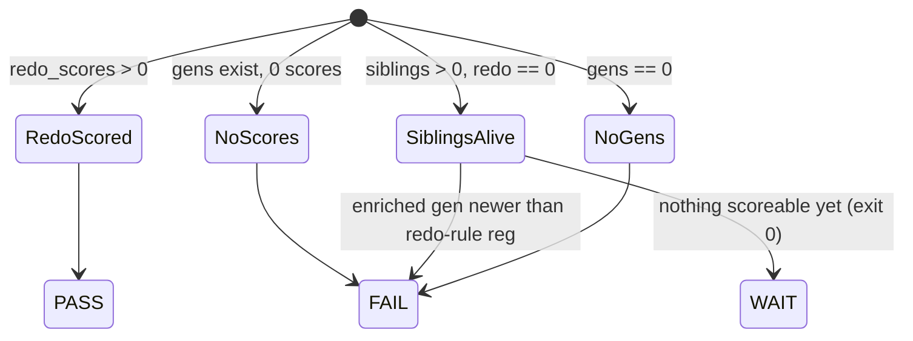

# fix: Langfuse `--verify` exit semantics — WAIT is not a failure

## Summary

`Register Langfuse Evaluators` ran red 9× on 2026-06-19. Every red run was a manual
`workflow_dispatch` of **`--verify`**, not the apply path. `verify()` returns exit `1`
in its **WAIT** branch — "score pipeline alive (91 sibling scores), but the redo
evaluator hasn't seen a post-registration generation yet; re-run later." WAIT is an
expected, non-terminal state, but CI reads any non-zero exit as failure, so each poll
painted the job red and the Action-Success KPI counted it as a breach.

This plan makes `verify()` map three verdicts to two exit codes correctly: **PASS** and
**WAIT** → exit `0`, **FAIL** → exit `1`. WAIT stays honest via an **evidence-based
discriminator**: WAIT degrades to FAIL once a box generation that the redo rule *should*
have scored exists (enriched `<stage>-llm` output created at/after the redo rule's
registration) yet `redo_scores == 0` — that means the rule's filter is broken, not that
we are "too early."

## Problem Frame

- **Observed:** 9 red `Register Langfuse Evaluators` runs in 24h; KPI marks the window
  dirty (see `docs/pulse-reports/2026-06-20_00-10.md`).
- **Root cause:** `verify()` conflates WAIT (transient/expected) with FAIL (terminal
  defect) — both `return 1`. CI has no neutral signal, so WAIT reads as failure.
- **Not the cause:** the apply path is already 409-idempotent (POST→409→`exists_ok`;
  existing rules go through PATCH — #1813/#1858). No live 409 re-apply bug.
- **Goal:** WAIT stops failing CI, without letting a genuinely stuck redo rule hide
  behind a permanent green.

---

## Scope Boundaries

**In scope**
- Exit-code semantics of `verify()` in `pipeline/evals/setup_langfuse_evaluators.py`.
- The evidence-based WAIT→FAIL discriminator and its supporting signal (redo-rule
  registration time, with a fallback).
- Tests in `pipeline/tests/test_setup_langfuse_evaluators.py`.

**Out of scope**
- The empty-`{{output}}` box-generation substrate (judges scoring blank deliverable
  text). Already shipped in #1866; awaiting box redeploy. `verify()` already *reports*
  it (`box generations ... with non-empty output: 0`); this plan does not change that
  diagnostic.
- Apply-path 409 handling (already idempotent).
- Why `--verify` is being polled hourly by an operator — behavioral, not a code defect.

### Deferred to Follow-Up Work
- A hard staleness time-cap on WAIT (e.g., "WAIT longer than N hours → FAIL even with no
  enriched generation"). The enriched/registration discriminator below is the agreed
  evidence signal; a wall-clock cap is a cruder secondary guard, deferred unless the
  discriminator proves insufficient in production.
- Splitting apply vs. verify into separate workflow jobs so a verify verdict can never
  share a red/green with registration. Not needed once exit codes are correct.

---

## Key Technical Decisions

- **KTD1 — WAIT and PASS both exit 0; only FAIL exits 1.** CI's only lever is the exit
  code. WAIT is an expected state, so it must be green. PASS stays green. FAIL (dead
  pipeline, no traces, or broken redo filter) stays red.
- **KTD2 — Evidence-based WAIT→FAIL discriminator (user-chosen).** WAIT is only valid
  while there is nothing the redo rule *should* have scored. Discriminator: a box
  generation with non-empty output (`name` ending `-llm`) whose `startTime` is at/after
  the redo rule's registration time exists, yet `redo_scores == 0` → **FAIL** (filter
  broken). Otherwise → **WAIT**. Reuses `enriched`, already computed in `verify()`.
- **KTD3 — Registration-time signal with a fallback.** Primary: read the redo rule's
  `createdAt` (or equivalent) from `GET /api/public/unstable/evaluation-rules`. The
  unstable API's exact field name is an execution-time unknown (probe to confirm). If no
  timestamp field is returned, fall back to **enriched-existence**: any enriched
  `<stage>-llm` generation with `redo_scores == 0` → FAIL. This fallback is sound because
  the enrichment fix (#1866) landed *after* the redo rule was registered (#1854), so an
  enriched generation is necessarily post-registration.
- **KTD4 — Verdict logic is a pure function, exit/printing at the boundary.** Extract a
  testable classifier returning `(verdict, message)`; `verify()` prints and maps verdict
  → exit. Enables unit tests without HTTP mocking of the whole flow.
- **KTD5 — Keep `verify()` as a gating CI job.** Demoting to always-exit-0 advisory was
  the alternative; rejected so a real broken-filter or dead-pipeline state still goes red.

---

## High-Level Technical Design

Verdict → exit-code decision matrix (the classifier's contract):

| Condition (evaluated in order) | Verdict | Exit |
|---|---|---|
| No GENERATION observations at all | FAIL | 1 |
| `redo_scores > 0` | PASS | 0 |
| Sibling scores exist, `redo_scores == 0`, **and** a post-registration enriched box generation exists | FAIL | 1 |
| Sibling scores exist, `redo_scores == 0`, no such generation yet | **WAIT** | **0** |
| Box generations exist but **zero** scores from any evaluator | FAIL | 1 |

Only the bolded WAIT row changes behavior (was exit 1). The new FAIL row (broken redo
filter) is split out of the old WAIT branch by the discriminator.

_Directional — the matrix above is authoritative on ordering._

---

## Implementation Units

### U1. Extract a pure verdict classifier (characterize current behavior)

- **Goal:** Pull the PASS/WAIT/FAIL decision out of `verify()` into a pure function that
  returns `(verdict, message)`, with `verify()` mapping verdict → exit code. No behavior
  change yet — WAIT still exits 1 at this step; this unit locks current behavior under test.
- **Requirements:** Advances KTD4. Prerequisite for the semantics change in U3.
- **Dependencies:** none.
- **Files:**
  - `pipeline/evals/setup_langfuse_evaluators.py` (extract classifier; `verify()` calls it)
  - `pipeline/tests/test_setup_langfuse_evaluators.py` (characterization tests)
- **Approach:** New `_classify_verify(...)` taking already-derived inputs — `gens` count,
  `box_gens`, `enriched`, `redo_scores`, `other_eval_scores` — and returning a verdict
  enum/string plus the human message. `verify()` keeps all HTTP/printing; at the end it
  calls the classifier and maps `{PASS:0, WAIT:1, FAIL:1}` (unchanged codes for now). Keep
  the existing printed messages verbatim so output is stable.
- **Execution note:** Characterization-first — write tests that pin the *current*
  verdict/exit for each branch before extracting, so the refactor is provably behavior-preserving.
- **Patterns to follow:** existing helper style in the module (`_count`, `_get_list`,
  small private functions); existing assertions in `pipeline/tests/test_setup_langfuse_evaluators.py`.
- **Test scenarios:**
  - No generations → verdict FAIL, exit 1.
  - `redo_scores > 0` → verdict PASS, exit 0.
  - Siblings score, `redo_scores == 0` → verdict WAIT, **exit 1** (current behavior pinned).
  - Box gens exist, zero scores anywhere → verdict FAIL, exit 1.
  - Classifier is pure: same inputs → same `(verdict, message)`, no network calls.
- **Verification:** New tests pass; running `--verify` against a live/mocked instance
  produces byte-identical stdout and the same exit code as before the refactor.

### U2. Surface the redo-rule registration-time signal (with enriched fallback)

- **Goal:** Make available the evidence the discriminator needs: when was the redo rule
  registered, and which enriched box generations post-date it.
- **Requirements:** Advances KTD2, KTD3.
- **Dependencies:** U1.
- **Files:**
  - `pipeline/evals/setup_langfuse_evaluators.py` (rule-timestamp getter; post-registration filter)
  - `pipeline/tests/test_setup_langfuse_evaluators.py`
- **Approach:** Extend the existing `GET /api/public/unstable/evaluation-rules` read
  (currently `_existing_rule_ids` captures only name→id) to also capture a registration
  timestamp for the `redo_of_shipped_capability` rule when present. Add a helper that,
  given `enriched` generations and the registration timestamp, returns whether any
  enriched generation has `startTime >= registered_at`. **Fallback (KTD3):** if no
  timestamp field is present in the rules payload, treat *any* enriched `<stage>-llm`
  generation as post-registration.
- **Patterns to follow:** `_existing_rule_ids()` (same GET, same payload-shape tolerance
  with `data`/`evaluationRules` fallbacks); `startTime` access as already used in `verify()`.
- **Test scenarios:**
  - Rules payload includes `createdAt` for the redo rule → getter returns it.
  - Rules payload omits a timestamp field → getter returns `None`; discriminator helper
    falls back to enriched-existence.
  - Enriched generation `startTime` after registration → "post-registration scoreable gen" True.
  - Enriched generation `startTime` before registration (timestamp path) → False (still WAIT).
  - No enriched generations → False regardless of timestamp.
- **Verification:** Helpers return correct booleans/timestamps across the matrix above;
  no live redo score required to exercise them (inputs injected).
- **Deferred to implementation:** exact timestamp field name on the unstable rules
  endpoint — confirm via `--probe` against the live instance before finalizing the getter.

### U3. Apply correct exit semantics + the WAIT→FAIL discriminator

- **Goal:** WAIT exits 0; a broken-redo-filter state (post-registration enriched gen,
  zero redo scores) becomes a distinct FAIL at exit 1.
- **Requirements:** Advances KTD1, KTD2, KTD5. Closes the pulse followup.
- **Dependencies:** U1, U2.
- **Files:**
  - `pipeline/evals/setup_langfuse_evaluators.py` (`_classify_verify` verdict + exit map)
  - `pipeline/tests/test_setup_langfuse_evaluators.py`
- **Approach:** In the classifier, split the old "siblings alive, redo == 0" WAIT branch
  using the U2 signal: post-registration enriched generation present → FAIL with a message
  naming the broken-filter suspicion; else → WAIT. Change the exit map to
  `{PASS:0, WAIT:0, FAIL:1}`. Update the WAIT message to state plainly that this is a
  non-failing "awaiting first post-registration generation" state.
- **Patterns to follow:** existing message tone/format in `verify()` (e.g.
  `VERIFY: WAIT — ...`, `VERIFY: FAIL — ...`).
- **Test scenarios:**
  - Siblings score, redo 0, **no** post-registration enriched gen → WAIT, **exit 0** (the fix).
  - Siblings score, redo 0, **post-registration enriched gen exists** → FAIL, exit 1,
    message cites broken redo filter.
  - `redo_scores > 0` → PASS, exit 0 (unchanged).
  - No generations → FAIL, exit 1 (unchanged).
  - Box gens exist, zero scores anywhere → FAIL, exit 1 (unchanged).
  - Timestamp-unavailable fallback: enriched gen present, redo 0 → FAIL (fallback treats
    enriched as post-registration).
- **Verification:** `--verify` against the current live state (siblings scoring, redo 0,
  box output still empty per #1866 not-yet-redeployed) returns **WAIT exit 0**; the
  `Register Langfuse Evaluators` workflow goes green on a verify dispatch. A subsequent
  pulse shows zero `Register Langfuse Evaluators` failures attributable to WAIT.

---

## Risks & Dependencies

- **R1 — WAIT masking a real stall.** If the redo rule's filter is subtly wrong *and* no
  enriched generation ever appears (box redeploy of #1866 still pending), the discriminator
  stays in WAIT/green indefinitely and the broken filter is invisible. Mitigation: the
  deferred wall-clock staleness cap; for now, the verify message still prints the empty-output
  diagnostic, and the box redeploy that lands #1866 will produce enriched gens that then
  exercise the FAIL path. Accepted for this scope.
- **R2 — Unstable API field drift.** The rules endpoint is the v3 *unstable* API; a
  timestamp field may be absent or renamed. Mitigation: KTD3 fallback to enriched-existence;
  `--probe` before finalizing (U2).
- **Dependency:** none external; single module + its test file. No new pip deps
  (stdlib-only constraint of the workflow preserved).

---

## Sources & Research

- `docs/pulse-reports/2026-06-20_00-10.md` — followup #1 (origin signal).
- Failing run logs (2026-06-19 `Register Langfuse Evaluators`, MODE=verify) — confirmed
  all 9 reds are WAIT-branch exit 1, not 409.
- Memory: `[[feedback_create_endpoint_409_breaks_reapply]]` (the apply-path bug already
  fixed — confirms 409 is not the live defect), `[[feedback_langfuse_evaluators_score_empty_output]]`
  (#1866 substrate fix, out of scope here), `[[project_langfuse_evaluators]]`.
- No external research: internal unstable API, fully codebase-local; no external option set.
