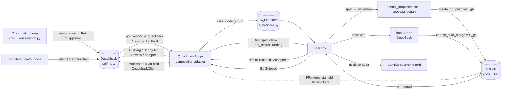

# feat: Quackback as the Autonomous Pipeline's Decision Layer

**Origin:** `docs/brainstorms/2026-06-21-quackback-decision-layer-requirements.md`
**Depth:** Deep (product) · **Output:** markdown
**Package root:** `pipeline/wgmesh_pipeline/`

> **Origin decisions revised at plan time.** Two of the origin's four "locked decisions" are deliberately reversed here after repo grounding: **transport REST (not MCP)** (KTD2) and **discovery poll-first (not webhook)** (KTD3). Treat this plan, not the origin's locked table, as authoritative for transport and discovery.

---

## Summary

Replace GitHub Issues with a self-hosted **Quackback** board as the autonomous pipeline's decision and audit layer. The Observation Loop posts **Build Suggestions** to Quackback (`Open for Vote`) instead of creating GitHub Issues. A founder flips a post to `Accepted for Build` — the only trigger that lets the box ingest the item into its internal execution store and build it through the existing spec→implement→PR pipeline. The DeepSeek judge auto-merges as today; on real merge the box flips the post to `Shipped`. Human decisions are mirrored to Langfuse as audit scores and persisted to a decision table. GitHub is touched only for branch, commits, and PR.

The integration plugs into the existing **Forge protocol** seam (`forge/protocol.py`) as a `QuackbackForge` **composition** adapter — it *holds* a `GitHubClient` (PR/branch/merge) and a `QuackbackClient` (issue/post ops), satisfying the `@runtime_checkable` `Forge` protocol structurally. Two-layer state: **Quackback** = decision/audit truth; the existing **SQLite store** (`state/store.py`) = execution stage.

---

## Problem Frame

The pipeline was built for unattended convergence — the Observation Loop autonomously files GitHub Issues, the box implements them, and judge-gated auto-merge ships them with no human in the loop. Founders have no single surface to **see, prioritize, and authorize** what the autonomous company proposes, and there is no structured capture of accept/reject judgments. GitHub Issues conflate "the agent had an idea" with "we decided to build this," and are a developer artifact rather than a founder decision surface.

This plan inserts a human prioritization gate at the **front** (Quackback `Accepted for Build`) while preserving autonomy at the **back** (judge auto-merge unchanged). The central consequence, accepted in the origin: build throughput now gates on founder attention. See **Open Questions OQ1** — whether that bottleneck is by-design or needs bounded auto-accept is a product decision left open for the operator; this plan ships the honest instrumentation either way (U8).

---

## Requirements Traceability

Carried from origin (`see origin` for rationale):

- **R1** Observation Loop creates template-compliant Build Suggestions in Quackback; pipeline creates zero GitHub Issues. → U5, U9
- **R2** Founders vote/comment; authorized founder accepts/rejects/refines (Quackback-native, not built here). → external; U3 reads the result
- **R3** Box builds only after `Accepted for Build`; marks `Building`; runs existing pipeline; judge auto-merges. → U3, U4, U6
- **R4** PR links back to the post; on merge the post → `Shipped`. → U6
- **R5** Duplicate implementation starts prevented (idempotency keyed by post id + accept transition). → U4
- **R6** Every decision auditable in Quackback and emitted as a Langfuse **audit** score. → U7
- **R7** Aging `Open for Vote` posts visible against the 48h SLA; founder-channel notifications across the funnel; **all-idle / zero-acceptance alarm**. → U8
- **R8** Hard replace day one — GitHub Issue generation disabled, existing issues drained. → U9 *(the create path is flag-guarded, not deleted; deletion is a deferred follow-up — see Scope Boundaries)*
- **R9** Keep DeepSeek judge auto-merge (back gate); drop the spec's human-PR-review step. → acceptance constraint, no unit; verify post-merge that merge stays judge-gated only (`impl_judge.py` unchanged).
- **R10** Learning loop: Langfuse scores + decision dataset reframed as **audit/measurement** (R6), not live learning. The *live* learning loop (in-context steering) + vote reranking are deferred follow-ups (U10, U11) — nothing reads the dataset live in this plan. → U7 (audit); U10, U11 (deferred)
- **R11** Self-host Quackback; named least-privilege bot key with **server-side** decision-status prohibition; gating read fail-closed, telemetry write best-effort. → U1, U2, U3, U7

---

## Key Technical Decisions

- **KTD1 — Composition, not subclass.** `QuackbackForge` (`forge/quackback.py`) **implements** the `Forge` protocol (`forge/protocol.py:30`, `@runtime_checkable`) by composition: it holds a `GitHubClient` for PR/branch/merge methods (`create_pr`, `update_pr_body`, `merge_pr`, `enable_auto_merge`, `get_pr`, `push_branch`, `has_merged_resolution_pr`) and a `QuackbackClient` for issue/post methods (`create_issue`, `get_issue`, `list_open_issues`, `comment`, `set_status`). It delegates each method to the correct backend explicitly. **Rationale (review F1/F6):** `GitHubClient` routes every call through a single `self.api_root` (`github/client.py:60,441`); the `GiteaForge` precedent retargets that one root to Gitea, so its inherited PR methods hit Gitea — a *single*-transport pattern. This integration needs *two* transports (issues→Quackback, PRs→GitHub) from one object, which subclassing cannot express. Composition gives two rooted clients and an explicit per-method split.
  - Consequence: `QuackbackForge` needs **both** `QUACKBACK_*` and GitHub creds; each issue method that must never reach GitHub is implemented against `_qb` only, and PR methods against `_gh` only. The split is enforced by the conformance suite (U2), not by docstring.
- **KTD2 — Transport: REST, not MCP.** The forge layer is plain `requests`/`urllib`; REST is the native fit and joins the existing conformance suite. The 27-tool MCP server is reserved for later interactive/agent-native use. *(Flips the origin's MCP-primary default after repo grounding.)*
- **KTD3 — Discovery: idempotent poll via a dedicated ingest, webhook deferred.** The box is a VM with no public HTTP receiver, and bot-origin webhooks are silently suppressible (learning: `github-app-reviews-dont-trigger-workflows.md`). **Rationale (review F2):** the live poller ingests through `reconcile_issues` over `client.list_open_issues()` (`poller.py:41`, `reconcile.py:55`); nothing calls `list_needs_triage`, and `reconcile_issues` encodes GitHub-label semantics (`MERGED_LABELS`, `needs-human`, resolution-PR lookup) that misfire on Quackback posts. So a **dedicated `reconcile_quackback(client, store)`** ingest runs in `poller.tick` under `forge_kind == "quackback"` (in place of `reconcile_issues`), returning `Accepted for Build` posts and upserting them directly. Poll is idempotent and retried, never one-shot (learning: `loop-pr-automerge-timing-race.md`). *(Flips the origin's webhook-primary default.)*
- **KTD4 — Two-layer state, with decision re-read for drift.** Quackback status = human decision/audit; the SQLite store (`state/store.py` `ALLOWED_TRANSITIONS`) = execution. Milestone mapping: store advances **past** `queued` (first real spec claim) → post `Building`; store `reviewed/awaiting_merge` → `Ready for Review`; store `merged` (real `pr.merged`) → `Shipped`. **Drift guard (review adversarial F2):** before claim, before PR open, and before the Shipped flip, the box does a cheap per-item `get_issue` decision-status read; if the post left `Accepted for Build`/`Building` (Cancelled / Needs Refinement), it aborts the run and does **not** flip status — the human's terminal decision is never overwritten. This is a bounded read, not a merge of the two state machines. `Building` is flipped only when work actually starts, not at ingest (review adversarial F3 — avoids false "in progress").
- **KTD5 — Gating read fail-closed, telemetry write best-effort.** The `Accepted for Build` read is fail-closed and loud — on API error the box does **not** build and the failure surfaces (learning: `polar-checkout-404s`). The Langfuse score write is best-effort/non-blocking via the never-raise `score_run` guard (`scoring.py`).
- **KTD6 — Idempotency + id mapping.** Idempotency key = `quackback_post_id + accept-transition marker`. **`status_version` is unverified** in Quackback's API (review adversarial F1) — U2 probes the live post payload for a monotonic version/`updatedAt`/revision field; if absent, the key falls back to the accept-transition timestamp (from the status-change or comment). Treat `409`/already-exists on create as success (learning: `feedback_create_endpoint_409_breaks_reapply`). Confirm accepted state with a direct per-item read, never inferred from absence in a capped list (learning: `feedback_absence_not_closed_paginated_list`). **Post-id→int mapping (review F3):** the store is `int`-keyed (`store.py:47,112`) and the int threads into spec paths, `bot/impl-{n}` branch names, and resolution-PR title matching. U4 defines the mapping (use Quackback's numeric post number if exposed; else a `quackback_post_id`↔`number` mapping column) and verifies it threads through branch naming and `has_merged_resolution_pr`.
- **KTD7 — Client construction fail-closed.** `QuackbackClient` mirrors `impl_judge.py` raw-HTTP: `urllib` + `User-Agent: Mozilla/5.0` (Cloudflare-1010 guard), `os.environ` key resolution, assert on payload **shape** not HTTP 200, raise on missing `QUACKBACK_*` secret/endpoint (learning: `multi-model-routing.md`).
- **KTD8 — Langfuse score = audit, not live learning.** Map the decision payload to the exact observation field the eval rule reads, on a real trace, and exclude the box's own generations (learning: `langfuse-evaluators-scored-empty-output.md`). Reuse `LangfuseScorer.record(...)`. Scores + the decision table are **audit/measurement only** (R6); no component reads them live in this plan (review product) — the live learning loop is deferred (U11).
- **KTD9 — Decision-status authority is server-enforced.** The bot key must be **server-side** unable to set `Accepted for Build` / `Rejected` (review security F1/F2). The local allowlist in the adapter is defense-in-depth only. U1/U2 require: provision a least-privilege Quackback key whose scopes permit create/read/update/comment/status→{Building, Ready for Review, Shipped} but **not** decision statuses; U2 conformance asserts a forbidden status write returns server **non-2xx**, not just a local raise. Key stored as a CI/box secret (`QUACKBACK_TOKEN`), rotation on personnel change or suspected exposure (runbook, U9).
- **KTD10 — Untrusted post content is fenced before it enters any LLM prompt.** Build Suggestion bodies and rejection reasons are human/agent-authored and flow into spec/implement and (deferred) steering prompts (review security F5, adversarial F2). Ingest bounds the fields injected into prompts (title + summary, not all 16 sections) and wraps them in a nonce-fence / DATA-not-instructions envelope (pattern: `feedback_llm_judge_gate_failopen_classes`). `decided_by` is stored as an **opaque Quackback user id**, never an email/name, to keep PII out of the public-repo SQLite/Langfuse/logs (review security F3; learning `feedback_public_repo_third_party_pii`).

---

## High-Level Technical Design

### Component / data flow



### Two-layer state mapping (decision ↔ execution) with drift guard

```mermaid
flowchart TB
  subgraph Quackback["Quackback — decision/audit (human)"]
    OFV[Open for Vote] --> NR[Needs Refinement] --> OFV
    OFV --> AFB[Accepted for Build]
    OFV --> REJ[Rejected]
    AFB --> BLD[Building] --> RFR[Ready for Review] --> SHP[Shipped]
    AFB --> CAN[Cancelled]
    BLD --> CAN
  end
  subgraph Store["SQLite store — execution (box)"]
    Q[queued] --> TR[triaged] --> SP[specced] --> SR[spec_ready]
    SR --> IM[implemented] --> RV[reviewed] --> AM[awaiting_merge] --> MG[merged]
    Q -. drift: post Cancelled .-> AB[aborted/escalated]
  end
  AFB -. ingest upsert .-> Q
  TR -. first claim → mirror .-> BLD
  RV -. mirror .-> RFR
  MG -. mirror on real pr.merged + re-read .-> SHP
  CAN -. drift re-read aborts run .-> AB
```

### Accept → Shipped sequence (with drift re-read)

```mermaid
sequenceDiagram
  participant F as Founder
  participant QB as Quackback
  participant QF as QuackbackForge
  participant ST as store
  participant P as poller
  participant GH as GitHub
  participant J as judge
  F->>QB: status → Accepted for Build
  QF->>QB: reconcile_quackback poll (idempotent)
  QF->>ST: upsert at queued (post-id→int, dedup key)
  P->>ST: claim_next → first spec
  P->>QB: re-read status (still Accepted?) → set_status Building
  P->>GH: create_pr via _gh (links Quackback post)
  P->>QB: re-read status → set_status Ready for Review
  P->>J: judge diff (fail-closed)
  J->>GH: enable_auto_merge via _gh
  GH-->>P: pr.merged
  P->>QB: re-read status; if still active → set_status Shipped
  P->>QB: (best-effort) Langfuse audit score
```

---

## Output Structure

New files (created), package root `pipeline/wgmesh_pipeline/` — `quackback/` subpackage folded into `forge/` per review (matches the single-file `forge/gitea.py` precedent):

```
pipeline/wgmesh_pipeline/
  forge/
    quackback.py            # QuackbackForge (composition: holds _gh + _qb) (U2)
    quackback_client.py     # QuackbackClient — raw urllib REST, fail-closed (U2)
    quackback_status.py     # status ↔ milestone map + allowlist constant (U3)
  github/
    reconcile.py            # + reconcile_quackback() ingest (U4)
pipeline/tests/
  test_quackback_client.py        # (U2)
  test_quackback_forge.py         # (U2, U3)
  test_quackback_discovery.py     # (U4)
  test_quackback_drift.py         # (U12)
  test_quackback_lifecycle.py     # (U6)
  test_quackback_audit.py         # (U7)
docs/runbooks/
  quackback-cutover.md            # drain + cutover + key-provisioning + rollback (U9)
```

Modified: `config.py`, `forge/factory.py`, `forge/protocol.py` (add `set_status`), `poller.py`, `observation.py` / `control_loop/executor.py`, `state/migrations/` (decision table + id-map column), `tests/conformance/test_forge_conformance.py`, `.github/workflows/observation-loop.yml`, notification/pulse workflow(s).

---

## Implementation Units

Grouped into phases. Land in order; each unit is one atomic commit.

### Phase 1 — Adapter foundation

### U1. Config + bot-key provisioning (least-privilege, server-enforced)

**Goal:** Add `quackback_url`/`quackback_token` config (fail-closed) and document provisioning a least-privilege bot key that the Quackback server forbids from setting decision statuses.
**Requirements:** R11. **Dependencies:** none.
**Files:** `pipeline/wgmesh_pipeline/config.py`, `pipeline/tests/test_config.py`, `docs/runbooks/quackback-cutover.md` (provisioning section)
**Approach:** Add `quackback_url`/`quackback_token` next to `gitea_url` (~`config.py:102`), from `QUACKBACK_URL`/`QUACKBACK_TOKEN`. When `forge_kind == "quackback"` and either is unset → raise at construction (KTD7). Runbook documents required key scopes (create/read/update/comment/status→{Building, Ready for Review, Shipped}; **not** Accepted/Rejected), storage as box/CI secret, rotation trigger (KTD9).
**Patterns to follow:** `config.py:33–36,102` env reads; retired `WGMESH_REVIEWER_PAT` secret-wiring shape.
**Test scenarios:**
- Happy: `forge_kind=quackback` + both env set → config exposes url/token.
- Error: `forge_kind=quackback` + missing token → raises clearly.
- Edge: `forge_kind=github` + Quackback vars unset → no error.
**Verification:** selecting Quackback without creds fails loudly; runbook names key scopes + rotation.

### U2. QuackbackClient + QuackbackForge (composition) + factory + conformance

**Goal:** A fail-closed REST `QuackbackClient` and a `QuackbackForge` that composes it with a `GitHubClient`, wired into the factory and the conformance suite, with the issue/PR backend split asserted.
**Requirements:** R1, R3, R11. **Dependencies:** U1.
**Files:** `pipeline/wgmesh_pipeline/forge/quackback_client.py`, `pipeline/wgmesh_pipeline/forge/quackback.py`, `pipeline/wgmesh_pipeline/forge/factory.py`, `pipeline/wgmesh_pipeline/forge/protocol.py` (add `set_status`), `pipeline/tests/test_quackback_client.py`, `pipeline/tests/test_quackback_forge.py`, `pipeline/tests/conformance/test_forge_conformance.py`
**Approach:** `quackback_client.py` = raw urllib per `impl_judge.py` (Mozilla UA, `QUACKBACK_*` keys, assert payload shape, never silent-200; KTD7). `QuackbackForge` (KTD1 composition) holds `_gh: GitHubClient` + `_qb: QuackbackClient`, implements the `Forge` protocol structurally: issue/post methods → `_qb` (`create_issue` → Build Suggestion `Open for Vote`, tags `agent-suggestion`+`build-candidate`, keep `_sanitise_write` wall; `get_issue`, `list_open_issues`, `comment`, new `set_status`), PR methods → `_gh`. Probe the live post payload for a `status_version`/`updatedAt` field (KTD6); record which field is used. Factory `make_forge` gains `kind == "quackback"`. Conformance (`test_forge_conformance.py:73`) adds a `QUACKBACK` case asserting issue methods hit `_qb` and **PR methods delegate to `_gh`**.
**Execution note:** Start with a failing conformance assertion that a forbidden `set_status(Accepted for Build)` returns server non-2xx (KTD9).
**Patterns to follow:** `impl_judge.py:128` UA, `forge/gitea.py` `_sanitise_write`, `tests/conformance/test_forge_conformance.py` RoutingSession.
**Test scenarios:**
- Covers R1. Happy: `create_issue` → POST Build Suggestion with both required tags; returns post id.
- Split: a PR method call routes to `_gh` (GitHub stub), an issue method routes to `_qb` (Quackback stub) — asserted explicitly.
- Server authority (KTD9): `set_status(post, "Accepted for Build")` → server non-2xx, surfaced (not just local raise).
- Idempotency: duplicate-title create → `409` treated as success, returns existing id.
- Fail-closed: HTTP 200 with malformed payload → raises (KTD7).
- Sanitise: each new Build-Suggestion field (`Evidence`, `Open Questions`, `Agent Notes`) carrying a synthetic secret → blocked (review security F3).
**Verification:** conformance green for all forge kinds; backend split + server-side status authority proven.

### Phase 2 — Discovery and lifecycle

### U3. Status map + fail-closed Accepted-for-Build read

**Goal:** Map statuses ↔ milestones, expose the box-settable allowlist, and provide a fail-closed read of `Accepted for Build` posts.
**Requirements:** R2, R3, R11. **Dependencies:** U2.
**Files:** `pipeline/wgmesh_pipeline/forge/quackback_status.py`, `pipeline/wgmesh_pipeline/forge/quackback.py`, `pipeline/tests/test_quackback_forge.py`
**Approach:** `quackback_status.py` holds the KTD4 milestone→status map + the box-settable set ({Building, Ready for Review, Shipped}). `list_open_issues` (the ingest read, per KTD3) returns only `Accepted for Build` posts and is **fail-closed**: API error propagates, never empty-looks-healthy (KTD5). Per-item `get_issue` confirms accepted state (KTD6).
**Patterns to follow:** `forge/protocol.py` method shape; `state/store.py:ALLOWED_TRANSITIONS` discipline.
**Test scenarios:**
- Covers R3. Happy: mixed board → returns only `Accepted for Build`.
- Fail-closed: API 5xx on list → raises; not treated as "no work".
- Guard: `set_status(post, "Rejected")` rejected locally (defense-in-depth atop KTD9 server enforcement).
- Per-item confirm: post absent from a capped page but `get_issue` shows accepted → treated accepted.
**Verification:** gating read raises on failure; box cannot author decision statuses.

### U4. `reconcile_quackback` ingest: discovery → store with id mapping + idempotency

**Goal:** A dedicated idempotent ingest that upserts `Accepted for Build` posts into the store with a post-id→int mapping, replacing `reconcile_issues` under `forge_kind=quackback`.
**Requirements:** R3, R5. **Dependencies:** U3.
**Files:** `pipeline/wgmesh_pipeline/github/reconcile.py` (`reconcile_quackback`), `pipeline/wgmesh_pipeline/poller.py` (tick branch), `pipeline/wgmesh_pipeline/state/migrations/` (id-map column), `pipeline/tests/test_quackback_discovery.py`
**Approach:** Add `reconcile_quackback(client, store)` (no GitHub-label semantics) and branch `poller.tick`: under `forge_kind=quackback` call it instead of `reconcile_issues` (KTD3, review F2). For each accepted post: resolve/allocate the int `number` from the post id (KTD6 mapping; new `quackback_post_id` column), compute the dedup key, and if unseen `store.upsert_issue` at `queued` (no `Building` flip yet — KTD4). Idempotent + retried, never one-shot. The fields carried into the store for later prompting are bounded + fenced (KTD10).
**Execution note:** Start with a failing test asserting a second poll of the same accepted post launches no second run.
**Patterns to follow:** `reconcile.py:55` ingest shape (minus label branches), `state/store.py` `upsert_issue`/`claim_next` (206), `poller.py:41` tick.
**Test scenarios:**
- Covers R5. Happy: new accepted post → upserted at `queued` with mapped int; no premature `Building`.
- Idempotency: same post polled twice → one row, one run.
- Id mapping: non-int `qb_…` post id → stable int allocated; threads into a `bot/impl-{n}` branch name (asserted).
- Re-accept after cancel: accept-transition marker changes → new key → new run allowed (uses KTD6 fallback if no `status_version`).
- Resilience: transient API error mid-poll → retried next tick, no partial double-ingest.
- Fencing: ingested body stored bounded (title+summary), fenced (KTD10).
**Verification:** double-poll launches one build; ids thread correctly; `reconcile_issues` label logic never runs on posts.

### U5. Repoint Observation Loop create → Quackback Build Suggestion

**Goal:** Observation Loop emits template-compliant Build Suggestions to Quackback instead of `gh issue create`.
**Requirements:** R1. **Dependencies:** U2.
**Files:** `.github/workflows/observation-loop.yml`, `pipeline/wgmesh_pipeline/observation.py`, `pipeline/wgmesh_pipeline/control_loop/executor.py`, `pipeline/tests/test_observation.py`
**Approach:** Route creation through `control_loop/executor._h_create_issue` (~line 87) with a Quackback-kind forge so `plan_actions`/`ObservationPlan` need no change (KTD1). Body uses the origin's 16-section template; metadata via tags + body (custom-fields API unverified — origin assumption). Behind `forge_kind=quackback`, the workflow path at `observation-loop.yml:735` routes to the adapter (flag-guarded, not deleted — see U9), under the same `sanitise.sh` gate and `OBSERVATION_LIVE`. **Cross-status proposal dedup** (review product): give it explicit ownership here — compare against existing posts across all statuses (Quackback AI dedup + the box's own title/summary/affected-areas comparison); on match, comment/update rather than create.
**Patterns to follow:** `control_loop/executor.py:87`, `observation.py` `plan_actions`, `company/scripts/sanitise.sh`, learning `observation-loop-creates-bogus-issues`.
**Test scenarios:**
- Covers R1. Happy: `create_issue` action → Build Suggestion `Open for Vote`, both tags, all template sections.
- Dedup: near-duplicate of an existing post (any status) → comments/updates existing, no new post.
- Sanitise: body with secret → blocked before POST.
- Gating: `OBSERVATION_LIVE` unset → shadow, no write.
**Verification:** observation run creates a template post, not a GitHub issue; dedup spans non-open statuses.

### U6. Lifecycle mirroring + flip-to-Shipped (with drift re-read)

**Goal:** Mirror execution milestones to Quackback; flip `Shipped` only on real PR merge *and* only if the post is still active.
**Requirements:** R3, R4. **Dependencies:** U3, U4.
**Files:** `pipeline/wgmesh_pipeline/poller.py`, `pipeline/tests/test_quackback_lifecycle.py`
**Approach:** First spec claim (store past `queued`) → `set_status(Building)` (KTD4). PR open → `set_status(Ready for Review)`; `create_pr` (via `_gh`) links the post URL (R4). In the `awaiting_merge→merged` branch (`poller.py:197`, terminal only on real `pr.merged` confirmed via `_gh.get_pr` at `poller.py:192`), do the drift re-read (U12) then `set_status(Shipped)` beside `score_run(outcome="merged")`. All flips best-effort, logged, never block the merge path.
**Patterns to follow:** `poller.py:156,180,192,197` handlers, `github/client.py:291` `enable_auto_merge`.
**Test scenarios:**
- Covers R4. Happy: PR merges → post `Shipped`, `score_run` once.
- Negative: `awaiting_merge` but not yet merged → no `Shipped` flip.
- Drift: post Cancelled before merge → no `Shipped` flip (U12), run aborted, human decision intact.
- Link: created PR body contains the Quackback post URL.
- Best-effort: `set_status` errors → merge still recorded, logged, no exception into loop.
**Verification:** Shipped only on real merge + still-active post; PR links post; status errors non-fatal.

### U12. Cancel / refine drift guard

**Goal:** Honor a founder Cancel/Refine that lands mid-build — abort the run instead of overwriting the terminal human decision.
**Requirements:** R3. **Dependencies:** U3, U4.
**Files:** `pipeline/wgmesh_pipeline/poller.py`, `pipeline/tests/test_quackback_drift.py`
**Approach:** Add a cheap per-item `get_issue` decision-status read at three points (KTD4, review adversarial F2): at claim, before PR open, before the Shipped flip. If the post left `Accepted for Build`/`Building` (Cancelled / Needs Refinement), transition the store row to `escalated`/aborted, stop work, and do **not** flip Quackback status. Bounded read; does not merge the two state machines.
**Execution note:** Start with a failing test that a Cancel between claim and PR-open aborts before any PR is created.
**Patterns to follow:** `poller.py` stage handlers; `forge.get_issue` per-item read.
**Test scenarios:**
- Happy: post stays Accepted/Building through merge → no abort.
- Cancel at claim → no spec/PR; store aborted; post untouched.
- Cancel after PR open, before merge → no Shipped flip; store aborted.
- Needs Refinement mid-build → same abort path.
**Verification:** a mid-build Cancel never produces a Shipped flip or further work.

### Phase 3 — Decision audit + notifications

### U7. Decision → Langfuse audit score + decision table

**Goal:** Emit a best-effort Langfuse **audit** score per human decision and persist a decision row. (Audit/measurement only — nothing reads it live; KTD8.)
**Requirements:** R6. **Dependencies:** U3.
**Files:** `pipeline/wgmesh_pipeline/forge/quackback.py` (decision read), `pipeline/wgmesh_pipeline/scoring.py`, `pipeline/wgmesh_pipeline/state/migrations/` (decision table), `pipeline/tests/test_quackback_audit.py`, `pipeline/tests/test_scoring.py`
**Approach:** When discovery/drift observes a decision transition, call `LangfuseScorer.record(issue=number, outcome="accepted"|"rejected"|"refined", scores={"votes": n}, session_id=f"issue-{number}")` — best-effort via `score_run` (KTD5). Map the payload to the exact field the eval rule reads, on a real trace, excluding the box's own generations (KTD8). Persist a `quackback_decisions` row (number, quackback_post_id, status, accept_marker, votes, **decided_by = opaque user id**, decided_at, rejection_reason). `decided_by` never an email/name (KTD10, review security F3).
**Patterns to follow:** `scoring.py:67` `LangfuseScorer.record` (stable `score_id`, never raises); `state/migrations/` style.
**Test scenarios:**
- Covers R6. Happy: accept decision → `record(outcome="accepted")` with votes; row persisted.
- Idempotency: same decision twice → one score (stable `score_id`), one row.
- Best-effort: Langfuse down → no exception into loop; row still persisted.
- Mapping: score lands on the field the rule reads (not empty `{{output}}`); box generations excluded.
- PII: `decided_by` stored as opaque id; a name/email in the payload is not persisted verbatim.
**Verification:** decisions produce audit scores + rows; Langfuse failure non-blocking; no PII persisted.

### U8. Notifications + SLA + all-idle alarm

**Goal:** Founder-channel notifications across the funnel, a 48h `Open for Vote` SLA, and a board-level zero-acceptance alarm — all repointed to Quackback.
**Requirements:** R7. **Dependencies:** U2.
**Files:** the pulse/open-age KPI workflow under `.github/workflows/`, pulse module if Python-side, `pipeline/tests/` matching test
**Approach:** Repoint the existing open-age KPI (origin `project_pulse_open_age_kpi`, 48h, target 0) to count Quackback `Open for Vote` posts by `createdAt`. Add a **board-level alarm** (review adversarial F5): "zero `Accepted for Build` transitions in N hours" → founder alert, distinct from per-post aging, since an absent founder produces a legitimately-empty (fail-closed-correct) read with no other signal. Emit founder-channel notifications on each funnel transition (new / needs votes / needs refinement / accepted / rejected / build started / ready for review / shipped), reusing the MentisDB/Slack/email best-effort `continue-on-error` pattern — **and monitor notifier delivery** (a silently-dropping notifier is the gate's single point of failure). Notification-only, never a decision surface.
**Patterns to follow:** existing pulse KPI workflow; `observation-loop.yml` MentisDB/Polar `continue-on-error` blocks.
**Test scenarios:**
- Covers R7. Happy: a post aged >48h in `Open for Vote` → SLA breach.
- Boundary: post aged exactly 48h → matches existing KPI inclusivity.
- Idle alarm: zero accept transitions in N hours → founder alert fires.
- Notify: each transition emits one message; delivery failure is detected (not silent).
**Verification:** SLA + idle alarm count Quackback; notifications fire per transition and surface delivery failure.

### Phase 4 — Cutover

### U9. Cutover: disable GitHub issue generation (flag-guarded), drain, runbook

**Goal:** Make Quackback the only queue by flipping `forge_kind`, with the GitHub create path **flag-guarded (not deleted)** so rollback is a real config flip.
**Requirements:** R1, R8. **Dependencies:** U2–U8, U12 landed and proven in shadow against a real Quackback instance.
**Files:** `.github/workflows/observation-loop.yml`, `pipeline/wgmesh_pipeline/config.py` (default `forge_kind`), `docs/runbooks/quackback-cutover.md`
**Approach:** Drain in-flight GitHub issues on the old path (origin OQ3 — finish-clean). Flip default `forge_kind=quackback` (or box env). Keep `gh issue create` **behind the `forge_kind` flag** (review adversarial F4 / product) — deletion is a deferred follow-up after N days proven. Runbook: drain checklist, key provisioning (KTD9), **true rollback** (flip `forge_kind=github` re-enables the still-present create path; if backlog was drained, reseed), verification (zero new GitHub issues; end-to-end accept→build→merge→Shipped).
**Execution note:** Cutover only after Phase 1–3 + U12 green in shadow against a real instance.
**Test scenarios:**
- Covers R8. Happy: post-cutover observation run creates a Quackback post, zero GitHub issues.
- Rollback: `forge_kind=github` → GitHub create path active again (flag-guarded, not a code revert).
- Assert: under `forge_kind=quackback`, the `gh issue create` path is not invoked.
**Verification:** end-to-end on the real instance; rollback is a genuine config flip.

---

## Scope Boundaries

### In scope
The composition forge adapter + fail-closed REST client, server-enforced decision-status authority, dedicated poll ingest with id mapping + idempotency, observation-loop repoint with cross-status dedup, lifecycle mirroring + flip-to-Shipped, cancel/refine drift guard, decision **audit** score + table (PII-safe), notifications + SLA + idle alarm, and the flag-guarded cutover.

### Deferred to follow-up work
- **U10 — vote-weighted build-order reranking.** A pure sort over the accepted-post list in `reconcile_quackback`; post-cutover fast-follow (origin slicing; review scope-guardian). Not needed for end-to-end correctness.
- **U11 — in-context proposal steering.** Inject recent decisions into the proposal prompt (mirrors `project_capabilities_grounding_redo_prevention`); requires U7's table to be non-empty first, so it lands after the first production decision cycle (review scope-guardian/product). This is the *only* mechanism that closes a live learning loop — until it ships, U7 is audit-only.
- **Delete the `gh issue create` path** — separate unit after Quackback is proven in production for N days (review adversarial F4).
- **HMAC webhook receiver** — real-time discovery once a public receiver exists; **when implemented it must validate `X-Quackback-Signature-256` and reject timestamp delta > 5 min** (review security F4; origin security requirement).
- **MCP-server client** — if the box adopts MCP as primary transport later (KTD2).
- **Promote four memory-only learnings into `docs/solutions/`** via `/ce-compound` after this lands (409-idempotency, absence≠closed, conflicting-PR rebase, LLM-judge fail-open classes).
- **Quackback custom-fields metadata** — adopt if/when that API is confirmed; until then tags + body.

### Outside this product's identity (from origin)
- A human merge gate (back stays judge auto-merge).
- Public/community-facing roadmap or voting (board is internal).
- GitHub Projects/Linear/Jira integration; weighted-voting schemes; auto-deploy.
- Replacing the box's internal execution state machine.

---

## Open Questions

- **OQ1 (product, for operator).** Build throughput now hard-stops on founder attention (an absent founder = idle company, with U9 the GitHub path is flag-guarded off). Is the founder the bottleneck **by design**, or should a bounded class (e.g. high-vote + low-risk + low-complexity) **auto-accept** so the box degrades gracefully? This plan ships the honest instrumentation (U8 idle alarm) either way; auto-accept would be a new follow-up unit. *Resolve before relying on the box for steady throughput.*
- **OQ2 (implementation, U2).** Does Quackback's REST post payload expose a monotonic `status_version`/revision? U2 probes it; if absent, KTD6 falls back to the accept-transition timestamp. Confirms the idempotency key shape.
- **OQ3 (implementation, U2/U6).** Does Quackback expose a numeric post number, or must the box maintain a `quackback_post_id`↔`number` map? Decides the U4 id-mapping mechanism.

---

## Risks & Dependencies

- **Dependency: a running self-hosted Quackback** (Docker/Railway; Postgres + Redis-compatible) with statuses created and a **least-privilege** bot key that the server forbids from decision statuses (KTD9). U2+ cannot be proven without it. *(origin OQ1,6.)*
- **Risk: gating read masks failure.** Mitigation: KTD5 fail-closed + U3 raise-on-error tests.
- **Risk: throughput gates on founder attention.** Mitigation: U8 SLA + idle alarm + monitored notifier; product decision OQ1.
- **Risk: client-side-only decision-status guard bypassable.** Mitigation: KTD9 server enforcement + U2 conformance asserting server non-2xx.
- **Risk: prompt-injection from post bodies.** Mitigation: KTD10 fencing + bounded fields; U4 test.
- **Risk: PII in public-repo decision table.** Mitigation: KTD10 opaque `decided_by`; U7 test.
- **Risk: drift overwrites human Cancel.** Mitigation: U12 drift guard.
- **Risk: cutover irreversible.** Mitigation: U9 flag-guards the create path (rollback = config flip); deletion deferred.
- **Risk: Langfuse empty-score regression.** Mitigation: KTD8 + U7 real-trace mapping test.

---

## Verified Execution (AGENTS.md §95–99)

No completion claim without test/source evidence. Every new input-producing module gets a test; the Quackback adapter joins `tests/conformance/test_forge_conformance.py` and the suite asserts the issue/PR backend split + server-side status authority. All forge writes pass the `sanitise.sh`/`_sanitise_write` wall (public repo — never commit secrets/PII/exact revenue). Conventional commits; branch off `main`.

---

## Sources & Research

- Origin requirements: `docs/brainstorms/2026-06-21-quackback-decision-layer-requirements.md`
- Quackback feasibility (web research): `github.com/QuackbackIO/quackback` — AGPL-3.0, REST `/api/v1` (`Bearer qb_`), HMAC-SHA256 webhooks, 27-tool MCP server, OAuth 2.1, self-host Docker/Railway. Named API key per agent (dissolves the prior reviewer-PAT distinct-identity 422). *Unconfirmed: per-post `status_version` field, numeric post id, custom-fields API (OQ2/OQ3).*
- Repo grounding (file:line): `forge/protocol.py:30`, `forge/gitea.py:65`, `forge/factory.py`, `github/client.py:60,270,287,291,441`, `github/reconcile.py:55`, `state/store.py:47,112`, `poller.py:41,192,197`, `observation.py`, `control_loop/executor.py:87`, `pipeline/evals/impl_judge.py:128`, `scoring.py:67`, `tests/conformance/test_forge_conformance.py:73`.
- Learnings: `docs/solutions/logic-errors/langfuse-evaluators-scored-empty-output.md`, `integration-issues/github-app-reviews-dont-trigger-workflows.md`, `integration-issues/loop-pr-automerge-timing-race.md`, `integration-issues/polar-checkout-404s-from-stale-config-2026-05-08.md`, `design-decisions/multi-model-routing.md`; memory: `feedback_create_endpoint_409_breaks_reapply`, `feedback_absence_not_closed_paginated_list`, `feedback_llm_judge_gate_failopen_classes`, `feedback_telemetry_writes_must_be_best_effort`, `feedback_public_repo_third_party_pii`.
- Plan deepened 2026-06-21 via ce-doc-review (6 personas): composition over subclass (F1/F6), dedicated `reconcile_quackback` ingest (F2), post-id→int mapping (F3), cancel/refine drift guard (adversarial F2 → U12), flag-guarded cutover (adversarial F4), server-side status authority + key scopes (security F1/F2 → KTD9), prompt-injection fencing + PII-safe `decided_by` (security F5/F3 → KTD10), audit-not-learning reframe of U7 (product), fold `quackback/` subpackage into `forge/` + defer U10/U11 (scope-guardian).
