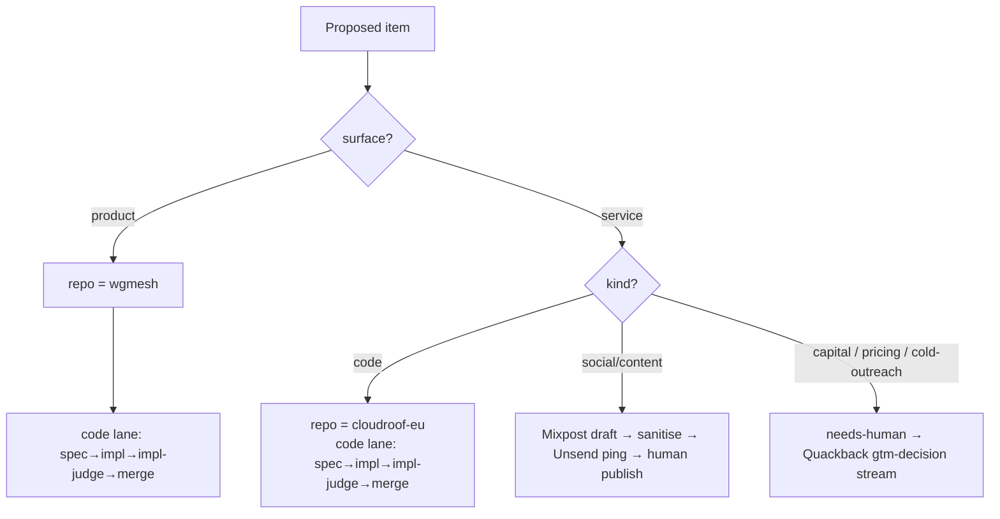

# feat: Split product (wgmesh) from service (cloudroof) across the pipeline

## Summary

The autonomous pipeline runs a single funnel pointed at one repo (`atvirokodosprendimai/wgmesh`), so go-to-market work for the managed service (cloudroof) lands as wgmesh product issues. This plan introduces an explicit **surface** axis (`product` | `service`) and routes every generated item by surface *and* kind to the terminal where it actually completes — product code merges in wgmesh, service code merges in `cloudroof-eu`, social/content drafts into the existing Mixpost human-publish rail, and capital/pricing/outreach into the `needs-human` / Quackback decision queue. The split is already mandated by `company/CONSTITUTION.md` but is structurally absent from routing code; this plan operationalizes it.

---

## Problem Frame

A single `pulse_seed_product_repo` drives `goal-sprint` ideation and `observation.py` create-routing, both hardcoded to wgmesh. Consequences (see origin: `docs/brainstorms/2026-06-21-product-service-split-requirements.md`):

- ~90% of the wgmesh aged backlog is service/GTM work, not product code.
- GTM tasks (outreach, ad spend, pricing) sit permanently stuck in a code funnel — they cannot `merge`.
- Revenue attribution is unreadable: wgmesh and cloudroof are one bucket, so product traction can't be told from service revenue (the recurring "seed products remain 0" signal in `company/loop-history/`).

`company/CONSTITUTION.md` (lines 51, 80, 96) and `company/system-prompt.md` (lines 21, 27, 66) already define wgmesh = AGPL product / cloudroof = managed service. The routing layer (`pipeline/wgmesh_pipeline/observation.py`, `observation_gather.py`) knows only `fn:dev` vs `needs-human` with no surface branching — and `fn:dev` even wins ties (`observation.py:198`), actively pulling GTM into the code lane.

---

## Requirements Traceability

| Origin requirement | Addressed by |
|---|---|
| R1 — Surface taxonomy (`product`/`service` axis) | U1, U2 |
| R2 — Routing by surface + kind; GTM not stranded in code lane | U2, U3 |
| R3 — Dual goal-sprint routing | U4 |
| R4 — Two repos, two roadmaps | U3, U4 |
| R5 — Quackback stream split | U7 |
| R6 — Pulse dual attribution | U5 |
| R7 — GTM social reuse, re-sourced | U6 |
| R8 — Public-safety sanitise gate preserved | U6 |
| Backlog disposition (origin Q3, success criterion) | U8 (deferred follow-up) |

---

## Key Technical Decisions

**KTD1 — Surface tag is a label (`surface:product` / `surface:service`).** Mirrors the existing `fn:*` lane labels, is visible on the issue, and is queryable by every downstream surface (goal-sprint, pulse, Quackback) without a new field. Repo-of-record alone was rejected: it carries no signal until an issue is already filed in the right place, and the classifier needs the signal at creation time. (origin Q5)

**KTD2 — cloudroof code reuses the `impl-judge` gate, pointed at `cloudroof-eu`.** No second judge is built; the existing fail-closed judge config is parameterized by target repo. Keeps one gate implementation, one rubric source. (origin Q4)

**KTD3 — One goal-sprint, routed by surface.** A single weekly sprint emits surface-tagged ideas to the correct repo rather than two independent cadences. Separate cadences are a follow-up if attention load demands it, not a launch requirement. (origin Q2)

**KTD4 — Quackback stream split is specified here as a contract, implemented on `feat/quackback-decision-layer`.** This plan defines the two decision-stream categories (product-decision, gtm-decision) and their routing keys; the in-flight branch consumes that contract. This plan does not rewrite that branch. (origin Q1 reviewer/cadence detail rides with it)

**KTD5 — Misfiled aged backlog is closed-and-regenerated under the new routing, not re-homed.** Re-homing preserves work but is manual and lossy across repos; close-and-regenerate exercises the new classifier end-to-end and is the honest test that routing works. Deferred to U8 as a fast-follow once routing exists. (origin Q3)

---

## High-Level Technical Design

Routing decision an item passes through at creation (`observation.py` after classification):

Two orthogonal axes decide the terminal: **surface** (`product`|`service`) picks the repo/queue family; **kind** (`code`|`social`|`human-gated`) picks the terminal within the service family. Product is always code today. The `fn:dev`-beats-`needs-human` collapse in `_route_one_lane` must be replaced by surface-aware routing so a `service`+`human-gated` item is never silently promoted into the code lane.

---

## Implementation Units

### U1. Surface taxonomy in strategy + prompt docs

- **Goal:** Establish the `product` vs `service` axis as authoritative, orthogonal to the existing `product` vs `meta` axis.
- **Requirements:** R1.
- **Dependencies:** none.
- **Files:** `STRATEGY.md`, `company/system-prompt.md`, `CONCEPTS.md` (gap-fill `surface` if the file exists).
- **Approach:** Add a "product vs service" subsection to STRATEGY.md key-metrics framing (today it only warns product-vs-meta). State that wgmesh metrics measure product traction and cloudroof metrics measure service revenue. In `company/system-prompt.md`, make the wgmesh/cloudroof-eu surface table explicit about which funnel each feeds and that GTM is never filed against wgmesh.
- **Patterns to follow:** the existing product-vs-meta callout block in `STRATEGY.md`.
- **Test scenarios:** `Test expectation: none -- documentation/strategy text, no behavioral change.`
- **Verification:** STRATEGY.md and system-prompt name the surface axis and the routing rule; a reader can tell which repo a given kind of work belongs in.

### U2. Surface classification + label emission

- **Goal:** The LLM proposer tags every item with exactly one surface label and a kind, and the routing function carries surface through instead of collapsing to `fn:dev`.
- **Requirements:** R1, R2.
- **Dependencies:** U1.
- **Files:** `pipeline/wgmesh_pipeline/observation_gather.py`, `pipeline/wgmesh_pipeline/observation.py`, `pipeline/tests/test_observation.py` (and/or `pipeline/tests/test_observation_gather.py`).
- **Approach:** Extend the label-emission prompt (`observation_gather.py:289-293`) to require one `surface:product`/`surface:service` label plus the existing lane label. Replace `_route_one_lane` (`observation.py:193-200`) with surface-aware routing: a `service` + human-gated item keeps `needs-human` (must NOT be promoted to `fn:dev`); a `product`/`service` code item keeps `fn:dev`. Add a `surface` field to the create dataclass so downstream units read it without re-parsing labels.
- **Patterns to follow:** existing `FN_DEV_LABEL`/`NEEDS_HUMAN_LABEL` constants and `_route_one_lane` structure.
- **Test scenarios:**
  - Covers R1. Proposer output with `surface:service` + outreach kind → routed `needs-human`, surface preserved, NOT collapsed to `fn:dev`.
  - `surface:product` + code kind → `fn:dev`, repo resolves to wgmesh (U3).
  - `surface:service` + code kind → `fn:dev`, repo resolves to cloudroof-eu (U3).
  - Hedged dual lane labels on a `service` human-gated item → `needs-human` wins (inverts today's `fn:dev`-wins for the service+human case).
  - Missing surface label → defaults to a safe lane (e.g., `needs-human`) and logs, rather than mis-filing as product code.
- **Verification:** routing returns the correct (repo, lane, surface) triple for each surface×kind combination; no GTM item lands in the code lane.

### U3. Repo routing by surface

- **Goal:** Create-target repo is chosen by surface, not hardcoded to wgmesh.
- **Requirements:** R2, R4.
- **Dependencies:** U2.
- **Files:** `pipeline/wgmesh_pipeline/observation.py`, `pipeline/tests/test_observation.py`.
- **Approach:** Replace the hardcoded `TARGET_REPO = f"{ORG}/wgmesh"` (`observation.py:46`) with a surface→repo map (`product`→wgmesh, `service`→cloudroof-eu). Thread the resolved repo through create calls. Keep `ORG` as the single org constant.
- **Patterns to follow:** existing `ORG`/`TARGET_REPO` module constants and the create path that consumes `repo`.
- **Test scenarios:**
  - product item → create targets `atvirokodosprendimai/wgmesh`.
  - service item → create targets `atvirokodosprendimai/cloudroof-eu`.
  - dedup/vetting still scopes per-repo (a wgmesh duplicate does not suppress a distinct cloudroof issue).
- **Verification:** issues are opened in the repo matching their surface; per-repo dedup is intact.

### U4. goal-sprint dual-surface emission

- **Goal:** Weekly ideation emits product ideas to wgmesh and service/GTM ideas to cloudroof-eu, surface-tagged.
- **Requirements:** R3, R4.
- **Dependencies:** U2, U3.
- **Files:** `.github/workflows/goal-sprint.yml`, `.compound-engineering/config.local.yaml`.
- **Approach:** Where goal-sprint reads `pulse_seed_product_repo` (`goal-sprint.yml:66,72`), have it resolve both the product repo and the service repo and tag each emitted idea with its surface so U2/U3 route it. Keep the single weekly cadence and the fingerprint anti-flood (KTD3); add surface to the fingerprint so a product idea and a service idea in the same week don't collide.
- **Patterns to follow:** the existing config-read loop and fingerprint guard in `goal-sprint.yml`.
- **Test scenarios:**
  - `Test expectation: none -- workflow YAML + config; behavior covered by U2/U3 routing tests. Validate via dry-run dispatch.`
- **Execution note:** validate with the workflow's existing `dry_run`/`workflow_dispatch` input before enabling live.
- **Verification:** a dry-run sprint emits at least one product-tagged and one service-tagged idea to the correct repos; fingerprint does not suppress one surface because the other changed.

### U5. Pulse dual-repo attribution

- **Goal:** The pulse reads product traction and service revenue as separate lines, closing the attribution gap.
- **Requirements:** R6.
- **Dependencies:** U1.
- **Files:** `.compound-engineering/config.local.yaml`, the corrected pulse-generation path that consumes `pulse_seed_product_repo` (per `config.local.yaml:26-28` note), `docs/pulse-reports/` (output only).
- **Approach:** Introduce a product repo and a service repo (extend `pulse_seed_product_repo`, or add `pulse_service_repo`, preserving the single-valued key's backward compat). Pulse usage/attribution sections report wgmesh and cloudroof separately. Aged-item and action-success KPIs already scope "both repos" — extend that scope to include cloudroof-eu explicitly.
- **Patterns to follow:** existing `pulse_metric_sources` and the "SCOPE = BOTH repos" KPI blocks in `config.local.yaml`.
- **Test scenarios:**
  - `Test expectation: none -- config + report-generation text; verify by running a pulse and confirming product/service lines render distinctly.`
- **Verification:** a generated pulse shows wgmesh product metrics and cloudroof service metrics on separate lines; "seed products 0" ambiguity is gone.

### U6. cloudroof social/content terminal

- **Goal:** Service social/content GTM drafts to Mixpost for one-click human publish, sourced from cloudroof growth context.
- **Requirements:** R7, R8.
- **Dependencies:** U2.
- **Files:** `.github/workflows/cloudroof-social-drip.yml` (new), reusing the script pattern of `.github/workflows/wgmesh-social-drip.yml`.
- **Approach:** Clone the wgmesh-social-drip pattern (Mixpost draft API, sanitise gate, Unsend review ping, human publish — no auto-publish per the 2026-06-19 decision) but source from cloudroof growth signals (cloudroof-eu merges / positioning) instead of wgmesh PRs, and target the cloudroof brand account(s). Keep `MIXPOST_*` and `UNSEND_*` env wiring identical.
- **Patterns to follow:** `.github/workflows/wgmesh-social-drip.yml` end-to-end (cron + best-effort steps + sanitise + Mixpost draft + Unsend ping).
- **Test scenarios:**
  - generated copy passes `company/scripts/sanitise.sh` before drafting; a draft containing a secret/PII is blocked, not posted.
  - no user-facing cloudroof change in window → evergreen fallback drafted, cadence never dark.
  - Mixpost/API failure → warn + non-blocking, no garbage posted.
  - draft created with `schedule:false` (draft, never auto-published).
- **Execution note:** reuse the existing best-effort + sanitise discipline; validate via `dry_run` before live.
- **Verification:** a dry-run produces a cloudroof draft (ship-news or evergreen), sanitised, with an operator review ping — never an unattended publish.

### U7. Quackback two-stream contract

- **Goal:** Define the product-decision vs gtm-decision stream split as a contract the in-flight Quackback layer consumes.
- **Requirements:** R5.
- **Dependencies:** U2 (surface label is the routing key).
- **Files:** a contract doc under `docs/` (e.g., `docs/quackback-decision-streams.md`), referenced from the `feat/quackback-decision-layer` work; no rewrite of that branch here.
- **Approach:** Specify two decision-stream categories keyed off the surface label: `product-decision` (wgmesh product judgment) and `gtm-decision` (cloudroof go-to-market: capital, pricing, outreach). Define routing key, reviewer-hat field, and SLA per stream. Leave the transport/implementation to the Quackback branch (KTD4).
- **Patterns to follow:** the decision-layer typing already drafted on `feat/quackback-decision-layer` (coordinate, do not duplicate).
- **Test scenarios:** `Test expectation: none -- contract/spec doc; conformance tests land with the Quackback branch implementation.`
- **Verification:** the contract names both streams, their routing key (surface label), and per-stream reviewer/SLA; the Quackback branch can implement against it without re-deciding scope.

### U8. Aged-backlog disposition under new routing (deferred follow-up)

- **Goal:** Clear the misfiled wgmesh backlog (11 aged PRs + GTM issues) by closing-and-regenerating under the new classifier.
- **Requirements:** origin success criterion (no orphaned backlog).
- **Dependencies:** U2, U3, U4 (routing must exist first).
- **Files:** none in this repo by default — operates on GitHub issues/PRs via the live pipeline; a one-shot dispatch may reuse `goal-sprint`/observation paths.
- **Approach:** Once routing is live, close the misfiled wgmesh GTM PRs/issues with a goal-citing reason and let surface-aware ideation regenerate the still-valid ones into the correct repo/lane. Product items (e.g., #539 Android VPN) stay in wgmesh. Do not bulk-close without reason (honors the PR-processing KPI).
- **Patterns to follow:** `company/scripts/pr-review-merge.sh` escalation/close-with-reason path; the conflict-heal disposition discipline.
- **Test scenarios:** `Test expectation: none -- operational disposition; correctness is observed via the next pulse showing zero misfiled aged items.`
- **Verification:** next pulse shows the wgmesh backlog free of service/GTM items; regenerated items appear in cloudroof-eu with `surface:service`.

---

## Scope Boundaries

**In scope:** surface taxonomy + label classifier; surface-aware repo + lane routing; goal-sprint dual emission; pulse dual attribution; cloudroof social terminal; Quackback stream contract; backlog disposition (U8).

**Deferred for later** (from origin): separate `@cloudroof` social account vs shared brand account (U6 can target either); separate goal-sprint cadence per surface; auto-publish-after-timeout; new social channels (X/LinkedIn/Reddit).

**Outside this product's identity** (from origin): rebuilding/replacing the Mixpost rail; unattended auto-publish to public accounts (explicitly rejected); monetizing the wgmesh product itself — revenue lives only in the cloudroof managed layer per CONSTITUTION; the split must never create a paywalled product surface.

**Deferred to Follow-Up Work** (plan-local sequencing): the cloudroof-eu code funnel's internal mechanics (mirrors wgmesh's spec→impl→judge→merge; stand up once routing lands); the Quackback stream *implementation* (lands on `feat/quackback-decision-layer` against U7's contract).

---

## System-Wide Impact

- **Routing core** (`observation.py`/`observation_gather.py`) changes shape for every generated item — the highest-blast-radius unit (U2/U3). All create paths must read the new `surface` field.
- **In-flight branch coordination:** `feat/quackback-decision-layer` must adopt U7's contract; sequence U7 so that branch can consume it without rework.
- **Cross-repo:** introduces `cloudroof-eu` as a live pipeline target; its label set (`surface:*`, `fn:dev`) and branch protection / `impl-judge` check must be provisioned (KTD2) before service-code routing goes live.

---

## Risks & Dependencies

- **Misclassification risk:** the LLM proposer tagging surface wrong sends work to the wrong funnel. Mitigation: U2 default-to-`needs-human` on a missing/ambiguous surface (fail safe, not fail into product code) + the surface label is human-visible and correctable.
- **cloudroof-eu readiness:** routing service code there assumes the repo has the lane labels, `impl-judge` required check, and merge lane provisioned. Dependency: provision cloudroof-eu before enabling U3 service-code routing (can ship product-side first).
- **Quackback contract drift:** if `feat/quackback-decision-layer` lands before U7, the stream split may need retrofitting. Mitigation: land U7's contract doc early and reference it from that branch.

---

## Sequencing

U1 → U2 → U3 (routing core, product-side first, safe to ship before cloudroof-eu is provisioned) → U4 (dual emission) → U5 (pulse) and U6 (social) and U7 (Quackback contract) in parallel → U8 (backlog disposition, after routing is live). Provision `cloudroof-eu` (labels + `impl-judge` + merge lane) before enabling U3's service-code path live.

---

## Open Questions (deferred to execution)

- Exact config shape for dual pulse repos (extend `pulse_seed_product_repo` to a list vs add `pulse_service_repo`) — resolve in U5 against the current consumer.
- Whether goal-sprint emits both surfaces every week or alternates — resolve in U4 once dual emission runs.
- cloudroof brand account identity for U6 (shared vs dedicated `@cloudroof`) — operator call before U6 goes live.
