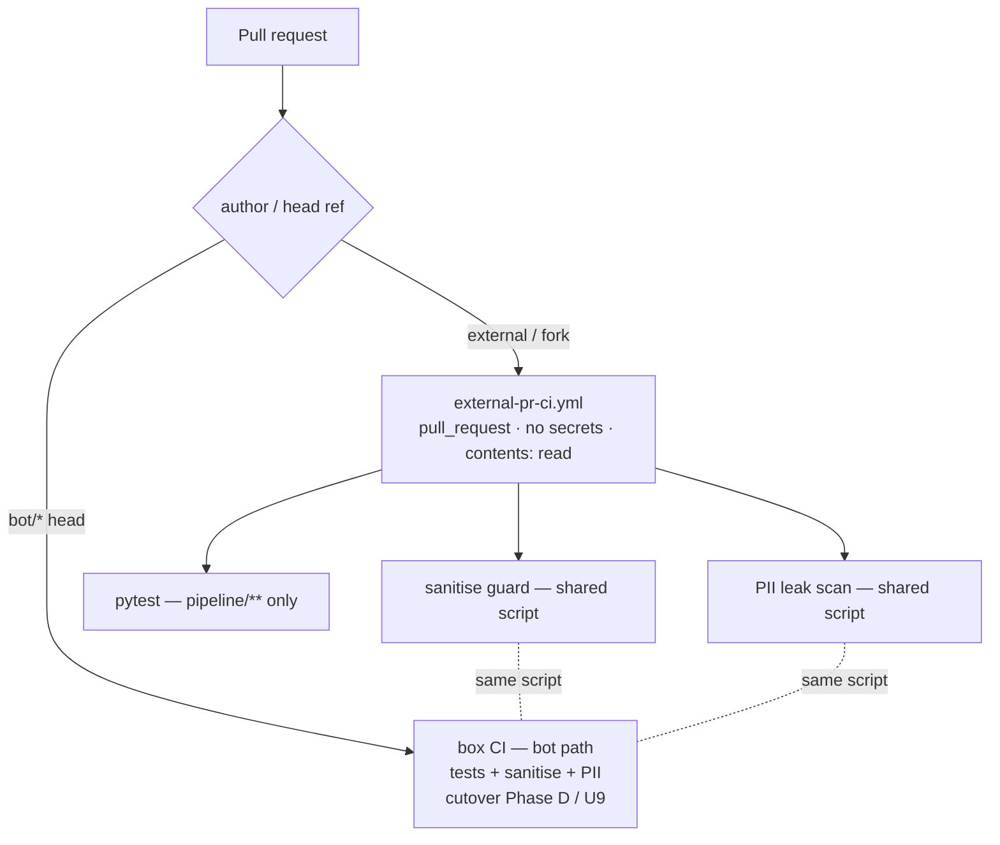

# feat: single hardened external-PR CI workflow (#1599 U10)

## Summary

Build the one Actions CI workflow that survives the #1599 box cutover: a sandboxed, secretless `pull_request` workflow that runs the **tests + sanitise + PII-leak** guards on untrusted external/fork PRs, where the box (which CIs bot PRs) must never reach. It folds the three current standalone CI workflows (`pipeline-ci`, `sanitise-wall`, `pii-policy-check`) into one author-scoped file and extracts their guard logic into shared scripts so the bot path (box) and fork path (Actions) run *identical* checks with no drift. This plan builds the survivor only — it does not disable the three originals or wire a required check (both belong to the cutover's Phase D, gated by the "no window without a leak guard" rule).

---

## Problem Frame

After the #1599 cutover, the box owns CI for bot-authored PRs. Untrusted external/fork PRs must be CI'd somewhere with **zero box/secret access** — GitHub's Actions sandbox (R6, R10). Today that coverage is spread across three workflows that already skip `bot/*` heads but otherwise run on every PR:

- `pipeline-ci.yml` — pytest on `pipeline/**` (path-filtered)
- `sanitise-wall.yml` — `scripts/lint/check-llm-emit-sanitise.sh`
- `pii-policy-check.yml` — per-commit restricted-path email/PII diff scan (with the commit-then-move-out bypass guard)

The PII guard exists because of a real public-repo email-leak incident, so the cutover forbids any window where a PR class merges with no leak guard. Consolidating the fork-side coverage into one hardened workflow — and sharing the guard scripts with the box's bot-side CI — is the precondition that lets Phase D later disable the three standalone workflows safely.

---

## Requirements Traceability

| #1599 requirement | Addressed by |
|---|---|
| R6 — external PRs CI'd by one retained Actions workflow, no box/secret access | U1, U3 |
| R10 — no GitHub-side trigger drives the loop (this is fork-CI only, not loop) | U1 |
| R11 — no secrets in the repo / workflow | U1 |
| U10 hardening checklist (pull_request, no secrets, contents:read, author filter, sanitise+PII) | U1, U2, U3 |
| "no window without a leak guard" (shared guard, single source) | U2 |

---

## Key Technical Decisions

**KTD1 — New `external-pr-ci.yml`, don't repurpose one of the three.** The three originals stay live and untouched; the #1599 strangler (KTD2 there) disables them later only after both CI paths are proven. Repurposing one now would entangle this additive change with the cutover's disable ordering.

**KTD2 — Extract the sanitise + PII guards into shared scripts.** The PII scan is non-trivial (per-commit restricted-path walk, escape rules, the move-out bypass guard). Lift it from `pii-policy-check.yml` into a script under `scripts/lint/` (sanitise already is one) so the box's bot-side CI and this fork-side CI invoke the *same* implementation. One source of truth means the two paths can't drift — directly serving the "no window without a leak guard" rule.

**KTD3 — `pull_request` only, never `pull_request_target`.** `pull_request_target` runs with base-repo secrets in scope against fork-supplied code — a secret-exfiltration vector. The workflow uses `pull_request`, references no `secrets.*`, and sets `permissions: contents: read`. Fork code then has no secret to reach.

**KTD4 — Filter to external/non-bot authors.** Invert the existing `bot/*`-head skip: this workflow runs *only* for non-bot/external authors (bot PRs are CI'd on the box). Prevents double-gating and keeps the fork path narrow.

**KTD5 — Keep the `pipeline/**` path filter on pytest.** Don't run the full suite on every fork PR; mirror `pipeline-ci`'s existing path filter. Sanitise + PII always run (they are the leak guards; forks are the highest-PII-risk authors).

**KTD6 — No required-check wiring in this plan.** Making it a required check on main belongs to cutover Phase D, when the box's bot-side CI equivalent (U9 there) goes live. Wiring it now, while bot PRs still use the old workflows, risks gating conflicts.

---

## High-Level Technical Design

Two CI paths, one guard implementation. The dotted links are the load-bearing part: sanitise + PII run from the same extracted scripts on both paths, so neither path can silently lose the guard.

---

## Implementation Units

### U1. External-PR CI workflow skeleton (security spine)

- **Goal:** A `pull_request`-triggered, secretless, read-only workflow scoped to external/non-bot authors.
- **Requirements:** R6, R10, R11, U10 checklist items 1–4.
- **Dependencies:** none.
- **Files:** `.github/workflows/external-pr-ci.yml` (new).
- **Approach:** Trigger `on: pull_request` (never `pull_request_target`). `permissions: contents: read`. No `secrets.*` anywhere. Author/event filter that runs the jobs only for non-bot/external authors (invert the `!startsWith(github.event.pull_request.head.ref, 'bot/')` pattern the three originals use; also treat fork-origin PRs as in-scope). Checkout at `github.event.pull_request.head.sha`.
- **Patterns to follow:** the `on`/`permissions`/`if:` blocks already in `.github/workflows/pii-policy-check.yml` and `sanitise-wall.yml`.
- **Test scenarios:** `Test expectation: none -- workflow config; verified behaviorally in U3 (synthetic external PR gets a status; no secret step runs).`
- **Verification:** the file references no secret; `permissions` is read-only; the job condition selects external/non-bot PRs.

### U2. Extract sanitise + PII guards into shared scripts

- **Goal:** One implementation of each guard, callable by both the fork-side (this workflow) and the box's bot-side CI.
- **Requirements:** "no window without a leak guard"; U10 checklist item 5.
- **Dependencies:** none (can precede or parallel U1).
- **Files:** `scripts/lint/check-pii-policy.sh` (new — lifted from `pii-policy-check.yml`'s inline run block), `scripts/lint/check-llm-emit-sanitise.sh` (existing — confirm it is a standalone callable; adjust only if it isn't), `pipeline/tests/` or `scripts/lint/` test for the PII script.
- **Approach:** Move the per-commit restricted-path scan (base/head SHA resolution, `git rev-list` range, per-commit `diff-tree`, the move-out bypass, the `gh_escape` annotation encoding) verbatim into `check-pii-policy.sh`, parameterized by `BASE_SHA`/`HEAD_SHA` env. Leave `pii-policy-check.yml` working by having it call the new script (proves parity before any consolidation). Behavior must be byte-for-byte unchanged — this is an extract-refactor, not a rewrite.
- **Execution note:** characterization-first — capture the current `pii-policy-check` behavior on a sample diff (clean + a planted email) before extracting, and assert the script reproduces it.
- **Patterns to follow:** `scripts/lint/check-llm-emit-sanitise.sh` as the script shape; the existing inline block as the exact logic to preserve.
- **Test scenarios:**
  - Clean diff (no restricted-path email) → exit 0, PASS.
  - Planted email in a restricted path at HEAD → non-zero exit, file+line annotation emitted.
  - Email added in an intermediate commit then moved OUT before HEAD → still caught (the move-out bypass guard).
  - Filename containing `,` or `:` → annotation properties are escaped, not injected.
  - Unresolvable base SHA → error exit, not a false PASS.
- **Verification:** `pii-policy-check.yml` still passes its existing runs using the extracted script; the new script's tests are green.

### U3. Wire the three checks into external-pr-ci and verify on a synthetic fork PR

- **Goal:** The external workflow runs pytest (path-filtered), sanitise, and PII via the shared scripts, and is proven on a real external PR.
- **Requirements:** R6; U10 checklist item 5; U10 verification.
- **Dependencies:** U1, U2.
- **Files:** `.github/workflows/external-pr-ci.yml`.
- **Approach:** Add jobs/steps: pytest gated by the `pipeline/**` path filter (KTD5); sanitise via `scripts/lint/check-llm-emit-sanitise.sh`; PII via `scripts/lint/check-pii-policy.sh` with `BASE_SHA`/`HEAD_SHA` from the PR event. All steps run without secrets. Then open a throwaway external/fork PR (or simulate via a non-bot branch that the filter treats as external) to confirm a CI status appears and no secret-bearing step exists to run.
- **Patterns to follow:** the step wiring in the three source workflows.
- **Test scenarios:**
  - External PR touching `pipeline/**` → pytest + sanitise + PII all run; status reported.
  - External PR touching only docs → pytest path-filter skips; sanitise + PII still run.
  - External PR with a planted email → PII job fails the check.
  - Bot (`bot/*`) PR → this workflow's jobs are skipped (no double-run).
- **Verification:** an external PR receives an Actions CI status; grep confirms zero `secrets.` references; bot PRs are not processed here.

---

## Scope Boundaries

**In scope:** the new `external-pr-ci.yml`; extracting the sanitise + PII guards to shared scripts; proving the fork path end-to-end.

**Deferred to Follow-Up Work** (owned by the #1599 cutover, not this plan):
- Disabling `pipeline-ci.yml` / `sanitise-wall.yml` / `pii-policy-check.yml` (cutover Phase D, after the box bot-CI also runs the shared guards — KTD6, the ordering rule).
- The box's bot-side CI consuming the same shared scripts (cutover U9).
- Making `external-pr-ci` a required check on main (cutover Phase D).

**Outside this plan:** the rest of the cutover (convergence-live, control loop, monitoring, provisioning, dead-man's-switch).

---

## Risks & Dependencies

- **Risk — `pull_request_target` creep.** Any later edit adding `pull_request_target` or a `secrets.*` reference reopens the fork-secret vector. Mitigation: the U3 verification greps for both; consider a meta-lint that fails if `external-pr-ci.yml` contains either token.
- **Risk — guard drift during extraction.** If `check-pii-policy.sh` diverges from the inline logic, a fork PR could pass while the bot path fails (or vice-versa). Mitigation: U2 is an extract-refactor with characterization tests + `pii-policy-check.yml` kept calling the script as a live parity proof.
- **Dependency — fork-PR CI semantics.** First-time fork contributors' workflows may need maintainer approval to run; that's GitHub's external-PR gate and is acceptable (read-only, no secrets). Note it; don't try to bypass it.

---

## Open Questions (deferred to execution)

- Exact job split — one job with sequential steps vs parallel jobs (pytest // sanitise // PII). Resolve in U3 against runner-time; parallel is cheap and isolates failures.
- Whether `check-llm-emit-sanitise.sh` is already cleanly callable or needs a thin wrapper — confirm in U2.
