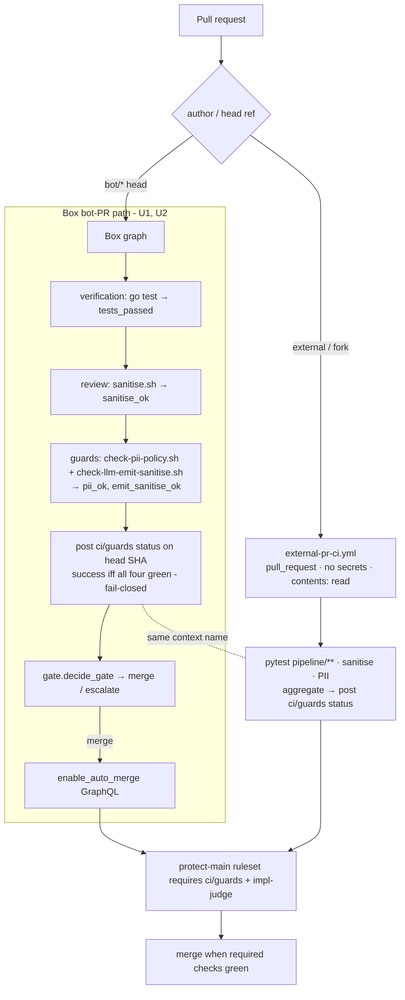

# refactor: #1599 Phase D — bot-PR CI on the box + required-check cutover

## Summary

Complete the CI phase of the #1599 Actions→box cutover. The external-PR side (U10) shipped this session (`external-pr-ci.yml` + the shared `scripts/lint/check-pii-policy.sh` / `check-llm-emit-sanitise.sh` guards, merged in #1934). What remains is the **bot-PR side (U9)** and the strangler retirement of the three standalone workflows.

Today the box's own bot-authored PRs merge gated only by the LLM `impl-judge` required check plus the box's *internal* deterministic decision (`gate.py`, which already consumes Go `tests_passed` + `sanitise_ok`). The three standalone Actions guards (`pipeline-ci`, `sanitise-wall`, `pii-policy-check`) **skip `bot/*` heads**, so bot PRs currently get **no path-scoped PII scan and no static emit-sanitise scan at all** — a real leak-guard gap on a public repo. Phase D closes it: the box runs the PII + emit-sanitise guards on every bot PR, surfaces the deterministic verdict as a **single required GitHub status check** shared with the external path, swaps the `protect-main` ruleset to require it, and disables the three now-redundant workflows under strangler discipline (disable, don't delete — deletion is #1599 U13, last).

---

## Problem Frame

#1599 R6 requires bot-PR CI to run **on the box** (no GitHub-side trigger in the loop, R10) while untrusted external PRs stay sandboxed on Actions (R11). U10 delivered the external sandbox and extracted the guards to shared scripts so both paths run identical checks. Three facts from recon shape the bot side:

1. **The box posts no check-runs.** `impl-judge` is a GitHub *Actions* workflow that posts a required CI check; the box merely calls `enable_auto_merge` (GraphQL, `github/client.py:322-361`) and GitHub merges once the ruleset's required checks pass. The box's deterministic gate (`graph/nodes/gate.py:21-94`) is an *internal* decision with no external surface.
2. **The box already runs tests + sanitise, but not PII or emit-sanitise.** `verification.py` runs `go build/test/vet` → `tests_passed`; `review.py:32-44` runs `company/scripts/sanitise.sh` → `sanitise_ok`. Neither the path-scoped `check-pii-policy.sh` nor the static `check-llm-emit-sanitise.sh` runs on bot PRs anywhere.
3. **A box-posted required status orphans external PRs.** A required check the box posts only on bot PRs would sit `Expected` forever on fork PRs (the box never touches forks, by R11). The required-check-with-no-run deadlock is a known failure here (see Risks).

The user has chosen a **status-check gate** (not a box-internal-only gate) and **ruleset swap in scope**. The design must therefore make the box's deterministic verdict an enforced status check **without** orphaning the external path.

---

## Requirements Traceability

| #1599 requirement | Addressed by |
|---|---|
| R6 — box runs CI for bot PRs; external PRs CI'd by the one retained Actions workflow | U1, U2, U3 |
| R10 — no GitHub-side workflow trigger drives the loop (bot CI runs in the box graph) | U1, U2 |
| R11 — no secrets/PII in repo or fork-reachable workflow (external path stays secretless) | U3 |
| R9 — strangler: disable only after the box equivalent is proven; disable-don't-delete | U4, U5 |
| #1599 U9 — test/lint/sanitise/PII for bot PRs run on the box; retire those checks for bot PRs | U1, U2, U4, U5 |
| #1599 U9 ordering — "no window where a PR class merges with no leak guard" | U3, U4 (sequencing) |

---

## Key Technical Decisions

**KTD1 — One required status context, two producers.** A single status context (working name **`ci/guards`**) is the lone CI gate in the `protect-main` ruleset. It is produced by the **box** for bot PRs and by **`external-pr-ci.yml`** for external PRs. Because exactly one producer fires per PR class and both post the *same* context name, every PR gets the context satisfied and neither class orphans. This is the load-bearing decision that makes "box runs bot CI" (R6) and "required check" and "no external-PR orphan" simultaneously satisfiable. (Alternative — three separate job-named required checks satisfied by Actions on external and box-posted statuses on bot — is rejected in Alternatives: the check-run-name vs commit-status-context matching is brittle and `pytest`/`go test` naming diverges across the two paths.)

**KTD2 — Box gains the two missing guards and posts the verdict via the REST statuses API.** The box runs `check-pii-policy.sh` (over the bot PR's `BASE..HEAD` range) and `check-llm-emit-sanitise.sh` (over the checked-out tree) as new deterministic gate inputs (`pii_ok`, `emit_sanitise_ok`), then posts the `ci/guards` commit status on the PR head SHA via a new `create_commit_status` client method (`POST /repos/{repo}/statuses/{sha}`). `ci/guards` = `tests_passed AND sanitise_ok AND pii_ok AND emit_sanitise_ok`. This keeps bot CI on the box (R6/R10) while giving GitHub's auto-merge engine a required check to wait on.

**KTD3 — Fail-closed on every guard.** Any guard subprocess that errors, times out, or exits non-zero yields `ci/guards = failure` (never success) and an `escalate` gate decision. Mirror the `impl-judge` fail-closed discipline (catch `BaseException`, not just `Exception`; a timeout/`SystemExit` must read as failure, not a skipped pass). The status is posted **before** `enable_auto_merge`, so GitHub never sees a green-by-absence gate.

**KTD4 — Strangler sequencing with no leak-guard window.** Order is hard: (a) box runs + posts `ci/guards` and `external-pr-ci` posts `ci/guards`, both proven green on real PRs of each class; (b) **only then** swap the ruleset — add `ci/guards`, remove the three originals' contexts; (c) **only then** disable the three workflows. The PII+sanitise leak guard is carried by `ci/guards` on both classes before the originals leave the required set or get disabled. Disable-don't-delete; deletion is #1599 U13.

**KTD5 — Drain CONFLICTING bot PRs before the ruleset swap.** A CONFLICTING/DIRTY PR fires no `pull_request` workflows and the box posts no status on a branch it can't process — so a newly-required `ci/guards` would be *absent* (not red) and the PR dead-ends. Conflict-heal (#1930) is live; the swap unit gates on "zero CONFLICTING open bot PRs" first.

**KTD6 — The box-posted status is not unforgeable; that hardening is out of scope.** The same single PAT authors, gates, posts `ci/guards`, and merges — so the box *could* post success without running the guards. Phase D buys auditability and branch-protection structure, not forgery-resistance. The unforgeable control (#1599's single-identity-concentration risk: an off-box required check or scope-split CI-read vs merge-write PATs) is a separate effort; noted in Risks, not solved here.

---

## High-Level Technical Design

Two producers, one required context. The dotted box-internal path is the new bot-side work; the external path reuses the just-shipped `external-pr-ci.yml`, refactored only to emit the shared context.

The dotted link is the invariant: `ci/guards` is one required context fed by whichever producer matches the PR class, so branch protection is satisfiable for both without orphaning either.

---

## Implementation Units

### U1. Box runs the PII + emit-sanitise guards on bot PRs and threads them into the gate

- **Goal:** The box runs `check-pii-policy.sh` (over the PR's `BASE..HEAD`) and `check-llm-emit-sanitise.sh` (over the checked-out tree) on every bot PR, exposing `pii_ok` and `emit_sanitise_ok` to the gate decision.
- **Requirements:** R6, R10; #1599 U9.
- **Dependencies:** none.
- **Files:** `pipeline/wgmesh_pipeline/graph/nodes/guards.py` (new node), `pipeline/wgmesh_pipeline/graph/nodes/gate.py` (extend `decide_gate` inputs + reasons), `pipeline/wgmesh_pipeline/poller.py` (wire the node + state keys, around the `implemented→reviewed` transition, poller.py:183-205), `pipeline/wgmesh_pipeline/github/client.py` (helper to resolve PR `base.sha`/`head.sha` and ensure the head ref is fetched for the range scan), `pipeline/tests/test_guards_node.py` (new), `pipeline/tests/test_gate.py` (extend).
- **Approach:** Mirror the subprocess pattern in `review.py:32-44` (`run_sanitise`) and `verification.py:60-91` (`run_verification`). The guards node fetches the PR head, runs `check-pii-policy.sh` with `BASE_SHA`/`HEAD_SHA` env over the range and `check-llm-emit-sanitise.sh` with the repo root, and sets `pii_ok` / `emit_sanitise_ok` (both default **false** on any non-zero/error/timeout — fail-closed, KTD3). Extend `decide_gate` to AND these into the merge decision and append `"PII check failed"` / `"emit-sanitise failed"` reasons. No change to the Go test or `sanitise.sh` steps — they already feed the gate.
- **Execution note:** test-first — write the fail-closed gate assertions before the node, so a guard error provably blocks rather than silently passing.
- **Patterns to follow:** `pipeline/wgmesh_pipeline/graph/nodes/review.py` (subprocess guard node shape); `verification.py` (multi-step subprocess + timeout); `gate.py:21-94` (`decide_gate` reason accumulation).
- **Test scenarios:**
  - Covers R6. Bot PR with a clean diff → `pii_ok=true`, `emit_sanitise_ok=true`, gate unaffected (still merges if other gates green).
  - Planted email in a restricted path on the bot PR → `pii_ok=false` → gate returns `escalate`, no merge.
  - Unsanitised LLM sink added to a workflow/script in the PR → `emit_sanitise_ok=false` → `escalate`.
  - Guard subprocess times out / raises → the corresponding flag is **false**, gate escalates (fail-closed) — assert it is not treated as a skipped pass.
  - PII script reports unresolvable base SHA → treated as failure, not pass.
- **Verification:** A bot PR carrying a planted PII/sanitise violation is escalated to `needs-human` by the box with no merge; a clean bot PR is unaffected.

### U2. Box posts the `ci/guards` required status on the PR head

- **Goal:** The box surfaces its deterministic CI verdict as a GitHub commit status named `ci/guards`, posted on the PR head SHA before auto-merge is enabled.
- **Requirements:** R6, R10; #1599 U9.
- **Dependencies:** U1.
- **Files:** `pipeline/wgmesh_pipeline/github/client.py` (new `create_commit_status(sha, context, state, description)` → `POST /repos/{repo}/statuses/{sha}`; mirror the existing REST/urllib helpers around client.py:597-636), `pipeline/wgmesh_pipeline/graph/nodes/guards.py` (post the status after computing the four flags), `pipeline/wgmesh_pipeline/github/protocol.py` and `gitea.py` (add the method to the client protocol + any second backend, matching how existing client methods are declared), `pipeline/tests/test_create_commit_status.py` (new), `pipeline/tests/test_guards_node.py` (extend).
- **Approach:** Compute `ci/guards = tests_passed AND sanitise_ok AND pii_ok AND emit_sanitise_ok`; post `state=success` only when all four are true, else `state=failure` with a short non-PII description (never echo a matched email — reuse the U10 redaction discipline). Post **before** `enable_auto_merge` (gate.py:114) so GitHub's auto-merge engine sees the context. The context string is config-surfaced (a constant in `config.py`) so the ruleset name and the posted name cannot drift.
- **Execution note:** test-first — assert the status is posted on the head SHA with `failure` on every guard-false branch before wiring the happy path.
- **Patterns to follow:** `github/client.py` REST helpers (urllib request shape, auth header, timeout); `config.py` for the shared context constant.
- **Test scenarios:**
  - Covers R6. All four flags true → one `POST /statuses/{head_sha}` with `state=success`, `context=ci/guards`.
  - Any single flag false → `state=failure`; auto-merge is not enabled for that PR.
  - Status is posted on the **head** SHA (not the merge ref), so GitHub associates it with the PR correctly.
  - Failure description contains no PII/secret value (redaction preserved).
  - `create_commit_status` HTTP error → surfaced loudly (the guard run is treated as failed, never a silent success).
- **Verification:** A real bot PR shows a `ci/guards` status (green on clean, red on a planted violation) posted by the box; auto-merge waits on it.

### U3. `external-pr-ci.yml` emits the same `ci/guards` status context

- **Goal:** The external path posts the identical `ci/guards` context so the one required check is satisfied on fork/external PRs without the box.
- **Requirements:** R6, R11; #1599 U9 ("leak guard cannot lapse on the external path").
- **Dependencies:** none (can run parallel to U1/U2).
- **Files:** `.github/workflows/external-pr-ci.yml` (modify).
- **Approach:** Aggregate the existing `pytest` / `sanitise` / `pii-policy` jobs into a single terminal `ci/guards` outcome and post it as a commit status via `gh api repos/{repo}/statuses/{sha} -f context=ci/guards -f state=...` using the workflow's read token (status-write needs `statuses: write` — scope the permission to the aggregation step only; keep `contents: read` elsewhere and **no `secrets.*`**, preserving the U10 hardening). Use a `needs:`-gated aggregation job that resolves `success` only when all three guard jobs succeed, `failure` otherwise (including when a job is skipped-by-path on a docs-only PR the guards must still pass — keep sanitise+PII always-run, per U10). Confirm `pull_request` already includes `synchronize` so post-fix commits re-post the status.
- **Patterns to follow:** the just-merged `.github/workflows/external-pr-ci.yml` job structure; the `gh api .../statuses` pattern.
- **Test scenarios:**
  - Covers R11. External PR, all guards green → aggregation posts `ci/guards=success`; no secret-bearing step runs.
  - External PR with a planted PII violation → `ci/guards=failure`.
  - Docs-only external PR → pytest path-skips but sanitise+PII still run and the aggregate still posts (never absent).
  - The aggregation step has `statuses: write` but the workflow references no `secrets.*` and no `pull_request_target`.
- **Verification:** An external PR receives a `ci/guards` status from Actions identical in name to the box-posted one; `grep` confirms zero `secrets.`/`pull_request_target`.
- **Test expectation note:** workflow behavior is proven on a real external/non-bot PR (the same dogfood path U10 used — the PR for this change is itself non-bot, so it exercises the external producer).

### U4. Swap the `protect-main` ruleset to require `ci/guards`, after draining CONFLICTING bot PRs

- **Goal:** `ci/guards` becomes a required status check on `main`; the three originals' contexts are removed from the required set — with no window where a leak guard isn't required.
- **Requirements:** R9; #1599 U9.
- **Dependencies:** U2, U3 (both producers proven green on a real PR of each class).
- **Files:** `scripts/ruleset/apply-protect-main-required-checks.sh` (new — a reproducible, idempotent `gh api` script that reads, diffs, and PATCHes the ruleset), `docs/plans/2026-06-21-005-...` (this plan records the before/after context set once read).
- **Approach:** First **read** the live ruleset (`gh api repos/{repo}/rulesets/13925617`) and record its actual `required_status_checks` contexts — the current set is not stored in-repo and the gate.py comment ("impl-judge + build + status") may be aspirational. Confirm zero open CONFLICTING bot PRs (`gh pr list` + `--json mergeable,mergeStateStatus`; conflict-heal #1930 drains them) — KTD5. Then PATCH the ruleset to **add** `ci/guards` and **remove** the `pipeline-ci` / `sanitise-wall` / `pii-policy-check` contexts (whichever are actually present), keeping `impl-judge`. The script is idempotent (re-run is a no-op) and prints the diff it will apply before applying. Ruleset id `13925617`, `protect-main` — edit the **ruleset**, not classic branch protection.
- **Execution note:** This unit performs an irreversible-ish production governance change; do U2/U3 bake first and keep the prior contexts recorded so re-adding them is the rollback.
- **Test scenarios:**
  - `Test expectation: none -- governance/API change. Verified behaviorally: a post-swap bot PR and external PR each merge only after ci/guards is green; a red ci/guards blocks merge.`
- **Verification:** `gh api .../rulesets/13925617` shows `ci/guards` required and the three originals absent from required; a bot PR and an external PR each block on a red `ci/guards` and merge on green; no open PR is orphaned on a missing context.

### U5. Disable the three standalone workflows (strangler, keep files)

- **Goal:** `pipeline-ci`, `sanitise-wall`, and `pii-policy-check` stop running for all PR classes; files remain for rollback.
- **Requirements:** R9; #1599 U9.
- **Dependencies:** U4 (the workflows must be out of the required set before they stop running, or PRs orphan).
- **Files:** `.github/workflows/pipeline-ci.yml`, `.github/workflows/sanitise-wall.yml`, `.github/workflows/pii-policy-check.yml` (disable — `if: false` job guard at minimum; prefer the workflow-level disabled state where available — and drop the `push:` triggers on `pipeline-ci`/`sanitise-wall`).
- **Approach:** Disable, don't delete (KTD4; deletion is #1599 U13 after the full bake). Because `ci/guards` already carries tests+sanitise+PII on both classes (U2/U3) and is now required (U4), the originals are redundant. Leave the files in place; re-enabling is the rollback.
- **Test scenarios:**
  - `Test expectation: none -- disabling redundant workflows; the leak guard is proven carried by ci/guards in U2/U3/U4 before this runs.`
- **Verification:** The three workflows show no new runs on subsequent PRs; a bot PR and an external PR still each gate on `ci/guards`; re-enabling a disabled workflow restores its runs (rollback works).

---

## Scope Boundaries

**In scope:** box-side PII + emit-sanitise guards on bot PRs (U1); the box-posted `ci/guards` status (U2); the external producer of the same context (U3); the `protect-main` ruleset swap (U4); disabling the three standalone workflows (U5).

**Deferred to follow-up work** (owned by #1599, not this plan):
- **Deleting** the disabled workflow files — #1599 U13, only after the full-cutover bake.
- The box's other absorbed subsystems (control loop, monitoring, provisioning) — Phases B/C/E.

**Outside this plan:**
- **Unforgeable CI control** (off-box required check, or scope-split CI-read vs merge-write PATs) — the single-identity-concentration hardening from #1599's risk register. Phase D surfaces the verdict as a status but does not make it forgery-resistant (KTD6).
- Widening the PII scan beyond its current path scope (e.g., scanning `memory/*.md` or general docs, or adding name/phone detection) — known gap, prohibitive FP cost; flag for human review rather than expand here.

---

## Risks & Dependencies

- **Required-check orphan (high).** A required context with no producer on some PR class blocks that class forever (the path-filtered-required-check deadlock). Mitigation: KTD1's single-context-two-producers design — every PR class has exactly one producer of `ci/guards`; U4 verifies neither class orphans before declaring done.
- **CONFLICTING PR → absent check → dead-end (high).** A CONFLICTING bot PR fires no workflows and gets no box status, so a newly-required `ci/guards` is absent, not red. Mitigation: KTD5 — drain to zero open CONFLICTING bot PRs (conflict-heal #1930 is live) as a precondition of U4.
- **Status name drift (medium).** If the box-posted context and the ruleset-required name and the Actions-posted name diverge by even a character, the gate silently never satisfies. Mitigation: a single shared constant in `config.py` (KTD2) and the U4 read-before-write script that records exact strings.
- **Single-identity forgeability (high, accepted/deferred).** The one PAT posts and consumes `ci/guards`; it can forge success. Phase D does not close this (KTD6); the off-box/scope-split hardening is tracked on #1599's identity risk. Recorded, not silently accepted.
- **Box runs Go tests, not pytest (clarification).** "tests" for bot PRs are `go test` (already run by `verification.py`), not pytest; `ci/guards` aggregates the Go test result on the bot path and the `pipeline/**` pytest result on the external path. The two paths gate on the checks appropriate to their PR content; the shared context name unifies them for branch protection.
- **Dependency — current ruleset contents unknown in-repo.** The live `required_status_checks` set must be read at execution (U4 first step); the plan cannot pre-name what to remove. Treated as an execution-time read, not an assumption.

---

## Open Questions (deferred to execution)

- **Exact current required contexts** in ruleset `13925617` — read first in U4; determines what U4 removes and whether U5's disable is even gated on a required-set change.
- **`ci/guards` vs another context name** — final string chosen at execution; must match across box, ruleset, and `external-pr-ci`. (`ci/guards` is the working name.)
- **Commit-status vs check-run matching** — confirm GitHub branch protection satisfies a required name from a REST commit status (box) and from a `gh api .../statuses` post (Actions) interchangeably; if a check-run is required instead, both producers must use the same mechanism. Verify on a canary PR before U4's swap.
- **Bake-period length** before U4/U5 — inherit #1599's per-phase bake deferral; pick at execution against real bot + external PR samples.
