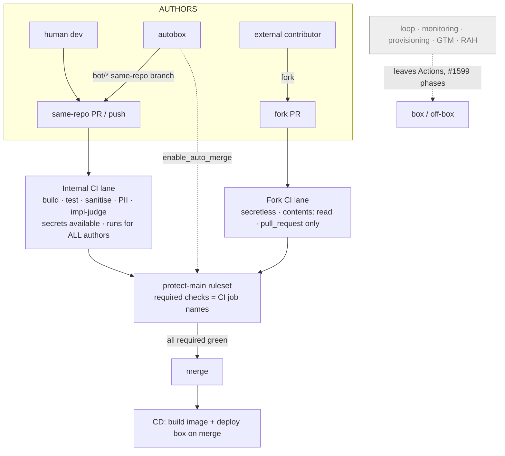

# refactor: Actions = CI/CD only — autobox is just another developer (#1599 retarget)

## Summary

Retarget the #1599 cutover to one invariant: **GitHub Actions holds only the CI/CD pipeline** — build + test + leak-guards on every PR/push, plus deploy (CD) on merge — and the **autobox is just another developer**: its PRs run the *same* Actions CI a human's PR does, gated by branch protection, not by a box-run check.

This **overrides #1599 R6/R10** (which had the box run bot-PR CI) and **reverses the just-merged Phase D** (#1938): the box stops gating its own PRs (remove the guards node + the box-posted `ci/guards` status); the leak guards move into the Actions CI as ordinary jobs that run for every author. `impl-judge` becomes **just another CI test**. Everything non-CI/CD (the convergence loop, monitoring, provisioning, GTM/social, eventually RAH) leaves Actions per #1599's existing phase work — this plan sets the **target and migration order**, not those subsystems' internals.

---

## Problem Frame

#1599 R6/R10 said the box runs CI for its own bot PRs (no GitHub trigger in the loop). Phase D built exactly that this session: a box guards node (PII + emit-sanitise) and a box-posted `ci/guards` commit status (#1938), with `external-pr-ci` scoped to non-bot authors only.

The operator sharpened the end-state: *the only thing that must be left in GitHub Actions is the CI/CD pipeline; **autobox is just another developer***. Under that invariant, a box-run CI is backwards — CI/CD belongs in Actions for **everyone**, the autobox included. Its PRs should hit the same pipeline as a teammate's and merge when branch protection's required checks pass.

This is not the bot-vs-human split Phase D assumed. The real axis is **trust**: same-repo branches (humans *and* the autobox) are trusted and run the full CI with secrets; untrusted **fork** PRs run a secretless hardened lane. "Autobox is just another developer" = the autobox rides the *internal* lane.

---

## Requirements (this retarget)

| # | Requirement | Overrides / builds on |
|---|---|---|
| RR1 | Each repo runs ONE internal CI workflow on every same-repo PR **and** push — all authors (human + autobox), no author skip — running build + test + the sanitise + PII leak guards. | overrides #1599 R6 |
| RR2 | The autobox never runs its own CI; it authors + enables auto-merge and **waits on the Actions CI conclusion** (branch-protection required checks). | overrides #1599 R10 (for CI), reverses #1938 |
| RR3 | `impl-judge` runs as **just another CI test** (a job in the CI workflow where a spec exists), not a box-special gate. | folds #1916/#796 |
| RR4 | Untrusted **fork** PRs run a secretless, hardened CI lane (no `secrets.*`, `contents: read`, never `pull_request_target`) — the existing `external-pr-ci` hardening. | keeps #1934 R11 |
| RR5 | **CD stays in Actions**: image build on push + box deploy on merge, gated on CI green. | overrides #1599 KTD7/U14 (box self-deploy) |
| RR6 | Reverse the Phase D box-side CI: remove the box guards node, `create_commit_status`, the `ci/guards` posting, and the shared-context ruleset coupling — without ever opening a leak-guard window. | reverses #1938 |
| RR7 | Define the end-state Actions inventory (keep = CI/CD per repo) and the ordered exodus of everything else to the box, deferring the subsystem internals to #1599's phases. | sequences #1599 B/C/E |

---

## Key Technical Decisions

**KTD1 — Actions = CI/CD only.** The kept Actions surface, per repo, is: the internal CI lane (RR1), the fork CI lane (RR4), and CD (RR5). Everything else is migration debt that leaves Actions. This is the single end-state invariant the whole plan serves.

**KTD2 — Trust axis, not bot axis.** Replace every `!startsWith(head.ref, 'bot/')` author filter with a **trust** split: same-repo head (human or autobox) → internal lane (full CI, secrets); fork head (`head.repo.full_name != github.repository`) → fork lane (secretless). The autobox's `bot/*` branches are same-repo → internal lane. This is what "just another developer" means mechanically.

**KTD3 — The box stops self-CIing (reverse #1938).** Remove the guards node, `create_commit_status`, the `ci/guards` commit-status posting, and `CI_GUARDS_CONTEXT` from the box. The PII + emit-sanitise guards do not disappear — they move to the Actions internal CI as jobs that run for every author (RR1). The box's gate node keeps consuming `tests_passed`/`sanitise_ok` for its *own* internal advancement decisions, but it no longer posts a gating status; the gate that blocks merge is Actions CI via branch protection (KTD7).

**KTD4 — `impl-judge` is just another CI test.** Run `pipeline/evals/impl_judge.py` as a job in the CI workflow (seed repo, where impl PRs carry a spec). It is a required check like the test job — no box-posted status, no bespoke gate. Where a PR has no spec (e.g. meta self-PRs), the job no-ops/passes.

**KTD5 — CD stays in Actions.** A developer's CI/CD includes deploy. Keep `build-pipeline-image.yml` (push) and box deploy on merge, gated on CI green (the auto-deploy-on-merge wiring from #1928). This **supersedes** #1599 U14 (box guarded self-deploy) — the box does not deploy itself; Actions CD does, on merge, like for any developer.

**KTD6 — Per-repo CI.** Two repos own CI independently: meta (`ai-pipeline-template`, the pipeline's own code — heal/loop/fix self-PRs) and seed (`wgmesh`, the product — impl PRs). Each gets the internal + fork lanes. `impl-judge` lives in seed (specs live there).

**KTD7 — Merge gate = Actions CI via branch protection.** The box enables auto-merge (`enable_auto_merge`, unchanged) and GitHub merges when the ruleset's required status checks — now the **CI job checks** (test, sanitise, pii, impl-judge), not the box `ci/guards` — pass. Same-repo branches make GitHub's `GITHUB_TOKEN` full-permission, so bot PRs run the full CI natively. Reverses the box-posted required status.

**KTD8 — Scope: invariant + reversal + ordering only.** This plan generalizes the CI lanes, reverses #1938, folds impl-judge, fixes CD, and writes the end-state inventory + migration order. It does **not** re-plan the box absorption of the loop/monitoring/provisioning — those stay #1599 Phases B/C/E. RAH's eventual exit is noted, not planned.

---

## High-Level Technical Design

Two CI lanes by trust, per repo; the box is just another author on the internal lane.

The box no longer appears inside the CI box — it is an author whose PRs the internal lane gates, exactly like a human's.

### End-state Actions inventory (per repo)

| Keep on Actions | Leaves Actions (→ box / off-box, #1599 phases) |
|---|---|
| Internal CI lane (build·test·sanitise·PII·impl-judge) | Loop: goal-sprint, observation, supervisor, strategy, conflict-heal, heartbeat-automerge, requeue, nongoose-shadow |
| Fork CI lane (secretless) | Monitoring: health, error-rate, diagnose, checkout-monitor, langfuse·×3, mentisdb, control-replay |
| CD: build image + deploy on merge | Provisioning: provision box/langfuse/quackback, set-box-env, terraform |
| | GTM: daily-release-notes, release, social drips; RAH ×5 (last) |

---

## Implementation Units

### U1. One internal CI lane (meta), trust-split, all authors

- **Goal:** A single meta-repo CI workflow runs on every same-repo PR and push, for all authors, running build + test + sanitise + PII; fork PRs route to the secretless lane.
- **Requirements:** RR1, RR2, RR4; KTD1, KTD2.
- **Dependencies:** none.
- **Files:** `.github/workflows/external-pr-ci.yml` (generalize/rename to the CI workflow), the three standalone CI workflows it absorbs are disabled in U5.
- **Approach:** Replace the `!startsWith(head.ref, 'bot/')` filters with a trust split: same-repo head → internal jobs (full token, secrets, the full suite); fork head (`head.repo.full_name != github.repository`) → the existing secretless jobs. Add `push:` (to `main`) so the CI also runs on direct pushes (RR1). Keep the U10 hardening on the fork path (no `secrets.*`, `contents: read`, no `pull_request_target`). The autobox's `bot/*` branches are same-repo → they hit the internal lane like a human's.
- **Patterns to follow:** the current `.github/workflows/external-pr-ci.yml` job structure; `pipeline-ci.yml` (build/test), `sanitise-wall.yml`, `pii-policy-check.yml` (the guards now folded in).
- **Test scenarios:**
  - Same-repo human PR → internal lane runs full suite; status reported.
  - Autobox `bot/*` PR (same repo) → internal lane runs full suite (no skip).
  - Fork PR → secretless lane only; `grep` confirms no `secrets.*` reachable on the fork path; no `pull_request_target`.
  - Push to `main` → CI runs.
  - PR touching only docs → the leak guards still run (always-run, in-script early-exit); build/test path-skip allowed.
- **Verification:** an autobox PR and a human PR get the identical internal CI; a fork PR gets the secretless lane; no author is skipped.

### U2. Reverse the Phase D box-side CI (#1938)

- **Goal:** The box no longer runs or posts its own CI; the leak guards live only in Actions CI.
- **Requirements:** RR6, RR2; KTD3.
- **Dependencies:** U1 (the guards must run in Actions for all authors **before** the box stops posting — no leak-guard window).
- **Files:** `pipeline/wgmesh_pipeline/graph/nodes/guards.py` (remove), `pipeline/wgmesh_pipeline/github/client.py` (remove `create_commit_status`), `pipeline/wgmesh_pipeline/forge/protocol.py` + `forge/quackback.py` (remove the method), `pipeline/wgmesh_pipeline/graph/nodes/gate.py` (drop `pii_ok`/`emit_sanitise_ok` params + the status coupling; keep `tests_passed`/`sanitise_ok` for internal advancement only), `pipeline/wgmesh_pipeline/poller.py` (unwire `guards_node`), `pipeline/wgmesh_pipeline/config.py` (remove `CI_GUARDS_CONTEXT`), `pipeline/wgmesh_pipeline/graph/state.py` (drop the keys), `scripts/ruleset/apply-protect-main-required-checks.sh` (remove or repoint to the CI job names — see U4), and the corresponding tests (`test_guards_node.py`, `test_create_commit_status.py`, `test_gate.py` revert of the pii/emit cases).
- **Approach:** Characterization-first — confirm the current box guards behavior, then remove it, asserting the gate node still makes sound internal advancement decisions on `tests_passed`/`sanitise_ok` alone. The box keeps authoring + `enable_auto_merge`; it just stops being a CI producer.
- **Execution note:** characterization-first; and **ordered strictly after U1** so the guards never lapse.
- **Test scenarios:**
  - Gate node still escalates on `tests_passed=false` / `sanitise_ok=false` (internal decision intact).
  - No `create_commit_status` / `ci/guards` references remain (grep clean).
  - Poller reviewed-stage no longer calls a guards node; full suite green.
  - A box impl PR still reaches `awaiting_merge` and merges via Actions CI (no box status posted).
- **Verification:** grep shows the box posts no CI status; the box still authors + auto-merges; suite green.

### U3. One CI lane in the seed repo (wgmesh) with impl-judge as a test

- **Goal:** The product repo runs one internal CI on every same-repo PR/push (all authors) — go build/test + the leak guards + `impl-judge` as a job — and a secretless fork lane.
- **Requirements:** RR1, RR3, RR4; KTD4, KTD6.
- **Dependencies:** U1 (mirror its shape).
- **Files (target repo `wgmesh`):** `.github/workflows/ci.yml` (the internal lane: go build/test, sanitise, PII, impl-judge job), the fork lane, plus the shared guard scripts (`scripts/lint/check-pii-policy.sh`, `check-llm-emit-sanitise.sh`) copied/vendored into the seed repo or invoked from a shared source. `impl-judge` job wraps `impl_judge.py`.
- **Approach:** Mirror U1's trust split in the seed repo. Fold `impl-judge` (currently `impl-judge.yml`, the #796 fail-closed DeepSeek check) as a job in the one CI rather than a standalone workflow. Ensure the leak guards exist in seed (the box no longer runs them — U2 — so seed Actions must). impl-judge job reads the PR's spec; no spec → pass.
- **Execution note:** cross-repo — state the seed repo explicitly; the guard scripts must be reachable in seed.
- **Test scenarios:**
  - Seed bot impl PR → go build/test + guards + impl-judge all run as CI jobs; merges on green.
  - impl-judge FAIL (unfaithful impl) → required check red → no merge (fail-closed preserved).
  - Fork PR to seed → secretless lane; impl-judge/secrets not reachable.
  - PR with no spec → impl-judge job passes (no-op), other jobs gate.
- **Verification:** a seed impl PR is gated entirely by seed Actions CI (incl impl-judge as a job); the box posts nothing.

### U4. Merge gate = Actions CI required checks (ruleset reconcile)

- **Goal:** Branch protection requires the CI **job** checks (not the box `ci/guards`); the box auto-merges when they pass.
- **Requirements:** RR2, RR7; KTD7.
- **Dependencies:** U1, U2, U3.
- **Files:** `scripts/ruleset/apply-protect-main-required-checks.sh` (repoint required contexts to the CI job names; drop `ci/guards`), applied per repo (meta + seed ruleset ids).
- **Approach:** Read each ruleset, set `required_status_checks` to the CI job names (test, sanitise, pii, impl-judge where present), remove the box `ci/guards` context. Drain CONFLICTING bot PRs first (a missing required check dead-ends them). Idempotent, dry-run default, create-if-absent (the rule may not exist yet — confirmed for meta).
- **Test scenarios:**
  - `Test expectation: none — governance/API change. Verified behaviorally: a bot PR and a human PR each merge only when the CI job checks are green; a red CI blocks both; no PR orphans on a missing context.`
- **Verification:** the ruleset requires the CI job checks; `ci/guards` absent; bot + human + fork PRs all gate on the same CI.

### U5. Retire the now-redundant standalone CI workflows

- **Goal:** Disable `pipeline-ci` / `sanitise-wall` / `pii-policy-check` once the one internal CI covers all authors.
- **Requirements:** RR1; KTD1.
- **Dependencies:** U1, U4.
- **Files:** `.github/workflows/{pipeline-ci,sanitise-wall,pii-policy-check}.yml` (disable; keep files for rollback, delete in a later trim).
- **Approach:** Strangler — disable only after U1's CI is the required gate (U4) so no guard lapses. `pipeline-ci` is already `disabled_manually`; this finishes the other two.
- **Test scenarios:** `Test expectation: none — disabling workflows whose coverage U1/U3 now carry; proven at U4.`
- **Verification:** the three show no new runs; every PR still gates on the one CI.

### U6. Confirm CD in Actions; cancel box self-deploy direction

- **Goal:** Build + deploy stay in Actions, gated on CI green; the #1599 box-self-deploy (U14) direction is explicitly dropped.
- **Requirements:** RR5; KTD5.
- **Dependencies:** U1.
- **Files:** `.github/workflows/build-pipeline-image.yml` (push build — confirm), `.github/workflows/deploy-pipeline-box.yml` + the auto-deploy-on-merge wiring (#1928) (confirm deploy fires on merge, gated on CI), a note in the #1599 issue retiring U14.
- **Approach:** Mostly confirmation + a documented decision: CD = Actions, on merge, after CI. No new self-deploy on the box. Verify deploy is gated on the merge (which is gated on CI), so a red CI can't deploy.
- **Test scenarios:** `Test expectation: none — confirmation + decision record. Behavioral check: a merge to main triggers image build + box deploy; a PR with red CI never merges, so never deploys.`
- **Verification:** merge → build + deploy fires; the U14 self-deploy direction is recorded as cancelled.

### U7. End-state inventory + migration order (decision doc)

- **Goal:** A single record of the kept Actions surface and the ordered exodus of everything else, so the cutover has one target.
- **Requirements:** RR7; KTD8.
- **Dependencies:** none (can land first as the north star).
- **Files:** a short doc under `docs/` (or a #1599 comment) capturing the keep-set + the ordered move-list mapped to #1599 phases.
- **Approach:** Record the inventory table (HTD) and the order: (1) CI invariant + Phase-D reversal (this plan), (2) loop → box (#1599 B), (3) monitoring → box (#1599 C), (4) provisioning → box/off-box (#1599 E), (5) GTM/social → box or elsewhere, (6) RAH last. Each step disables its Actions workflows only after the box equivalent bakes (strangler, unchanged).
- **Test scenarios:** `Test expectation: none — decision doc.`
- **Verification:** the doc names the kept set and the ordered exodus; #1599 phases reference it.

---

## Scope Boundaries

**In scope:** the trust-split internal + fork CI lanes per repo (U1, U3); reversing the Phase D box-side CI (U2); impl-judge as a CI test (U3); merge-gate reconcile to CI checks (U4); retiring the standalone CI workflows (U5); confirming CD-in-Actions + cancelling box self-deploy (U6); the end-state inventory + order (U7).

**Deferred to #1599's existing phases:** the actual absorption of the convergence loop (Phase B), monitoring/telemetry (Phase C), and provisioning (Phase E) onto the box — this plan orders them, it does not re-plan their internals.

**Deferred to follow-up:** RAH's eventual exit from Actions (last; #1599 KTD6 keeps it out of scope for now); deleting the disabled workflow files (a later trim, after bake).

**Outside this plan:** the convergence graph, merge-gate risk tiers, identity model, and product/GTM strategy — inherited, not redesigned.

---

## Risks & Dependencies

- **Leak-guard window during reversal (high).** Removing the box guards (U2) before the Actions internal CI runs them for all authors (U1) would leave bot PRs with no leak guard. Mitigation: strict ordering U1 → U4 (required) → U2; the guards run in Actions for every author before the box stops posting.
- **Required-check orphan (high).** Swapping required contexts to CI job names while a bot PR is CONFLICTING (no workflow runs → check absent) dead-ends it. Mitigation: U4 drains CONFLICTING bot PRs first (conflict-heal #1930 live).
- **Cross-repo coordination (high).** The box stops running seed-PR guards (U2) — seed Actions CI (U3) must exist and gate first, or seed impl PRs lose coverage. Mitigation: U3 before U2's effect reaches seed; sequence per repo.
- **Fork-secret exposure (high, mitigated).** Generalizing CI must not give fork code secrets. Mitigation: the trust split (KTD2) keeps forks on the secretless lane; same-repo (incl autobox) get secrets because they are trusted.
- **Reverting just-merged code (medium).** #1938 merged hours ago; U2 unwinds it. Mitigation: characterization-first; the guards' *logic* survives (moves to Actions), only the box-as-producer is removed.
- **Single-identity concentration unchanged.** The autobox still authors + merges under one PAT; moving CI to Actions does **not** add an independent control (Actions CI runs on the autobox's own trusted branch). The off-box/scope-split hardening from #1599's identity risk remains open.

---

## Open Questions (deferred to execution)

- **Meta impl-judge?** Meta self-PRs (pipeline code) have no spec — does impl-judge run there at all, or is it seed-only? (Lean seed-only; meta CI = build/test/guards.)
- **One workflow with a trust gate vs two workflow files** (internal + fork). One file with per-job trust conditions is fewer moving parts but mixes secret and secretless jobs in one run; two files isolate the secretless surface more visibly. Resolve in U1 against the hardening audit.
- **Shared guard scripts across repos.** Seed needs `check-pii-policy.sh` / `check-llm-emit-sanitise.sh` (U3); vendor a copy vs fetch from a shared source vs a composite action. Resolve in U3.
- **Bake-period lengths** before each disable (U5) and before the loop/monitor/provision exodus (U7) — inherit #1599's per-phase bake.
