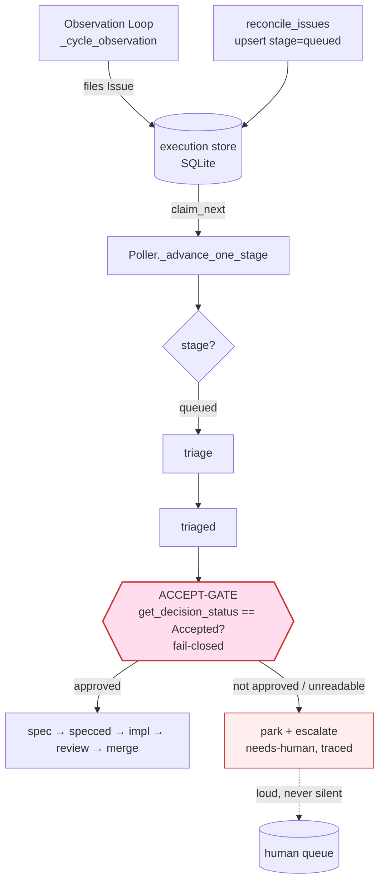

# feat: Fail-closed founder accept-gate + GTM cleanup + staged box re-enable

## Summary

The autonomous box was disabled on 2026-06-22 because it specced, built, and merged GTM/marketing work — cold outreach copy, comparison pages, a 5-email drip, a referral system — with **no founder approval gate**. Tracing confirmed the external blast radius was zero (the merged artifacts were code/docs, no executor sent anything), but the harm the operator named is real on a different axis: **wasted implementation tokens and pollution of the product `main` with features nobody accepted.**

The fix is not to build a gate from scratch. The accept-gate enforcement already exists — but only on the Quackback forge path (un-flipped), while the box runs on the GitHub forge path, which has **no approval signal at all**. This plan makes the gate **forge-agnostic and fail-closed** so the box cannot produce a build artifact for any Issue lacking explicit founder approval, regardless of forge; cleans the unrequested GTM code off wgmesh `main`; and stages a shadow-proven re-enable with a single-flag rollback.

The box stays OFF until this gate is live and shadow-proven.

---

## Problem Frame

**What broke.** On the `forge_kind=github` path (the box default), `github/client.py list_open_issues` returns every open Issue with no approval filter; `reconcile_issues` upserts them all to the execution store at `stage="queued"`; the Poller then claims and builds each one through `triaged → specced → implemented → merged`. There is no point in that path where founder approval is required before a build artifact is produced. The Observation Loop files Issues autonomously, so the loop is self-feeding: it proposes GTM work, then builds it.

**Why the existing enforcement doesn't cover it.** The Quackback decision layer (merged, inert) gates at *ingest*: `QuackbackForge.list_open_issues` returns only posts with status `Accepted for Build`, fail-closed on API error. But that only holds when `forge_kind=quackback`. The full forge cutover (plan `003`) is not done, and coupling the safety gate to that larger cutover delays re-enable and entangles it with an open product question (whether the founder should be the sole build bottleneck).

**What the operator wants.** A gate that (a) defaults to deny, (b) holds on whatever forge the box runs today, (c) is loud and traced when it blocks, (d) can be shadow-proven before going live, and (e) covers both Surfaces (product `wgmesh` and service `cloudroof-eu`). Plus the merged GTM code removed in a way the Observation Loop won't simply re-propose.

**Concept vocabulary** (from `CONCEPTS.md`): *Issue* (proposed work item), *Spec* (approved Issue, authored by Spec writer), *Implementation* (code fulfilling a Spec), *Funnel stage* (`triage/spec_ready/needs_impl/awaiting_merge/merged`), *Surface* (`product` = wgmesh, `service` = cloudroof), *Escalation* (work promoted to the human queue). "Accept-gate" and "Accepted for Build" are decision-layer terms, not yet in `CONCEPTS.md`.

---

## Requirements

- **R1** — No Issue advances from `triaged` to `specced` (the first build-artifact stage) unless it carries explicit founder approval. This is the chokepoint; gating earlier (ingest) is defense-in-depth, not the primary guard.
- **R2** — The gate is **fail-closed**: missing, unreadable, malformed, or not-yet-approved status → block + escalate, never build. Default-on-missing is *deny*.
- **R3** — The gate is **forge-agnostic**: it reads an approval signal on both the GitHub path (an `approved-for-build` label) and the Quackback path (status `Accepted for Build`), behind one Protocol method.
- **R4** — Gate denials are **loud and traced** (escalate to the human queue / `needs-human`), never silent skips.
- **R5** — The gate is gated by its own live flag (`ACCEPT_GATE_LIVE`) so it can run shadow (observe + log, no behavior change) before enforcing.
- **R6** — The gate covers **both Surfaces** (`wgmesh` and `cloudroof-eu`); neither repo may route around it.
- **R7** — The unrequested GTM code is removed from wgmesh `main` such that `collect-capabilities.sh` reconciles it out of the Observation Loop's grounding (so the loop does not re-propose it), and `go build ./... && go vet ./...` stay green.
- **R8** — Re-enable is staged: shadow-prove the gate blocks unapproved work (journal evidence), then flip live, with rollback = single flag flip + re-disable Actions.
- **R9** — The gate decision is **deterministic** (a status/label read), never an LLM call, so it cannot fail-open on a model/budget outage.

---

## Key Technical Decisions

### KTD1 — Gate at the build chokepoint, not only at ingest
Insert the fail-closed guard in `poller.py:_advance_one_stage` immediately before the `triaged → specced` spec call (`poller.py:130-131`) — the single narrowest point every Issue passes before any build artifact exists. The Quackback ingest filter (`list_open_issues`) stays as defense-in-depth, but the chokepoint guard is the primary enforcement and is forge-agnostic. Rationale: gating at the Poller covers manually-filed and reconciled Issues alike, and mirrors the existing exit drift-guard (`_mirror_quackback`, which already reads `get_decision_status` and aborts on drift out of the lane). The accept-gate is the *entry* analogue of that proven *exit* guard.

### KTD2 — One Protocol method, two forge implementations
Add an approval accessor to the `Forge` Protocol (`forge/protocol.py`) — e.g. `get_decision_status(number) -> str` (already present on `QuackbackForge:147`). Implement it on `github/client.py` by reading the `approved-for-build` label (the same positive label `company/scripts/pr-review-merge.sh` already uses as a merge gate — reuse the established convention, do not invent a new signal). The guard compares against `quackback_status.ACCEPTED_FOR_BUILD` on Quackback and label-presence on GitHub, behind one call. Rationale: decouples the safety gate from the `FORGE_KIND` cutover (plan `003`); the box can re-enable on the GitHub path today.

### KTD3 — Positive assertion, default-deny
The gate asserts approval is **present** ("Accepted for Build" / label present), not "no objection". Any other state — including unreadable/error — denies. This is the inverse of the Langfuse fail-open trap (numeric judge defaulted *high* on empty input); here the default direction is *block*. (See `docs/solutions/logic-errors/langfuse-evaluators-scored-empty-output.md`, `docs/solutions/integration-issues/autonomous-review-merge-bootstrap.md` Bug #8.)

### KTD4 — Test through the real boundary
Unit tests over a faked forge can stay green while the live gate never blocks (the hollow-green / never-run-path class — `docs/solutions/runtime-errors/goose-weak-model-prints-spec-instead-of-writing.md`). Each gate test must drive the actual decision-status read result and confirm the guard *bites* by asserting that flipping the status from approved→unapproved flips build→block. Mirror `test_quackback_drift.py`'s fake-status-read setup in `test_poller.py`.

### KTD5 — Revert-PR convention for cleanup
Remove the GTM code via `Revert "<title>"` PRs (or equivalently-titled surgical PRs) so `collect-capabilities.sh` subtracts the matching capability from the Observation Loop's grounding. A bare file delete leaves the loop believing the GTM capability shipped, and it will re-propose or defend it. (See `docs/solutions/logic-errors/capabilities-digest-grounds-loop-against-shipped-work.md`.)

### KTD6 — Staged re-enable mirrors the proven cutover shape
Reuse the merge-lane-heal / Quackback-cutover flip shape: inert/shadow on the box → prove with journal evidence (`planned=N, specced=0` because unapproved) → flip a single env flag → rollback = flag-false. Do not invent a new sequence. For the Actions half, verify every gate-triggering event is produced by a user/PAT actor, not a GitHub App `GITHUB_TOKEN` (App-token actions silently do not fire workflow events; a missing required check reads PENDING, never RED — `docs/solutions/integration-issues/github-app-reviews-dont-trigger-workflows.md`).

---

## High-Level Technical Design

### Build path — where the gate sits (fail-closed entry guard)

The guard is the diamond before `spec`. Ingest filter (Quackback) is upstream defense-in-depth; the chokepoint guard is the primary, forge-agnostic enforcement.

### Approval signal — one method, two forges

| Forge | `get_decision_status(number)` source | "Approved" means |
|-------|--------------------------------------|------------------|
| `quackback` | post status (`QuackbackForge:147`, exists) | `== "Accepted for Build"` |
| `github` | `approved-for-build` label presence (new accessor) | label present |
| any error / missing | — | **deny + escalate** (KTD3) |

### Re-enable state machine

```mermaid
stateDiagram-v2
  [*] --> AllOff: current (box halted, Actions disabled)
  AllOff --> GateMerged: P1 merged (gate code, ACCEPT_GATE_LIVE=false)
  GateMerged --> Cleaned: P2 merged (GTM reverted, build green)
  Cleaned --> Shadow: ACCEPT_GATE_LIVE=false + CONTROL_LOOP_ENABLED=true (shadow log only)
  Shadow --> Proven: journal shows unapproved Issues blocked, 0 specced
  Proven --> Live: ACCEPT_GATE_LIVE=true + re-enable Actions
  Live --> Verified: one approved Issue builds; unapproved stays blocked
  Live --> AllOff: ROLLBACK = flags false + disable Actions
```

---

## Implementation Units

### Phase 1 — Forge-agnostic fail-closed accept-gate (`ai-pipeline-template`)

### U1. Approval accessor on the Forge Protocol + GitHub client
**Goal:** A single `get_decision_status`-style method exists on the `Forge` Protocol and on the GitHub client (Quackback already has it), so the gate reads approval through one call on any forge.
**Requirements:** R3, R9.
**Dependencies:** none.
**Files:**
- `pipeline/wgmesh_pipeline/forge/protocol.py` (add method to `Forge` Protocol + `ForgeIssue` if needed)
- `pipeline/wgmesh_pipeline/github/client.py` (implement accessor reading `approved-for-build` label)
- `pipeline/wgmesh_pipeline/forge/quackback.py` (confirm signature parity; no behavior change)
- `pipeline/tests/test_forge_protocol.py`, `pipeline/tests/test_forge_factory.py` (Protocol conformance)
- `pipeline/tests/test_github_client.py` (label-read accessor)
**Approach:** Deterministic label/status read only — no LLM. The GitHub accessor returns a normalized approval state (`approved` / `not_approved`) derived from `approved-for-build` label presence; map to the same comparison the Quackback path uses. Keep the accessor read-only (the box must never author approval).
**Execution note:** Characterization-first — add a test asserting the *current* GitHub client returns the open-issue set with labels before adding the accessor, so the new method's behavior is pinned against real label data.
**Patterns to follow:** `QuackbackForge.get_decision_status` (`forge/quackback.py:147`); label handling in `forge/protocol.py ForgeIssue` (`:21`).
**Test scenarios:**
- Happy: GitHub issue WITH `approved-for-build` label → accessor returns approved. Covers R3.
- Happy: Quackback post with status `Accepted for Build` → approved (parity).
- Edge: GitHub issue with no labels → not_approved (not error).
- Edge: GitHub issue with other labels but not `approved-for-build` → not_approved.
- Error: forge API raises / returns malformed → method surfaces the error to the caller (caller denies per U2), does not swallow to a falsy "approved".
- Protocol: both forges satisfy the updated `Forge` Protocol (conformance test).

### U2. Fail-closed accept-gate at the Poller spec chokepoint
**Goal:** No Issue advances `triaged → specced` unless its approval state is `approved`; otherwise park + escalate, loudly and traced.
**Requirements:** R1, R2, R4, R5.
**Dependencies:** U1.
**Files:**
- `pipeline/wgmesh_pipeline/poller.py` (guard before the spec call at `:130-131`)
- `pipeline/wgmesh_pipeline/config.py` (add `ACCEPT_GATE_LIVE` flag, `_get_bool` pattern at `:274-283`)
- `company/box-config.json` (add `ACCEPT_GATE_LIVE: "false"` operational toggle)
- `pipeline/tests/test_poller.py` (gate behavior)
- `pipeline/tests/test_poller_stage_tracing.py` (escalation trace)
**Approach:** Before `self.graph.spec(state)`, call the U1 accessor for the Issue. If not approved (or read errored), do not spec: move the Issue to an escalated/parked state and emit a traced escalation (reuse the `_mirror_quackback` abort-and-escalate path at `poller.py:315-324`). When `ACCEPT_GATE_LIVE=false`, run in **shadow**: log the decision the gate *would* make (`would_block` / `would_allow`) into the journal but let the existing flow proceed unchanged — this produces the shadow evidence for U8 without altering behavior. When `true`, enforce.
**Execution note:** Test-first — write the failing "unapproved Issue is blocked before spec" test against the real decision-read result, then implement; confirm it bites by toggling the fake status approved↔unapproved (KTD4).
**Patterns to follow:** `_mirror_quackback` drift guard (`poller.py:271,301,311-324`); flag gating like `_module_live` / `*_LIVE`.
**Test scenarios:**
- Happy (live): approved Issue → proceeds to `spec`. Covers R1.
- Happy (live): unapproved Issue → does NOT spec; lands in escalated/parked stage; escalation event emitted. Covers R1, R2, R4.
- Fail-closed: decision-status read raises → Issue blocked + escalated, never specced. Covers R2.
- Fail-closed: status present but unrecognized/malformed value → blocked. Covers R2.
- Shadow (`ACCEPT_GATE_LIVE=false`): unapproved Issue → flow unchanged BUT journal records `would_block`. Covers R5, R8.
- Bite check: same Issue flips build→block when status flips approved→unapproved (guards against hollow-green). Covers R2/KTD4.
- Trace: blocked Issue produces a `needs-human`/escalation trace entry, not a silent skip. Covers R4.

### U3. Cover both Surfaces (product + service)
**Goal:** The gate is enforced for Issues on both `wgmesh` and `cloudroof-eu`; neither Surface can route around it.
**Requirements:** R6.
**Dependencies:** U2.
**Files:**
- `pipeline/wgmesh_pipeline/config.py` (confirm per-Surface / per-repo forge + gate config; the 2nd cloudroof instance has its own env — see `install-cloudroof-instance.yml`)
- `company/box-config.json` and the cloudroof instance env (gate flag present in both)
- `pipeline/tests/test_config.py` (both-Surface gate config resolves)
**Approach:** Verify the Poller in each instance (wgmesh box + cloudroof box) reads `ACCEPT_GATE_LIVE` and the U1 accessor for its TARGET_REPO. No Surface-specific bypass. If the cloudroof instance uses the interim label gate (Quackback gtm-stream not live), the `approved-for-build` label accessor (U1 GitHub path) covers it.
**Test scenarios:**
- Config: `ACCEPT_GATE_LIVE` resolves on both the wgmesh and cloudroof instance configs (box-config + env layering, `config.py:160-161`).
- Both-forge: gate guard active whether the instance is `forge_kind=github` (label) or `quackback` (status). Covers R6.
- `Test expectation: none` for any pure-config wiring that carries no branch — annotate with reason.

---

### Phase 2 — Clean unrequested GTM code (`atvirokodosprendimai/wgmesh`)

**Target repo:** `atvirokodosprendimai/wgmesh`. All paths below are repo-relative to that repo. The GTM code is an isolated island — nothing in the real product (`pkg/daemon`, `pkg/mesh`, `pkg/crypto`, `pkg/discovery`) imports it; no `go.mod` deps were added.

### U4. Revert Tier A + B — docs, pages, and the analytics/promo/nurture cluster
**Goal:** Remove the build-safe GTM artifacts (no daemon wiring) via revert-PRs.
**Requirements:** R7.
**Dependencies:** none (independent of U1–U3).
**Files (delete / revert):**
- Tier A: `docs/comparison/` (#751); `public/vpn-alternative.md` + 2 `README.md` lines (#742); the 4 positioning docs + `scripts/audit-polar-products.sh` (#761); `pkg/nurture/` (#788, imported by nothing).
- Tier B (do together — #782 extended #738's `pkg/analytics`, lone revert conflicts): `pkg/promo/`, `pkg/analytics/`, `cmd/analytics-dashboard/`, the stray root binary `analytics-dashboard`, and `docs/outreach-communities.md` / `docs/outreach-templates.md` / `docs/trial-offer-structure.md` (#738).
**Approach:** Use `Revert "<title>"`-titled PRs (KTD5) so capabilities reconcile. Tier A units are independent and build-safe in any order. Tier B is one consistent tree-state removal of the `#738`+`#782` cluster (surgical delete of the cluster rather than two conflicting merge-reverts).
**Execution note:** Run `go build ./... && go vet ./...` after the cluster removal to confirm the product still builds (it has no dependency on the removed packages).
**Patterns to follow:** the `Revert "<title>"` capability-subtraction convention; `collect-capabilities.sh`.
**Test scenarios:** `Test expectation: none — deletion of unreferenced GTM packages/docs.` Verification is the build/vet pass below, not new tests. Confirm no remaining import of `pkg/nurture`, `pkg/promo`, `pkg/analytics`, `cmd/analytics-dashboard` (`gh search code` / tree grep) returns zero hits after the PRs.

### U5. Revert Tier C — referral (unwire daemon first, build-breaking)
**Goal:** Remove the referral GTM code that is wired into the production daemon binary, without breaking `go build`.
**Requirements:** R7.
**Dependencies:** U4 (do last; this is the only build-breaking unit).
**Files:**
- `main.go` (remove `pkg/referral` import at `:20`; remove the `referral` subcommand dispatch + helpers `referralState`/`loadReferralState`/`saveReferralState`/`getOrCreateReferralCode`/`runReferralShow|Stats|Validate`/`printReferralUsage` at `~:281,:355,:1543-1721`; remove referral block from CLI help)
- `main_test.go` (remove `TestReferral*CLI` tests, `~:374-475`)
- `pkg/referral/` (delete after unwiring)
**Approach:** Two-step, ordered: (a) strip the `main.go`/`main_test.go` wiring, (b) then `rm -r pkg/referral/`. `git revert -m 1 aa7ce30` does both atomically **iff** `main.go` has not been touched by intervening merges — verify with `git log main -- main.go` first; if it has, do the surgical two-step. Title the PR as a revert (KTD5).
**Execution note:** Characterization-first — confirm `go build ./... && go vet ./...` is green BEFORE the change (baseline) and AFTER (no regression). The daemon must still build and its existing subcommands (`join`/`init`/`status`/etc.) must be untouched.
**Patterns to follow:** existing root `main.go` subcommand structure (leave non-referral subcommands intact).
**Test scenarios:**
- Build: `go build ./...` green after referral removed and unwired. Covers R7.
- Vet: `go vet ./...` clean.
- Regression: existing daemon subcommands present and unchanged (no referral subcommand; `--version`, `join`, `status` still resolve).
- Grep: zero references to `pkg/referral` in the tree after the PR.

### U6. Reconcile capabilities + confirm green main
**Goal:** The Observation Loop's grounding no longer asserts the GTM capabilities as shipped; product `main` is green.
**Requirements:** R7.
**Dependencies:** U4, U5.
**Files:**
- wgmesh capability digest / `collect-capabilities.sh` output (verify GTM capabilities subtracted)
- CI on wgmesh `main` (build/vet/test green post-revert)
**Approach:** Confirm the revert-PRs' titles caused `collect-capabilities.sh` to drop the GTM capabilities, so the next Observation cycle does not re-propose outreach/drip/referral/comparison work. Confirm `main` CI is green.
**Test scenarios:** `Test expectation: none — verification unit.` Verification: capability digest no longer lists the GTM capabilities; wgmesh `main` build/vet/test green.

---

### Phase 3 — Staged, shadow-proven re-enable (`ai-pipeline-template` + ops)

### U7. Shadow-prove the gate blocks unapproved work
**Goal:** With the gate code merged but `ACCEPT_GATE_LIVE=false`, run the box control loop in shadow and collect journal evidence that unapproved Issues *would* be blocked.
**Requirements:** R8, R5.
**Dependencies:** U2 (gate code merged), U6 (clean main so the loop isn't grounded on GTM).
**Files:**
- `company/box-config.json` (`CONTROL_LOOP_ENABLED=true`, `ACCEPT_GATE_LIVE=false` for the shadow window)
- box journal / control-loop trace output (evidence)
- `docs/runbooks/accept-gate-reenable.md` (new — shadow section)
**Approach:** Re-enable only the control loop (not yet the autonomous Actions crons or live gate). Drive at least one cycle where an unapproved Issue is present; confirm the journal records `would_block` and that `specced=0` for unapproved Issues. This is the entry analogue of the merge-lane-heal shadow proof (`planned=N executed=0`).
**Execution note:** Characterization baseline — record what the box does *without* the gate enforcing (shadow) before flipping live, so the live flip's effect is attributable.
**Test scenarios:** `Test expectation: none — operational shadow run.` Verification: box journal shows ≥1 `would_block` for an unapproved Issue and zero unapproved Issues reaching `specced` during the shadow window.

### U8. Flip live + re-enable Actions, verified, with rollback
**Goal:** Enforce the gate and bring the pipeline back online, proven by one approved Issue building end-to-end while an unapproved Issue stays blocked.
**Requirements:** R8, R6.
**Dependencies:** U7.
**Files:**
- `company/box-config.json` (`ACCEPT_GATE_LIVE=true`) via `set-box-env` (no provision)
- GitHub Actions workflow states (re-enable the CI/CD + needed crons via `gh workflow enable`; see `project_all_pipelines_disabled_kill_switch`)
- `docs/runbooks/accept-gate-reenable.md` (flip + verify + rollback sections)
**Approach:** Flip `ACCEPT_GATE_LIVE=true` (box restart). Re-enable Actions in a deliberate order — CI/CD first, then the autonomous crons only after the gate is confirmed enforcing. Before trusting any re-enabled gate-triggering workflow, verify its triggering actor is a user/PAT, not a GitHub App `GITHUB_TOKEN` (KTD6). Verify: one Issue marked approved builds through to merge; one unapproved Issue is blocked + escalated. **Rollback** = `ACCEPT_GATE_LIVE=false` (or `CONTROL_LOOP_ENABLED=false`) + re-disable Actions — a flag flip, not a code revert.
**Execution note:** Do not re-enable the autonomous Observation/build crons until the live gate is confirmed enforcing on a real approved/unapproved pair.
**Test scenarios:** `Test expectation: none — operational flip.` Verification: (a) approved Issue → Implementation merged; (b) unapproved Issue → blocked + escalated, zero build artifacts; (c) rollback flips both behaviors off in one step; (d) every re-enabled gate-triggering workflow fired by a PAT/user actor (no App-token PENDING-forever check).

### U9. Re-enable runbook
**Goal:** A durable operator runbook for shadow → flip → verify → rollback, so the sequence is repeatable and the rollback is unambiguous.
**Requirements:** R8.
**Dependencies:** U7, U8.
**Files:** `docs/runbooks/accept-gate-reenable.md`.
**Approach:** Document the staged sequence, the exact flags (`CONTROL_LOOP_ENABLED`, `ACCEPT_GATE_LIVE`, `FORGE_KIND`), the `gh workflow enable` ordering, the verification pairs, and the single-flag rollback. Cross-link the Quackback cutover runbook (`docs/plans/2026-06-22-003`) as the optional follow-on decision-layer activation.
**Test scenarios:** `Test expectation: none — documentation.`

---

## Scope Boundaries

**In scope:** forge-agnostic fail-closed accept-gate at the build chokepoint (both forges, both Surfaces); removal of the merged GTM code from wgmesh `main`; staged shadow→flip re-enable with rollback.

### Deferred for later
- **Bounded auto-accept (OQ1).** Whether a low-risk/high-vote class should auto-accept so the box degrades gracefully instead of hard-stopping on founder attention. Decision deferred; this plan ships the **hard gate** (zero build throughput without approval) per the operator's confirmation. Revisit once steady-state throughput pressure is felt.
- **Full Quackback forge cutover** (`FORGE_KIND=github → quackback`, plan `docs/plans/2026-06-22-003`). Orthogonal: the forge-agnostic gate makes re-enable safe without it. The cutover remains the richer founder-decision UX and can land after.

### Outside this product's identity
- Reinstating any GTM/marketing build capability inside the autonomous product pipeline. GTM routes to the cofounder queue per the product/service split — the box builds CODE, not GTM (`docs/brainstorms/2026-06-21-product-service-split-requirements.md`).

### Deferred to Follow-Up Work
- Adding `approved-for-build` as a first-class concept to `CONCEPTS.md` and the Quackback status map documentation (doc-only; not blocking the gate).

---

## Risks & Dependencies

- **Hollow-green gate (high).** A gate green in unit tests but inert live. Mitigation: KTD4 bite-checks through the real decision-read; shadow proof (U7) before trusting it.
- **Fail-open on read error (high).** An exception path that resolves to "approved". Mitigation: KTD3 default-deny; explicit error-path tests (U1, U2).
- **Build break on referral revert (medium).** `pkg/referral` is wired into the daemon. Mitigation: U5 unwire-first ordering + before/after build characterization.
- **Loop re-proposes reverted GTM (medium).** If capabilities aren't reconciled. Mitigation: KTD5 revert-PR convention; U6 verification.
- **Actions re-enable fails silently (medium).** App-token-triggered workflows never fire; missing check reads PENDING not RED. Mitigation: KTD6 actor verification; deliberate re-enable ordering (U8).
- **Surface gap (medium).** cloudroof-eu routes around the gate. Mitigation: R6 / U3 both-Surface coverage.
- **Dependency:** the box remains OFF (current state) until U8 verification passes.

---

## Sources & Research

- Origin: `docs/brainstorms/2026-06-21-quackback-decision-layer-requirements.md` (front-gate = founder "Accepted for Build"; back-gate = judge auto-merge kept).
- Existing enforcement (Quackback path): `forge/quackback.py` (`get_decision_status:147`, `list_open_issues:185`), `forge/quackback_status.py` (`ACCEPTED_FOR_BUILD`), drift guard `poller.py:_mirror_quackback`.
- Build path / chokepoint: `poller.py:_advance_one_stage` (`:130-131`), Poller (`poller.py:21`), `config.py` flag layering (`:160-161,:258-283`).
- Cleanup surface + blast radius: wgmesh PRs #738/#742/#751/#761/#782/#788/#793 (traced; GTM = isolated island, only `pkg/referral` wired to daemon `main.go`).
- Learnings: `docs/solutions/runtime-errors/goose-weak-model-prints-spec-instead-of-writing.md` (hollow-green), `.../logic-errors/langfuse-evaluators-scored-empty-output.md` (fail-open default-high), `.../integration-issues/github-app-reviews-dont-trigger-workflows.md` (App-token trigger boundary), `.../integration-issues/autonomous-review-merge-bootstrap.md` Bug #8 (positive-label gate), `.../logic-errors/capabilities-digest-grounds-loop-against-shipped-work.md` (revert-PR reconcile), `.../logic-errors/manually-filed-issues-bypass-pipeline-triage.md` (loud-not-silent denial).
- Related plans: `docs/plans/2026-06-22-003-feat-quackback-cutover-plan.md`, `docs/plans/2026-06-21-001-feat-quackback-decision-layer-plan.md`.

---

## Open Questions

- **OQ1 (product, deferred):** founder as sole build bottleneck (hard gate, this plan) vs. bounded auto-accept class. Confirmed hard gate for now; auto-accept deferred.
- **OQ2 (execution-time):** exact `approved-for-build` label semantics on cloudroof-eu if its Quackback gtm-decision stream goes live mid-rollout — resolve when the cloudroof instance flips forge.
