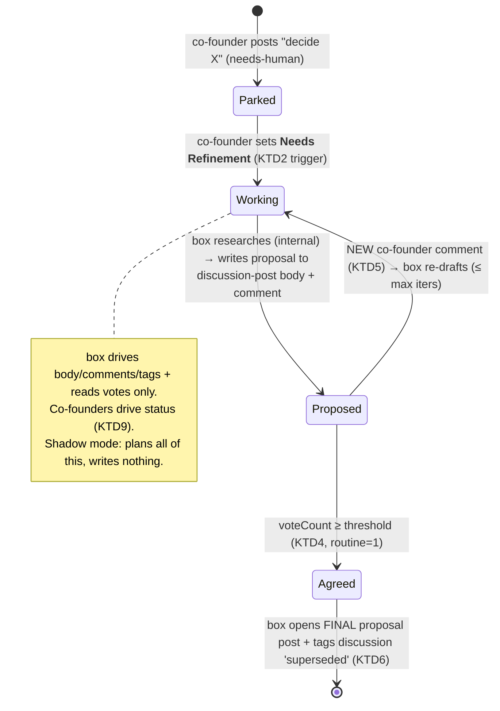

# feat: Decision lane — Phase 1 (the consent loop, read-only execution)

**Date:** 2026-06-22 · **Type:** feat · **Depth:** Deep
**Origin:** `docs/brainstorms/2026-06-22-capability-acquisition-ladder-requirements.md`
**Scope:** Phase 1 of the capability-acquisition ladder — the decision/proposal lane only.
Self-build (rung 2), rent-a-human (rung 3), and web research are **out of this plan**.

---

## Summary

Give the box a **decision lane**: for a co-founder decision ask, it researches (internal
context only, for now), drafts a **structured proposal** (recommendation, options, pros/cons,
upsides/downsides, ROI), iterates on co-founder **comments**, and on reaching the **approval
threshold** opens a clean **final proposal post** and retires the discussion post. Execution in
Phase 1 is *just producing the decided artifact* — no self-modification, no spend — so the whole
consent loop ships with zero blast radius. It is a new box control-loop module, shadow-first,
exactly like observation and merge-lane.

## Problem frame

Today a `needs-human` decision (e.g. "decide Stripe pricing") is *parked* — the box creates the
post and does nothing else; it cannot read comments, so there is no iteration. The brainstorm's
target is the box that *works* decision items under co-founder consent. Phase 1 builds the consent
loop itself — the gate — before any of the powers (self-build, spend) it will later gate. Proving
the loop with zero blast radius is the whole point of sequencing it first (see origin: Approach).

KTD9 from the decision-layer holds throughout: **the box never sets a decision status.** It
drives body, comments, tags, and reads votes; the co-founders drive status. That single constraint
shapes the trigger, the agreement signal, and the retirement mechanism below.

## VERIFY items — RESOLVED 2026-06-22 (probed against the live instance)

- ✅ **Comment read:** `GET /api/v1/posts/{id}/comments` → 200; each comment carries
  `principalId`, `authorName`, `isTeamMember`, `content`, `createdAt`, `id`, `parentId`. Enough to
  read the thread AND distinguish a co-founder comment from the box's own (`authorName` = the bot
  key name).
- ✅ **Vote count:** `voteCount` is on the post payload. `GET /posts/{id}/votes` → **404** (no
  voter list). The threshold reads the count; voter-is-co-founder rests on the private-board
  assumption (all voters are co-founders), per origin.

---

## Key technical decisions

- **KTD1 — box-native control-loop module, shadow-first.** The lane is a new `ControlLoopScheduler`
  module (like observation / merge-lane), not an Actions workflow — aligns with the
  actions=CI/CD-only retarget (`project_actions_cicd_only_retarget`). It runs shadow (plans, no
  writes) until a `DECISION_LANE_LIVE` flag flips, mirroring the merge-lane cutover discipline.
- **KTD2 — trigger is a founder-set status, not a box action (KTD9).** The box may not set a
  decision status, so it cannot move a post into the lane itself. The co-founder moves a decision
  post to **`Needs Refinement`** = "box, draft/refine a proposal here." The box ingests
  `Needs Refinement` posts (slug-filtered read, the verified ingest pattern) and works them.
- **KTD3 — internal grounding only in Phase 1.** The proposal is grounded on `STRATEGY.md`, KPIs,
  and the repo via the Goose runner — **no web research** (that is Phase 2's first self-build).
  Market/competitor claims the model makes are explicitly labeled as **assumptions** in the
  proposal body, not asserted as fact.
- **KTD4 — risk-tiered approval threshold (config), Phase 1 exercises `routine = 1`.** The policy
  is built tiered now — routine = 1 approve-vote, dangerous = all current co-founders — but Phase 1
  has no dangerous actions (read-only), so every proposal is routine and the gate is
  `voteCount >= 1`. The policy reads `voteCount` from the post (count only; private-board
  attribution assumption). The N=2 caveat and the €X "dangerous" line are config, surfaced for
  Phase 2.
- **KTD5 — iteration via author distinction + a store-backed processed-comment marker.** The box
  re-drafts only on a **new co-founder comment** (`authorName` ≠ the bot key, `isTeamMember` true),
  never on its own comment, and tracks the last-processed comment id/timestamp in the store so it
  doesn't re-process. Loop-guarded by a max-iteration cap.
- **KTD6 — retire the discussion post by tagging `superseded`, not deleting.** KTD9 blocks the box
  from setting `Cancelled`. On agreement the box opens a clean **final proposal post** (the decision
  record) and tags the discussion post `superseded` (the box may set tags) — keeping the
  deliberation trail rather than `delete_post`-ing it.
- **KTD7 — execute = produce the decided artifact.** In Phase 1 the lane terminates at the final
  proposal post. No downstream action (no self-build, no spend) — those are later rungs.

---

## High-level technical design

---

## Implementation units

### U1. Comment-read API on the Quackback client
**Goal:** the box can read a post's comment thread with author attribution.
**Requirements:** origin "Iterate" step; KTD5. **Dependencies:** none.
**Files:** `pipeline/wgmesh_pipeline/forge/quackback_client.py`,
`pipeline/wgmesh_pipeline/forge/quackback.py` (passthrough),
`pipeline/tests/test_quackback_client.py`, `pipeline/tests/test_quackback_forge.py`.
**Approach:** add `list_comments(post_id) -> list[dict]` calling the verified
`GET /posts/{id}/comments`, returning raw comment dicts (carry `id`, `principalId`, `authorName`,
`isTeamMember`, `content`, `createdAt`). Fail-closed-loud on read error (a missing thread must not
silently read as "no new feedback"). Surface it on `QuackbackForge` (read path, no allowlist).
**Patterns to follow:** `list_posts` / `list_statuses` (cursor + shape-assert + fail-closed read).
**Test scenarios:** returns parsed comments with author fields; empty thread → `[]`; API error →
raises `QuackbackError` (not silent empty); forge passthrough reaches `_qb`, not `_gh`.

### U2. Vote-count read on the Quackback client
**Goal:** the box can read a post's approve-vote count for the threshold check.
**Requirements:** origin "Agree" step; KTD4. **Dependencies:** none.
**Files:** `pipeline/wgmesh_pipeline/forge/quackback_client.py`,
`pipeline/wgmesh_pipeline/forge/quackback.py`, `pipeline/tests/test_quackback_client.py`.
**Approach:** add `get_vote_count(post_id) -> int` reading `voteCount` off the post payload
(`GET /posts/{id}`). No voter list exists (verified 404) — document that attribution rests on the
private-board assumption. Fail-closed-loud.
**Patterns to follow:** `get_post` / `get_decision_status` (read, no allowlist).
**Test scenarios:** returns the integer `voteCount`; missing field → 0 (not crash); API error →
raises.

### U3. Approval-threshold policy
**Goal:** a pure policy that, given a proposal's risk tier + current vote count + co-founder count,
returns approved / not-yet.
**Requirements:** KTD4; origin "threshold is a risk-tiered config policy". **Dependencies:** none.
**Files:** `pipeline/wgmesh_pipeline/decision_lane/policy.py` (new),
`pipeline/wgmesh_pipeline/config.py` (config: co-founder principal set, `€X` dangerous-spend line,
risk-tier→threshold map), `pipeline/tests/test_decision_policy.py`.
**Approach:** pure functions — `required_approvals(risk_tier, cofounder_count)` (routine → 1;
dangerous → all current co-founders) and `is_approved(vote_count, risk_tier, cofounder_count)`.
Threshold expressed *relative to current co-founder count* so it scales (1 / majority / all)
without redesign. Phase 1 callers always pass `risk_tier="routine"`.
**Execution note:** test-first — this is the safety gate; pin every tier/threshold combination.
**Test scenarios:** routine → 1 regardless of count; dangerous at N=2 → 2 (unanimous); dangerous at
N=5 → 5; `is_approved` true at exactly threshold, false below; N=2 dangerous with 1 vote → not
approved (the stall case is intended).

### U4. Iteration state — author distinction + processed-comment marker
**Goal:** the box re-drafts only on a new co-founder comment, never on its own, and never twice.
**Requirements:** KTD5. **Dependencies:** U1.
**Files:** `pipeline/wgmesh_pipeline/decision_lane/comments.py` (new),
`pipeline/wgmesh_pipeline/state/store.py` + `state/migrations/0005_decision_lane.sql` (new:
per-post last-processed comment marker + lane state),
`pipeline/tests/test_decision_comments.py`, `pipeline/tests/test_state.py`.
**Approach:** `latest_cofounder_comment(comments, bot_author)` filters to `isTeamMember=true` AND
`authorName != bot_author`, returns the newest by `createdAt`. Store keeps a
`decision_posts(post_id, last_comment_id, last_proposed_at, iterations)` row; a comment newer than
`last_comment_id` is "new". Migration mirrors `0003_quackback_id_map` / `0004_issue_body` style.
Max-iteration cap is config.
**Test scenarios:** bot's own comment ignored; non-team comment ignored; newest co-founder comment
selected; already-processed comment id → not new; iteration counter increments and caps; migration
0005 adds the table (assert migration list `["0001"…"0005"]`).

### U5. Proposal-generation recipe (internal grounding)
**Goal:** turn a decision ask + internal context into a structured PM-grade proposal.
**Requirements:** origin "Propose"/"Research"; KTD3. **Dependencies:** none (recipe is standalone).
**Files:** `pipeline/recipes/wgmesh-decision-proposal.yaml` (new),
`pipeline/tests/test_decision_recipe.py`.
**Approach:** a Goose recipe (mirror `wgmesh-triage-spec.yaml` / the observation assess recipe)
taking params: the decision title, the decision brief (post body), a path to `STRATEGY.md`, and an
optional prior-proposal + latest-comment (for revision rounds). Prompt requires exact sections:
`## Recommendation`, `## Options Considered`, `## Pros`, `## Cons`, `## Upsides`, `## Downsides`,
`## ROI / Cost`, `## Assumptions` (where market/competitor claims live, flagged unverified until
web research lands in Phase 2). Public-repo-safe; single-line path params only (the multi-line trap
from the rich-briefs work — pass the brief/strategy as file paths, never inline).
**Execution note:** characterization-assert the recipe declares each required section heading + the
"assumptions are unverified" instruction; assert path params stay single-line (the YAML-scalar
break guard, mirroring `test_assessment_recipe_templates_params_as_single_line_paths`).
**Test scenarios:** recipe text declares all 8 section headings; declares the assumptions-unverified
instruction; templating a param adds no lines; revision params (prior proposal + comment) are
present and optional.

### U6. Decision-lane forge methods — trigger ingest + discussion→final lifecycle
**Goal:** the forge can list lane-triggered posts and perform the agreement artifact moves.
**Requirements:** KTD2, KTD6, KTD7. **Dependencies:** U1.
**Files:** `pipeline/wgmesh_pipeline/forge/quackback.py`,
`pipeline/tests/test_quackback_forge.py`.
**Approach:** `list_needs_refinement_posts()` — slug-filtered read of `Needs Refinement` posts (the
lane trigger; reuses the verified `?status=<slug>` filter). `open_final_proposal(title, body)` →
`create_post` (sanitise-walled, the existing create path). `mark_superseded(post_id)` → add a
`superseded` tag (the box may set tags; never `Cancelled` — KTD9). Updating the discussion-post
proposal body uses the existing post-update path; posting a comment uses the existing `comment()`.
**Test scenarios:** `list_needs_refinement_posts` filters by the Needs-Refinement slug; final post
goes through the sanitise wall; `mark_superseded` sets a tag and never calls set_status; a decision
status is never authored on any path (KTD9 assertion).

### U7. Decision-lane control-loop module (orchestrator)
**Goal:** wire U1–U6 into one shadow-first module that runs the consent loop end-to-end.
**Requirements:** all origin steps; KTD1. **Dependencies:** U1, U2, U3, U4, U5, U6.
**Files:** `pipeline/wgmesh_pipeline/decision_lane/__init__.py` (new orchestrator),
`pipeline/wgmesh_pipeline/control_loop/__init__.py` (register `decision` module + `_cycle_decision`),
`pipeline/wgmesh_pipeline/config.py` (`DECISION_LANE_LIVE` flag, allowlisted),
`pipeline/tests/test_decision_lane.py`, `pipeline/tests/test_control_loop.py`.
**Approach:** per cycle — ingest `Needs Refinement` posts; for each: read comments (U1) → if no
proposal yet OR a new co-founder comment (U4), run the proposal recipe (U5) and write the proposal
to the discussion-post body + a "proposal updated" comment; else read `voteCount` (U2) and if
`is_approved` (U3, routine) → open final post + tag superseded (U6) + record terminal. All writes
go through the executor's sanitise wall. Shadow mode (`_module_live("decision")` false) plans +
logs the actions and writes nothing — identical-path shadow, like observation. Loop-guarded by the
max-iteration cap (U4).
**Execution note:** mirror the observation/merge-lane module shape; shadow-prove before any live flip.
**Test scenarios:** fresh Needs-Refinement post with no proposal → drafts one (or plans it, in
shadow); a new co-founder comment → re-drafts; no new comment + below threshold → no-op; at
threshold → opens final post + supersedes discussion; box's own comment never triggers a re-draft;
shadow mode performs zero writes (DryRun records only); module registers in the scheduler and runs
under `control_loop_enabled`.

### U8. Shadow-prove wiring + queue observability
**Goal:** the lane is observable and provable in shadow before going live.
**Requirements:** KTD1; origin success criteria. **Dependencies:** U7.
**Files:** `pipeline/wgmesh_pipeline/decision_lane/__init__.py` (structured run record),
`pipeline/wgmesh_pipeline/quackback_kpi.py` (extend: count posts in `Needs Refinement` awaiting a
proposal + oldest-awaiting age — the lane's silent-stall canary), `pipeline/tests/test_quackback_kpi.py`.
**Approach:** emit a per-cycle record (posts seen, proposals planned/written, agreements). Extend the
queue-health KPI with a "decisions awaiting proposal / awaiting vote" signal so a stalled lane is
visible (same KTD3 silent-stall mitigation as the cutover — no notification in Phase 1).
**Test scenarios:** KPI counts Needs-Refinement-without-proposal and the oldest awaiting age; empty
→ zero/null; the lane record reports planned vs written per cycle.

---

## Scope boundaries

**In:** the consent loop (ingest → propose → comment-iterate → threshold → final post + supersede),
internal grounding, the risk-tiered policy (routine path exercised), shadow-first box module,
comment + vote reads, iteration state, the proposal recipe, lane observability.

**Deferred for later** (origin, later rungs/phases):
- **Web research** (Phase 2's first self-build) — Phase 1 grounds internally; market claims are
  labeled assumptions.
- **Rung 2 self-build** (box modifying `ai-pipeline-template`) + its deploy-rollback brakes.
- **Rung 3 rent-a-human** + payment/marketplace/budget guard.
- **Dangerous-tier execution** — the policy supports it; Phase 1 never triggers it.
- **Notifications / SLA** on awaiting decisions (the KPI makes stalls visible; push is later).

**Outside this product's identity** (origin): public/community surfaces — the board and lane stay
private/internal.

**Deferred to Follow-Up Work** (plan-local): going live (`DECISION_LANE_LIVE=true`) is an operator
cutover after shadow-prove, not a code unit; voter-principal attribution if Quackback later exposes
a voter list (today `voteCount` + private-board assumption carries it).

---

## Risks & dependencies

- **No voter attribution.** `voteCount` is a count only (404 on the votes sub-resource). A
  non-co-founder voter would be miscounted — mitigated by the private board (all voters are
  co-founders). Revisit if the board ever opens up.
- **Internal-only grounding produces weak market claims.** Mitigated by the mandatory
  `## Assumptions` section; the real fix is Phase 2 web research. Do not let the box assert
  competitor/pricing facts as settled.
- **Trigger collision.** `Needs Refinement` already exists as an undecided-backlog status (it's in
  the KPI's undecided set + off the roadmap). Using it as the lane trigger overloads its meaning —
  acceptable (a Needs-Refinement post *is* "needs the box to refine it"), but note the dual role.
- **Shadow→live discipline.** Like every box module, prove in shadow (plans the proposal + agreement
  moves, writes nothing) before flipping `DECISION_LANE_LIVE`.
- **Depends on** the live Quackback instance + the `qb_` bot key (post-cutover: present); the
  existing control-loop scheduler + executor sanitise wall; the Goose runner.

---

## Sequencing

U1, U2, U3, U5 are independent and parallelizable. U4 depends on U1. U6 depends on U1. U7 depends
on U1–U6 and is the orchestrator. U8 depends on U7. Phase grouping: **A — primitives** (U1, U2, U3,
U4); **B — generation** (U5); **C — orchestration** (U6, U7); **D — observability + shadow-prove**
(U8). Live flip is operator-run after D, mirroring the merge-lane and cutover cutovers.
