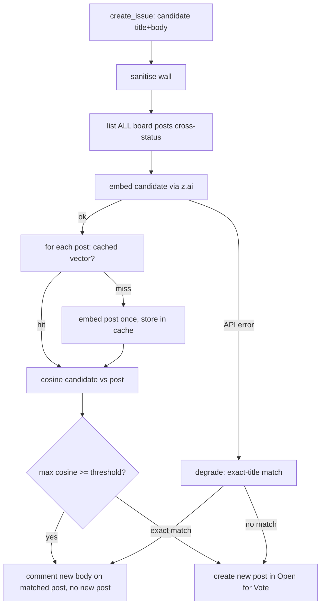

# fix: Harden Build-Suggestion dedup with semantic similarity

**Date:** 2026-06-23 · **Type:** fix · **Depth:** Standard
**Origin:** `docs/brainstorms/2026-06-23-dedup-hardening-semantic-requirements.md`

---

## Summary

The forge dedup backstop matches **exact normalized title** only, so reworded near-duplicate
Build Suggestions slip and the board accretes the same intent four ways. Replace that matcher
with **semantic cosine similarity** over post embeddings (title + body), cached per post,
sourced from z.ai (the existing provider/key), degrading to exact-title when the embeddings call
fails. Retire the now-blind keyword dedup layer, and — bundled — fix `create_issue` so new posts
land in `Open for Vote` instead of the stray `Open` default.

## Problem frame

Confirmed against the live code (see origin):

- `observation.py`'s fuzzy keyword dedup (`is_duplicate`, 5-keyword/2-hit) runs against
  `build_dedup_corpus(inputs)` ← `forge.list_open_issues()`, which for `QuackbackForge` returns
  **only `Accepted for Build` posts** (KTD3). New suggestions sit in `Open` / `Open for Vote`, so
  the corpus is empty → the fuzzy layer never fires.
- `QuackbackForge._find_duplicate_post` *does* list **all** board posts (cross-status) but matches
  exact normalized title (`_normalize_title`) → any rewording slips.

So the layer that catches rewording is blind, and the layer that sees everything can't match
fuzzily. The forge backstop is where both the full-board view and the fix belong.

## Key technical decisions

- **KTD1 — semantic matcher at the forge backstop, not a new layer.** Keep
  `_find_duplicate_post`'s all-posts cross-status listing; swap only the *matcher* from
  title-equality to cosine-over-embeddings. Single authoritative dedup that sees every post
  regardless of status (origin Approach).
- **KTD2 — embed title + body.** The body is the PM brief now, which carries the real intent a
  title abbreviates. Embed the concatenation (title is the strongest signal; body disambiguates).
- **KTD3 — persistent per-post embedding cache (operator-confirmed).** Each post's vector is
  computed once and stored (keyed by post id), so a dedup pass embeds only the *candidate* and
  compares against stored vectors — not re-embedding the whole board, which the restart-storm
  context makes expensive. A post with no cached vector is embedded once on read (backfill).
- **KTD4 — z.ai embeddings, reuse the existing key.** The box already uses z.ai
  (`ANTHROPIC_HOST`/`ZAI_API_KEY`); the embeddings model + endpoint reach the same account. Exact
  model id / endpoint / dimension are **VERIFY-first** (U1) before the client is built.
- **KTD5 — fail-closed-degrade, not fail-open.** An embeddings-API error degrades to the current
  exact-title match (a weaker backstop), never to "no dedup". The threshold is a conservative,
  config-tunable cosine cutoff — bias against over-merging two genuinely distinct asks.
- **KTD6 — on duplicate, unchanged behavior.** Comment the new body on the matched post (accretes
  context); never silently drop the signal — the current `create_issue` behavior.

---

## High-level technical design

---

## Implementation units

### U1. z.ai embeddings client (VERIFY-first)
**Goal:** a small client that turns text into a vector via z.ai, fail-closed-loud.
**Requirements:** KTD4, KTD5; origin "z.ai embeddings — VERIFY". **Dependencies:** none.
**Files:** `pipeline/wgmesh_pipeline/forge/embeddings.py` (new),
`pipeline/wgmesh_pipeline/config.py` (model id + enable flag, allowlisted),
`pipeline/tests/test_embeddings.py`.
**Approach:** **First probe** the z.ai embeddings endpoint/model/dimension with the box key (a
throwaway request, recorded in the plan/runbook) — mirror the cutover VERIFY discipline; do not
hardcode an unverified model id. Then a urllib client (injectable http caller, like
`quackback_client`) `embed(text) -> list[float]`, reusing `ZAI_API_KEY` + the z.ai host. Raise
`EmbeddingError` on non-2xx / malformed (never return a zero vector silently).
**Execution note:** VERIFY the endpoint before writing the client; test-first against a recorded
response fixture, no live call in tests.
**Patterns to follow:** `forge/quackback_client.py` (injectable `http_caller`, shape-assert,
fail-closed `_call`).
**Test scenarios:** valid response → returns the float vector of expected dim; non-2xx → raises;
malformed/no-vector body → raises; empty input → raises or returns documented sentinel (decide at
impl). `Covers: the embeddings source the matcher depends on.`

### U2. Persistent per-post embedding cache
**Goal:** store and retrieve a post's embedding by post id, so dedup embeds only the candidate.
**Requirements:** KTD3. **Dependencies:** none (schema only).
**Files:** `pipeline/wgmesh_pipeline/state/migrations/0006_post_embeddings.sql` (new),
`pipeline/wgmesh_pipeline/state/store.py` (get/put embedding methods),
`pipeline/tests/test_state.py`.
**Approach:** table `post_embeddings(post_id TEXT PK, model TEXT, vector TEXT, updated_at)` —
vector serialized (JSON array) keyed by post id + model (a model change invalidates the cache).
`get_post_embedding(post_id, model) -> list[float] | None`; `put_post_embedding(post_id, model,
vector)`. Mirror the `0005_decision_lane` / `decision_posts` store-method shape.
**Test scenarios:** put then get round-trips the vector; get on a missing id → None; a different
`model` → cache miss (None), not the stale vector; migration 0006 adds the table (assert the
migration list includes `0006`).

### U3. Cosine similarity matcher
**Goal:** a pure function that decides duplicate-or-not from two vectors + a threshold.
**Requirements:** KTD5. **Dependencies:** none.
**Files:** `pipeline/wgmesh_pipeline/forge/similarity.py` (new),
`pipeline/tests/test_similarity.py`.
**Approach:** `cosine(a, b) -> float`; `is_similar(a, b, threshold) -> bool`. Pure, no I/O; guard
zero-norm vectors (return 0.0, not a divide error).
**Execution note:** test-first — this is the precision/recall gate; pin the threshold behavior.
**Test scenarios:** identical vectors → cosine 1.0, similar at any threshold ≤ 1; orthogonal → 0.0,
not similar; just-above / just-below threshold flips `is_similar`; a zero vector → 0.0 (no crash).

### U4. Wire semantic matching into the forge dedup
**Goal:** `_find_duplicate_post` matches semantically over all posts, with the exact-title degrade.
**Requirements:** KTD1, KTD2, KTD5, KTD6. **Dependencies:** U1, U2, U3.
**Files:** `pipeline/wgmesh_pipeline/forge/quackback.py`,
`pipeline/wgmesh_pipeline/config.py` (dedup threshold + what-to-embed config, allowlisted),
`pipeline/tests/test_quackback_forge.py`.
**Approach:** in the dedup path: embed the candidate (U1); for each listed post, read its cached
vector (U2) or embed-and-cache once on miss; compute cosine (U3); the duplicate is the post with
the max cosine ≥ threshold. On any `EmbeddingError`, fall back to the existing `_normalize_title`
exact match (degrade, KTD5). The candidate text and post text are title + body (KTD2). Keep the
`_DEDUP_MAX_POSTS` page cap. On match, comment-on-existing as today (KTD6).
**Execution note:** characterization-first on the degrade path — assert the exact-title behavior is
preserved when embeddings raise, so a provider outage can't regress dedup to nothing.
**Test scenarios:** two same-intent / different-title posts (similar vectors via injected fake
embedder) → matched, no new post, body commented on existing; two distinct asks (dissimilar
vectors) → not matched, new post created; embeddings raise → falls back to exact-title (exact dup
caught, reworded not — documented degrade); a post missing a cached vector → embedded once and
stored, then compared; cache hit avoids re-embedding (assert the embedder is not called for cached
posts). `Covers origin success criteria: reworded dup caught, distinct asks not merged, outage
degrades not disables.`

### U5. Retire the blind keyword dedup layer
**Goal:** remove the empty-corpus keyword dedup so dedup has one authoritative owner.
**Requirements:** origin "retire/demote the keyword layer". **Dependencies:** U4.
**Files:** `pipeline/wgmesh_pipeline/observation.py`, `pipeline/wgmesh_pipeline/observation_gather.py`
(remove the dedup-corpus plumbing if now unused), `pipeline/tests/test_observation.py`.
**Approach:** remove `is_duplicate` / `build_dedup_corpus` use from `plan_actions` (the forge
backstop now owns dedup). Keep the assess prompt's "do NOT re-propose" board context — that's
prevention, not the guarantee. Delete now-dead helpers + their tests, or demote `is_duplicate` to a
documented cheap pre-filter if research shows it still adds value over a fed corpus (decide at impl;
default is remove).
**Test scenarios:** `plan_actions` no longer drops items via the keyword corpus (the forge dedups);
removed helpers' tests deleted; no import of the removed symbols remains. `Test expectation: behavior
parity — plan_actions still emits the planned creates; dedup moved downstream.`

### U6. Fix the create-default status (bundled)
**Goal:** new Build Suggestions land in `Open for Vote`, not the stray `Open` default.
**Requirements:** origin "wrong default board status (bundled)". **Dependencies:** none.
**Files:** `pipeline/wgmesh_pipeline/forge/quackback.py`,
`pipeline/tests/test_quackback_forge.py`.
**Approach:** `create_issue`'s `create_post` currently passes no status → lands in the Quackback
system default `Open` despite `Open for Vote` being `isDefault`. Pass the `Open for Vote` status id
explicitly (resolve via the existing `_status_id_for` / slug lookup) so new suggestions enter the
decision flow. KTD9 unaffected — `Open for Vote` is the board's intended *entry* status, set at
create, not a box-driven decision transition.
**Test scenarios:** `create_issue` calls `create_post` with the Open-for-Vote status id; a created
post's status is Open for Vote (fake asserts the status arg). `Covers: new posts enter the voting
flow + appear correctly off-roadmap.`

---

## Scope boundaries

**In:** semantic matcher at the forge backstop; z.ai embeddings client (VERIFY-first); persistent
per-post embedding cache; conservative configurable threshold; fail-closed-degrade to exact-title;
retire the keyword layer; the create-default-status fix.

**Deferred to Follow-Up Work:**
- **The restart-amplifier** — observation re-creates a full batch on every box restart (the *volume*
  driver). Perfect dedup makes re-runs create nothing new, but the wasted embedding/agent cost
  remains. Sibling fix (a "ran recently" guard), out of this plan (origin Out of scope).
- **Threshold tuning to data** — ship a conservative default; calibrate against known dup/non-dup
  pairs from the current board as a fast follow.
- **Semantic dedup on the decision lane** — proposals there are comment-threaded, not new posts.

## Risks & dependencies

- **z.ai embeddings shape unverified** — model id / endpoint / dimension are confirmed-to-exist but
  not pinned. U1 VERIFY gates the client; if z.ai exposes no usable embeddings endpoint, the
  provider reopens (a local sentence-embedding model is the fallback — the matcher + cache are
  provider-agnostic).
- **Over-merge (false positive)** — a too-low threshold merges distinct asks (the precision the
  exact-title match implicitly had). Mitigated by a conservative default + the distinct-asks test.
- **Embedding cost / latency per create** — bounded by the cache (candidate-only embed in steady
  state) and the `_DEDUP_MAX_POSTS` cap.
- **Depends on** the pipeline store (migrations), the existing z.ai credential, and the forge's
  existing all-posts listing (the listing half already works — only the matcher changes).

## Sequencing

U1 (VERIFY-first), U2, U3 are independent and parallelizable. U4 depends on U1+U2+U3 and is the
integration. U5 follows U4 (don't remove the keyword layer until the forge owns dedup). U6 is
independent and can land any time. Test-first on U1/U3 (the provider seam and the precision gate);
characterization-first on U4's degrade path.
