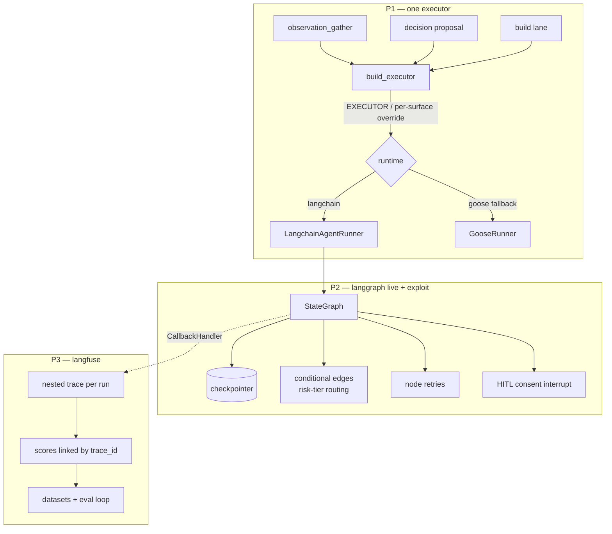

# feat: LangChain/LangGraph/Langfuse triad — completion & cutover

## Summary

Finish and cut over the agent runtime to one stack: the configured executor
(LangChain) on every LLM surface, a live LangGraph state graph with node retries,
checkpointed resume, conditional edges, and a HITL consent interrupt, and Langfuse
capturing trace-linked runs with scores and a dataset eval loop. P1 (executor) and the
base graph flip (U3) are completion-and-wiring. The LangGraph-native exploit, however,
requires **re-architecting the box's per-stage issue scheduler around graph interrupts**
(Phase 2a, U9–U12) — preserving round-robin fairness, the multi-cycle merge wait, and
inter-stage drift aborts — which is the dominant cost and not a mere flag flip. Flag
flips are gated by the (reshaped) parity test plus journal review, then `set-box-env` +
box restart with a flag-flip rollback.

---

## Problem Frame

The runtime is three layers at three completion states (see origin:
`docs/brainstorms/2026-06-23-lang-triad-cutover-requirements.md`). Two surfaces —
observation assess (`pipeline/wgmesh_pipeline/observation_gather.py:183`) and
decision proposal (`pipeline/wgmesh_pipeline/decision_lane/proposal_runner.py:29`)
— construct `GooseRunner` directly and bypass the `EXECUTOR` setting, so the
pipeline runs two agent runtimes at once and the Build-agent role's tool-agnostic
contract (CONCEPTS.md) is violated on those paths. LangGraph is built and
parity-tested (`graph/build_lg.py`, dispatched by `graph/build.py`) but the box
runs `legacy`, so its checkpoint/conditional-edge/retry/interrupt powers sit dark.
Langfuse's `CallbackHandler` is wired onto the langgraph invoke path
(`build_lg.py:40-47`) but not legacy — so per-node auto-tracing is effectively off
on the box, and scores key on `session_id` but not `trace_id`. Underneath:
z.ai timeouts hit at the SDK boundary with no agent-loop backoff. The triad makes
those failures visible (Langfuse) and recoverable (LangGraph retries + checkpoints).

This is meta-pipeline work (STRATEGY.md tracks *Convergence engine* and *Self-heal
& resilience*) — it advances "no babysitting," not product convergence.

The origin's P0 recon (R1–R3 — box graph impl, Goose-direct surface inventory,
Langfuse wiring) is scout-confirmed and folded into this plan's grounding (see
Sources); no separate recon unit. The one residual P0 probe — whether
`EXECUTOR=langchain` is already live on the box — is an Open Question, not a blocker
(the per-surface gating is safe either way).

---

## Key Technical Decisions

- **Per-surface executor gating, not a bare reroute.** `EXECUTOR` is one
  process-global flag read once at startup (`config.py:338`), and the build lane
  already runs `langchain`. A mechanical `GooseRunner(config)` → `build_executor(config)`
  swap would therefore cut observation and decision to langchain the instant they
  deploy, with no shadow buffer. Add per-surface overrides
  (`observation_executor` / `decision_executor`, each defaulting to the global
  `executor`) so each surface lands inert (goose) and flips independently. Honors
  the origin's "human-flip each surface."

- **Native mechanics require an interrupt-driven scheduler re-architecture (U9–U12,
  the dominant cost of the plan).** Today `poller.py` is an issue *scheduler*, not a
  driver: `claim_next` takes one issue per tick and advances exactly one stage
  (`self.graph.triage`/`.spec`/`.implement`/`.review` via `_run_stage`, each its own
  `_compile_single` graph), round-robining across issues for fairness; the multi-cycle
  `awaiting_merge` re-poll loop (`poller.py:219-268`) waits for GitHub to merge across
  many ticks; `_mirror_quackback` (`poller.py:272-343`) runs drift-abort checks at five
  inter-stage points (two abort *before* a side-effecting stage). The full StateGraph's
  conditional edges, retries, and interrupts only fire under `self.compiled.invoke()` —
  a path the box never calls — and a naive "one full invoke per cycle" would run all
  stages for one issue per tick (breaking fairness; ~14 min/LLM call starves others),
  has no node for the multi-cycle `awaiting_merge` wait, and no place for the
  pre-stage drift aborts (all verified against the code by two reviewers). So the
  cutover is a **re-architecture of the scheduler around graph interrupts**: insert a
  graph interrupt at each stage boundary so the graph pauses per stage and the
  checkpointer resumes one stage per tick (preserving round-robin fairness), model
  `awaiting_merge` as an interrupt node the scheduler re-polls, and move the drift
  checks into graph gate-nodes with abort edges. This is the precondition that makes
  the exploit features (U4/U5/U6) attach where the box runs and the parity test gate
  the real path.

- **The parity test is the cutover gate, but it is not transparent to the exploit
  features.** `test_build_lg_parity.py` (`_assert_parity()` asserts
  `legacy_result == langgraph_result` and identical `RecordingClient.calls`, invoking
  with no config) breaks the moment exploit features land, verified empirically on
  the repo's langgraph 1.2.5: (a) a checkpointer compile raises
  `ValueError: Checkpointer requires ... thread_id` on a config-less invoke; (b)
  `interrupt()` makes invoke return `{..., "__interrupt__": [...]}` — a partial
  state, not a finished `GraphState`, so the equality assertion can never hold on
  consent paths; (c) a node retry re-emits any pre-failure recorded call, diverging
  `RecordingClient.calls`. The gate must be reshaped, not assumed transparent: thread
  the `thread_id` through both invoke and the harness; carve interrupt paths into a
  pause→resume→compare scenario whose reference is the legacy poll-consent terminal
  (or an explicit golden fixture) — comparing resumed-langgraph against nothing
  degrades to a langgraph-vs-langgraph self-check on the merge-granting path; and make
  retries idempotent-call-set tolerant rather than excluding the timeout-prone nodes
  (see U4). The recorded-call-emitting nodes are: `spec_pr` (`create_pr`/`add_label`),
  `implement` (`push_branch`/`create_pr`), `gate`/`side_effects`
  (`enable_auto_merge`/`merge_pr`), `escalate` (`add_label`), `surface_gate`
  (`add_label` on block) — any retry or new conditional edge re-entering one of these
  diverges `RecordingClient.calls`.

- **Checkpointer is net-new, durable, access-controlled, and has two seams.** No
  `compile(checkpointer=...)` exists today. `build_state_graph` compiles six graphs —
  five per-stage (`_compile_single`, `build_lg.py:170`) plus the orchestration graph
  (`:238`); the checkpointer attaches to whichever path U9 makes the box drive, with
  `thread_id` plumbed at each `invoke` site. Cross-restart resume requires a durable
  backend (sqlite/postgres), not in-memory — the box restarts on every flag flip —
  and that backend persists `GraphState`, so it must (i) strip `_UNSAFE_STATE_KEYS`
  before serialization (see secret-strip KTD) and (ii) be access-controlled / out of
  the public repo. Backend choice is an open question.

- **Secret strip must be an implementation seam, not just a test assertion.**
  `_UNSAFE_STATE_KEYS = ("github","goose_runner","config")` exists in `tracing.py`
  for the manual `trace_node` path only; `config` carries `zai_api_key`/
  `wgmesh_bot_pat` in plaintext (bug #13). Both the checkpointer (U4) and the
  auto-trace `CallbackHandler` (U7) serialize the full `GraphState` by default and
  bypass `_safe_state`. The plan must name the seam — a pre-serialization
  `_safe_state` transformer wrapping the checkpointer's `put`, and a handler
  serialization hook or safe-projected node state — not rely on a downstream test to
  catch the leak. `_UNSAFE_STATE_KEYS` stays authoritative in `tracing.py`; U4 and U7
  both import it (no second copy).

- **HITL/retry edges mirror the proven "autonomy inside the gates" split**
  (`docs/solutions/design-decisions/multi-model-routing.md`). Quality-only failures
  (tests/review) retry on the next tier; security (`sanitise`) or high `risk_tier`
  goes straight to the human interrupt. Conditional edges already live in
  `build_lg.py` router methods (`route_after_triage`, `route_after_gate`, …) — new
  edges attach there; node retries attach at `add_node`/`compile`.

- **Trace-linked scores: capture the trace id from the live span, not the handler
  object.** Scores key on `session_id` today (reliable, `issue-{n}`) and accept
  `trace_id` only if a node stuffed it into state (`scoring.py:245`
  `_trace_id_from_state`). The repo pins `langfuse>=3`, whose `CallbackHandler()` is
  stateless w.r.t. trace id — there is no `handler.last_trace_id` to read after
  `.invoke()` returns (the v2 API the origin assumed). The trace id lives in the OTEL
  span context and must be captured **inside** a node while the span is open via
  `langfuse.get_current_trace_id()` (confirm the exact accessor against the box's
  installed build), written into `GraphState`, and reduce-merged to the top level.
  Code stays the source of truth for attribution (`scoring.py`); handler spans are
  best-effort.

- **Verify the evaluator reads the deliverable field on a real trace.** The prior
  empty-output scoring bug (`docs/solutions/logic-errors/langfuse-evaluators-scored-empty-output.md`)
  came from `{{output}}` pointing at a span that carried no deliverable text, so
  NUMERIC judges defaulted high. Before trusting any score, dump one live langgraph
  trace and confirm the field the evaluator reads carries the deliverable. Exclude
  the eval worker's own judge LLM calls (`name "none of" [...]` filter). Never
  serialize `config`/tokens into a trace (`_UNSAFE_STATE_KEYS`, bug #13 — public repo).

- **Surgical reroute.** Per AGENTS.md simplicity-first: P1 is a near-mechanical
  swap preserving `stage=`/`session_id=`/file-path-param conventions and the
  stdout-salvage + empty-output guard in the runner
  (`docs/solutions/runtime-errors/goose-weak-model-prints-spec-instead-of-writing.md`).
  Exit 0 ≠ success — assert the deliverable artifact exists.

---

## High-Level Technical Design

End-state runtime and the three cutover flips:

Parity gates legacy vs langgraph. Auto-tracing fires on the flip (the `CallbackHandler`
already rides `StateGraphWrapper.invoke`/`_run_stage`), but trace grouping and
trace-linked scores require the interrupt-driven invoke/resume path (U9–U10, keyed by
`thread_id`) and U7 (in-span trace-id capture) — until then the box emits N per-stage
traces per session.

---

## Implementation Units

### Phase 1 — One executor everywhere

### U1. Per-surface executor gating + observation reroute

- **Goal:** Add `observation_executor` / `decision_executor` config (default to the
  global `executor`) and reroute observation assess through `build_executor` honoring
  the per-surface value. Lands inert (goose) until flipped.
- **Requirements:** R5, R6, R7
- **Dependencies:** none
- **Files:** `pipeline/wgmesh_pipeline/config.py` (parse two new env keys, fallback
  to `executor`), `pipeline/wgmesh_pipeline/executor.py` (accept an explicit
  surface/executor-name override in `build_executor` or a thin per-surface helper),
  `pipeline/wgmesh_pipeline/observation_gather.py` (swap `GooseRunner(self.config)`
  at line 183 for the per-surface executor), `pipeline/tests/test_executor_factory.py`,
  `pipeline/tests/test_config.py` (or nearest config test)
- **Approach:** Mirror the existing `executor=(_get_nonempty(... "EXECUTOR") or "goose")`
  parse for `OBSERVATION_EXECUTOR` / `DECISION_EXECUTOR`, each falling back to
  `config.executor` when unset. Keep `build_executor`'s fail-closed `ValueError` on
  unknown names. Preserve `stage="observation"`, `session_id="control-loop-observation"`,
  and the file-path-param convention. Do not add abstraction beyond the override.
- **Patterns to follow:** `build_executor` factory (`executor.py:39-59`), the
  `EXECUTOR` parse + normalization (`config.py:338`), `test_executor_factory.py`
  env-normalization tests.
- **Execution note:** Start with a failing test asserting the rerouted surface runs
  through `build_executor` and honors the per-surface override (real path, not a
  dry-run stub — AGENTS.md).
- **Test scenarios:**
  - `OBSERVATION_EXECUTOR` unset → observation resolves to `config.executor`
    (fallback). Covers R6.
  - `OBSERVATION_EXECUTOR=goose` with global `EXECUTOR=langchain` → observation runs
    `GooseRunner` (independent gating proven). Covers R6.
  - `OBSERVATION_EXECUTOR=langchain` → observation runs `LangchainAgentRunner`,
    `run_recipe` called with `stage="observation"`, `session_id` preserved.
    Covers R5, R7.
  - `OBSERVATION_EXECUTOR="LangChain "` → normalized to `langchain`.
  - Unknown value → `ValueError` (fail-closed).
  - Rerouted observation still produces the strict 4-key JSON assessment
    (`issues_to_create`/`issues_to_close`/`needs_human`/`prs_to_close`); empty/
    missing output raises, not silently passes (exit 0 ≠ success). Covers R5.
- **Verification:** Tests green; with all per-surface flags unset the box behavior
  is byte-identical to today (goose); flipping `OBSERVATION_EXECUTOR=langchain` is
  the only thing that moves observation to langchain.

### U2. Decision proposal reroute through per-surface executor

- **Goal:** Reroute decision proposal through `build_executor` honoring
  `decision_executor`. Lands inert (goose).
- **Requirements:** R4, R6, R7
- **Dependencies:** U1
- **Files:** `pipeline/wgmesh_pipeline/decision_lane/proposal_runner.py` (swap
  `GooseRunner(config)` at line 29), `pipeline/tests/` (decision proposal runner test
  — create if absent)
- **Approach:** Same swap as U1 using `decision_executor`. Decision output is
  free-form markdown (no JSON contract) — preserve the existing output handling;
  do not add structured-output validation (out of scope per origin). Preserve
  `stage="decision"`, `session_id=f"decision-{id}"`.
- **Patterns to follow:** U1; `proposal_runner.py` current call shape.
- **Execution note:** Test-first on the reroute honoring `decision_executor`.
- **Test scenarios:**
  - `DECISION_EXECUTOR` unset → resolves to `config.executor`.
  - `DECISION_EXECUTOR=langchain` → `LangchainAgentRunner`, `stage="decision"`,
    `session_id` preserved, runs through `build_executor`. Covers R4, R7.
  - `DECISION_EXECUTOR=goose` with global langchain → runs goose (independent).
    Covers R6.
  - Free-form markdown proposal still returned non-empty; empty output raises.
- **Verification:** Tests green; decision path inert (goose) until
  `DECISION_EXECUTOR=langchain` flipped.

---

### Phase 2 — LangGraph live, full capability set

### U3. Base langgraph cutover (parity-gated flag flip)

- **Goal:** Flip `GRAPH_IMPL=langgraph` live after the parity harness proves
  langgraph == legacy on a real cycle, and verify a live issue flows
  triage→spec→impl→review on the deployed SHA.
- **Requirements:** R8, R9
- **Dependencies:** none (independent of U1/U2)
- **Files:** `pipeline/tests/test_build_lg_parity.py` (extend to cover a full
  real-cycle transition set if current coverage is partial — confirm not hollow),
  `docs/runbooks/` (cutover + rollback runbook entry)
- **Approach:** No runtime shadow mode exists for `GRAPH_IMPL`; the gate is the
  parity test plus journal review of a real langgraph cycle. The base flip runs the
  langgraph graph through the existing per-stage `_run_stage` wrapper path (the box's
  current stage-by-stage driving) — it does NOT yet require U9; U9 follows to convert
  to single-`invoke()` so the native exploit mechanics (U4/U5/U6) can attach. Cutover
  = `set-box-env GRAPH_IMPL=langgraph` + box restart; **verify the box runs the merged
  SHA** before trusting the flip (merge ≠ deploy —
  `reference_box_redeploy_merge_not_deploy_lag`). Rollback = `set-box-env
  GRAPH_IMPL=legacy` + restart.
- **Patterns to follow:** `test_build_lg_parity.py` `_assert_parity()` /
  `RecordingClient`; the merge-lane-heal / quackback shadow→prove→flip→verify→
  rollback discipline.
- **Execution note:** Characterization-first — confirm the parity harness exercises
  the real stage transitions (not stubs) before relying on it as the gate; drive a
  test through the real boundary (hollow-green caution, CONCEPTS.md).
- **Test scenarios:**
  - Parity harness asserts identical result and identical `RecordingClient.calls`
    across legacy and langgraph for: wont-do escalate, needs-info escalate,
    surface-gate block, spec-only return, full implement→review→gate→merge,
    gate-retry→ladder loop. Covers R8.
  - `GRAPH_IMPL=" LangGraph "` → `config.graph_impl == "langgraph"`, dispatch returns
    `StateGraphWrapper`. Covers R9.
  - `GRAPH_IMPL` unset → `legacy` (rollback default holds).
- **Verification:** Parity test green on the full transition set; on the box, a real
  issue completes triage→spec→impl→review on langgraph and the deployed SHA matches
  the merged commit.

### Phase 2a — Interrupt-driven scheduler re-architecture

This sub-phase is the dominant cost. It converts the box from a per-stage poller
scheduler to an interrupt-driven graph scheduler that preserves round-robin fairness,
the multi-cycle merge wait, and the inter-stage drift aborts. Characterization-first
throughout: capture the poller's current external behavior at the real boundary
(forge calls, merge/escalate outcomes, drift aborts, awaiting_merge re-poll, multi-
issue fairness) before refactoring, and prove it unchanged (hollow-green caution).

### U9. Per-stage interrupts in the StateGraph + interrupt-aware invoke

- **Goal:** Insert a graph interrupt at each stage boundary so the graph pauses after
  each stage rather than running triage→review in one shot, and make
  `StateGraphWrapper.invoke` interrupt-aware (accept `thread_id` in config, return/
  detect the `__interrupt__` shape, resume via `Command(resume=...)`). This makes
  "one stage per resume" the unit of execution — the seam the scheduler (U10) drives.
- **Requirements:** advances R9 (real-path cutover); unblocks R10–R13
- **Dependencies:** U3
- **Files:** `pipeline/wgmesh_pipeline/graph/build_lg.py` (per-stage interrupts;
  `thread_id` in invoke config; `__interrupt__` detect/resume),
  `pipeline/tests/test_build_lg_parity.py`, `pipeline/tests/test_build_lg_interrupt.py`
  (new)
- **Approach:** Attach interrupts + checkpointer to the **orchestration graph**
  (`build_lg.py:196-238`), NOT the five `_compile_single` per-stage graphs — the
  orchestration graph is where routing and the retry loop live. It is not a linear
  stage list: `route_after_triage` (→ escalate|surface_gate), `route_after_gate`
  (→ side_effects|ladder_retry), and the `ladder_retry→ladder_prep→implement` loop
  fan out. So "one stage per resume" must be defined for branching/looping nodes:
  specify whether the interrupt sits before or after each router, and what a resume
  does when it re-enters the ladder loop (each loop iteration is one resumable
  advance). Thread `thread_id` (issue number) through invoke and the parity harness —
  a checkpointer-compiled graph raises without it (verified, 1.2.5). The interrupting
  invoke returns `{..., "__interrupt__": [...]}` (partial state) — the wrapper detects
  this, never treats it as terminal. Reshape the parity harness to drive stage-by-stage
  via resume and compare per-stage results to legacy.
- **Patterns to follow:** `StateGraphWrapper.invoke`/`_run_stage` (`build_lg.py:40-85`);
  `route_after_*` router methods; `test_build_lg_parity.py` `_assert_parity()`.
- **Execution note:** Test-first on pause-after-stage + resume-to-next-stage; reshape
  parity to the resume-driven path.
- **Test scenarios:**
  - A single invoke/resume advances exactly one stage then returns the `__interrupt__`
    shape; the wrapper detects it, does not treat it as terminal.
  - `thread_id` (issue number) present in invoke config; checkpointer-compiled graph
    does not raise.
  - Parity harness drives stage-by-stage via resume; per-stage results and recorded
    calls match legacy for the legacy-handled input classes. Covers R8.
- **Verification:** One resume = one stage advance, paused at the next boundary;
  parity green on the resume-driven harness.

### U10. Interrupt-driven scheduler in the poller

- **Goal:** Convert `poller.py` so each tick `claim_next`s one issue and **resumes its
  checkpointed graph by `thread_id`** (or starts a fresh invoke if none), advancing one
  stage and re-pausing — preserving round-robin fairness — instead of dispatching to a
  stage method. Reconcile the stage-label store + `scratch` with the graph checkpoint
  as one source of truth.
- **Requirements:** advances R9; unblocks R10–R13
- **Dependencies:** U9
- **Files:** `pipeline/wgmesh_pipeline/poller.py` (replace `_advance_one_stage` +
  `poller.py:186-217` Python gate/escalation with resume-one-stage-by-thread_id),
  `pipeline/tests/test_poller.py`
- **Approach:** The scheduler keeps `claim_next`'s one-issue-per-tick fairness; the
  per-issue work becomes "resume the graph one stage." Distinguish "issue has a pending
  interrupt checkpoint → resume" from "no checkpoint → fresh invoke" by querying the
  checkpointer for the `thread_id`. Decide the store-label vs checkpoint precedence
  rule explicitly (the checkpoint is the execution source of truth; the store label is
  the index) so a resume never double-applies a stage. **Fairness is timestamp-driven,
  not graph-driven:** `claim_next` orders by `store.updated_at ASC` (`store.py:222`) +
  per-attempt cooldown, and today every stage advance bumps `updated_at`. Every resume
  that advances a stage must likewise touch `updated_at` (and honor the cooldown) or
  the just-advanced issue keeps its oldest timestamp and is re-claimed next tick,
  starving siblings. **Re-inject stripped handles on resume:** `_safe_state` /
  checkpoint serialization strip `github`/`goose_runner`/`config` (non-serializable +
  secret), so the scheduler must re-supply them into the resumed `GraphState` before
  any node that needs them runs.
- **Patterns to follow:** `store.claim_next` (`store.py:210`); `poller.py` current
  per-tick loop; the checkpointer `get(thread_id)` API.
- **Execution note:** Characterization-first — capture multi-issue round-robin
  progress and per-stage advancement, then refactor and prove fairness preserved.
- **Test scenarios:**
  - Two in-flight issues at different stages both advance across consecutive ticks;
    a resumed issue's `store.updated_at` is bumped so it moves to the back of the
    `claim_next` order (round-robin fairness preserved, no single-issue busy-loop).
  - An issue with a pending interrupt checkpoint resumes; one without starts a fresh
    invoke; stripped handles (`github`/`goose_runner`/`config`) are re-injected before
    the resumed node runs.
  - A resumed stage is not double-applied (store-label vs checkpoint precedence holds).
  - External behavior (forge calls, terminal outcomes) matches the prior poller for the
    legacy-handled input classes.
- **Verification:** Multiple issues progress one stage per tick each; no stage double-
  applied; outcomes match the prior scheduler.

### U11. `awaiting_merge` as an interrupt node

- **Goal:** Model the multi-cycle merge wait as a graph interrupt after
  `enable_auto_merge`: the graph pauses, the scheduler re-polls the PR each tick and
  resumes-or-stays, transitioning to merged on real merge and escalating on
  closed-unmerged — replacing the poller's `awaiting_merge` re-poll loop
  (`poller.py:219-268`).
- **Requirements:** advances R9; preserves the merge-wait behavior single-invoke lacks
- **Dependencies:** U9, U10
- **Files:** `pipeline/wgmesh_pipeline/graph/build_lg.py` (awaiting_merge interrupt
  node + edges), `pipeline/wgmesh_pipeline/poller.py` (re-poll + resume), `gate.py`
  (the `enable_auto_merge` boundary), `pipeline/tests/test_poller.py`,
  `pipeline/tests/test_build_lg_interrupt.py`
- **Approach:** After `side_effects`/`enable_auto_merge`, interrupt; the scheduler's
  re-poll checks PR state and resumes only on a terminal merge signal. The interrupt
  must sit **strictly after** `enable_auto_merge` so the many re-poll resumes never
  replay it (this is the one interrupt that legitimately resumes repeatedly). Never
  record `merged` while the PR is open (`poller.py:255-268`). Closed-unmerged →
  escalate edge.
- **Patterns to follow:** `poller.py:219-268` current `awaiting_merge` loop;
  `gate.py:112-114`.
- **Test scenarios:**
  - PR not yet merged across multiple ticks → no `merged` transition, issue re-polled.
  - PR merged → resume to merged/END.
  - PR closed-unmerged → escalate, no `merged`.
- **Verification:** An issue parks at awaiting_merge across ticks and only records
  merged on a real merge; closed-unmerged escalates.

### U12. Inter-stage drift checks as graph gate-nodes

- **Goal:** Move `_mirror_quackback` drift checks (`poller.py:272-343`, five inter-stage
  points, two abort-before-side-effect) into graph gate-nodes with abort edges, so a
  founder moving a post out of the lane still aborts work *before* the side-effecting
  stage (e.g. the spec_ready drift check before the impl PR is opened).
- **Requirements:** preserves the drift-abort gating single-invoke lacks
- **Dependencies:** U9, U10
- **Files:** `pipeline/wgmesh_pipeline/graph/build_lg.py` (drift gate-nodes +
  conditional abort edges), `pipeline/wgmesh_pipeline/decision_lane/` (mirror call),
  `pipeline/tests/test_build_lg_routing.py`, `pipeline/tests/test_poller.py`
- **Approach:** Each pre-stage drift check becomes a gate-node; on drift it routes to
  escalate (the abort edge) rather than proceeding. Preserve the five check points and
  the two abort-before-side-effect semantics exactly. **Split drift-READ from
  status-WRITE:** `_mirror_quackback` not only aborts — it calls `client.set_status`
  (`poller.py:331-342`), an external mutation of the founder's board. LangGraph
  re-executes a node from the checkpoint on each resume, so a gate-node that re-issues
  `set_status` would double-mirror (re-flipping a post, or racing a status the founder
  just changed). The gate-node only reads + routes (replay-safe); the `set_status`
  write fires from an idempotent point — guard on already-at-target, or key it to a
  once-per-stage-transition site off the store label — so a resume cannot re-mirror.
- **Patterns to follow:** `_mirror_quackback` call sites (`poller.py:127,164-169,…`);
  `route_after_*` conditional-edge pattern.
- **Test scenarios:**
  - A spec_ready drift-out-of-lane → no impl PR opened, store row escalated.
  - A non-drift cycle proceeds through the gate unchanged.
  - Each of the five mirror points still fires at its stage.
- **Verification:** Drift at any of the five points aborts/mirrors exactly as the
  poller did; no impl PR opens against a cancelled decision.

---

### Phase 2b — Exploit features (on the re-architected scheduler)

### U4. Node retries + checkpointed resume

- **Goal:** Add the first `compile(checkpointer=...)` and a node retry policy so the
  provider timeout — which fires inside `implement`/`spec_pr` LLM calls — retries
  without re-emitting forge calls, and a hard failure resumes from checkpoint instead
  of restarting. NOT transparent to the parity contract — reshape the gate per the
  parity KTD.
- **Requirements:** R10, R13
- **Dependencies:** U9, U10
- **Files:** `pipeline/pyproject.toml` (add + pin a durable checkpoint backend —
  `langgraph-checkpoint-sqlite` or `-postgres`; only `MemorySaver` is installed today
  and it loses all in-flight state on the restart this unit designs for),
  `pipeline/wgmesh_pipeline/graph/build_lg.py` (`compile(checkpointer=...)`, retry
  policy; split the call-emitting stages — see Approach),
  `pipeline/wgmesh_pipeline/graph/nodes/implement.py`,
  `pipeline/wgmesh_pipeline/graph/nodes/spec_pr.py`,
  `pipeline/wgmesh_pipeline/config.py` (checkpointer backend + retry knobs),
  `pipeline/tests/test_build_lg_parity.py`,
  `pipeline/tests/test_build_lg_checkpoint.py` (new)
- **Approach:** Configure a durable, access-controlled checkpointer at the invoke seam
  U9 establishes, with `thread_id` plumbed through invoke and the parity harness (a
  config-less invoke raises `ValueError: Checkpointer requires ... thread_id`,
  verified). Wrap the checkpointer's `put` with a `_safe_state` transformer so
  `_UNSAFE_STATE_KEYS` never serialize (the seam, not just a test). **The timeout-prone
  node is the LLM call, which is also call-emitting** — `implement` runs `run_recipe`
  (the z.ai timeout, `implement.py:40`) then `push_branch`/`create_pr` (`:75,:77`); a
  blanket "retry only call-free nodes" would exclude exactly the node that times out,
  delivering no resilience. Resolve at the node boundary, accounting for where state lives: the diff is captured
  from the **dirty git workspace** (`_stage_impl_tree` → `git diff --cached`, then
  commit — `implement.py:59-68`), not produced into `GraphState`, and the prepared
  branch checkout (`_prepare_impl_workspace`, `implement.py:157`) plus the
  runner/`github` handles are not serializable into the checkpoint. So a naive split
  whose "retryable LLM prefix" relies on the live workspace breaks on cross-restart
  resume (branch + dirty tree gone, handles null). Two viable scopes — pick one and
  state it: **(a)** persist the produced **diff text** into `GraphState` at the end of
  the LLM sub-node, and have the forge sub-node reconstruct from that persisted diff
  rather than the live workspace (true cross-restart resume); or **(b)** treat
  `implement` as a single node whose retry is **in-process only** (retry the LLM within
  the same invoke, no cross-restart resume of a half-built workspace). Either way, name
  how runner/`github` are re-injected on resume. For the call-divergence concern, make
  the parity harness assert idempotent call-set equivalence on retried nodes (leaning
  on `create_pr`'s existing `find_open_pr_number` idempotency, `implement.py:59,187`).
  Bound retries by attempt count, not live dollars (cost is async). Client timeout
  stays generous (600s, `be0d8b9`).
- **Patterns to follow:** `build_lg.py` `_compile_single` compile seam; the
  escalate-on-fail bounded-attempt ladder in `models.py`; `_safe_state` in `tracing.py`;
  `create_pr` idempotency (`implement.py:59,187`).
- **Execution note:** Add a failing test that the `implement` LLM sub-node retries on a
  transient timeout and re-completes without re-emitting `create_pr`; reshape parity to
  the thread_id + idempotent-call-set path.
- **Test scenarios:**
  - The `implement` LLM sub-node raises a transient timeout once → retried → succeeds;
    `create_pr` fires exactly once (not re-emitted). Covers R10.
  - Run fails past retry budget → checkpoints; a resume continues from the last
    checkpoint, not from triage. Covers R10.
  - Parity harness asserts idempotent call-set equivalence on retried nodes; non-retry
    runs match legacy exactly. Covers R13.
  - Checkpointed state contains no `config`/token/`github` keys, asserted on the
    serialized payload the checkpointer wrote.
  - Retries bounded by attempt count (no unbounded loop on persistent failure).
- **Verification:** A simulated `implement`-stage timeout retries the LLM sub-node and
  resumes without a duplicate PR; the reshaped parity scenarios pass; the persisted
  checkpoint payload carries no secrets.

### U5. Conditional edges — risk-tier / classification routing

- **Goal:** Add conditional edges that route by risk tier / classification where the
  legacy poller ran a fixed sequence, following the "autonomy inside the gates" split.
  Effective only on the re-architected interrupt-driven scheduler (U9/U10) — edges are
  dead under the old per-stage `_run_stage` path. Risk-tier-divergent inputs are new
  behavior, explicitly outside the legacy-parity corpus (legacy never produced them).
- **Requirements:** R11, R13
- **Dependencies:** U9, U10
- **Files:** `pipeline/wgmesh_pipeline/graph/build_lg.py` (router methods +
  `add_conditional_edges`), `pipeline/tests/test_build_lg_parity.py`,
  `pipeline/tests/test_build_lg_routing.py` (new)
- **Approach:** Extend the existing router methods (`route_after_*`). Quality-only
  rejections retry on the next tier; security (`sanitise`) or high `risk_tier` routes
  straight to escalate/interrupt — never auto-retried. New routing must remain
  parity-equivalent for the inputs the legacy graph already handled; only genuinely
  new branches (risk-tier divergence) add behavior, and those need their own
  scenarios since legacy has no equivalent.
- **Patterns to follow:** `route_after_gate` retry loop; the quality-vs-security
  split in `multi-model-routing.md`.
- **Test scenarios:**
  - Quality-only gate failure → routes to ladder retry on next tier. Covers R11.
  - `sanitise`/security failure → routes straight to escalate, no retry. Covers R11.
  - High `risk_tier` → routes to human interrupt path, bypassing auto-merge.
  - Inputs the legacy graph handled keep identical routing (parity green). Covers R13.
- **Verification:** Risk-tier inputs route per the split; legacy-equivalent inputs
  stay parity-green.

### U6. HITL consent gate as graph interrupt

- **Goal:** Express the decision-lane consent gate as a LangGraph interrupt (pause →
  external consent → resume) rather than a poll.
- **Requirements:** R12, R13
- **Dependencies:** U9 (interrupt machinery), U10 (scheduler resume-by-thread_id),
  U4 (checkpointer the interrupt pauses into)
- **Files:** `pipeline/wgmesh_pipeline/graph/build_lg.py` (consent interrupt node/edge,
  reusing U9's interrupt machinery),
  `pipeline/wgmesh_pipeline/decision_lane/` (consent signal + authz check),
  `pipeline/tests/test_build_lg_interrupt.py`
- **Approach:** The consent gate is one more interrupt riding U9's per-stage interrupt
  machinery; the U10 scheduler already resumes a pending interrupt by `thread_id`, so
  the consent resume reuses that path — it is not a new trigger mechanism. **Consent is
  a security boundary:** the resume grants real side-effects (PR merges), so validate
  the consent signal originates from a trusted actor (e.g. a Quackback-signed
  `Accepted for Build` event) before `Command(resume=...)`; log and reject
  unauthenticated/spoofed resume attempts, never silently drop. Legacy has no interrupt
  (the consent gate was a poll), so the carve-out's resumed-terminal state is compared
  against the **legacy poll-consent terminal** (drive the legacy flow to completion) or
  an explicit golden fixture — not against nothing. Must not regress the legacy
  decision flow when `GRAPH_IMPL=legacy`.
- **Patterns to follow:** `build_lg.py` node/edge add; the decision-lane consent flow
  (`decision_lane/`); the Quackback `Accepted for Build` gate (memory:
  `project_quackback_decision_layer`).
- **Execution note:** Test-first on pause-at-consent + authorized-resume; assert
  unauthenticated resume is rejected.
- **Test scenarios:**
  - Run reaches consent node → invoke returns the `__interrupt__` shape; caller
    persists, does not proceed to side-effects. Covers R12.
  - Authorized consent (trusted-actor signal) → `Command(resume=...)` continues to
    side-effects. Covers R12.
  - Unauthenticated/spoofed resume signal → rejected and logged, no merge.
  - Consent denied → routes to escalate/close, no merge.
  - Interrupt paths are carved out of the `legacy_result == langgraph_result` equality
    assertion and validated by pause→resume→compare against the legacy poll-consent
    terminal (or a golden fixture), not against nothing; non-consent paths keep parity.
    Covers R13.
- **Verification:** A consent-gated run pauses, persists, and resumes only on an
  authorized signal; the interrupt return shape is handled, not mistaken for terminal;
  no auto-proceed without authorized consent.

---

### Phase 3 — Langfuse auto-trace, scores, eval loop

### U7. Trace-linked scores + field verification

- **Goal:** Back-write the `CallbackHandler` trace id into `GraphState` so scores
  link to the trace; verify the evaluator field carries the deliverable; exclude the
  eval worker's own judge calls; scope evaluators to run type.
- **Requirements:** R14, R15
- **Dependencies:** U9, U10 (trace grouping needs the re-architected invoke/resume
  path keyed by `thread_id`; per-stage resumes group under one session/thread)
- **Files:** `pipeline/wgmesh_pipeline/graph/build_lg.py` (capture trace id inside a
  node via the live span), `pipeline/wgmesh_pipeline/tracing.py`,
  `pipeline/wgmesh_pipeline/scoring.py` (consume `trace_id` from state),
  `pipeline/evals/setup_langfuse_evaluators.py` (judge-call exclusion filter +
  run-type scoping), `pipeline/tests/test_scoring.py`,
  `pipeline/tests/test_callback_handler_tracing.py`
- **Approach:** Capture the trace id **inside a node while the span is open** via
  `langfuse.get_current_trace_id()` (confirm accessor against the box's `langfuse>=3`
  build) and write it into `GraphState` so `_trace_id_from_state` (`scoring.py:245`)
  reads it — the v3 `CallbackHandler()` exposes no post-invoke trace id, so the
  origin's "read it off the handler after invoke" does not work. Ensure the
  auto-trace handler does not serialize `_UNSAFE_STATE_KEYS` from node inputs (it
  serializes full state by default, bypassing `_safe_state` — apply a serialization
  hook or pass nodes a safe-projected state). Confirm on a real trace that the
  evaluator's `{{var}}` points at the field carrying the deliverable (node-span vs
  generation split — the empty-output trap). Add a `name "none of"` filter excluding
  the eval worker's `ChatAnthropic` judge generations. Scope `impl_faithfulness`-style
  evaluators to impl runs (today they score observation/decision runs and read low).
  Decide `trace_node` retire-vs-layer (open question). (Scope-guardian split note: the
  live-trace field check is an ops verification step, not unit-testable — it lives in
  the U3 cutover runbook; the code work here is the trace-id capture + evaluator
  filters.)
- **Patterns to follow:** `scoring.py` `LangfuseScorer.record` (`score_id` idempotency,
  `session_id` always, `trace_id` when present); `tracing.py` `emit_generation`;
  `_UNSAFE_STATE_KEYS` strip.
- **Execution note:** Verify against one live trace before trusting scores — this is
  the re-hit risk (`langfuse-evaluators-scored-empty-output`).
- **Test scenarios:**
  - A node captures the live trace id via `get_current_trace_id()` into `GraphState`;
    `_trace_id_from_state` returns it after the cycle. Covers R15.
  - The auto-trace handler's captured span inputs contain no `config`/token/`github`
    keys.
  - `LangfuseScorer.record` attaches the score to the trace id (not orphaned to
    session only) when state carries it. Covers R15.
  - Evaluator reads a non-empty deliverable field (regression guard against empty
    `{{output}}`). Covers R14.
  - Eval worker's own judge LLM calls are excluded from scored generations.
  - `impl_faithfulness` evaluator does not score observation/decision runs.
  - Trace/score payloads contain no `config`/token keys.
- **Verification:** Post-U9, a live build-lane run shows one nested trace with scores
  attached to the trace id; a manual trace dump confirms the evaluator field carries
  the deliverable; no judge-call recursion in the Scores view. Note the interim:
  observation/decision still emit no langgraph trace until their executors flip to
  langchain (U1/U2), so "one trace-linked run per cycle" is build-lane-scoped until
  all flips land.

### U8. Langfuse datasets + eval loop

- **Goal:** Promote recurring inputs (specs, proposals) into Langfuse datasets and run
  the evaluators against them, closing the observe→score→improve loop.
- **Requirements:** R16
- **Dependencies:** U7
- **Files:** `pipeline/evals/setup_langfuse_evaluators.py`,
  `pipeline/evals/spec_parity.py` (injectable generator+judge pattern as the loop
  template), `pipeline/evals/run_evals.py` (the `--check` CI path),
  `pipeline/tests/test_setup_langfuse_evaluators.py`, `pipeline/tests/test_evals.py`
- **Approach:** Build the dataset population + evaluation on the existing injectable
  `spec_generator` + `judge` shape (`spec_parity.py`). Datasets carry specs and
  proposals as items; evaluators run against them, scoped to run type (U7). Keep the
  `--check` path green in `pipeline-ci.yml` (`run_evals --check`).
- **Patterns to follow:** `spec_parity.py` `evaluate_spec_parity(references,
  spec_generator, judge)` → `SpecParityReport`; `setup_langfuse_evaluators.py` rubric
  setup; `pipeline-ci.yml:51-56` `--check`.
- **Execution note:** Test-first on dataset population + evaluator run with injected
  generator/judge (no live LLM in unit tests).
- **Test scenarios:**
  - A dataset item (spec/proposal) is created and retrievable. Covers R16.
  - Evaluator runs against the dataset with an injected judge and produces scores
    keyed to the right run type. Covers R16.
  - `run_evals --check` stays green (no eval misconfiguration). Covers R16.
  - Evaluators do not re-score the judge's own generations (carries U7 filter).
- **Verification:** Datasets populate; `--check` green in CI; a dataset run produces
  scored results in Langfuse scoped to the correct run type.

---

## Scope Boundaries

### Deferred for later

- A full provider-resilience layer beyond node retries/checkpoints (circuit-breaker,
  SDK-level backoff, smarter escalation) — node retries are the resilience ceiling
  here (see origin).
- Restructuring decision proposal into structured/JSON output — not required for the
  executor reroute (see origin).

### Outside this product's identity

- Deleting Goose. It stays the fallback executor; the goal is to end parallel
  hardcoded Goose paths, not remove the runtime (see origin).

### Deferred to Follow-Up Work

- `/ce-compound` capture after landing — LangGraph checkpoints / HITL-interrupt are
  net-new for this repo with no prior learning to lean on.

---

## Open Questions

- Is `EXECUTOR=langchain` already set on the box? Determines whether the U1/U2 reroute
  is instant-live or buffered, and whether the per-surface gating is load-bearing or
  speculative. The gating makes this safe either way, but confirm before flipping.
  (P0 probe — box journal/env.)
- Checkpointer storage backend — durable sqlite/postgres (cross-restart resume; the
  box restarts on every flag flip) and **access-controlled / out of the public repo**
  since it persists `GraphState`. (U4)
- Does the box's installed `langfuse>=3` expose a usable in-span trace-id accessor
  (`get_current_trace_id()` or equivalent)? U7's trace-link depends on it. (U7)
- `implement` resume model — persist the diff text into `GraphState` for true
  cross-restart resume (a), or in-process-only retry of the LLM with no half-built-
  workspace resume (b). (U4)
- Does Quackback `set_status` tolerate being called with the post already at the
  target (idempotent), or does a repeat write race the founder's board? Gates the U12
  read/write split. (U12)
- Conditional-edge routing keys — which risk tiers / classifications drive which
  branches. (U5)
- `trace_node` retire vs layer over the auto-trace. (U7)
- Is the self-hosted Langfuse instance's Traces/Datasets view access-controlled? It
  would otherwise expose specs/proposals on a public-facing system. (U7, U8)

---

## Risks & Dependencies

- **merge ≠ deploy.** A flag flip won't take until the box runs the merged SHA; a
  fix once ran stale for two days (`reference_box_redeploy_merge_not_deploy_lag`,
  PR #1928 `auto-deploy-on-merge.yml`). Verify deployed SHA after every flip.
- **Empty-output scoring re-hit.** Node-span vs LLM-generation field split silently
  defaults NUMERIC judges high. Governs U7 — verify on a live trace.
- **Live z.ai debug is expensive** (~14 min/tick, deploy loops cost ~1.5h). Validate
  the live `GRAPH_IMPL=langgraph` cut via an interactive box shell, not deploy loops
  (`goose-weak-model-prints-spec`).
- **Stale-base handoff.** Rebase the cutover branch onto current `main` before any
  Codex/sub-agent handoff — a prior merge-lane-heal sub-agent branched off a stale
  base and re-created a file with inverted semantics, caught only in review
  (`project_merge_lane_heal_to_box`).
- **Scheduler re-architecture is the dominant cost (the central P2 risk).** The box is
  a per-stage issue *scheduler* (round-robin fairness, multi-cycle `awaiting_merge`
  wait, inter-stage drift aborts) — not a graph driver; a naive single-invoke breaks
  all three (verified by two reviewers against langgraph 1.2.5). Phase 2a (U9–U12)
  re-architects it around per-stage interrupts to preserve fairness, the merge wait,
  and drift aborts while making native checkpoints/retries/interrupts attach where the
  box runs. This is a hard prerequisite for the exploit features (U4/U5/U6) and the
  largest body of work in the plan — if Phase 2a proves too big, the fallback is to
  drop LangGraph-native mechanics and keep the poller (reconsider at brainstorm).
  Characterization-first is mandatory: capture fairness, awaiting_merge re-poll, and
  drift aborts at the real boundary before refactoring, or the parity suite is
  hollow-green.
- **Parity is not transparent to the exploit features.** Empirically: checkpointer
  compile raises without a `thread_id`; `interrupt()` returns a partial
  `__interrupt__` state; node retries diverge `RecordingClient.calls`. The gate must
  be reshaped (thread_id, interrupt carve-out, call-free-prefix retries), not assumed
  green — assuming transparency turns every parity scenario red on first exploit unit.
- **Secrets at rest / in public traces.** The durable checkpointer and the auto-trace
  handler both serialize full `GraphState` (carrying `config` with plaintext keys,
  bug #13) unless the `_safe_state` seam is applied. The checkpointer backend and the
  Langfuse instance must be access-controlled — this is a public-facing system.
- **Bot-PR CI:** `bot/*` head PRs skip the `pipeline-tests` Actions run
  (`pipeline-ci.yml:27`) and are gated at merge by `impl-judge` — ensure the new
  tests run on the path that actually gates this work.

---

## Sources / Research

- Origin requirements: `docs/brainstorms/2026-06-23-lang-triad-cutover-requirements.md`
- Grounding dossier: `/tmp/compound-engineering/ce-brainstorm/lang-triad/grounding.md`
- Executor: `pipeline/wgmesh_pipeline/executor.py:18-59`; sites
  `observation_gather.py:183`, `decision_lane/proposal_runner.py:29`;
  `langchain_agent/runner.py`
- Graph: `graph/build.py:103-117`, `graph/build_lg.py` (StateGraph, router methods,
  `_compile_single`/`_run_stage`, `StateGraphWrapper.invoke:40-47`)
- Langfuse: `tracing.py:164-273` (`build_callback_handler`, `init_tracing`,
  `trace_node`, `emit_generation`), `scoring.py` (`LangfuseScorer.record`,
  `_trace_id_from_state:245`)
- Config / cutover: `config.py:338-342` (`EXECUTOR`/`GRAPH_IMPL`),
  `control_loop/__init__.py` (shadow→flip module pattern), `control_loop/executor.py`
- Tests: `pipeline/tests/test_build_lg_parity.py`, `test_executor_factory.py`,
  `test_scoring.py`, `test_callback_handler_tracing.py`; evals
  `pipeline/evals/spec_parity.py`, `setup_langfuse_evaluators.py`, `run_evals.py`;
  CI `.github/workflows/pipeline-ci.yml`
- Learnings: `docs/solutions/logic-errors/langfuse-evaluators-scored-empty-output.md`,
  `docs/solutions/design-decisions/multi-model-routing.md`,
  `docs/solutions/runtime-errors/goose-weak-model-prints-spec-instead-of-writing.md`
- Recent: PR #1985 (LLM client timeout 60s→600s)
