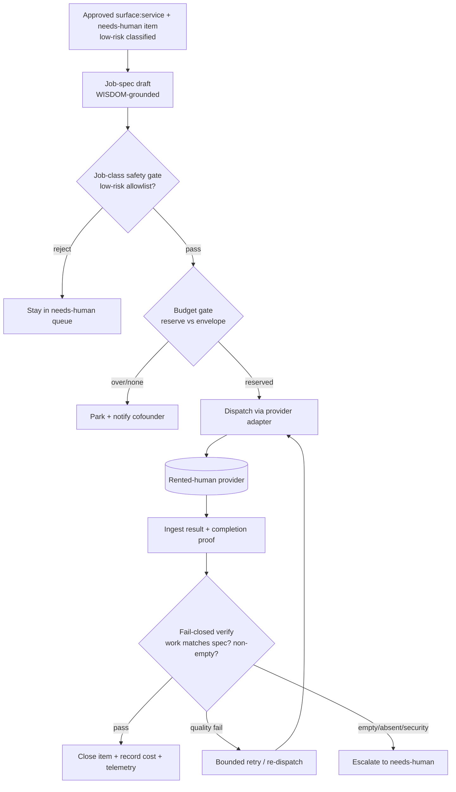

# feat: GTM rent-a-human executor lane

## Summary

Build an autonomous **GTM-execution lane** that drains the `surface:service`
decision queue: it takes an approved low-risk GTM job, drafts a job spec
(WISDOM-grounded), reserves spend against a budget envelope, dispatches the job
to a rented-human provider via a vendor-agnostic adapter, runs a fail-closed
verification gate on the returned work, and closes the item — removing the
cofounder-as-executor bottleneck. A provider-feasibility spike gates the build; a
cloudroof positioning + Mom-Test validation kit ships alongside.

---

## Problem Frame

Four pulses running, **0 paid customers**, wgmesh backlog drained — demand is the
gating constraint, not engineering (see origin). The Observation Loop already
emits `surface:service` GTM issues, but every non-code item is parked
`needs-human` in a cofounder-only queue with **no executor after approval**, so
nothing ships. The cofounder-as-executor is the babysitting failure STRATEGY.md
commits to removing. This plan gives the queue an autonomous rented-human
executor so service GTM drains without a human in the loop.

Advances STRATEGY *Customer Factory / Revenue surface* track (owns paid
customers).

---

## Key Technical Decisions

- **Provider-feasibility spike gates the build (U1).** No production code beyond a
  throwaway probe until one concrete provider is confirmed to support API
  dispatch + structured completion proof + EU DPA + acceptable per-task cost.
  Landscape research ranks **Toloka** first (GDPR DPA + ISO 27701, full REST/SDK,
  ~$0.10–0.50/task), with **Microworkers** (EU HQ, GTM task types) and
  **HumanOps** (MCP-native, pricing/GDPR unverified) as alternates; **avoid MTurk**
  (US-only data posture) and Upwork/Fiverr (no autonomous dispatch). (see origin
  Dependencies)

- **Vendor-agnostic provider adapter (U2).** The lane targets a dispatch+verify
  contract, not a specific vendor; built and tested against a fake provider so the
  spike's pick wires in behind the seam without lane rework. Keeps momentum
  despite the spike-first gate.

- **Verification is fail-closed on empty/absent work, proven on a real payload.**
  The returned-work field is traced to the actual deliverable on a real trace
  before the gate is trusted; NUMERIC/"not applicable" rubrics default to *fail*,
  not pass (mirrors the langfuse-empty-output and goose-hollow-green learnings).
  End-to-end "does returned work match the dispatched job", never HEAD-200.

- **Budget gate is a pre-dispatch reservation + bounded-attempts ceiling.**
  Provider spend reports asynchronously, so a synchronous per-job dollar cap is
  not implementable (per the multi-model-routing learning). Reserve against a
  tracked envelope before dispatch; cap attempts; park on exceed.

- **New decision-lane sibling module, not an extension of the proposal runner.**
  GTM execution (dispatch + verify + close) is a different concern from proposal
  drafting; the queue-drain logic lives on its own.

- **Low-risk job allowlist; high-risk stays in the human queue.** MVP accepts only
  low-blast-radius jobs; outbound-as-the-company (cold outreach, posting) is
  rejected by the lane until the loop is proven. Security/high-risk reasons go
  straight to `needs-human`, never climbed (mirrors the build-lane gate).

- **Grounding is a rich best-effort block, not a deterministic match gate.** Reuse
  the shipped `select_learnings`/`write_learnings_file` seam keyed on job text;
  fail-open; guard against ingesting the lane's own emitted jobs (self-ingestion).

---

## High-Level Technical Design



*Directional — the prose and Implementation Units are authoritative.*

---

## Output Structure

```
pipeline/wgmesh_pipeline/gtm_lane/      # new module
  __init__.py
  executor.py        # lane orchestration: intake → draft → dispatch → verify → close
  provider.py        # vendor-agnostic dispatch+verify adapter protocol
  fake_provider.py   # in-memory provider for tests
  job_spec.py        # job-spec model + low-risk job-class allowlist
  verify.py          # fail-closed verification gate
  budget.py          # envelope reservation + bounded-attempts ceiling
pipeline/recipes/
  wgmesh-gtm-job-draft.yaml             # job-spec drafting recipe (learnings-grounded)
docs/gtm-wisdom/                         # vendored GTM corpus (from WISDOM.compiled.md)
docs/gtm/
  cloudroof-positioning.md              # Obviously Awesome frame
  mom-test-stargazers.md                # discovery question kit
company/
  gtm-execution-state.json              # budget envelope + telemetry state
```

The per-unit `**Files:**` lists are authoritative; the tree is a scope sketch.

---

## Implementation Units

### Phase A — Foundation (gates everything)

### U1. Provider feasibility spike

- **Goal:** Confirm one concrete rented-human provider supports unattended API
  dispatch + structured completion proof + EU/GDPR DPA + acceptable per-task cost,
  and determine its spend-reporting model (sync vs async). Produce a short
  decision note + the adapter-contract requirements. Gates U2–U9.
- **Requirements:** Resolves origin "Resolve Before Planning" (which provider; the
  envelope amount remains a cofounder input).
- **Dependencies:** none
- **Files:** `docs/gtm/provider-feasibility.md` (decision note; no production code)
- **Approach:** Evaluate Toloka first (landscape rank #1). Probe the live API with
  a single throwaway low-risk task end-to-end (dispatch → result → proof) if a
  free/cheap tier allows; otherwise confirm from docs + a sales-free signup. Record
  per-task cost, proof shape, DPA availability, latency, and the spend-reporting
  model. If Toloka fails a gate, fall to Microworkers, then HumanOps. Output names
  the chosen provider + maps its result/proof shape onto the U2 adapter contract.
- **Patterns to follow:** the stale-config / end-to-end-verify discipline in
  `docs/solutions/integration-issues/polar-checkout-404s-from-stale-config-2026-05-08.md`
  (verify against the live API, stamp `last_verified`).
- **Execution note:** Spike — research + a throwaway probe, not production code.
  The lane build (U2+) does not start until this note names a viable provider.
- **Test scenarios:** Test expectation: none — spike produces a decision note, not
  shippable behavior.
- **Verification:** A written decision note names a provider that clears all four
  gates (API dispatch, structured proof, EU DPA, cost) and states its
  spend-reporting model; or it concludes no provider qualifies and the lane is
  not built.

### U2. Provider adapter protocol + fake provider

- **Goal:** A vendor-agnostic dispatch+verify contract the lane targets, plus an
  in-memory fake provider so the lane is built and tested without a live vendor.
- **Requirements:** R3 (dispatch + ingest result/proof).
- **Dependencies:** U1
- **Files:** `pipeline/wgmesh_pipeline/gtm_lane/provider.py`,
  `pipeline/wgmesh_pipeline/gtm_lane/fake_provider.py`,
  `pipeline/tests/test_gtm_provider.py`
- **Approach:** Define a protocol with `dispatch(job_spec) -> handle` and
  `fetch_result(handle) -> result_with_proof` (shape informed by U1). The fake
  provider returns scripted results (success-with-proof, empty, garbage,
  pending) for deterministic lane tests. Real provider is a later swap behind the
  same protocol. Credentials reach the adapter via an **allowlist** env (not
  denylist), per the multi-model-routing learning.
- **Patterns to follow:** protocol/duck-typing + allowlist env in
  `pipeline/wgmesh_pipeline/models.py` / `goose/runner.py`.
- **Test scenarios:**
  - Fake provider returns success+proof → adapter surfaces a structured result.
  - Fake returns empty / garbage / still-pending → adapter reports each distinctly
    (no silent coercion to "done").
  - Missing provider credential → adapter raises (fail-closed), does not no-op.
- **Verification:** Lane code can dispatch and fetch through the protocol against
  the fake; the real provider is swappable without touching lane logic.

### Phase B — Lane and gates

### U3. GTM-execution lane core

- **Goal:** Orchestrate one item end-to-end: intake an approved low-risk item →
  draft a job spec → (gates U4–U6) → dispatch via adapter → ingest result →
  close. Fail-open: any lane error returns the item to the queue in its prior
  state.
- **Requirements:** R1, R2, R4.
- **Dependencies:** U2
- **Files:** `pipeline/wgmesh_pipeline/gtm_lane/executor.py`,
  `pipeline/wgmesh_pipeline/gtm_lane/job_spec.py`,
  `pipeline/recipes/wgmesh-gtm-job-draft.yaml`,
  `pipeline/tests/test_gtm_executor.py`
- **Approach:** Mirror `decision_lane/proposal_runner.py` for runner shape +
  recipe params (job spec written to a file path, same convention). The job-spec
  draft recipe emits task + acceptance criteria + safety bounds. Lane is a new
  sibling module, not a proposal_runner extension. Wrap the dispatch→ingest path
  so any exception parks the item unchanged (fail-open) and never double-dispatches.
- **Patterns to follow:** `pipeline/wgmesh_pipeline/decision_lane/proposal_runner.py`
  (runner + params + recipe); `graph/nodes/spec.py` (file-path param + finally
  cleanup).
- **Execution note:** Characterization-first — capture the no-op / queue-return
  path before adding dispatch, so fail-open is proven.
- **Test scenarios:**
  - Covers AE1. Approved low-risk item → spec drafted → dispatched via fake →
    result ingested → item closes.
  - Lane error mid-dispatch → item returns to queue in prior state; not dropped,
    not double-dispatched (integration test through the real executor + fake
    provider, no over-mocking).
  - Job-spec draft is non-empty and carries acceptance criteria + safety bounds
    (deliverable-in-code, not prompt-trusted).
- **Verification:** An approved low-risk item flows queue→closed against the fake
  provider; any failure leaves the queue item intact.

### U4. Job-class safety gate

- **Goal:** Accept only low-risk job classes; reject outbound-as-the-company;
  enforce the sanitise wall on job specs and returned artifacts both directions.
- **Requirements:** R5, R6, R7.
- **Dependencies:** U3
- **Files:** `pipeline/wgmesh_pipeline/gtm_lane/job_spec.py` (allowlist),
  `pipeline/wgmesh_pipeline/gtm_lane/executor.py` (gate wiring),
  `pipeline/tests/test_gtm_safety.py`
- **Approach:** A positive allowlist of low-risk classes (lead research,
  list-building, manual signups/account creation, content QA, competitor recon,
  data entry). Anything else — especially outbound contact as the company — is
  rejected back to `needs-human`. Run `company/scripts/sanitise.sh` on the
  outbound job spec and the inbound returned artifact. Scope secret scanning
  **narrowly** (`api_key`/`private_key`/`credentials`, not bare `key`) to avoid
  false-positive escalations (per the review-merge-bootstrap learning).
- **Patterns to follow:** positive-gate + narrow-keyword scan in
  `docs/solutions/integration-issues/autonomous-review-merge-bootstrap.md`;
  sanitise wall usage in `.github/workflows/wgmesh-social-drip.yml`.
- **Test scenarios:**
  - Covers AE2. A "cold-email the stargazer list" item → rejected by R6, stays in
    queue, not dispatched.
  - Each allowlisted low-risk class → accepted.
  - A non-allowlisted class (e.g. "negotiate pricing") → rejected to `needs-human`.
  - Job spec or returned artifact containing a secret/PII/exact-revenue token →
    sanitise rejects in that direction.
  - Returned GTM copy containing the bare word "key" in prose → NOT falsely
    flagged (narrow scoping).
- **Verification:** Only allowlisted classes dispatch; outbound-as-company is
  blocked; sanitise gates both directions without false positives.

### U5. Fail-closed verification gate

- **Goal:** Verify every returned result against the job spec's acceptance
  criteria + safety bounds before close; fail-closed on empty/absent work;
  retry/escalate ladder on failure.
- **Requirements:** R8, R9.
- **Dependencies:** U3
- **Files:** `pipeline/wgmesh_pipeline/gtm_lane/verify.py`,
  `pipeline/tests/test_gtm_verify.py`
- **Approach:** Combine a structured-proof check (proof artifact present + matches
  the dispatched job) with an LLM-judge of the returned-work field against the
  acceptance criteria — mirroring `pipeline/evals/impl_judge.py` (fail-closed,
  bounded content). Default empty/absent/"not applicable" to **fail**, never pass.
  Quality-only fail → bounded retry/re-dispatch; empty/absent or
  security/high-risk → straight to `needs-human` (never climbed). Single-worker +
  structured-proof for MVP; N-worker consensus redundancy is deferred (see Scope
  Boundaries).
- **Patterns to follow:** `pipeline/evals/impl_judge.py` (fail-closed judge,
  `_truncate`); the empty-output failure class in
  `docs/solutions/logic-errors/langfuse-evaluators-scored-empty-output.md`.
- **Execution note:** Prove the gate on a **real returned-work payload** (dump one
  real judgment, confirm the judge saw the deliverable text) before trusting it;
  add a test that feeds "API success + empty/garbage work" and confirm the gate
  rejects (revert-the-fix check to confirm the test bites).
- **Test scenarios:**
  - Covers AE1. Returned work satisfies acceptance criteria + proof present → pass.
  - Covers AE4. Returned work omits half the criteria → quality fail → bounded
    retry, item stays open.
  - Returned result empty / proof absent → fail-closed → escalate to
    `needs-human`, never silent close.
  - "Not applicable" rubric path → resolves to fail, not a passing default.
  - Security/high-risk reason in returned artifact → straight to `needs-human`,
    not retried.
- **Verification:** No item closes without a verified, non-empty, proof-backed
  result; failures retry or escalate per the ladder; the gate provably rejects
  empty/garbage on a real payload.

### U6. Budget envelope gate

- **Goal:** Reserve estimated cost against a cofounder-approved envelope before
  dispatch; cap attempts; park on exceed or no envelope.
- **Requirements:** R10.
- **Dependencies:** U3
- **Files:** `pipeline/wgmesh_pipeline/gtm_lane/budget.py`,
  `company/gtm-execution-state.json`, `pipeline/tests/test_gtm_budget.py`
- **Approach:** Pre-dispatch **reservation** against a tracked envelope (config +
  state file), plus a bounded-attempts ceiling — not a synchronous post-hoc dollar
  cap (provider spend is async per U1). Record actual cost on close, reconcile the
  reservation. Over-envelope or absent envelope → park + notify cofounder. Envelope
  amount is a cofounder input (explicit assumption; placeholder + configurable).
- **Patterns to follow:** bounded-attempts + cost-ceiling design in
  `docs/solutions/design-decisions/multi-model-routing.md`; state-file pattern in
  `company/social-drip-state.json`.
- **Test scenarios:**
  - Covers AE3. Job estimate exceeds remaining envelope → parked at the gate,
    cofounder notified, no dispatch.
  - No envelope configured → park, do not dispatch.
  - Within envelope → reserved, dispatched; on close, actual cost reconciled
    against the reservation.
  - Bounded-attempts ceiling reached for one item → escalate, stop re-dispatching.
- **Verification:** No dispatch occurs without a reservation inside a configured
  envelope; spend is bounded by attempts, not a hoped synchronous dollar figure.

### Phase C — Grounding, validation, ops

### U7. WISDOM / GTM-learnings grounding

- **Goal:** Ground the job-spec draft in a vendored GTM corpus via the shipped
  learnings seam; fail-open; guard self-ingestion.
- **Requirements:** R11, R12.
- **Dependencies:** U3
- **Files:** `docs/gtm-wisdom/` (vendored corpus distilled from
  `ai-vektorius-lt/WISDOM.compiled.md`),
  `pipeline/wgmesh_pipeline/gtm_lane/executor.py` (grounding call),
  `pipeline/recipes/wgmesh-gtm-job-draft.yaml` (advisory block),
  `pipeline/tests/test_gtm_grounding.py`
- **Approach:** Reuse `select_learnings`/`write_learnings_file`
  (`pipeline/wgmesh_pipeline/learnings.py`) keyed on the job/decision text, rooted
  at the vendored corpus dir (the WISDOM source lives in a sibling repo and cannot
  be globbed from this deploy — vendor a distilled copy in). Inject as a
  dedicated advisory "known GTM playbook" block, not a deterministic match gate.
  Fail-open: grounding absence never blocks a job. Guard against the corpus
  ingesting the lane's own emitted jobs (self-ingestion).
- **Patterns to follow:** `pipeline/wgmesh_pipeline/learnings.py` + its spec/implement
  call sites (PR #1988); rich-grounding-block discipline in
  `docs/solutions/logic-errors/capabilities-digest-grounds-loop-against-shipped-work.md`.
- **Test scenarios:**
  - Covers AE5. No matching GTM learning → empty grounding, job proceeds unchanged
    (fail-open).
  - A job whose text overlaps a vendored playbook entry → that entry rides in the
    draft's advisory block.
  - Grounding read error → caught, job proceeds (fail-open), not a lane failure.
  - The lane's own emitted job artifacts are excluded from the corpus
    (self-ingestion guard).
- **Verification:** Relevant playbook guidance reaches the draft when present;
  absence/error never blocks a job.

### U8. Validation kit (positioning + Mom-Test)

- **Goal:** Produce the cloudroof positioning frame and the Mom-Test discovery kit;
  build the stargazer target list as a low-risk lane job. Actual conversations
  deferred.
- **Requirements:** R13, R14, R15.
- **Dependencies:** U3 (the target-list-build runs as a lane job)
- **Files:** `docs/gtm/cloudroof-positioning.md`,
  `docs/gtm/mom-test-stargazers.md`
- **Approach:** Author the positioning frame with the Obviously Awesome components
  (competitive alternatives incl. self-hosting wgmesh, unique attributes, value,
  target segment, category). Author the Mom-Test kit (past-behavior questions, not
  pitch; target-segment definition). The stargazer target-list build is dispatched
  as a low-risk job through the lane (U4 allowlist); the outbound conversations
  themselves are deferred behind R6's risk boundary.
- **Patterns to follow:** origin doc's validation-kit requirements; the WISDOM
  corpus TRIGGER index (Obviously Awesome, Mom Test entries).
- **Test scenarios:** Test expectation: none for the static docs (artifacts, not
  behavior). The target-list-build job is exercised by U3/U4 dispatch tests.
- **Verification:** Positioning frame names the alternatives incl. self-hosting and
  a target segment; Mom-Test kit probes past behavior; target-list build runs as a
  gated low-risk job; no outbound conversation is auto-run.

### U9. Telemetry + capture memory-only learnings

- **Goal:** Emit lane telemetry (cost, pass/fail, latency) to the pulse; capture
  the two memory-only learnings as durable `docs/solutions/` entries.
- **Requirements:** Advances R8–R10 observability; closes a known knowledge gap.
- **Dependencies:** U5, U6
- **Files:** `company/gtm-execution-state.json` (telemetry fields),
  pulse config under `.compound-engineering/config.local.yaml`,
  `docs/solutions/integration-issues/public-repo-third-party-pii.md` (new),
  `docs/solutions/integration-issues/cloudflare-urllib-user-agent-block.md` (new)
- **Approach:** Append best-effort telemetry (per the telemetry-must-be-best-effort
  learning — a telemetry write must never block the lane). Surface the new
  KPI line in the pulse. Author the two `docs/solutions/` entries (public-repo PII
  handling; Cloudflare 1010 user-agent block) since this lane makes both
  first-class.
- **Patterns to follow:** best-effort write discipline (telemetry learning);
  `company/social-drip-state.json` state shape; pulse metric-source config.
- **Test scenarios:**
  - A telemetry-write failure does not block or fail a lane run (best-effort).
  - Telemetry records cost + pass/fail + latency per closed item.
  - Test expectation: none for the two authored learning docs.
- **Verification:** The pulse shows a GTM-lane KPI line; a telemetry outage doesn't
  stall the lane; both learning docs exist.

---

## Scope Boundaries

### Deferred for later

- **Outbound GTM as the company** (cold outreach, posting, customer messaging) —
  enabled only after the dispatch+verify loop is proven on low-risk jobs (R6).
- **Actual stargazer validation conversations** — kit + target list prepared here;
  running the conversations waits on the risk boundary.
- **Installing the cloudroof code-build instance** — the executor for
  code-buildable GTM (landing/signup); its own stalled brainstorm
  (`docs/brainstorms/2026-06-22-cloudroof-service-funnel-requirements.md`). Parallel
  dependency, not built here.
- **WISDOM-injection into the decision-proposal recipe** — proposal quality is not
  the constraint; revisit only if approved decisions start stalling on draft
  quality rather than execution.

### Outside this product's identity

- **Cofounder-as-executor** — reverting GTM execution to a human-in-the-loop queue
  contradicts the "no babysitting" thesis.
- **Paywalling product capability** — monetization stays at the managed-service
  layer per CONSTITUTION.md.
- **Self-modifying GTM strategy** — the lane executes approved jobs; it does not
  set pricing, strategy, or brand voice.

### Deferred to Follow-Up Work

- **N-worker consensus redundancy** for verification (assign the same job to
  multiple workers, cross-validate) — MVP uses single-worker + structured-proof +
  fail-closed check; add redundancy if single-worker quality proves insufficient.
- **Webhook/callback ingestion** of provider results — MVP may poll; move to
  webhooks if latency or polling cost warrants.

---

## Risk Analysis & Mitigation

- **Off-execution-path no-op.** A lane wired but never actually draining the queue
  (the repo's recurring failure mode). *Mitigation:* U3 characterization-first on
  the queue-return path; verify a real item flows queue→closed against the fake,
  and a real provider end-to-end in the spike.
- **Fail-open masquerading as fail-closed.** The verify gate "fires" but scores an
  empty field and defaults high. *Mitigation:* U5 proves the gate on a real
  returned-work payload; empty/"not applicable" defaults to fail; revert-the-fix
  test confirms it bites.
- **Silent zeros.** Provider result-fetch returns empty and reads as "no work,
  healthy." *Mitigation:* distinguish "0 jobs" from "fetch broke"; end-to-end
  verify, never HEAD-200; stamp external refs `last_verified`.
- **EU/GDPR + third-party PII.** Rented humans touch contact data over an external
  API on a public repo. *Mitigation:* provider must have an EU DPA (U1 gate);
  sanitise wall both directions (U4); never commit real contact data; capture the
  PII learning (U9).
- **Async spend overrun.** No synchronous dollar cap available. *Mitigation:*
  pre-dispatch reservation + bounded-attempts ceiling (U6).
- **External-API client quirks.** e.g. Cloudflare 1010 blocking default
  user-agents. *Mitigation:* capture the CF learning (U9); set an explicit
  user-agent on provider calls.

---

## Dependencies / Assumptions

- **Load-bearing (U1 gate):** a provider with API dispatch + structured proof + EU
  DPA + acceptable cost must exist. If none qualifies, the lane is not built and
  this plan stops at U1.
- **Assumption:** the spend envelope amount and refresh cadence are cofounder
  inputs; the lane treats them as configurable placeholders.
- **Assumption:** `company/scripts/sanitise.sh` can gate both job specs and
  returned artifacts.
- **Reuse:** the shipped `learnings.py` seam (PR #1988) grounds the job draft; the
  decision-lane runner shape is the template for the executor.

---

## Open Questions

### Resolve Before Planning

- *(Resolved into U1.)* Which provider — handled as the gating spike.

### Deferred to Implementation

- Exact provider result/proof schema and how the verifier scores it (depends on the
  U1-chosen provider).
- Whether result ingestion polls or uses webhooks (Follow-Up Work).
- The precise low-risk allowlist taxonomy may refine once the provider's supported
  task types are known.

---

## Sources / Research

- Origin: `docs/brainstorms/2026-06-24-gtm-rent-a-human-executor-requirements.md`.
- Pulse trend: `docs/pulse-reports/2026-06-24_07-08.md` (0 customers, demand is
  the gating constraint).
- Provider landscape (external): Toloka (GDPR DPA + ISO 27701, full REST/SDK,
  ~$0.10–0.50/task) ranked #1; Microworkers (EU HQ, GTM task types); HumanOps /
  RentAHuman.ai (2026, MCP-native, pricing/GDPR unverified); avoid MTurk (US data
  posture), Upwork/Fiverr (no autonomous dispatch). Prior art: ~300-task MTurk/
  Toloka dispatch at ~$0.30/task with programmatic validation. Quality-via-
  redundancy (3-worker cross-validate) and escrow-on-completion patterns noted.
- Learnings (institutional): fail-closed-on-empty + LLM-judge empty-output
  (`docs/solutions/logic-errors/langfuse-evaluators-scored-empty-output.md`);
  hollow-green / deliverable-in-code
  (`docs/solutions/runtime-errors/goose-weak-model-prints-spec-instead-of-writing.md`);
  fail-closed routing + allowlist env + bounded-cost
  (`docs/solutions/design-decisions/multi-model-routing.md`); silent-zeros +
  end-to-end-verify (`docs/solutions/integration-issues/polar-checkout-404s-from-stale-config-2026-05-08.md`);
  positive-gate + narrow-keyword scan
  (`docs/solutions/integration-issues/autonomous-review-merge-bootstrap.md`);
  rich-grounding-block
  (`docs/solutions/logic-errors/capabilities-digest-grounds-loop-against-shipped-work.md`).
- Reuse seam: `pipeline/wgmesh_pipeline/learnings.py`,
  `pipeline/wgmesh_pipeline/decision_lane/proposal_runner.py`,
  `pipeline/evals/impl_judge.py`, `company/scripts/sanitise.sh`,
  `.github/workflows/wgmesh-social-drip.yml`.
