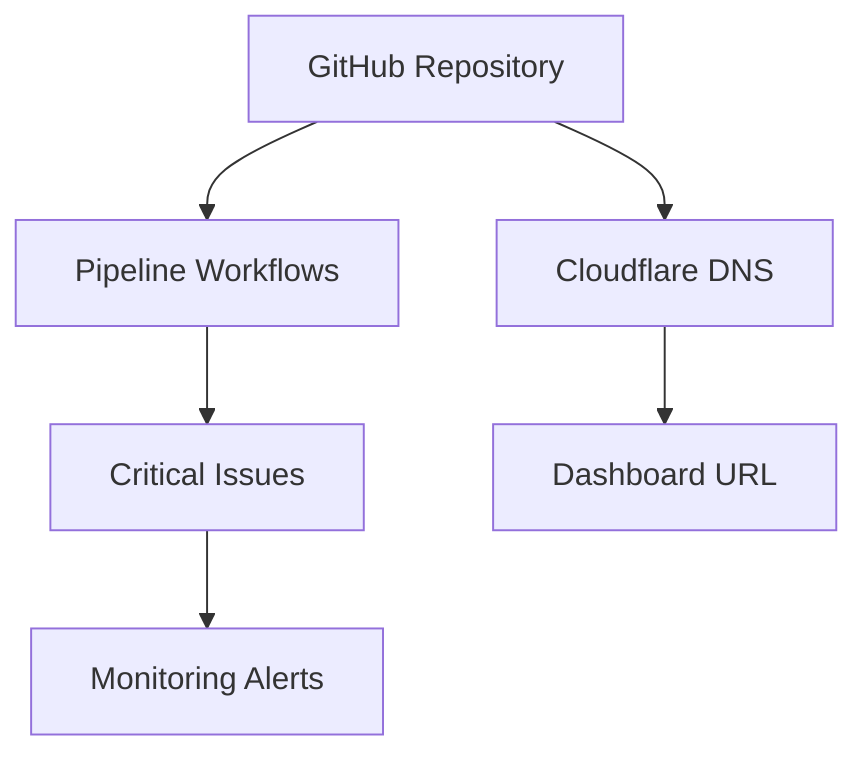

# AI Pipeline Infrastructure as Code

This Terraform configuration manages the complete infrastructure for the AI pipeline system.

## Components Managed

### GitHub Repository
- Repository creation and configuration
- Issue labels for pipeline workflow
- Actions variables and secrets

### Cloudflare DNS
- Dashboard domain configuration
- URL forwarding rules

### Monitoring
- Critical issue tracking
- Pipeline health alerts

## Prerequisites

1. Terraform v1.0+
2. GitHub account with admin access
3. Cloudflare account with DNS access
4. Required API tokens (GitHub, Cloudflare, OpenRouter)

## Hetzner MentisDB VPS

This Terraform stack also provisions the MentisDB production VPS on Hetzner and creates the `mem.beerpub.dev` Cloudflare A record.

Required environment variables:

```bash
export HCLOUD_TOKEN="your_hetzner_cloud_token"
export CLOUDFLARE_API_TOKEN="your_cloudflare_api_token"
```

Required tfvars include the MentisDB variables plus the existing wgmesh-related variables:

```hcl
deploy_ssh_public_key       = "ssh-ed25519 AAAA..."
beerpub_cloudflare_zone_id  = "beerpub_zone_id"
github_push_token           = "ghp_your_token_here"
openrouter_api_key          = "opr_your_key_here"
cloudflare_zone_id          = "chimney_zone_id"
```

MentisDB outputs:

- `mentisdb_ipv4`
- `mentisdb_url`
- `mentisdb_ssh`

Deployment sequence:

```bash
terraform apply
ansible-playbook -i inventory.ini infrastructure/ansible/mentisdb-deploy.yml
```

Terraform creates the server and DNS record. The Ansible playbook is run separately to install and configure `mentisdbd`.

## Setup

### 1. Configure Variables

Create `terraform.tfvars`:
```hcl
github_push_token          = "ghp_your_token_here"
openrouter_api_key         = "opr_your_key_here"
cloudflare_zone_id         = "your_zone_id_here"
deploy_ssh_public_key      = "ssh-ed25519 AAAA..."
beerpub_cloudflare_zone_id = "your_beerpub_zone_id_here"
```

### 2. Initialize Terraform

```bash
terraform init
```

### 3. Plan and Apply

```bash
terraform plan
terraform apply
```

## Monitoring

The configuration includes:
- Critical issue tracking (issues #525-528)
- Pipeline velocity monitoring (3.0 issues/hour target)
- Stale issue detection (6 hour threshold)

## Outputs

After deployment, Terraform will output:
- Repository URL
- Dashboard URL
- Critical issues being monitored
- Monitoring configuration

## Maintenance

To update the infrastructure:

```bash
terraform plan
terraform apply
```

To destroy (use with caution):

```bash
terraform destroy
```

## Architecture


