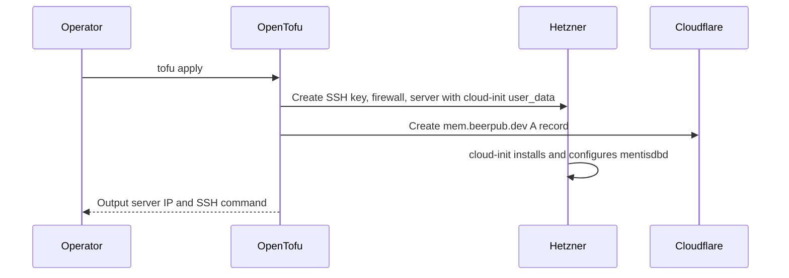

# MentisDB OpenTofu Module

This OpenTofu module provisions the MentisDB production VPS on Hetzner, configures it through cloud-init, and creates the `mem.beerpub.dev` Cloudflare A record.

## Managed Resources

- Hetzner Cloud SSH key for deployment access
- Hetzner Cloud firewall allowing SSH, HTTP, and HTTPS
- Hetzner Cloud `mentisdb-prod` server with `cloud-init.sh.tpl` rendered as bash `user_data`
- Cloudflare `mem.beerpub.dev` A record pointing at the server IPv4 address

## Required TF Variables

```bash
export TF_VAR_hcloud_token="your_hetzner_cloud_token"
export TF_VAR_cloudflare_api_token="your_cloudflare_api_token"
export TF_VAR_deploy_ssh_public_key="ssh-ed25519 AAAA..."
export TF_VAR_beerpub_cloudflare_zone_id="your_beerpub_zone_id_here"
```

The SSH public key is only for optional debugging access to the deployed VPS. MentisDB installation and service configuration run from cloud-init during first boot.

## State Backend

Remote state is stored in the Hetzner Object Storage bucket `atvirokodosprendimai-tfstate`.
This module uses the key `mentisdb/terraform.tfstate`. The module has an empty backend block, so provide a generated `backend.hcl` when initializing.

Configure the bucket, S3 credentials, and GitHub secrets with [../BOOTSTRAP.md](../BOOTSTRAP.md).

## Commands

```bash
tofu init -backend-config=../backend.hcl
tofu plan
tofu apply
```

## Deployment Sequence

Run a single OpenTofu apply from this directory:

```bash
tofu apply
```

The `hcloud_server.mentisdb` resource renders `cloud-init.sh.tpl` into Hetzner `user_data`. On first boot, cloud-init installs packages, installs `mentisdbd`, writes the systemd unit and environment file, configures nginx, obtains the Let's Encrypt certificate, and enables the firewall.

## Debugging cloud-init

```bash
ssh root@<ipv4>
tail -f /var/log/cloud-init-output.log
journalctl -u mentisdbd
```

Re-running cloud-init requires recreating the server (`tofu apply -replace=hcloud_server.mentisdb`). For idempotent in-place changes (mentisdbd version bump etc.), SSH in and re-run the equivalent commands manually, then `tofu state rm` if the cloud-init drifts.

## Outputs

- `mentisdb_ipv4`
- `mentisdb_url`
- `mentisdb_ssh`

## Architecture


