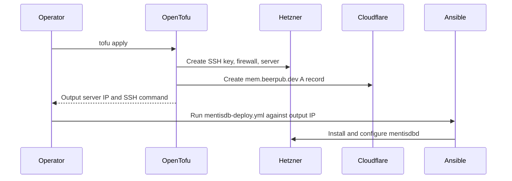

# MentisDB OpenTofu Module

This OpenTofu module provisions the MentisDB production VPS on Hetzner and creates the `mem.beerpub.dev` Cloudflare A record.

## Managed Resources

- Hetzner Cloud SSH key for deployment access
- Hetzner Cloud firewall allowing SSH, HTTP, and HTTPS
- Hetzner Cloud `mentisdb-prod` server
- Cloudflare `mem.beerpub.dev` A record pointing at the server IPv4 address

## Required TF Variables

```bash
export TF_VAR_hcloud_token="your_hetzner_cloud_token"
export TF_VAR_cloudflare_api_token="your_cloudflare_api_token"
export TF_VAR_deploy_ssh_public_key="ssh-ed25519 AAAA..."
export TF_VAR_beerpub_cloudflare_zone_id="your_beerpub_zone_id_here"
```

## State Backend

Remote state is stored in the Hetzner Object Storage bucket `atvirokodosprendimai-tfstate`.
This module uses the key `mentisdb/terraform.tfstate`. The module has an empty backend block, so provide a generated `backend.hcl` when initializing.

Configure the bucket, S3 credentials, and GitHub secrets with [../BOOTSTRAP.md](../BOOTSTRAP.md).

## Commands

```bash
tofu init -backend-config=../backend.hcl
tofu plan
tofu apply
```

## Deployment Sequence

1. Apply this OpenTofu module first.
2. Read the `mentisdb_ipv4` or `mentisdb_ssh` output.
3. Run the Ansible playbook against the output IP:

```bash
ansible-playbook -i inventory.ini infrastructure/ansible/mentisdb-deploy.yml
```

## Outputs

- `mentisdb_ipv4`
- `mentisdb_url`
- `mentisdb_ssh`

## Architecture


