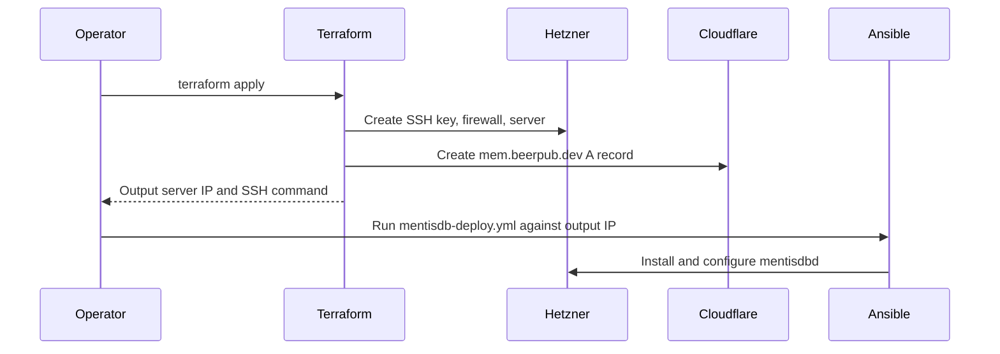

# MentisDB Terraform Module

This Terraform module provisions the MentisDB production VPS on Hetzner and creates the `mem.beerpub.dev` Cloudflare A record.

## Managed Resources

- Hetzner Cloud SSH key for deployment access
- Hetzner Cloud firewall allowing SSH, HTTP, and HTTPS
- Hetzner Cloud `mentisdb-prod` server
- Cloudflare `mem.beerpub.dev` A record pointing at the server IPv4 address

## Required Environment

```bash
export HCLOUD_TOKEN="your_hetzner_cloud_token"
export CLOUDFLARE_API_TOKEN="your_cloudflare_api_token"
export TF_VAR_deploy_ssh_public_key="ssh-ed25519 AAAA..."
export TF_VAR_beerpub_cloudflare_zone_id="your_beerpub_zone_id_here"
```

## Commands

```bash
terraform init
terraform plan
terraform apply
```

## Deployment Sequence

1. Apply this Terraform module first.
2. Read the `mentisdb_ipv4` or `mentisdb_ssh` output.
3. Run the Ansible playbook against the output IP:

```bash
ansible-playbook -i inventory.ini infrastructure/ansible/mentisdb-deploy.yml
```

## Outputs

- `mentisdb_ipv4`
- `mentisdb_url`
- `mentisdb_ssh`

## Architecture


