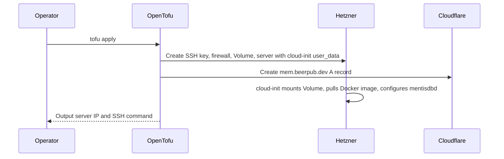

# MentisDB OpenTofu Module

This OpenTofu module provisions the MentisDB production VPS on Hetzner, configures it through cloud-init, and creates the `mem.beerpub.dev` Cloudflare A record.

## Managed Resources

- Hetzner Cloud SSH key for deployment access
- Hetzner Cloud firewall allowing SSH, HTTP, and HTTPS
- Hetzner Cloud Volume for durable MentisDB data and Let's Encrypt state
- Hetzner Cloud `mentisdb-prod` server with the Volume attached at server creation and `cloud-init.sh.tpl` rendered as bash `user_data`
- Cloudflare `mem.beerpub.dev` A record pointing at the server IPv4 address

## Required TF Variables

```bash
export TF_VAR_hcloud_token="your_hetzner_cloud_token"
export TF_VAR_cloudflare_api_token="your_cloudflare_api_token"
export TF_VAR_beerpub_cloudflare_zone_id="your_beerpub_zone_id_here"
export TF_VAR_mentisdb_password="your_basic_auth_password"
export TF_VAR_mentisdb_dashboard_pin="your_dashboard_pin"
```

The MentisDB container image is controlled by `var.mentisdb_image`. The default is digest-pinned for reproducible server replacement. To upgrade, update the digest value rather than using a mutable tag.

No SSH key is provisioned. Docker installation, image pull, service configuration, nginx, certbot, and firewall setup run autonomously from cloud-init during first boot. For emergency access, use the Hetzner Cloud Console (web-based VNC) - no SSH credentials required.

## State Backend

Remote state is stored in the Hetzner Object Storage bucket `atvirokodosprendimai-tfstate`.
This module uses the key `mentisdb/terraform.tfstate`. The module has an empty backend block, so provide a generated `backend.hcl` when initializing.

Configure the bucket, S3 credentials, and GitHub secrets with [../BOOTSTRAP.md](../BOOTSTRAP.md).

## Commands

```bash
tofu init -backend-config=../backend.hcl
tofu plan
tofu apply
```

## Deployment Sequence

Run a single OpenTofu apply from this directory:

```bash
tofu apply
```

The `hcloud_server.mentisdb` resource attaches the Hetzner Volume during server creation and renders `cloud-init.sh.tpl` into Hetzner `user_data`. On first boot, cloud-init installs Docker and support packages, pulls `var.mentisdb_image`, writes a systemd unit around `docker run`, configures nginx, obtains or reuses the Let's Encrypt certificate, and enables the firewall.

The container uses `/var/lib/mentisdb` for chain data through the Docker bind mount created by `docker run`.

## Volume Layout

The Hetzner Volume is mounted at `/srv/persistent` and bind-mounted into conventional paths:

- `/srv/persistent/mentisdb` -> `/var/lib/mentisdb`
- `/srv/persistent/letsencrypt` -> `/etc/letsencrypt`

Both MentisDB chain data and Let's Encrypt certificates survive server replacement. The Volume has Hetzner `delete_protection = true` and Terraform `lifecycle.prevent_destroy` for defense in depth against accidental data loss.

## Auth

The public HTTP API is protected by single-user HTTP Basic Auth at nginx. The username is `mentisdb`.

The password is supplied through `var.mentisdb_password`, normally from the `MENTISDB_PASSWORD` GitHub organization secret exposed to the Terraform deployment workflow as `TF_VAR_mentisdb_password`.

The `/.well-known/acme-challenge/` path remains unauthenticated so certbot can renew Let's Encrypt certificates.

The native dashboard PIN is supplied through `var.mentisdb_dashboard_pin`, normally from the `MENTISDB_DASHBOARD_PIN` GitHub organization secret exposed to the Terraform deployment workflow as `TF_VAR_mentisdb_dashboard_pin`. This PIN is distinct from the API Basic Auth password and is handled by MentisDB's own PIN gate at `https://127.0.0.1:9475/dashboard`.

## Native Dashboard

MentisDB's embedded native dashboard is proxied through nginx at:

```text
https://mem.beerpub.dev/dashboard
```

The daemon serves the dashboard locally on `https://127.0.0.1:9475/dashboard`; nginx terminates the public certificate and proxies dashboard traffic to that local HTTPS endpoint with upstream certificate verification disabled for MentisDB's self-signed internal certificate. Dashboard authentication is handled by MentisDB's native PIN gate using `MENTISDB_DASHBOARD_PIN`, separate from API Basic Auth.

The following environment variables are set in the systemd unit:
- `MENTISDB_DASHBOARD_PIN` — dashboard PIN for native auth
- `MENTISDB_UPDATE_CHECK=0` — suppress update notifications on the dashboard
- `MENTISDB_STARTUP_SOUND=false` — disable startup audio
- `MENTISDB_THOUGHT_SOUNDS=false` — disable thought audio cues

## Operational Commands

```bash
# Bump mentisdb image
docker buildx imagetools inspect ghcr.io/cloudllm-ai/mentisdb:<new-tag> | grep -i digest
# Update var.mentisdb_image with the new ghcr.io/...@sha256:... value
# Push to main, terraform-deploy fires, server replaces, cert + data reused.

# Manually rotate password
gh secret set MENTISDB_PASSWORD --org atvirokodosprendimai --visibility selected --repos ai-pipeline-template,wgmesh
gh workflow run "Terraform Infrastructure Deployment" -R atvirokodosprendimai/ai-pipeline-template
```

Image upgrades are done by bumping `var.mentisdb_image` to a new digest, pushing to `main`, and letting the Terraform deployment replace the server. The persistent Volume is reused, so chain data and certificates remain in place.

## Debugging cloud-init

```bash
ssh root@<ipv4>
tail -f /var/log/cloud-init-output.log
journalctl -u mentisdbd
```

Re-running cloud-init requires recreating the server:

```bash
tofu apply -replace=hcloud_server.mentisdb
```

## Outputs

- `mentisdb_ipv4`
- `mentisdb_url`
- `mentisdb_ssh`

## Architecture


