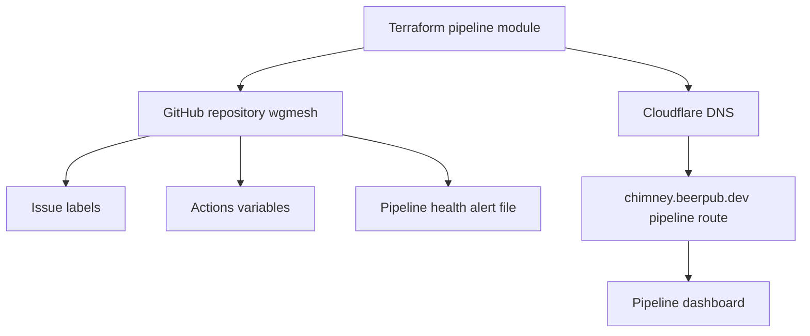

# Pipeline Terraform Module

This Terraform module manages the existing wgmesh GitHub repository and the pipeline dashboard routing for `chimney.beerpub.dev`.

## Managed Resources

- GitHub repository: `atvirokodosprendimai/wgmesh`
- GitHub issue labels for pipeline workflow
- GitHub Actions variables for pipeline automation
- Cloudflare DNS for the dashboard CNAME
- Cloudflare page rule for `chimney.beerpub.dev/pipeline`
- Pipeline health alert configuration committed to the wgmesh repository

## Required Environment

```bash
export CLOUDFLARE_API_TOKEN="your_cloudflare_api_token"
export TF_VAR_github_push_token="ghp_your_token_here"
export TF_VAR_openrouter_api_key="opr_your_key_here"
export TF_VAR_cloudflare_zone_id="your_chimney_zone_id_here"
```

## Commands

```bash
terraform init
terraform plan
terraform apply
```

The first run against existing resources may require `terraform import` before `terraform plan` can converge cleanly.

## Outputs

- `repository_url`
- `dashboard_url`
- `critical_issues`
- `monitoring_config`

## Architecture


