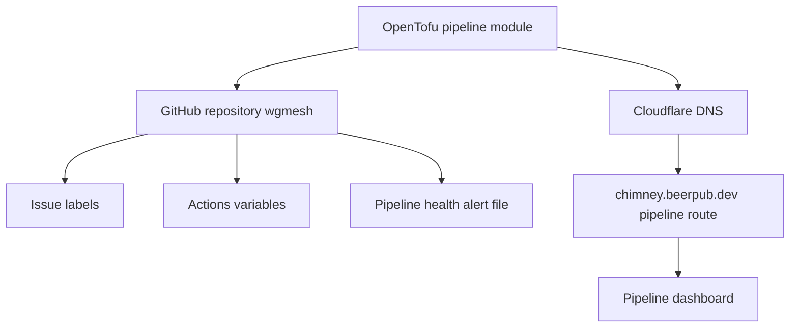

# Pipeline OpenTofu Module

This OpenTofu module manages the existing wgmesh GitHub repository and the pipeline dashboard routing for `chimney.beerpub.dev`.

## Managed Resources

- GitHub repository: `atvirokodosprendimai/wgmesh`
- GitHub issue labels for pipeline workflow
- GitHub Actions secrets for pipeline automation
- Cloudflare DNS for the dashboard CNAME
- Cloudflare page rule for `chimney.beerpub.dev/pipeline`
- Pipeline health alert configuration committed to the wgmesh repository

## Required TF Variables

```bash
export TF_VAR_github_push_token="ghp_your_token_here"
export TF_VAR_openrouter_api_key="opr_your_key_here"
export TF_VAR_cloudflare_zone_id="your_chimney_zone_id_here"
export TF_VAR_cloudflare_api_token="your_cloudflare_api_token"
```

## State Backend

Remote state is stored in the Hetzner Object Storage bucket `atvirokodosprendimai-tfstate`.
This module uses the key `pipeline/terraform.tfstate`. The module has an empty backend block, so provide a generated `backend.hcl` when initializing.

Configure the bucket, S3 credentials, and GitHub secrets with [../BOOTSTRAP.md](../BOOTSTRAP.md).

## Commands

```bash
tofu init -backend-config=../backend.hcl
tofu plan
tofu apply
```

The first run against existing resources may require `tofu import` before `tofu plan` can converge cleanly.

## Outputs

- `repository_url`
- `dashboard_url`
- `critical_issues`
- `monitoring_config`

## Architecture


